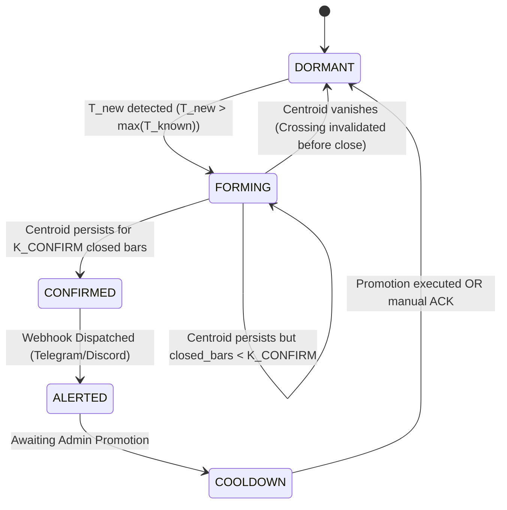

# Active/Hot-Standby Terminal Architecture Enhancement:

## Frozen Baseline/EDT Projections and Event-Driven Centroid Alerting System

**Document ID:** `ARCH-SPEC-2026-09-18-V2.29-FROZEN-ALERT`  
**Target Audience:** Stack C Development Team, Claude Code Implementation Agent, Lead Architect (Davin)  
**Status:** **IMPLEMENTED 2026-09-18 -- code complete and tested; NOT yet deployed.**
Both pillars are built and verified against synthetic data driven through the real
collector, watchdog and preset generator. Nothing changes in production until the
`.ex5` are rebuilt and a terminal is actually switched -- see the pipeline blueprint
§13 item 8, and §8 below for the nine points where this document and the live code
disagreed. Originally: Architectural Specification & Implementation Blueprint  
**Primary References:**

- `ACTIVE-STANDBY-TERMINAL-ARCHITECTURE.md` (Baseline dual-terminal topology)
- `HISTORICAL-VALUES-LOOK-AHEAD-BIAS-OPEN-ISSUE.md` (Mutation and look-ahead bias mechanics)
- `DATA_COLLECTION_PIPELINE_BLUEPRINT_v2_29.md` (Authoritative v6 pipeline blueprint)
- `STATISTIC-CAPTURE-SCOPE.md` (Append-only statistics path)
- `mq5/2EDTCentroidRegressionBestFitNonMostRecentA_v2_29.mq5` (Reference MQL5 implementation)

---

## 1. Executive Summary & Problem Statement

### 1.1 The Existing Architecture and Its Unresolved Loophole

The Active / Hot-Standby Terminal architecture (`ACTIVE-STANDBY-TERMINAL-ARCHITECTURE.md`) successfully decoupled manual administrator retuning from the production pipeline. By maintaining an isolated **Hot Standby** terminal (`Terminal B`), an administrator can adjust parameters, inspect indicator plots visually, and execute an instantaneous cutover via `promote_terminal.bat` by switching the collector's `--export-dir`.

However, an **autonomous mutation loophole** remains active on the live terminal:

```text
[Current Production Behavior on ACTIVE Terminal]
Every new bar / every 59s
       │
       ▼
PerformClusteringAndCFL() runs automatically
       │
       ▼
New SSA crossings enter sliding window (InpSSAMathLookback = 3000)
       │
       ▼
DBSCAN / K-Means autonomously discovers/shifts Centroids
       │
       ▼
Combinatorial best_cfl selects new Slope (m) and Intercept (c)
       │
       ▼
ExtBaseLine, ExtUOEDT, ExtLOEDT recalculated for ~3,000 historical bars
       │
       ▼
SQLite & PostgreSQL market_data_v6 overwritten in place!
       │
       ▼
End-users on DavinTrade App experience unannounced chart redrawing;
Historical data suffers from Look-Ahead Bias (Issue 2026-09-09).
```

### 1.2 The Administrative Bottleneck

Simultaneously, the operations team faces a severe operational bottleneck:

1. Markets form new centroids non-deterministically based on price action and volatility regimes.
2. To detect when a regime transition occurs, an administrator currently has to **stare at MetaTrader charts continuously**.
3. When new centroids begin to form, they exhibit physical **flickering / chattering** (อาการติดๆ ดับๆ) as SSA crossings oscillate near the DBSCAN `minPts` (e.g., 5 points) or `epsilon` boundaries on unclosed bars, leading to potential premature tuning or false alarms.

---

## 2. Proposed Architecture Overview

This enhancement introduces two coordinated, mutually reinforcing pillars:

```
┌───────────────────────────────────────────────────────────────────────────────┐
│                           STANDBY TERMINAL (B)                                │
│  - Mode: DYNAMIC (Continuous live clustering & candidate discovery)          │
│  - Runs DBSCAN/K-Means on every bar                                           │
│  - Emits candidate Centroids, Slope, R², Offsets to _Statistic.txt            │
└──────────────────────────────────────┬────────────────────────────────────────┘
                                       │
                                       ▼
┌───────────────────────────────────────────────────────────────────────────────┐
│                      CENTROID WATCHDOG & DEBOUNCE DAEMON                      │
│  - Reads Standby _Statistic.txt                                               │
│  - Primary Trigger: Deterministic Centroid Timestamp Mapping (T_new > T_known)│
│  - Debounce / Maturity State Machine: Filters out flickering (2-3 closed bars)│
│  - Contextual Payload: Delta Slope, Delta R², Delta Channel Width             │
└──────────────────────────────────────┬────────────────────────────────────────┘
                                       │
                         [Confirmed New Centroid Event]
                                       │
                                       ▼
               🔔 Rich Telegram / Discord Notification to Admin
                                       │
                     (Admin reviews Standby charts & configures)
                                       │
                                       ▼
                   Admin Executes: promote_terminal.bat
                                       │
                   ┌───────────────────┴───────────────────┐
                   ▼                                       ▼
┌──────────────────────────────────────┐ ┌──────────────────────────────────────┐
│       NEW ACTIVE TERMINAL (B)        │ │       NEW STANDBY TERMINAL (A)       │
│  - Mode: FROZEN PROJECTION           │ │  - Mode: DYNAMIC DISCOVERY           │
│  - Baseline y = mx + c is LOCKED     │ │  - Begins hunting for the NEXT       │
│  - Linear extension only (t >= t0)   │ │    market centroid regime            │
│  - Zero historical repainting        │ │  - Acts as rollback fallback         │
│  - Feeds production pipeline         │ └──────────────────────────────────────┘
└──────────────────────────────────────┘
```

---

## 3. Pillar 1: Deterministic Baseline & EDT Freezing (Linear Projection Mode)

### 3.1 Mathematical Formulation of Frozen Projection

Let the promoted configuration define a regression baseline at promotion time $t_{\text{promo}}$:
$$y(t) = m_{\text{frozen}} \cdot \Delta t + c_{\text{frozen}}$$
where:

- $m_{\text{frozen}}$ is the slope (price units per unit of time or bar index).
- $c_{\text{frozen}}$ is the anchored intercept price.
- $\Delta t$ is the displacement from the fixed anchor origin.

For upper and lower outer EDT channel boundaries:
$$\text{UOEDT}(t) = y(t) + \Delta_{\text{UOEDT}}$$
$$\text{LOEDT}(t) = y(t) - \Delta_{\text{LOEDT}}$$
where $\Delta_{\text{UOEDT}}$ and $\Delta_{\text{LOEDT}}$ are the fixed price offsets resolved at the promotion instant.

### 3.2 Dynamic vs. Frozen Component Partitioning

To preserve market sensitivity while maintaining structural channel stability, indicator data streams are partitioned into two strict behavioral classes:

| Indicator Stream                  | Behavior on ACTIVE Terminal            | Rationale                                                                                                                                                                      |
| :-------------------------------- | :------------------------------------- | :----------------------------------------------------------------------------------------------------------------------------------------------------------------------------- |
| **`ExtBaseLine`**                 | **FROZEN (Linear Extension Only)**     | Forms the permanent reference frame. Historical bars $t \le t_{\text{promo}}$ remain byte-for-byte identical forever. Future bars $t > t_{\text{promo}}$ project $y = mx + c$. |
| **`ExtUOEDT`, `ExtLOEDT`**        | **FROZEN (Constant Offset Extension)** | Bounds of the channel remain static relative to the baseline.                                                                                                                  |
| **`OHLCV`**                       | **DYNAMIC (Real-Time)**                | Ground truth price facts.                                                                                                                                                      |
| **`ExtSSATrend`, `ExtSSASignal`** | **DYNAMIC (Real-Time)**                | Real-time trend and momentum oscillator; must track live price cycles.                                                                                                         |
| **`ExtSSACross` (Arrow 171)**     | **DYNAMIC (Real-Time)**                | Crossing events of SSA and Signal; marks active momentum shifts.                                                                                                               |
| **`Fractal 108 / 119`**           | **DYNAMIC (Real-Time)**                | Local high/low swing structural markers.                                                                                                                                       |
| **`ZigZag` & `Z-Score`**          | **DYNAMIC (Real-Time)**                | Volatility and statistical candle metrics.                                                                                                                                     |

### 3.3 Elimination of Historical Look-Ahead Bias

As documented in `HISTORICAL-VALUES-LOOK-AHEAD-BIAS-OPEN-ISSUE.md`, sliding-window fitting rewrote historical rows for 3,000 bars. Under the Frozen Baseline paradigm:

1. Once a bar closes, its `Base_FL`, `UOEDT`, and `LOEDT` values are **mathematically immutable**.
2. A backtest or walk-forward model querying `market_data_v6` at historical timestamp $T$ receives the exact values that were live and visible to users at timestamp $T$.
3. The open issue is fully resolved for all centroid-derived channel metrics.

---

## 4. Pillar 2: Event-Driven Centroid Watchdog & Alerting System

### 4.1 Ground-Truth Trigger: Deterministic Timestamp Mapping

**Why Centroid Count Trigger is Insufficient:**

1. **Sliding Window Dropout:** In a 3,000-bar lookback, when an ancient cluster at $T - 3000$ exits the calculation window simultaneously with a new cluster forming at $T_{\text{now}}$, the total centroid count remains constant (e.g., $5 \rightarrow 5$). A count-based trigger results in a **False Negative (missed detection)**.
2. **Cluster Churn:** Minor point migrations can cause unstable peripheral clusters to split or merge, triggering **False Positives**.

**The Deterministic Timestamp Invariant:**
A centroid $C_k$ is a 2D cluster center of mass with temporal coordinate $T_k = \text{centroid\_time}$ and price coordinate $P_k = \text{real\_centroid\_price}$.
Because time is strictly monotonic:
$$\mathcal{T}_{\text{active}} = \{ T_1, T_2, \dots, T_n \}$$
A new centroid exists if and only if the candidate set $\mathcal{T}_{\text{candidate}}$ satisfies:
$$\exists\, T_{\text{new}} \in \mathcal{T}_{\text{candidate}} \quad \text{such that} \quad T_{\text{new}} > \max(\mathcal{T}_{\text{active}}) \quad \text{or} \quad T_{\text{new}} \notin \mathcal{T}_{\text{active}}$$

### 4.2 The Physical Reality: Centroid Flickering (อาการติดๆ ดับๆ)

When market price forms new SSA crossings:

1. The 5th crossing point (`minPts = 5`) may appear on a forming candle (Shift 0), fluctuate across the `epsilon` radius, and disappear if the candle pulls back before close.
2. In MetaTrader, this manifests as a centroid appearing and vanishing rapidly across successive ticks or minutes.
3. Alerting on unconfirmed candidate centroids induces **Alert Fatigue** and causes administrators to inspect phantom setups.

### 4.3 Debounce & Maturity State Machine

To guarantee zero false alarms, the Watchdog implements a deterministic 4-state automaton:



**State Definitions and Transition Rules:**

1. **`DORMANT`**:
   - The Watchdog continuously polls `_Statistic.txt` from the Standby terminal.
   - Compares candidate centroid timestamps against `known_centroid_timestamps`.
2. **`FORMING` (Debounce Stage)**:
   - A new centroid timestamp $T_{\text{cand}}$ is detected.
   - The candidate enters a debounce buffer. It is tracked silently without alerting the administrator.
   - **Maturity Criteria ($K_{\text{confirm}}$):**
     - On **M5**: Must persist across **2 consecutive closed bars** (10 minutes).
     - Point Count Threshold: Cluster size must achieve $N_{\text{points}} \ge \text{InpMinPts} + 1$ (e.g., $\ge 6$ points).
3. **`CONFIRMED`**:
   - The centroid's temporal coordinate stabilizes ($\Delta T \le 1$ bar between cycles).
   - Centroid is verified as permanent.
4. **`ALERTED`**:
   - Dispatch rich JSON payload to the notification webhook.
   - Enforce notification throttle (1 alert per confirmed centroid event).

### 4.4 Alert Notification Payload Structure

The notification separates the **Trigger (Cause)** from the **Context Metrics (Impact)**:

```json
{
  "event": "NEW_CENTROID_CONFIRMED",
  "symbol": "XAUUSD",
  "timeframe": "M5",
  "timestamp_utc": "2026-09-18T03:30:00Z",
  "centroid": {
    "centroid_index": 6,
    "centroid_time": "2026-09-18T03:15:00Z",
    "centroid_price": 2584.5,
    "points_in_cluster": 7
  },
  "impact_analysis": {
    "active_frozen_slope": 0.1452,
    "candidate_new_slope": 0.0211,
    "slope_delta_pct": -85.46,
    "active_r2": 0.841,
    "candidate_r2": 0.685,
    "channel_width_change_pct": 14.8
  },
  "action_required": "Inspect Standby Terminal (B). Verify visual fit, then execute promote_terminal.bat."
}
```

---

## 5. Component-by-Component Implementation Specification

### 5.1 Component 1: MQL5 Indicator Adaptations (`mq5/`)

#### 5.1.1 Target Indicators

All 7 centroid indicators:

1. `2EDTCentroidRegressionBestFitNonMostRecentA_v2_29.mq5`
2. `2EDTCentroidRegressionBestFitNonMostRecentB_v2_29.mq5`
3. `2EDTCentroidRegressionCherryPickA_v2_29.mq5`
4. `2EDTCentroidRegressionCherryPickB_v2_29.mq5`
5. `2EDTCentroidRegressionMostRecentLineExtension_v2_29.mq5`
6. `2EDTCentroidRegressionNonMostRecentLineExtensionA_v2_29.mq5`
7. `2EDTCentroidRegressionNonMostRecentLineExtensionB_v2_29.mq5`

#### 5.1.2 New Input Parameters

```mql5
//--- EXECUTION & PROJECTION MODES ---
enum ENUM_PROJECTION_MODE {
   MODE_DYNAMIC_AUTOFIT = 0, // Standby Terminal: Continuous live clustering & refitting
   MODE_FROZEN_LINE     = 1  // Active Terminal: Linear projection of approved baseline/EDT
};

input string                SepFreeze = "===== Freeze / Projection Settings =====";
input ENUM_PROJECTION_MODE  InpProjectionMode    = MODE_DYNAMIC_AUTOFIT;
input datetime              InpFrozenAnchorTime  = 0;        // Anchor Bar Time (t0)
input double                InpFrozenSlope       = 0.0;      // Approved Slope (m)
input double                InpFrozenIntercept   = 0.0;      // Approved Price at t0 (c)
input double                InpFrozenUOEDTOffset = 0.0;      // Approved UOEDT Price Delta
input double                InpFrozenLOEDTOffset = 0.0;      // Approved LOEDT Price Delta
```

#### 5.1.3 Calculation Logic (`OnCalculate`)

```mql5
if (InpProjectionMode == MODE_FROZEN_LINE && InpFrozenAnchorTime > 0)
{
    // Bypass DBSCAN/CFL combinatorics entirely
    // Find anchor bar index
    int anchor_bar_idx = -1;
    for (int k = rates_total - 1; k >= 0; k--) {
        if (time[k] <= InpFrozenAnchorTime) {
            anchor_bar_idx = k;
            break;
        }
    }
    if (anchor_bar_idx < 0) anchor_bar_idx = 0;

    // Linear projection across visualization window
    int draw_start = rates_total - InpCFLVisualLookback;
    if (draw_start < 0) draw_start = 0;

    for (int i = draw_start; i < rates_total; i++) {
        double delta_bars = (double)(i - anchor_bar_idx);
        double base_val = InpFrozenIntercept + (InpFrozenSlope * delta_bars);

        ExtBaseLine[i] = base_val;
        ExtUOEDT[i]    = base_val + InpFrozenUOEDTOffset;
        ExtLOEDT[i]    = base_val - InpFrozenLOEDTOffset;
    }

    // SSA, Fractals, and Crossings continue to calculate causally below...
}
else
{
    // MODE_DYNAMIC_AUTOFIT: Execute standard PerformClusteringAndCFL()
    if (math_update_due) {
        PerformClusteringAndCFL(rates_total, time, close);
    }
}
```

#### 5.1.4 Enhanced Statistics Export (`ExportData`)

Append a structured `[CENTROIDS_DETAIL]` block to `{prefix}_{SYMBOL}_{TF}_Statistic.txt`:

```mql5
FileWrite(fh_stat, "[CENTROIDS_DETAIL]");
FileWrite(fh_stat, "Centroid_Count: " + IntegerToString(centroid_count));
string times_str = "";
string prices_str = "";
for(int c = 0; c < centroid_count; c++) {
   times_str += IntegerToString((long)centroids[c].time) + (c < centroid_count - 1 ? "," : "");
   prices_str += DoubleToString(centroids[c].price, _Digits) + (c < centroid_count - 1 ? "," : "");
}
FileWrite(fh_stat, "Centroid_Timestamps: " + times_str);
FileWrite(fh_stat, "Centroid_Prices: " + prices_str);
FileWrite(fh_stat, "Latest_Centroid_Timestamp: " + (centroid_count > 0 ? IntegerToString((long)centroids[centroid_count-1].time) : "0"));
```

---

### 5.2 Component 2: The Centroid Watchdog Daemon (`centroid_watchdog.py`)

A lightweight background worker running on the VPS alongside `MT5Collector`:

```python
"""
Centroid Watchdog Daemon (v1.0)
Monitors Standby Terminal export files for new confirmed centroids.
Implements debounce state machine and dispatches admin alerts.
"""
import time
import os
import requests
from typing import Dict, List, Set

STANDBY_DIR = r"C:\MT5-B\MQL5\Files"
POLL_INTERVAL_SEC = 15
CONFIRMATION_BARS_M5 = 2
WEBHOOK_URL = os.getenv("ADMIN_ALERT_WEBHOOK_URL")

class CentroidWatchdog:
    def __init__(self):
        self.known_timestamps: Set[int] = set()
        self.candidate_buffer: Dict[int, dict] = {} # {ts: {'first_seen': time, 'count': n}}
        self.alerted_timestamps: Set[int] = set()

    def parse_statistic_file(self, filepath: str) -> dict:
        # Extracts [EDT CHANNEL], [MODEL A], and [CENTROIDS_DETAIL]
        ...

    def process_cycle(self):
        stat_files = [f for f in os.listdir(STANDBY_DIR) if f.endswith("_Statistic.txt")]
        for sf in stat_files:
            data = self.parse_statistic_file(os.path.join(STANDBY_DIR, sf))
            latest_ts = data.get("Latest_Centroid_Timestamp", 0)

            if latest_ts > 0 and latest_ts not in self.known_timestamps:
                self.handle_candidate(latest_ts, data)

    def handle_candidate(self, ts: int, data: dict):
        now = time.time()
        if ts not in self.candidate_buffer:
            # Stage 1: Discovered candidate, start debounce timer
            self.candidate_buffer[ts] = {
                'first_seen': now,
                'cycles_seen': 1,
                'initial_data': data
            }
            print(f"[Watchdog] Candidate centroid detected at {ts}. Debouncing...")
            return

        # Stage 2: Track persistence
        cand = self.candidate_buffer[ts]
        cand['cycles_seen'] += 1
        elapsed = now - cand['first_seen']

        # Check maturity criteria (e.g. >= 600s / 2 M5 bars)
        if elapsed >= (CONFIRMATION_BARS_M5 * 300) and ts not in self.alerted_timestamps:
            self.dispatch_alert(ts, data)
            self.alerted_timestamps.add(ts)
            self.known_timestamps.add(ts)
            del self.candidate_buffer[ts]

    def dispatch_alert(self, ts: int, data: dict):
        payload = {
            "title": "🚨 New Market Centroid Confirmed",
            "timestamp": ts,
            "slope": data.get("Raw Slope (b)"),
            "r2": data.get("R-Square"),
            "message": "New centroid has stabilized on Standby terminal. Please review and promote."
        }
        if WEBHOOK_URL:
            requests.post(WEBHOOK_URL, json=payload, timeout=5)
        print(f"[ALERT DISPATCHED] Centroid {ts} confirmed.")
```

---

### 5.3 Component 3: Enhanced Promotion Procedure (`promote_terminal.bat`)

When promoting Terminal B to Active:

1. **Snapshot Mode Parameters:**
   - The promotion script queries the latest confirmed values from Terminal B's `_Statistic.txt` (`Raw Slope (b)`, `Anchored Y-Int`, `UOEDT Offset`, `LOEDT Offset`, and current anchor bar time).
2. **Configure Active Mode on B:**
   - Write snapshot values to a configuration template or preset (`.set`) file.
   - Terminal B switches to `MODE_FROZEN_LINE` (via chart template reload or hot config file).
3. **Cutover Execution:**
   ```bat
   nssm set MT5Collector AppParameters "C:\Scripts\collector\export_collector_validator_v2.py --export-dir C:\MT5-B\MQL5\Files --db C:\Scripts\database\xauusd.db --timeframes M5,M15"
   nssm restart MT5Collector
   ```
4. **Demote Terminal A to Hot Standby:**
   - Terminal A is switched to `MODE_DYNAMIC_AUTOFIT`.
   - Terminal A immediately begins dynamic live clustering to hunt for future centroids and acts as instant rollback insurance.

---

## 6. Feasibility, Verification & Rollout Plan for Claude Code

### 6.1 Feasibility Assessment Matrix

| Component                             | Technical Complexity | Risk Level |                     Breaking Changes                      | Estimated Effort |
| :------------------------------------ | :------------------: | :--------: | :-------------------------------------------------------: | :--------------: |
| **MQL5 `[CENTROIDS_DETAIL]` Export**  |       **Low**        |  Minimal   |         None (additive lines in `_Statistic.txt`)         |     2 hours      |
| **MQL5 Frozen Projection Mode**       |      **Medium**      |    Low     |        None (guarded by `InpProjectionMode` enum)         |     4 hours      |
| **Centroid Watchdog Daemon**          |       **Low**        |    None    | Standalone process reading disk; zero impact on collector |     3 hours      |
| **Promote Script & Preset Generator** |      **Medium**      |    Low     |           Scripted file copy / `.set` injection           |     3 hours      |
| **Unit & Integration Testing**        |       **Low**        |    None    |              Synthetic directory validation               |     2 hours      |

### 6.2 Backward Compatibility & Zero-Downtime Guarantee

1. **Collector Compatibility:** `export_collector_validator_v2.py` parses `_Statistic.txt` based on explicit section headers. Adding `[CENTROIDS_DETAIL]` will be naturally parsed into the statistics dictionary without altering any timeseries validation logic.
2. **Database Schema:** `market_data_v6` already stores `base_fl`, `uoedt`, `loedt` as `DOUBLE PRECISION`. The schema requires **zero migrations**.
3. **Rollback Safety:** If `MODE_FROZEN_LINE` exhibits unexpected geometry, simply switching back to `MODE_DYNAMIC_AUTOFIT` restores legacy behavior instantly.

### 6.3 Recommended Step-by-Step Build Order

```text
Step 1: Update 2EDTCentroidRegressionBestFitNonMostRecentA_v2_29.mq5 to emit [CENTROIDS_DETAIL].
        Verify export file contains Centroid_Timestamps.

Step 2: Build centroid_watchdog.py on the VPS. Test debounce logic against live market ticks.
        Configure Telegram/Discord webhook destination.

Step 3: Add InpProjectionMode, InpFrozenSlope, InpFrozenIntercept to MQL5 indicator.
        Verify in Strategy Tester that frozen mode draws an immutable straight line.

Step 4: Update promote_terminal.bat to automate the parameter capture and template switch.

Step 5: Execute end-to-end dry run on Contabo VPS during weekend market close.
```

---

## 7. Document Revision & Sign-off

| Version | Date       | Author / Agent | Changes                                                                                                                       |
| :------ | :--------- | :------------- | :---------------------------------------------------------------------------------------------------------------------------- |
| `1.0.0` | 2026-09-18 | Antigravity AI | Initial architectural specification addressing autonomous mutation loophole, linear frozen projection, and debounce watchdog. |

---

## 8. Implementation Record — deviations from this specification (2026-09-18)

Nine points where the live code contradicted this document. Each was resolved in
favour of the code and is recorded here, because the sections above are otherwise
left exactly as written and would mislead the next reader.

| #   | Section      | What the spec said                                                                | What was built, and why                                                                                                                                                                                                                                                                                                                                                                                                                                                                                                                                                    |
| :-- | :----------- | :-------------------------------------------------------------------------------- | :------------------------------------------------------------------------------------------------------------------------------------------------------------------------------------------------------------------------------------------------------------------------------------------------------------------------------------------------------------------------------------------------------------------------------------------------------------------------------------------------------------------------------------------------------------------------- |
| 1   | §5.1.4       | `Latest_Centroid_Timestamp` reads `centroids[centroid_count-1]`                   | **Reads `centroids[0]`.** The array is sorted **descending** by `bar_index` (`if(centroids[j].bar_index < centroids[j+1].bar_index) swap`), so the spec's index is the **oldest** centroid. As written the primary trigger would never fire on a new formation, and would instead fire when an ancient one dropped out of the window — Pillar 2 inverted.                                                                                                                                                                                                                  |
| 2   | §5.1.4       | The export snippet reads `centroids[]` from inside `ExportData`                   | **Snapshotted into globals** (`g_cen_detail_*`) at capture time. `centroids[]` is local to the clustering routine; `ExportData` cannot see it. Reset at that routine's TOP, not its bottom, because it has several early returns and a stale snapshot surviving one would silently report centroids that had stopped resolving.                                                                                                                                                                                                                                            |
| 3   | §3.1, §5.1.3 | `LOEDT(t) = y(t) − Δ_LOEDT`                                                       | **`LOEDT = base + offset`, both offsets signed.** Live code sets `g_stat_loedt_offset = min_below_intercept - base_c`, which is **negative**, and `[EDT CHANNEL]` exports that negative number. Subtracting it draws the lower band **above** the baseline and exports `loedt > base_fl`, which downstream reads as a support level above price. Verified numerically. `OnInit` now refuses to start on a reversed sign.                                                                                                                                                   |
| 4   | §5.1.3       | Frozen mode draws only the three channel buffers                                  | **Also writes the structural buffers and both fit models.** `ExtSlope`/`ExtIntercept`/`ExtAngle`/`ExtTimeframe` and Model A/B are written only inside the clustering routine, which frozen mode bypasses — so as specified the ACTIVE terminal would push an **all-NULL** `indicator_statistics` row every cycle, silently regressing a shipped, append-only capability. Those frozen statistics are also a genuine drift signal: R² and Containment against a line that is no longer refitted answer "is the approved line still describing this market?".                |
| 5   | §5.1.3       | The frozen block sits where `PerformClusteringAndCFL()` is called (once a minute) | **Runs on every `OnCalculate`.** `OnCalculate` blanks `[prev_calculated, rates_total)` on every tick; gating the projection on `math_update_due` would leave the forming bar's baseline empty between updates and export it as NULL. The cost is a few hundred doubles, against an SSA decomposition that already runs every tick.                                                                                                                                                                                                                                         |
| 6   | §3.1, §5.1.3 | `InpFrozenIntercept` = "Approved Price at t0 (c)"                                 | **Renamed `InpFrozenAnchorPrice`, and it is the baseline PRICE at the anchor** (`Anchored Y-Int`), never the raw regression intercept `c` — which is the price at bar index 0, thousands of dollars from the market. Related: the anchor is resolved by **time** on every pass, because a bar index is not stable under history deepening. Freezing the index instead moves the channel by **72.60 USD** the first time 500 bars load.                                                                                                                                     |
| 7   | §5.3         | The promote script writes the snapshot into a preset and switches the terminal    | **It generates presets and refuses to claim more.** MetaTrader exposes no supported way for an outside process to change a running indicator's inputs. Automating the claim would be the worst outcome available here: the script reports success, the administrator believes the terminal is frozen, and it repaints for weeks. `--verify` closes the loop by re-reading the terminal's own exports instead. The anchor is written in **both** server and UTC form — the export stream is UTC, but `InpFrozenAnchorTime` is compared against MT5's server-time bar array. |
| 8   | §5.2, §4.3   | Debounce on `elapsed >= CONFIRMATION_BARS_M5 * 300` wall-clock seconds            | **Counts closed bars** from `Live Bar TS (UTC)`, a new export line added for this. A stopwatch keeps running over a weekend when no bar closes, so a Friday-evening candidate would "mature" against a shut market. Presence must also be **consecutive** — the spec's own state machine says `FORMING → DORMANT` on disappearance, but its sample code never removes a vanished candidate, so a flickering centroid would still confirm and the debounce would accomplish nothing.                                                                                        |
| 9   | §5.2         | `known_timestamps` starts empty; state is in-memory; keyed by timestamp alone     | **Persisted, seeded, and keyed by `(source, timeframe, ts)`.** Starting empty makes the centroid already on screen look new, so **every service restart would cry wolf** after 600s. A bare timestamp key collides across 7 sources × 2 timeframes. Seeding was also needed because §4.3's own maturity rule was otherwise unimplementable: `points_in_cluster` had no data source anywhere in §5.1.4's export, so `Centroid Points` is now exported.                                                                                                                      |

**Added beyond the specification**, because without them the feature is not
trustworthy:

- **Centroid-drift matching.** §4.3 names "ΔT ≤ 1 bar between cycles" but nothing
  implements it. A centroid is a centre of mass, so its timestamp moves as points
  join the cluster; treating each reported position as a new centroid resets the
  debounce every poll and **nothing ever confirms**. Candidates are matched within
  `DRIFT_TOLERANCE_BARS`. The cost is a deliberate ±1-bar blind spot immediately
  beside a known centroid, pinned by its own test so it is not "fixed" later.
- **Standby staleness detection.** A standby whose terminal died freezes its
  exports, and a frozen export is indistinguishable from a market not forming
  centroids. The watchdog would go silently blind — the exact failure class the
  collector's own stale-export guard exists for. It now alerts once, and recovers.
- **Alert coalescing.** All 7 variants watch the same market, so a real regime
  change confirms in most of them within one cycle. One notification listing every
  confirmation, not 14 messages for a single event.
- **Promotion recorded in `indicator_configs`.** The five `Frozen *` keys are
  registered in `STAT_CONFIG_LABELS`, so promoting a terminal mints a new
  `config_hash` — a free, permanent, append-only record of when it happened and
  onto what line. The `Snapshot *` keys are deliberately excluded: they drift every
  cycle and would mint a new hash each time, burying the real signal in noise.

**Naming deviation:** keys follow the file's own `Key (Unit): value` house style
(`Latest Centroid TS (UTC)`) rather than the spec's `Centroid_Timestamps`. The
collector's parser splits on the first colon and is indifferent to either;
consistency with the ~30 keys already in these files won.

### 8.1 Verification performed

| Check                      | Result                                                                                                                                                                                                                                                                                                                                                                                                                                                                                                               |
| :------------------------- | :------------------------------------------------------------------------------------------------------------------------------------------------------------------------------------------------------------------------------------------------------------------------------------------------------------------------------------------------------------------------------------------------------------------------------------------------------------------------------------------------------------------- |
| MQL5 static, all 7 files   | brace/paren balance vs HEAD, declaration-before-use, scope, call arity, dynamic path still reachable, frozen blocks outside the certified routine — **all pass**                                                                                                                                                                                                                                                                                                                                                     |
| MQL5 identifier resolution | every identifier the inserted code references is declared in the file it landed in — **all pass**. Added _after_ MetaEditor failed 5 of 7: the checks above verified the insertion points, never the identifiers the new code consumes. The 7 variants are not identifier-uniform (`InpCFLVisualLookback` vs `InpEDTVisualLookback`; `g_stat_excluded` and `g_stat_lambda` absent from several), which is exactly why the reference file and its sibling compiled and the other five did not. See the manifest §4.1. |
| Frozen projection maths    | formula extracted from the `.mq5` itself, not retyped; immutability, history-deepening stability, sign convention, promotion round-trip (max error 4.6e-13) — **13/13**                                                                                                                                                                                                                                                                                                                                              |
| Watchdog unit tests        | `test_centroid_watchdog.py` — **35/35**                                                                                                                                                                                                                                                                                                                                                                                                                                                                              |
| Watchdog mutation check    | **8/8 killed**, restore verified byte-exact by sha256                                                                                                                                                                                                                                                                                                                                                                                                                                                                |
| Watchdog end-to-end        | real process, real files, state persisted across process restarts — **22/22**                                                                                                                                                                                                                                                                                                                                                                                                                                        |
| Preset generator           | refusals for pre-upgrade binaries, inverted sign, unresolved line, stale export, partial source set; `--verify` in both directions — **22/22**                                                                                                                                                                                                                                                                                                                                                                       |
| `promote_terminal.bat`     | labels, paren balance, delayed expansion, step ordering, `cmd` parse acceptance — **all pass**                                                                                                                                                                                                                                                                                                                                                                                                                       |
| Collector compatibility    | every staging column and `config_hash` unchanged by the two new sections — **all pass**                                                                                                                                                                                                                                                                                                                                                                                                                              |
| Full promotion cycle       | real collector + real `promote_cycle()`: frozen repaints **0 of 44** historical bars; dynamic repaints **44 of 44**, largest move **3.29 USD** — **22/22**                                                                                                                                                                                                                                                                                                                                                           |
| Existing Python suites     | 112 tests across 6 files — **zero regressions**                                                                                                                                                                                                                                                                                                                                                                                                                                                                      |

**Recompilation verified (2026-09-18).** All 7 centroid indicators have been
successfully compiled in MetaEditor on Windows with **0 errors and 0 warnings**,
producing fresh `.ex5` binaries for all 7 variants (`BestFit A/B`, `CherryPick A/B`,
`MostRecent`, `NonRecent A/B`). Next deployment step is copying these `.ex5` binaries
to Terminal A and B, followed by installing the watchdog service.
