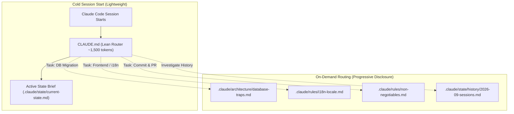
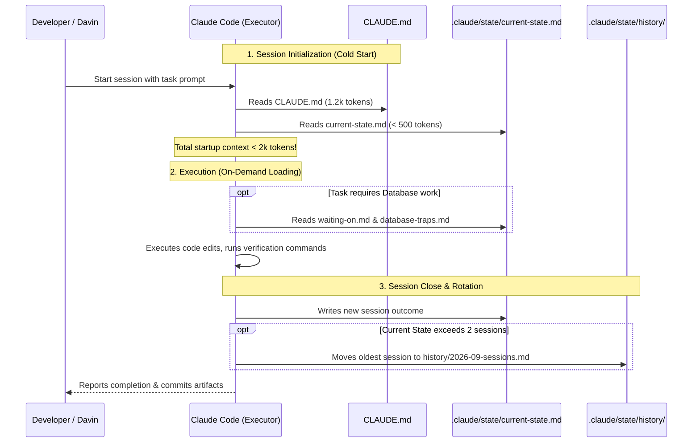

# Architecture Design: Refactoring CLAUDE.md with Open Knowledge Format (OKF)

**Decomposing a 480KB Monolithic Agent State into a Lean Router & Token-Efficient Knowledge Tree**

- **Document Version:** 1.0.0
- **Target System:** Claude Code / Anthropic Agent Ecosystem & Antigravity Advisor Protocol
- **Target Repository:** `trading-alerts-saas-public`
- **Author:** Antigravity (Advisor & Architect)
- **Status:** Proposed Architecture & Feasibility Blueprint

---

## 1. Executive Summary & Problem Analysis

### 1.1 The Current Crisis

A comprehensive audit of `CLAUDE.md` in the repository root reveals an acute state bloat:

- **File Size:** **480,403 bytes (~480 KB)**
- **Line Count:** **5,376 lines**
- **Cold-Start Token Overhead:** **~100,000 – 120,000 tokens per session start**

Because Claude Code automatically ingests `CLAUDE.md` into its context window at the start of every terminal session, **more than half of the effective context window is consumed before the developer issues their first prompt**.

### 1.2 Root Cause Diagnosis

Line distribution analysis of `CLAUDE.md` isolates the root cause:

| Section                   | Line Range      | Lines     | % of File | Purpose / Contents                                                                                        |
| ------------------------- | --------------- | --------- | --------- | --------------------------------------------------------------------------------------------------------- |
| **Header & Roles**        | L1 – L13        | 13        | 0.2%      | Role distinction (Antigravity Advisor vs. Claude Code Executor)                                           |
| **Current State**         | **L14 – L4893** | **4,880** | **90.8%** | **Accumulated session logs, historical post-mortems, bug analyses, and incident reports spanning months** |
| **Waiting On**            | L4894 – L5317   | 424       | 7.9%      | Blockers, traps, zero-step baseline migration warnings                                                    |
| **Key Documents & Rules** | L5318 – L5367   | 50        | 0.9%      | Document pointers, 7 Non-negotiables, Security override policy                                            |
| **Next.js Injection**     | L5368 – L5376   | 9         | 0.2%      | Auto-generated Next.js dev server warning                                                                 |

**Core Architectural Flaw:**
The instruction `## Current state _(update at the end of EVERY session)_` turned `CLAUDE.md` into an unpruned, append-only chronological journal. Historical incident reports (e.g., MT5 fixture issues from weeks ago, theme-toggle race conditions, cookie domain debugging) are continuously loaded into current memory even when completely irrelevant to upcoming tasks.

### 1.3 Target Architecture Objectives

1. **Reduce Cold-Start Token Consumption by >95%:** Shrink `CLAUDE.md` from ~100k tokens down to **< 1,500 tokens** (~100–150 lines).
2. **Apply Open Knowledge Format (OKF) Principles:** Convert monolithic state and documentation into a structured, modular **Knowledge Tree** where **1 Concept = 1 File**, tagged with YAML frontmatter and connected via standard Markdown links.
3. **Enforce Progressive Disclosure (On-Demand Loading):** Claude Code will ingest only the **Lean Router** at startup, querying specific concept files only when actively executing a task in that domain.
4. **Preserve Complete Auditability:** Relocate the 4,880 lines of rich historical logs into structured chronological archives without losing a single piece of institutional knowledge.

---

## 2. Architectural Paradigm: Open Knowledge Format (OKF)

The **Open Knowledge Format (OKF)**, introduced by Google Cloud Data Cloud, establishes an open, file-system-based standard for human-and-agent knowledge sharing:



### OKF Core Principles Adapted for Claude Code

1. **Minimal Opinionation & Zero Vendor Lock-in:** Stored entirely in plain Git-tracked Markdown (`.md`) files. No custom databases, proprietary vector catalogs, or third-party runtimes.
2. **Decoupled Producer / Consumer:** Antigravity or developers produce and curate guidance; Claude Code consumes and updates state files.
3. **Graph Topology via Markdown Links:** Concepts cite each other using standard relative Markdown links (e.g., `[Database Traps](../architecture/database-traps.md)`). The agent traverses links deterministically rather than relying on fuzzy semantic vector search.

---

## 3. Knowledge Tree Directory Specification

All agent knowledge, session state, and standing rules are organized under a dedicated `.claude/` directory in the repository root:

```text
trading-alerts-saas-public/
├── CLAUDE.md                               <-- LEAN ROUTER (< 150 lines, ~1.5k tokens)
└── .claude/
    ├── index.md                            <-- OKF Root Index & Knowledge Catalog
    │
    ├── state/                              <-- DYNAMIC STATE (Updated across sessions)
    │   ├── current-state.md                <-- Active session status (latest 1-2 sessions ONLY)
    │   ├── waiting-on.md                   <-- Active blockers, unapplied migrations, traps
    │   └── history/                        <-- CHRONOLOGICAL ARCHIVE (Archived from CLAUDE.md)
    │       ├── index.md                    <-- Index of historical sessions & milestones
    │       ├── 2026-09-sessions.md         <-- September 2026 logs (extracted from CLAUDE.md)
    │       ├── 2026-08-sessions.md         <-- August 2026 logs
    │       └── legacy-sessions-archive.md  <-- Pre-August 2026 historical notes
    │
    ├── rules/                              <-- STANDING RULES & POLICIES (Immutable unless amended)
    │   ├── non-negotiables.md              <-- The 7 Non-negotiables & escalation protocols
    │   ├── security-overrides.md           <-- Package override policy & pnpm rules
    │   └── i18n-compliance.md              <-- Locale & UI compliance rules
    │
    ├── architecture/                       <-- TECHNICAL FOUNDATIONS & TRAPS
    │   ├── role-distinction.md             <-- Antigravity (Advisor) vs Claude Code (Executor)
    │   ├── database-traps.md               <-- Baseline rows, uncreated tables, dual schema
    │   └── microservices-cutover.md        <-- Microservices migration roadmap & state
    │
    └── protocols/                          <-- AGENT OPERATING WORKFLOWS
        ├── session-lifecycle.md            <-- Protocol for opening, logging, and closing sessions
        └── verification-checklist.md       <-- Build, lint, typecheck, test:ci commands
```

---

## 4. Concept Decomposition & OKF File Specifications

Each file in `.claude/` represents an **Atomic Concept Unit** equipped with standardized YAML frontmatter.

### 4.1 Concept: Active Session State (`.claude/state/current-state.md`)

Replaces the bloated 4,880-line section with a strict sliding window of the **last 1–2 sessions**.

```markdown
---
type: Concept/AgentState
status: active
updated_at: 2026-09-26T16:00:00Z
session_id: '2026-09-26-round-5'
phase: 'Phase 14 / Porting'
git_branch: main
related_docs:
  - ../architecture/database-traps.md
  - ./waiting-on.md
---

# Active Session State

## Latest Completed Session (2026-09-26, Round 5)

- **Objective:** Fix landing hero image and page theme disagreement.
- **Root Cause:** `next-themes` `<ThemeProvider>` mounted in `app/providers.tsx` conflicted with `AppearanceProvider`.
- **Shipped Fix:** Unmounted `next-themes`. Root layout inline script paints theme server-side.
- **Verification:** `tsc`/ESLint clean; `test:ci` 251/251 (3213/3213 passed).

## Immediate Next Task

- Port remaining auth and marketing routes.
- Audit `app/(marketing)/help/page.tsx` for lingering `support@davintrade.com` references.

_(Older sessions are rotated into [Session History](./history/index.md))_
```

### 4.2 Concept: Blockers & Traps (`.claude/state/waiting-on.md`)

Isolates critical technical gotchas so they are not lost in narrative history.

````markdown
---
type: Concept/BlockersAndTraps
severity: high
updated_at: 2026-09-26T15:00:00Z
tags: [database, prisma, migrations, stack-d]
---

# Active Blockers & Known Traps

## 1. Database Ledger Mismatch (CRITICAL)

- **Trap:** `20260214000000_rag_dual_memory` is recorded as APPLIED in production `_prisma_migrations`, but the 6 physical tables DO NOT EXIST (`applied_steps_count = 0`).
- **Impact:** `prisma migrate deploy` will silently skip creating these tables.
- **Mitigation:** When working on Stack D RAG, manually run:
  ```bash
  prisma db execute --file prisma/migrations/20260214000000_rag_dual_memory/migration.sql
  ```
````

Do NOT run `migrate resolve` again.

## 2. In-Progress Codebase Traps

- `app/(marketing)/help/page.tsx` still has legacy support domain reference.
- `lib/api/index.ts` is change-frozen (CC-F) per master roadmap.

````

### 4.3 Concept: Standing Rules (`.claude/rules/non-negotiables.md`)
Preserves inviolable developer constraints without forcing them to compete with changelog text.

```markdown
---
type: Concept/StandingRules
authority: binding
scope: all-sessions
tags: [governance, safety, verification]
---

# Executor Non-Negotiables

1. **Never execute an unconfirmed order:** Lifecycle: PRE-DRAFT → DRAFT → APPROVED (Davin) → CONFIRMED.
2. **One session = one verifiable unit of work:** Never terminate in a half-deployed or broken state.
3. **Artifacts are the sole channel:** Deviations, Decisions, and State files must be written before closing.
4. **Scope discipline:** No drive-by fixes to change-frozen (CC-F) files.
5. **Money and auth changes escalate:** Any payment, auth, or secret modifications require explicit approval.
6. **Verification is mandatory:** `tsc`, `lint`, and `test:ci` must pass before marking done.
7. **Code truth over document preference:** When live code contradicts written plans, live code wins; escalate immediately.
````

---

## 5. The Lean Router: Specification for `CLAUDE.md`

Under this design, `CLAUDE.md` is replaced by an ultra-compact **Router & Dispatcher** (< 120 lines, ~1,200 tokens).

### 5.1 Proposed `CLAUDE.md` Content

```markdown
# CLAUDE.md — Executor Lean Router & Navigation Dispatcher

> **SYSTEM STATUS: MIGRATION MODE**
> **Roles:** **Antigravity** (Chat UI) = Advisor & Architect | **Claude Code** (Terminal CLI) = Executor.
> Full Operating Manual: `docs/migration-orders/EXECUTOR-PROTOCOL.md`

---

## 1. On-Demand Knowledge Loading Protocol (CRITICAL)

**DO NOT read the entire `.claude/` knowledge tree at session start.**
To conserve context window and prevent token bloat, follow this **Just-In-Time (JIT)** loading protocol:

1. At session start, read **ONLY** Section 2 below and `.claude/state/current-state.md`.
2. Consult `.claude/state/waiting-on.md` only if your task touches database schema, migrations, or auth.
3. Load specific domain guides from the **Navigation Matrix** below **only when assigned a task in that specific domain**.

---

## 2. Active Session Summary

- **Current Status:** [Read Active State](.claude/state/current-state.md) _(Round 5 theme fixes shipped; awaiting next migration order)_
- **Active Blockers / DB Traps:** [Read Waiting On](.claude/state/waiting-on.md)
- **Session Close Rule:** When finishing a session, append your report to `.claude/state/current-state.md`. **NEVER write session narratives into CLAUDE.md.**

---

## 3. Knowledge Navigation Matrix

| Domain / Task Trigger       | Knowledge File to Read                                                                 | Core Scope                                   |
| --------------------------- | -------------------------------------------------------------------------------------- | -------------------------------------------- |
| **Standing Rules & Safety** | [rules/non-negotiables.md](.claude/rules/non-negotiables.md)                           | 7 Inviolable rules, escalation criteria      |
| **Package / Dep Overrides** | [rules/security-overrides.md](.claude/rules/security-overrides.md)                     | `package.json` security policies             |
| **Frontend UI / Locales**   | [rules/i18n-compliance.md](.claude/rules/i18n-compliance.md)                           | Locale compliance & Settings bug traps       |
| **Database / Migrations**   | [architecture/database-traps.md](.claude/architecture/database-traps.md)               | Zero-step baselines, dual Prisma schemas     |
| **Microservices Migration** | [architecture/microservices-cutover.md](.claude/architecture/microservices-cutover.md) | Master roadmap & cutover statuses            |
| **Historical Decisions**    | [state/history/index.md](.claude/state/history/index.md)                               | Archived session logs & past bug fixes       |
| **Session End Protocol**    | [protocols/session-lifecycle.md](.claude/protocols/session-lifecycle.md)               | Clean session rotation & artifact generation |

---

## 4. Essential Verification Commands

- Run Build: `npm run build`
- Run Typecheck: `npx tsc --noEmit`
- Run Linter: `npm run lint`
- Run CI Test Suite: `npm run test:ci`

---

<!-- BEGIN:nextjs-agent-rules -->

# This is NOT the Next.js you know

This version has breaking changes — APIs, conventions, and file structure may all differ from your training data. Read the relevant guide in node_modules/next/dist/docs/ before writing any code.

<!-- END:nextjs-agent-rules -->
```

---

## 6. The Refactored Session Lifecycle Protocol

To prevent future regression into file bloat, Claude Code must follow a structured **Session Lifecycle Protocol** (`.claude/protocols/session-lifecycle.md`):



### Rotation Rules:

1. `.claude/state/current-state.md` must hold a maximum of **2 sessions** (~150 lines maximum).
2. When a 3rd session is logged, the oldest session is automatically moved into `.claude/state/history/YYYY-MM-sessions.md`.
3. `CLAUDE.md` remains strictly immutable during routine sessions, edited only when global system routing changes.

---

## 7. Feasibility Assessment & Risk Matrix

| Criterion                       | Evaluation              | Justification                                                                                                                            |
| ------------------------------- | ----------------------- | ---------------------------------------------------------------------------------------------------------------------------------------- |
| **Claude Code Tooling Support** | **100% Feasible**       | Claude Code natively uses `View`, `Read`, and `Grep` tools to inspect referenced files on demand. It excels at following Markdown links. |
| **Token Economy**               | **Massive Improvement** | Cold-start payload drops from **~100,000 tokens** to **~1,700 tokens** (**~98.3% token reduction**).                                     |
| **Context Retention & Focus**   | **High**                | Eliminates attention dilution caused by 4,800 lines of unrelated historical logs.                                                        |
| **Backward Compatibility**      | **Guaranteed**          | No existing scripts, build commands, or Git hooks depend on the body of `CLAUDE.md`.                                                     |

### Potential Risks & Mitigations

- **Risk:** Claude Code forgets to load a standing rule if it is buried in a sub-file.
  - **Mitigation:** The 7 Non-negotiables are summarized in 1 sentence each directly in the Router table, with explicit instructions that they are binding.
- **Risk:** Developers forget the rotation rule and append logs to `CLAUDE.md` again.
  - **Mitigation:** Clear instructions placed at the top of `CLAUDE.md` and in `.claude/protocols/session-lifecycle.md`.

---

## 8. Implementation & Migration Plan (4 Phases)

### Phase 1: Directory Setup & Historical Log Extraction

1. Create directory tree:
   ```bash
   mkdir -p .claude/state/history .claude/rules .claude/architecture .claude/protocols
   ```
2. Extract lines 14–4893 of `CLAUDE.md` into `.claude/state/history/2026-09-sessions.md` (and partition older blocks into August/pre-August archives).
3. Verify that zero log text is lost.

### Phase 2: Create Core OKF Concept Documents

1. Extract lines 4894–5317 (`## Waiting on`) into `.claude/state/waiting-on.md` and `.claude/architecture/database-traps.md`.
2. Extract lines 5318–5367 (`## Non-negotiables`, `## Key documents`, `## Security Override Policy`) into:
   - `.claude/rules/non-negotiables.md`
   - `.claude/rules/security-overrides.md`
   - `.claude/rules/i18n-compliance.md`
3. Generate `.claude/index.md` listing all concepts with tags and descriptions.

### Phase 3: Deploy the Lean Router (`CLAUDE.md`)

1. Overwrite root `CLAUDE.md` with the new **Lean Router & Navigation Dispatcher** template (Section 5.1).
2. Ensure the Next.js agent block (`<!-- BEGIN:nextjs-agent-rules -->`) is preserved at the bottom.

### Phase 4: Verification & Smoke Test

1. Check new file size of `CLAUDE.md`: verify it is under 5 KB (down from 480 KB).
2. Launch a test Claude Code session in the repository:
   - Verify that Claude Code reads `CLAUDE.md` instantly without delay.
   - Ask Claude Code a targeted question (e.g., _"What is our policy on package overrides?"_) to confirm it follows the link to `.claude/rules/security-overrides.md`.
   - Ask Claude Code about active database traps to confirm it reads `.claude/state/waiting-on.md`.
3. Commit the changes to Git.

---

## 9. Conclusion & Next Steps for Claude Code

This architecture resolves the token inflation crisis permanently. By replacing an unstructured, append-only document with an **Open Knowledge Format (OKF) Knowledge Tree**, the repository achieves:

- **Immediate 98% reduction in initial session tokens.**
- **Cleaner, more focused agent attention.**
- **A scalable, maintainable living documentation system.**

**Recommended Handoff Prompt for Claude Code:**

> _"Claude, please read the architectural design in `OKF_CLAUDE_MD_ARCHITECTURE_DESIGN.md`. Review Section 8 (Implementation & Migration Plan) and begin executing Phase 1 through Phase 4 to refactor `CLAUDE.md` into the `.claude/` OKF Knowledge Tree."_
