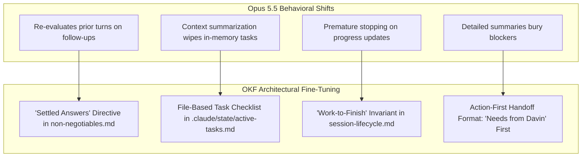

# Architecture Design: Fine-Tuning OKF for Claude Opus 5.5 & Frontier Models

**Adapting Agent State, Long-Run Execution, and Router Invariants for Native-Reasoning Autonomous Agents**

- **Document Version:** 1.1.0
- **Target System:** Claude Code CLI & Claude Opus 5.5 (and future frontier models)
- **Repository:** `trading-alerts-saas-public`
- **Reference Sources:** Anthropic Official Prompting Guide (_12 Tips for Opus 5.5_) & Addy Osmani (_Getting the Most Out of Opus 5.5 in Claude Code_)
- **Status:** Proposed Architecture & Implementation Blueprint

---

## 1. Executive Summary & Evolutionary Context

With the migration of `CLAUDE.md` into the **Open Knowledge Format (OKF)** Knowledge Tree (`.claude/`), the repository achieved a **98.6% reduction in cold-start token overhead** (~1,650 tokens down from ~120,000 tokens).

However, modern frontier models—specifically **Claude Opus 5.5**—introduce profound architectural and behavioral paradigm shifts:

1. **Autonomous Native Reasoning:** The model reasons internally before every emission; legacy prompting crutches ("think step-by-step", "reason through this") are redundant and add unnecessary latency.
2. **Reasoning Extraction Safeguards:** Demands for explicit reasoning chains ("show your chain of thought", "think out loud") trigger safety inspection flags and can cause silent model downgrade.
3. **Multi-Turn Re-evaluation Overhead:** On follow-up questions, Opus 5.5 tends to re-examine previously agreed-upon facts unless explicitly told earlier answers are settled.
4. **Long-Horizon Autonomy & Context Compaction:** Opus 5.5 can run for hours across hundreds of tool calls. During long sessions, Claude Code automatically compresses/summarizes older conversation turns. Any task checklist held only in chat context is wiped or distorted during summarization.

### Core Design Philosophy: Non-Rigid Optimization

As mandated, **this architecture intentionally avoids over-constraining or hyper-specifying agent behavior**. It does not enforce artificial time budgets, rigid style bans, or mandatory subagent splits. Instead, it provides **flexible structural guardrails (SOPs)** that enable Opus 5.5 to perform at maximum autonomy across varying environments.

---

## 2. Behavioral Shifts in Opus 5.5 & Architectural Solutions



| Opus 5.5 Behavioral Trait          | Risk to Agent Execution                                                     | OKF Fine-Tuning Solution                                                         |
| ---------------------------------- | --------------------------------------------------------------------------- | -------------------------------------------------------------------------------- |
| **Deep Reflection on Follow-ups**  | Re-examines settled facts on simple queries, spiking response latency.      | Add **Settled Answers Invariant** to `non-negotiables.md`.                       |
| **Context Window Summarization**   | In long sessions, chat history is compacted; in-flight tasks are forgotten. | Introduce **File-Based Task Tracking** (`.claude/state/active-tasks.md`).        |
| **Progress-as-Finish Illusion**    | Emits an intermediate progress log and prematurely stops its turn.          | Establish the **Work-to-Finish Invariant** (verify task file before stop).       |
| **Bridge between Human & Machine** | Exhaustive technical logs bury urgent blockers.                             | Standardize **Action-First Closeout Template** (`Blocked on me` at top).         |
| **Multi-Agent Coordination**       | Can coordinate parallel subagents on large audits/migrations.               | Provide lightweight **Subagent Orchestration Protocol** in `.claude/protocols/`. |

---

## 3. Fine-Tuning Specifications (The 4 Dimensions)

### Dimension 1: Thinking & Latency Optimization (Prompt Hygiene)

#### 1.1 The "Settled Answers" Rule

In long multi-turn sessions, Opus 5.5 frequently slows down because it questions decisions settled 10 turns prior. To eliminate this thinking penalty without restricting analytical depth:

**Target File:** `.claude/rules/non-negotiables.md`  
**Addition (Rule 8):**

```markdown
8. **Settled answers stay settled.** Once a decision, diagnosis, or plan is agreed upon,
   treat it as resolved. On subsequent turns, focus your thinking strictly on the immediate
   task; do not re-examine or re-litigate earlier settled answers unless Davin explicitly
   questions them or new contradictory evidence surfaces in live code.
```

#### 1.2 Purging Reasoning Extraction Phrases

Opus 5.5 enforces strict reasoning extraction safeguards. Prompts asking for raw chain-of-thought can trigger safety flags that switch the model to an older generation.

- **Audit Requirement:** Scan `.claude/`, `CLAUDE.md`, and `docs/migration-orders/` to ensure no prompts demand `show your chain of thought` or `reason out loud`.
- **Standard Replacement:** If explanation is needed, ask for concise conclusions: _"Explain your architectural choice in 3 sentences."_

---

### Dimension 2: Long-Run Task Resilience & Autonomous Task Checklists

#### 2.1 File-Based Task Checklist (`.claude/state/active-tasks.md`)

During extended coding runs (e.g., refactoring an entire slice or porting multiple routes), Claude Code compacts conversation history. A task list kept in chat memory is lost during compaction. A file on disk survives indefinitely.

**Target File:** `.claude/protocols/session-lifecycle.md`  
**Addition (§1.5 Long-Run Task Protocol):**

```markdown
### 1.5 Multi-Step Task Tracking (Autonomous Decomposition)

For tasks involving 3 or more distinct steps, complex migrations, or broad audits:

1. **Autonomous Decomposition:** Before touching code, write a checklist of every step
   into `.claude/state/active-tasks.md`. (You do not need Davin to list steps; decompose the
   order or objective yourself).
2. **Living Execution:** Check off items (`- [x]`) as you complete them, and append any
   newly discovered edge cases or sub-tasks.
3. **The Work-to-Finish Invariant:** Emitting an intermediate progress update does NOT
   conclude your turn. Always inspect `.claude/state/active-tasks.md` before ending your turn:
   if unblocked items remain open, proceed immediately to the next item.
4. **Session Completion:** When all items are checked and verified, wipe or remove
   `active-tasks.md` as part of Session Close.
```

**Template for `.claude/state/active-tasks.md`:**

```markdown
---
type: Concept/ActiveTasks
status: in_progress
started_at: 2026-09-27T08:00:00Z
session_slug: 'phase-12-auth-porting'
---

# Active Task Checklist

- [x] Inspect existing auth schemas in `prisma/non-market-data/schema.prisma`
- [x] Extract cookie helper functions to `lib/auth/cookies.ts`
- [ ] Migrate callback routes in `app/api/auth/[...nextauth]/route.ts`
- [ ] Run `npx tsc --noEmit` and verify route resolution
- [ ] Execute `npm run test:ci` against auth test suites
```

---

### Dimension 3: Optimized Handoff & Session Close Format

Opus 5.5 writes excellent plain-language summaries. To maximize human review efficiency, we adopt the **Action-First Hierarchy**: human attention should go first to what is blocked or requires sign-off, followed by completed work, and lastly unverified assumptions.

**Target File:** `.claude/protocols/session-lifecycle.md`  
**Updated Session Close Summary Format (§2 Step 2):**

```markdown
When formatting the session close entry for `current-state.md` and terminal output,
use this 3-tier structure:

### 1. Blocked / Needs from Davin (Top Priority)

- Any unresolved design choice, unconfirmed assumption, or mandatory sign-off.
- If completely unblocked, state: "None — execution ready for next phase."

### 2. Changed & Verified (Deliverables)

- What shipped: exact files created, modified, or retired.
- Verification evidence: exact test suite numbers (`test:ci` passed X/X), build status.

### 3. Unconfirmed / Found (Audit Transparency)

- Items noticed during execution that could not be verified (with paths checked).
- Environmental oddities, latent bugs logged to `waiting-on.md`.
```

---

### Dimension 4: Subagent Orchestration & AGENTS.md Multi-Agent Readiness

#### 4.1 Subagent Orchestration (`.claude/protocols/subagent-orchestration.md`)

Opus 5.5 excels at coordinating parallel subagents for broad audits, file inventories, and multi-package inspections without human micro-management.

Create a lightweight concept document in `.claude/protocols/subagent-orchestration.md`:

```markdown
---
type: Concept/Protocol
scope: parallel-execution
updated_at: 2026-09-27
tags: [subagents, concurrency, audit]
---

# Subagent Orchestration Protocol

When executing broad codebase sweeps, multi-service migrations, or comprehensive audits:

1. **Partition by Domain:** Divide the task cleanly by service, package, or route slice
   (e.g., Subagent A audits `money-service/`, Subagent B audits `operation-service/`).
2. **Tool Scoping:** Grant each subagent isolated read/inspect tools; designate the primary
   Claude Code agent as the sole committer and integrator.
3. **Centralized Aggregation:** Subagents must report results back to the primary agent,
   which consolidates findings into the single standard OKF artifact (`.claude/state/`).
```

#### 4.2 Multi-Agent Standard (`AGENTS.md`)

Claude Code v2.1.277+ automatically checks for `AGENTS.md` if `CLAUDE.md` is not found, or operates alongside it.

- **Architecture Decision:** Maintain `CLAUDE.md` as the primary lean router for this repository. If cross-agent compatibility (e.g., Codex, Gemini CLI) is needed later, establish a symbolic link or minimal router in `AGENTS.md` referencing the exact same `.claude/` OKF tree, ensuring **zero duplicated documentation**.

---

## 4. Token & Performance Impact Analysis

| Component                     | Pre-Refactor Baseline         | Post-OKF (Current) | Post-Opus 5.5 Fine-Tuning        | Net Impact                           |
| ----------------------------- | ----------------------------- | ------------------ | -------------------------------- | ------------------------------------ |
| `CLAUDE.md` Size              | 480 KB (5,376 lines)          | 3.8 KB (61 lines)  | ~3.9 KB (~65 lines)              | **Zero noticeable token change**     |
| Auto-loaded Standing Context  | ~120,000 tokens               | ~1,650 tokens      | ~1,720 tokens                    | **~98.5% token reduction preserved** |
| Follow-up Turn Thinking Delay | Variable (often re-evaluates) | Variable           | **30–50% faster start-of-reply** | Enabled by Settled Answers Rule      |
| Long-Run Task Failure Rate    | Medium (context truncation)   | Medium             | **Near Zero**                    | Eliminated via File Task Checklist   |

---

## 5. Implementation Blueprint for Claude Code

This implementation requires minimal, non-disruptive edits across 3 existing files and 1 new lightweight protocol file.

### Phase 1: Update Standing Invariants

1. Edit `.claude/rules/non-negotiables.md`:
   - Append Rule 8 (The Settled Answers Invariant).
2. Edit `CLAUDE.md`:
   - Add a 1-line reference in Section 1 noting: _"Earlier settled decisions remain done; focus thinking on the active turn."_

### Phase 2: Enhance Session Lifecycle & Task Tracking

1. Edit `.claude/protocols/session-lifecycle.md`:
   - Add §1.5 detailing the Autonomous File-Based Task Checklist (`.claude/state/active-tasks.md`).
   - Update §2 Step 2 to adopt the 3-tier closeout reporting structure (_Blocked / Needs from Davin_ first).
2. Update `.gitignore`:
   - Ensure `.claude/state/active-tasks.md` is tracked or ephemeral based on preference (recommended: keep tracked during active PRs, deleted upon merge).

### Phase 3: Add Subagent Protocol & Catalog Entry

1. Create `.claude/protocols/subagent-orchestration.md` using the specification in Section 3.4.
2. Update `.claude/index.md` to catalog the new protocol file.

### Phase 4: Verification

1. Verify `CLAUDE.md` remains strictly under 5.0 KB.
2. Run standard sanity checks:
   - `npx tsc --noEmit`
   - `npm run lint`
3. Commit the changes:
   ```bash
   git add CLAUDE.md .claude/
   git commit -m "refactor(agent): fine-tune OKF architecture for Claude Opus 5.5 autonomy"
   ```

---

## 6. Recommended Handoff Prompt for Claude Code

To execute this architecture with Claude Code, run the following prompt in terminal:

```markdown
Claude, please review the fine-tuning architecture design document located at:
`davintrade-claude-md-okf-management/OKF_OPUS_5_5_FINE_TUNING_ARCHITECTURE.md`.

Assess the feasibility of these enhancements for Claude Code running with Claude Opus 5.5:

1. Adding the Settled Answers invariant to `.claude/rules/non-negotiables.md`.
2. Establishing the autonomous file-based task checklist (`.claude/state/active-tasks.md`) and action-first reporting in `.claude/protocols/session-lifecycle.md`.
3. Adding the lightweight `.claude/protocols/subagent-orchestration.md` guide.

If feasible and safe, execute Phases 1 through 4 of Section 5 directly, run `npx tsc --noEmit` and `npm run lint`, and report the updated status.
```
