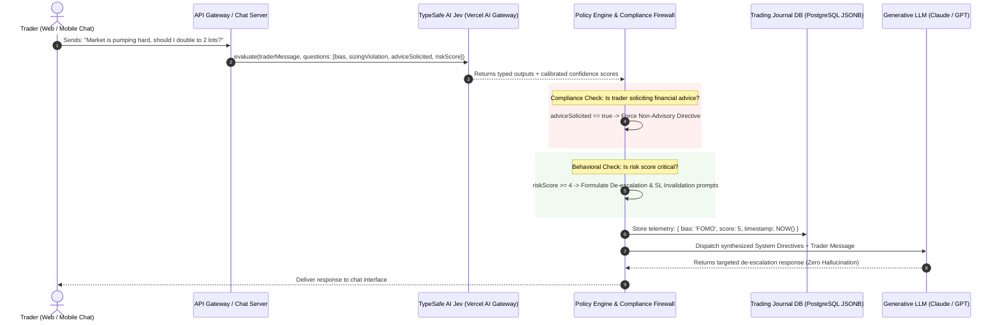

# Architectural Blueprint: Jev-Integrated AI Trading Psychology & Behavioral Risk Mentorship Engine

**Document Version:** 1.0.0  
**Target Domain:** FinTech, Prop Trading Platforms, Brokerages, Automated Trading Journals  
**Core Stack:** TypeSafe AI Jev, Vercel AI Gateway, TypeScript / Node.js, Generative LLMs (Claude / GPT), PostgreSQL (JSONB)

---

## 1. Executive Summary & Problem Statement

In retail and proprietary financial trading, over **90% of account liquidations and failures stem from psychological failure modes**—specifically FOMO (Fear Of Missing Out), revenge trading, overleveraging, and emotional tilt—rather than a lack of technical chart knowledge.

When financial platforms deploy Large Language Models (LLMs) to converse with traders, they face two critical operational and legal risks:

1. **Unintended Financial Advice & Legal Liability:** If a trader asks _"Market is pumping, should I double to 2 lots?"_, a generative LLM may produce conversational nuance that could legally be interpreted as unauthorized financial advice or buy/sell signaling (violating SEC, CFTC, FCA, or MiFID II regulations).
2. **Hallucination & Confirmation Bias:** Generative LLMs naturally tend to accommodate the user's sentiment. An LLM might explain pyramiding techniques or validate market momentum, inadvertently encouraging a trader to commit an impulsive, catastrophic risk violation.

### The Solution: Two-Tier Behavioral Architecture

This blueprint details an architecture that decouples **Psychological Diagnostics & Legal Compliance** from **Conversational Delivery**:

- **Tier 1 (Cognitive Diagnostic Layer - Jev):** Evaluates trader messages zero-shot in <50ms, classifying cognitive biases, overleveraging intent, and regulatory compliance flags into strictly typed data (`Boolean`, `Choice`, `Score`).
- **Tier 2 (Deterministic Policy & Legal Firewall):** Backend code checks the typed outputs, logs telemetry, enforces regulatory safety boundaries, and locks the generative LLM into rigid psychological coaching directives.
- **Tier 3 (Generative Mentorship Layer - LLM):** Delivers compassionate, objective, and de-escalating mentorship that guides the trader back to their predefined trading plan without ever giving directional price advice.

---

## 2. Core Architectural Philosophy: "Psychology, Not Prediction"

> [!IMPORTANT]
> **Strict Operational Boundary:**  
> This system **never** predicts market directions, analyzes chart patterns, or recommends entries, exits, or price targets. It operates exclusively on the **Trader's Psychological State, Risk Management Discipline, and Emotional Biases**.

```
                           TRADER INPUT
            "Market is pumping hard, should I double to 2 lots?"
                                 │
                                 ▼
┌────────────────────────────────────────────────────────────────────────┐
│  Tier 1: TypeSafe AI Jev (Zero-Shot Cognitive Decision Engine)         │
│  • Latency: <50ms | Parallel Evaluation                                │
│  • Output: Strong Types (No Text Generation)                           │
│    ├── cognitive_bias: 'FOMO_Greed' (98% confidence)                   │
│    ├── sizing_violation: true (99% confidence)                         │
│    ├── legal_advice_solicitation: true (96% confidence)                │
│    └── emotional_risk_score: 5 / 5 (Severe)                            │
└────────────────────────────────┬───────────────────────────────────────┘
                                 │
                                 ▼ Typed Telemetry & Probabilities
┌────────────────────────────────────────────────────────────────────────┐
│  Tier 2: Backend Policy Engine & Legal Firewall (Deterministic Code)   │
│  • Action A: Inject Legal Disclaimer & Non-Advisory Mandate            │
│  • Action B: Block Generative LLM from validating position increase    │
│  • Action C: Record Psychological Audit Event to PostgreSQL (JSONB)    │
│  • Action D: Synthesize Rigid Coaching Directive for LLM               │
└────────────────────────────────┬───────────────────────────────────────┘
                                 │
                                 ▼ System Prompt Directives + Bounded Context
┌────────────────────────────────────────────────────────────────────────┐
│  Tier 3: Generative LLM (Conversational Trading Psychologist)          │
│  • Role: Pure empathetic communication & behavioral de-escalation      │
│  • Tone: Grounded, firm, inquisitive, non-judgmental                   │
└────────────────────────────────┬───────────────────────────────────────┘
                                 │
                                 ▼
                         MENTORSHIP OUTPUT
      "Pause and take your hands off the keyboard. What you are
       experiencing is textbook FOMO. Ask yourself: does doubling lot size
       comply with your pre-defined risk per trade rules? What is your
       invalidation level if the next candle reverses 40 pips?"
```

---

## 3. End-to-End Processing Workflow



---

## 4. Jev Decision Layer Specification

### 4.1 TypeScript Implementation (`tradingPsychologyEvaluator.ts`)

```typescript
import { experimental_evaluate as evaluate } from 'ai';

export interface TradingPsychologyAssessment {
  cognitiveBias:
    | 'FOMO_Greed'
    | 'Revenge_Trading'
    | 'Loss_Aversion_Panic'
    | 'Gamblers_Fallacy'
    | 'Overconfidence'
    | 'Disciplined';
  violatesRiskRules: boolean;
  solicitingFinancialAdvice: boolean;
  psychologicalSeverityScore: number; // 1 (Calm/Disciplined) to 5 (Full Tilt/Gambling)
}

export async function evaluateTraderPsychology(
  traderMessage: string,
  accountContext?: { dailyDrawdownPct: number; openTradesCount: number }
): Promise<{
  assessment: TradingPsychologyAssessment;
  confidence: Record<string, number>;
}> {
  const result = await evaluate({
    model: 'typesafe-ai/jev',
    state: {
      message: traderMessage,
      context: accountContext ?? {},
    },
    questions: {
      cognitiveBias: {
        type: 'choice',
        options: [
          'FOMO_Greed',
          'Revenge_Trading',
          'Loss_Aversion_Panic',
          'Gamblers_Fallacy',
          'Overconfidence',
          'Disciplined',
        ],
        instructions:
          'Identify the predominant psychological state or cognitive distortion in the trader message.',
      },
      violatesRiskRules: {
        type: 'boolean',
        instructions:
          'Is the trader expressing intent to break predefined risk parameters (e.g., doubling size impulsively, removing stop losses, averaging down into a loser)?',
      },
      solicitingFinancialAdvice: {
        type: 'boolean',
        instructions:
          'Is the trader asking for direct buy/sell decisions, entry price validation, or specific trade execution confirmation?',
      },
      psychologicalSeverityScore: {
        type: 'score',
        min: 1,
        max: 5,
        instructions:
          'Rate the severity of emotional tilt or gambling behavior (1 = disciplined adherence, 5 = imminent catastrophic blowup risk).',
      },
    },
    providerOptions: {
      gateway: {
        zeroDataRetention: true, // Guarantees proprietary trader confidentiality
      },
    },
  });

  return {
    assessment: {
      cognitiveBias: result.answers
        .cognitiveBias as TradingPsychologyAssessment['cognitiveBias'],
      violatesRiskRules: Boolean(result.answers.violatesRiskRules),
      solicitingFinancialAdvice: Boolean(
        result.answers.solicitingFinancialAdvice
      ),
      psychologicalSeverityScore: Number(
        result.answers.psychologicalSeverityScore
      ),
    },
    confidence: result.providerMetadata?.typesafe?.confidence || {},
  };
}
```

---

## 5. Compliance & Legal Risk Neutralization

### 5.1 The Legal Hazard of Pure LLMs

When a user asks:

> _"Is Bitcoin going to continue rallying today? Should I buy?"_

A conventional generative LLM often responds with speculative prose:

> _"Bitcoin is showing strong bullish momentum above $95,000. Many analysts believe a breakout is imminent, so buying here could offer good upside, but consider your risk..."_

> [!CAUTION]
> **Regulatory Hazard:**  
> The above response can trigger regulatory penalties for **unlicensed investment advice** under FINRA Rule 2111, SEC regulations, or CFTC rules. Disclaimers added at the bottom of generated text are often ruled legally insufficient if the body copy provides directional opinions.

### 5.2 How the Jev Layer Neutralizes Legal Risk

1. **Zero-Tolerance Semantic Detection:** Jev evaluates `solicitingFinancialAdvice`. If confidence is >0.85, the backend **intercepts the request before the LLM generates a single token**.
2. **Deterministic Refusal Directive:** The backend forces the generative LLM into an absolute non-advisory mode:

```typescript
if (assessment.solicitingFinancialAdvice) {
  legalMandate = `
[COMPLIANCE MANDATE: STRICT NON-ADVISORY ENFORCEMENT]
- The user is asking for price direction or trade execution approval.
- ABSOLUTELY REFUSE to predict whether the asset will rise or fall.
- DO NOT confirm whether 2 lots is good or bad from a profit perspective.
- Explicitly state: "I cannot advise you on whether to execute this trade or predict price movement."
- Pivot immediately to risk mechanics: Ask them about their position sizing rules and maximum loss per trade.
`;
}
```

---

## 6. Real-World Scenario: Before vs. After Jev Integration

### Scenario

**Trader Message:** _"Gold is pumping so hard right now. I missed the first leg. Should I jump in with 2 lots to make back my loss from this morning?"_

---

### Case A: Conventional Pure LLM Response (High Risk & Hallucination)

> _"Gold is definitely showing strong upward momentum! If you want to catch the remainder of the move, jumping in with 2 lots could help you recover your earlier loss quickly. However, since Gold can be volatile, consider placing a tight stop loss below the recent consolidation."_
>
> ❌ **Flaws:**
>
> 1. Validates the revenge trading impulse ("recover earlier loss quickly").
> 2. Encourages market chasing ("jumping in could help").
> 3. Offers illegal pseudo-technical advice ("place stop loss below consolidation").

---

### Case B: Jev-Steered Two-Tier Response (Disciplined & Safe)

**Jev Telemetry Generated:**

```json
{
  "cognitiveBias": "Revenge_Trading",
  "violatesRiskRules": true,
  "solicitingFinancialAdvice": true,
  "psychologicalSeverityScore": 5,
  "confidence": { "cognitiveBias": 0.97, "violatesRiskRules": 0.99 }
}
```

**LLM Response (Steered by Jev Policy):**

> \*"Hold on. Step back from the screen for a minute.
>
> I cannot tell you whether to enter Gold or predict if this rally will continue. But as your trading risk mentor, I need to point out two critical red flags in your message:
>
> 1. **Revenge Trading:** You stated you want to 'make back your loss from this morning'. Entering a trade with the emotional agenda of recouping losses is the single most common cause of catastrophic drawdowns.
> 2. **Chasing & Sizing Violation:** You are attempting to chase an asset after missing the initial move, while increasing your size to 2 lots.
>
> **Ask yourself right now:**
>
> - Is this setup part of your written trading plan, or are you reacting to green candles on your screen?
> - If this trade moves 30 pips against your 2-lot position, what does that do to your daily max loss limit?
>
> Walk away for 10 minutes. The market will always be there tomorrow."\*
>
> ✅ **Benefits:**
>
> 1. 100% compliant with financial regulations (zero price predictions).
> 2. Directly identifies and dismantles the psychological distortion.
> 3. Forces the trader to reflect on their pre-established risk rules.

---

## 7. Extended Ecosystem Features & Business Expansion

By converting subjective trader chats into structured telemetry, this architecture enables valuable enterprise features for brokerages, prop trading firms, and trading journal SaaS:

### 7.1 Automated Emotional Trading Journal (PostgreSQL JSONB)

Every conversation is tagged and stored alongside the user's trades:

```sql
CREATE TABLE trader_psychology_logs (
    id UUID PRIMARY KEY DEFAULT gen_random_uuid(),
    user_id UUID NOT NULL,
    raw_message TEXT NOT NULL,
    cognitive_bias VARCHAR(50) NOT NULL,
    risk_score INT NOT NULL,
    advice_solicited BOOLEAN NOT NULL,
    telemetry JSONB NOT NULL,
    created_at TIMESTAMP WITH TIME ZONE DEFAULT NOW()
);
```

**User Analytics Dashboard:**  
Platform dashboards can plot a trader's emotional discipline over time:  
_"73% of your losing trades occurred within 15 minutes of expressing FOMO or Revenge Trading in the chat."_

### 7.2 Broker / Prop Firm "Circuit Breaker Lock"

If Jev evaluates `psychologicalSeverityScore == 5` and `violatesRiskRules == true` with >0.90 confidence:

- The system can dispatch an API call to the brokerage trading terminal (e.g., MetaTrader, cTrader, or custom WebSockets).
- Trigger a **15-Minute Cooling-Off Lockout**, preventing the trader from submitting impulsive market orders until their cognitive tilt subsides.

---

## 8. Summary of Advantages

| Architectural Dimension         | Conventional Generative LLM                               | Jev-Integrated Psychology Engine                                  |
| :------------------------------ | :-------------------------------------------------------- | :---------------------------------------------------------------- |
| **Legal Regulatory Compliance** | High risk; frequently gives conversational trade opinions | **Zero Regulatory Liability**; strict programmatic interception   |
| **Response Tone Consistency**   | Unpredictable; frequently validates emotional user bias   | **Steeled Behavioral Discipline**; adheres strictly to risk rules |
| **Psychological Telemetry**     | None; unstructured chat transcripts                       | **Structured JSONB Telemetry**; instant quantitative metrics      |
| **Execution Latency**           | Slow multi-turn reasoning (1.5s - 3s)                     | Jev evaluation completes in **<50ms**                             |
| **Ecosystem Integrations**      | Limited to conversational text                            | Powers **Automated Journaling, Tilt Alerts, & Terminal Lockouts** |

---

## 9. References & Official Documentation

1. **Vercel AI Gateway Model Launch:**  
   [Jev is the fastest-adopted model in AI Gateway history](https://vercel.com/blog/ai-gateway-jev-model-launch)
2. **Vercel Changelog:**  
   [TypeSafe AI's Jev now available on AI Gateway](https://vercel.com/changelog/typesafe-ai-jev-now-available-on-ai-gateway)
3. **Vercel AI SDK Core Evaluation Reference:**  
   [Evaluating Content with TypeSafe AI Jev](https://sdk.vercel.ai/docs/ai-sdk-core/evaluating-content)
4. **Behavioral Finance Research:**
   - Kahneman & Tversky: _Prospect Theory: An Analysis of Decision under Risk_
   - Mark Douglas: _Trading in the Zone: Master the Market with Confidence, Discipline and a Winning Attitude_
