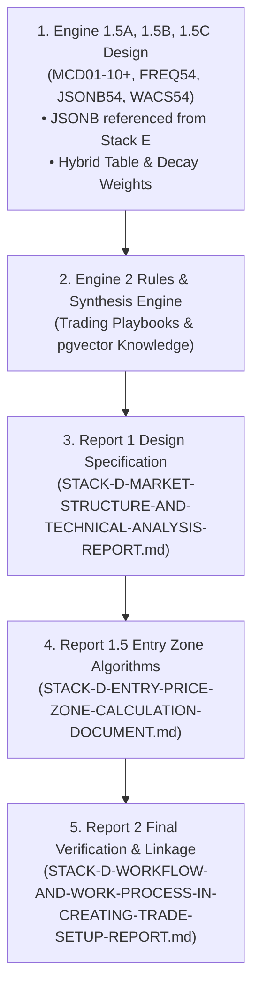

# 🚀 Hand Off Report: DavinTrade Stack D & E Architecture Migration

**Date:** 2026-08-29  
**From:** Antigravity AI Assistant (Session 1)  
**To:** Antigravity AI Assistant (Session 2 / New Session) & User  
**Project:** DavinTrade SaaS (`trading-alerts-saas-public`)  
**Active Directory:** `d:\SaaS Project\trading-alerts-saas-public\davintrade-stack-d-and-e\`  
**Current Milestone State:** Stuck at Session 11-3 migration planning; actively designing Engine 1.5, Engine 2, and Report 1 & 1.5 specifications for Claude Code implementation.

---

## ⛔ CRITICAL DIRECTIVE & STRICT IMMUTABILITY RULE (DO NOT VIOLATE)

> [!CAUTION]
>
> ### 🛑 STRICTLY FORBIDDEN TO MODIFY:
>
> **DO NOT TOUCH, EDIT, RENAME, OR OVERWRITE:**  
> 📁 [**`STACK-D-CONVERSATIONAL-AI-CHART-ANALYSIS-ARCHITECTURE.md`**](file:///d:/SaaS%20Project/trading-alerts-saas-public/davintrade-stack-d-and-e/STACK-D-CONVERSATIONAL-AI-CHART-ANALYSIS-ARCHITECTURE.md) _(Version 1 Original Baseline)_  
> **Rationale:** The user **strictly requires this V1 baseline file to remain 100% frozen/unmodified** so Claude Code can diff it against the latest specifications and synthesize a refreshed Migration Plan from Session 11-3 onwards!

---

## 📊 1. Master Document Inventory & Current Status

All specifications in `davintrade-stack-d-and-e/` have been audited, fully synchronized, and confirmed **100% English (0 Thai characters, 100% valid UTF-8, zero syntax errors)**:

| #   | Master Document File                                                                                                                                                                                                           | Version    | Scope & Implemented Key Milestones                                                                                                                                                                                                                                                                                                    |
| :-- | :----------------------------------------------------------------------------------------------------------------------------------------------------------------------------------------------------------------------------- | :--------- | :------------------------------------------------------------------------------------------------------------------------------------------------------------------------------------------------------------------------------------------------------------------------------------------------------------------------------------ |
| 1   | [**`ENGINE-4-USER-CONSTRAINTS-AND-PREFERENCES-ARCHITECTURE.md`**](file:///d:/SaaS%20Project/trading-alerts-saas-public/davintrade-stack-d-and-e/ENGINE-4-USER-CONSTRAINTS-AND-PREFERENCES-ARCHITECTURE.md)                     | **v1.8.0** | • **8 Core Metrics** (5 Multiple-Choice + 3 Numeric Inputs)<br>• **Fixed 54-Bar Standard** (Hardcoded lookback: M5=4.5h, M15=13.5h)<br>• **Max Leverage Ceiling:** 1:5.0x Institutional Risk Cap<br>• **Single-Order Demarcation:** Standalone trade scope (No portfolio aggregation)<br>• **Scope Interception:** XAUUSD M5/M15 only |
| 2   | [**`STACK-D-CONVERSATIONAL-AI-CHART-ANALYSIS-ARCHITECTURE-V2.md`**](file:///d:/SaaS%20Project/trading-alerts-saas-public/davintrade-stack-d-and-e/STACK-D-CONVERSATIONAL-AI-CHART-ANALYSIS-ARCHITECTURE-V2.md)                 | **v2.4.0** | • **7-Pillar Retrieval Engine** (`Promise.all` < 120ms)<br>• **Fixed 54-Bar Window** (`LOOKBACK_BARS = 54`)<br>• **Entry Price Sanity Gate (±5.0% Band)**<br>• **Out-of-Scope Interception Guardrails** (Non-XAUUSD / Non-M5/M15)<br>• **pgvector & Chat History Relational Schema**                                                  |
| 3   | [**`STACK-D-WORKFLOW-AND-WORK-PROCESS-IN-CREATING-TRADE-SETUP-REPORT.md`**](file:///d:/SaaS%20Project/trading-alerts-saas-public/davintrade-stack-d-and-e/STACK-D-WORKFLOW-AND-WORK-PROCESS-IN-CREATING-TRADE-SETUP-REPORT.md) | **v2.0.0** | • **Report 2 Specification & Workflow** (End-to-End)<br>• **Entry Price Sanity Validation (±5.0% Band)**<br>• **Sub-0.01 Lot Underflow Protocol** (4-Step Sequential Resolution)<br>• **3-Tier Dynamic Take Profit Matrix** (Conservative/Standard/Aggressive)<br>• **Statutory Disclaimers & Compliance Matrix**                     |
| 4   | [**`STACK-D-MASTER-MODIFICATION-PLAN.md`**](file:///d:/SaaS%20Project/trading-alerts-saas-public/davintrade-stack-d-and-e/STACK-D-MASTER-MODIFICATION-PLAN.md)                                                                 | **Active** | • Complete 7-Pillar architecture overview<br>• Table schema extension design (Columns 80–102)                                                                                                                                                                                                                                         |
| 5   | [**`STACK-E-POSTGRESQL-JSONB-MARKET-COMMENTS-ARCHITECTURE.md`**](file:///d:/SaaS%20Project/trading-alerts-saas-public/davintrade-stack-d-and-e/STACK-E-POSTGRESQL-JSONB-MARKET-COMMENTS-ARCHITECTURE.md)                       | **v1.0.0** | • **JSON-B Market Comments & Quality Metrics Engine**<br>• Authoritative reference for `JSONB54` narrative schemas & comment triggers                                                                                                                                                                                                 |
| 6   | [**`stack-d-prisma-design.xlsx`**](file:///d:/SaaS%20Project/trading-alerts-saas-public/davintrade-stack-d-and-e/stack-d-prisma-design.xlsx)                                                                                   | **Active** | • Database column layout: Cols 1–79 (Raw Indicators), Cols 80–89 (`MCD01_VALID`..`MCD10_VALID`), Cols 90–99 (`FREQ54_MCD01`..`10`), Col 100 (`JSONB54`), Col 101 (`Conf_Score`), Col 102 (`WACS54`).                                                                                                                                  |

---

## 🧠 2. Key Architectural Consensus & Design Decisions Reached

### 2.1 Fixed 54-Bar Lookback Standard (Platform-Wide Standard)

- **Design Decision:** Removed user-customizable lookback window (previously 27–108 bars). The lookback is now **permanently fixed at 54 bars** across the platform.
- **Mathematical Rationale:**
  - **On M5 (54 bars = 270 min / 4.5 hours):** Perfectly captures an entire London or New York active intraday trading session for Scalpers.
  - **On M15 (54 bars = 810 min / 13.5 hours):** Captures the full active 24-hour trading cycle across London and New York overlaps for Day Traders.
- **Engineering Impact:** Eliminates expensive dynamic SQL aggregations on-the-fly, accelerates PostgreSQL index lookups, and provides deterministic, high-signal feature vectors for the LLM.

### 2.2 Extended Database Schema (`market_data_v6` Extensions)

- Both M5 and M15 share the exact same table and column headers (differentiated by `timeframe = 'M5' | 'M15'`).
- **Columns 1–79:** Standard Raw OHLCV, 6 Centroid Variants (MAP, SSA, EMA_SSA, Crossing, Base_FL, UOEDT, LOEDT), Fractals, S/R Lines, Z-Score Candle, ZigZag Pivots & Metrics, Provenance.
- **Columns 80–89 (`MCD01_VALID` to `MCD10_VALID`):** Instantaneous Market Condition Descriptions active on the current bar.
- **Columns 90–99 (`FREQ54_MCD01` to `FREQ54_MCD10`):** Frequency counts of each MCD state over the fixed 54-bar lookback window.
- **Column 100 (`JSONB54`):** Deduplicated narrative timeline & granular sub-state frequency dictionary _(architecturally referenced and extended from Stack E JSONB comment schemas)_.
- **Column 101 (`Conf_Score`):** Current bar instantaneous confluence score ($-100$ to $+100$).
- **Column 102 (`WACS54`):** 54-bar Weighted Average Confluence Score with decay weighting ($-100$ to $+100$).

### 2.3 Strict Platform Scope & Guardrails

- **Asset Scope:** `XAUUSD (Gold)` only. Non-XAUUSD queries are politely intercepted and redirected.
- **Timeframe Scope:** `M5` (Micro Execution) & `M15` (Macro Structure) only. Swing trading timeframes (H1, H4, D1) are out-of-scope.
- **Entry Price Plausibility Gate ($\pm 5.0\%$):** Custom entry prices must be within $[P_{\text{live}} \times 0.95 \le \text{Entry} \le P_{\text{live}} \times 1.05]$.
- **Leverage Ceiling:** Institutional ceiling of **1:5.0x (5.0x max)**.
- **Single-Order Demarcation:** Calculations apply strictly to a single standalone trade setup without portfolio-level risk aggregation.

---

## 💡 3. Recommended Architectural Design Patterns (Engine 1.5 & Engine 2)

> [!TIP]
>
> ### 🌟 ARCHITECTURAL RECOMMENDATION FLAGS:
>
> The following recommendations address schema scalability, LLM prompt optimization, and quantitative scoring accuracy.

### A. Frequency Columns Expansion vs. Hybrid Table Design (Engine 1.5A & 1.5B)

- **The Problem:** MCDs contain multiple categorical sub-states (e.g., `MCD01` Slope has _Positive (+1), Negative (-1), Flat (0)_; `MCD02` Structure has _HH, HL, LH, LL, EQH, EQL_). Allocating an individual SQL column for every sub-state would expand the table by 30–50+ columns and trigger frequent Prisma migrations whenever a new sub-state is introduced.
- **Recommended Hybrid Pattern:**
  1. **PostgreSQL Columns (Numeric & Indexable):** Retain high-level aggregated summary frequencies as physical columns:
     - `freq54_bullish_count` (Bars with bullish bias)
     - `freq54_bearish_count` (Bars with bearish bias)
     - `freq54_flat_count`
     - `freq54_zigzag_breaks` (Structure breakout events)
  2. **Granular Sub-State Frequency Map in `JSONB54`:** Store the complete dictionary of granular sub-state counts inside `JSONB54`:
     ```json
     {
       "frequencies": {
         "mcd01_slope_pos": 38,
         "mcd01_slope_neg": 10,
         "mcd01_slope_flat": 6,
         "mcd02_structure_hh": 4,
         "mcd02_structure_hl": 3,
         "mcd03_channel_upper_touch": 7,
         "mcd03_channel_lower_touch": 1
       }
     }
     ```
     _Benefit:_ Keeps PostgreSQL schema clean and stable while providing LLM full 100% granular access without continuous `ALTER TABLE` migrations.

---

### B. Internal Structure of `JSONB54` (Semantic Narrative & Deduplication)

To allow the LLM to generate **Report 1** deterministically without context bloat, structure `JSONB54` into 3 essential components:

```json
{
  "window_bars": 54,
  "timeframe": "M5",
  "summary_narrative": [
    "Bullish Momentum Dominant: Regression slope was positive in 38/54 bars (70.4%).",
    "Market Structure: Formed 4 Higher Highs (HH) and 3 Higher Lows (HL) within the 54-bar lookback.",
    "Channel State: Price interacted with Upper EDT Channel 7 times with zero lower band breakdown.",
    "Candle Volatility: Average Z-score body size is elevated (+1.42 sigma) showing expanding volume."
  ],
  "dominant_regime": "STRONG_BULLISH_EXPANSION",
  "key_levels_in_54bars": {
    "swing_high": 2552.8,
    "swing_low": 2531.1
  }
}
```

_Benefit:_ Deduplicating multi-bar events into a concise `summary_narrative` allows Stack D's prompt assembler to inject dense, high-signal facts directly into the prompt without token waste.

---

### C. Mathematical Decay Weighting for `WACS54` (Weighted Average Confluence Score)

Since $WACS_{54} \in [-100, +100]$:

- **Weighting Rationale:** Recent bars (e.g., bars $t$ to $t-10$) must carry higher weight than historical bars (bars $t-45$ to $t-54$) to ensure responsiveness to recent trend shifts without lag.
- **Recommended Formula (Linear Decay Weighting):**
  $$WACS_{54} = \frac{\sum_{i=1}^{54} (w_i \times \text{Conf\_Score}_i)}{\sum_{i=1}^{54} w_i}$$
  _Where $w_i = 55 - i$ (Bar 1 = latest bar with $w_1 = 54$; Bar 54 = oldest bar with $w_{54} = 1$)._
  _(Optionally Exponential Decay: $w_i = e^{-\lambda i}$)._

---

### D. Pipeline Bridge to Engine 2 & Report Generation

```
[ Engine 1.5 Outputs (MCDs, JSONB54 Narrative, Conf_Score, WACS54) ]
                              │
                              ▼
[ Engine 2: Synthesis & Rules Engine ]
  • Ingests WACS54 (+75 = Strong Bullish Trend Conviction)
  • Ingests JSONB54 (Storyline Narrative & Technical Evidence)
  • Ingests User Constraints from Engine 4 (Trader Type, Risk %, Style)
                              │
                              ▼
[ Generate Report 1: Market Structure & Technical Analysis Report ]
  • Establishes Setup Direction (BUY / SELL / WAIT)
  • Provides Technical Justification derived from JSONB54 narrative
  • Passes direction & structure bounds to Report 1.5 & Report 2
```

---

## 🎯 4. Outstanding Roadmap & Next Work Packages (For Session 2)

The new session should execute the following work packages in sequential order:



### Detailed Breakdown of Next Steps:

#### Step 1: Engine 1.5A, 1.5B, 1.5C Detailed Specification

- **Engine 1.5A (MCD Definition & Detection):** Define the exhaustive discrete states for MCD01 to MCD10+ (Slope, Market Structure from ZigZag, Channel touch/rejection, Z-score body, etc.) and calculate `FREQ54_MCDxx`.
- **Engine 1.5B (Storyline & Deduplication):** Structure `JSONB54` narrative generation, state timeline, and deduplication logic for high-signal LLM context.
  > [!NOTE]
  > **Authoritative Architectural Reference:**  
  > The JSONB structure and event trigger rules in Engine 1.5B can directly reference and build upon [**`STACK-E-POSTGRESQL-JSONB-MARKET-COMMENTS-ARCHITECTURE.md`**](file:///d:/SaaS%20Project/trading-alerts-saas-public/davintrade-stack-d-and-e/STACK-E-POSTGRESQL-JSONB-MARKET-COMMENTS-ARCHITECTURE.md) located in the same directory (`davintrade-stack-d-and-e/`).
- **Engine 1.5C (WACS54):** Formalize decay-weighted momentum & bias algorithm ($WACS_{54} \in [-100, +100]$) and `Conf_Score`.

#### Step 2: Engine 2 (Synthesis & Rules Engine) Detailed Specification

- Synthesize WACS54, JSONB54, and Engine 4 constraints into setup directions (`BUY` / `SELL`).
- Structure `pgvector` embedding knowledge retrieval for trading playbooks and invalidation rules.

#### Step 3: Design Report 1 Specification

- **Target File Name:** `STACK-D-MARKET-STRUCTURE-AND-TECHNICAL-ANALYSIS-REPORT.md` (Renamed from _"Technical and Trade Setup Analysis Report"_).
- ⚠️ **NOTE:** Do **NOT** create this file immediately; formulate and align on its complete architectural specification first.

#### Step 4: Design Report 1.5 (Entry Price Zone Calculation)

- **Target File Name:** `STACK-D-ENTRY-PRICE-ZONE-CALCULATION-DOCUMENT.md`
- Formulate mathematical algorithms for the 5 discrete entry price levels (Best Fit, Upper Channel Rejection, Lower Channel Rejection, Baseline Breakout, Pullback).

#### Step 5: Integration with Report 2

- Connect the output of Report 1 and Report 1.5 into the already completed and verified [**`STACK-D-WORKFLOW-AND-WORK-PROCESS-IN-CREATING-TRADE-SETUP-REPORT.md`**](file:///d:/SaaS%20Project/trading-alerts-saas-public/davintrade-stack-d-and-e/STACK-D-WORKFLOW-AND-WORK-PROCESS-IN-CREATING-TRADE-SETUP-REPORT.md).

---
