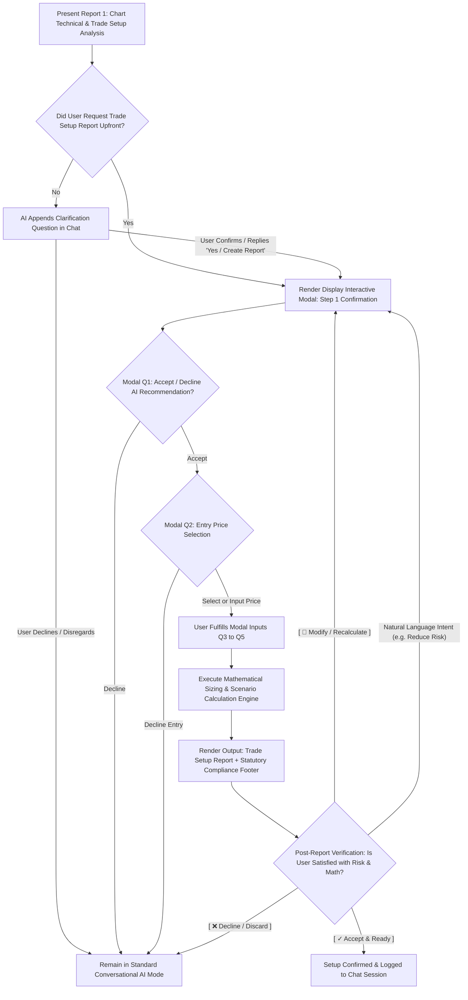

# Workflow and Work Process in Creating Trade Setup Report (Stack D)

**Document Version:** 2.0.0  
**Document Code:** `STACK-D-WORKFLOW-AND-WORK-PROCESS-IN-CREATING-TRADE-SETUP-REPORT.md`  
**Target Scope:** `XAUUSD` on `M5` and `M15` Timeframes  
**System Layer:** Conversational AI Co-Pilot & Execution Mathematics Engine (Stack D)  
**Compliance Classification:** Execution-Only / Mathematical Decision-Support Software Tool (EU AI Act / US CFTC / UK FCA / Japan JFSA)  
**Date:** 2026-08-29

---

## 📌 1. End-to-End Trigger Flow & Interaction Architecture



### 1.1 Trigger Clarification Logic:

1. **Default Post-Report 1 Clarification:** When Report 1 (Technical Analysis) completes without prior explicit instructions to generate the Trade Setup Report, the AI assistant politely prompts:
   > _"Would you like me to generate the Trade Setup Report with mathematical position sizing and profit-taking targets for this setup?"_
2. **Affirmative Response:** If the user agrees (e.g. _"Yes"_, _"Create Trade Setup Report"_, _"Proceed with Report 2"_), the system pops up the **Display Interactive Modal**.

---

## 📋 2. Display Interactive Modal Specification (`Input for Trade Setup Report Creation`)

The interactive modal serves as the structured gateway before running execution calculations. It captures **5 specific input parameters**, enforcing strict safety guardrails from the user's **Engine 4 Constraints & Preferences profile**:

```
┌────────────────────────────────────────────────────────────────────────────────────────────────────────────────┐
│                           DISPLAY INTERACTIVE MODAL: TRADE SETUP REPORT INPUTS                                 │
├────┬───────────────────────────────────────┬──────────────────────┬────────────────────────────────────────────┤
│ #  │ Input Field Name                      │ UI Component Type    │ Validation & Guardrail Rules               │
├────┼───────────────────────────────────────┼──────────────────────┼────────────────────────────────────────────┤
│ 1  │ **Position Side Confirmation**        │ 2-Button Toggle      │ • `[ Accept AI Recommendation ]` ➔ Proceed │
│    │ *(Accept / Decline AI Recommendation)*│                      │ • `[ Decline ]` ➔ Return to Standard Chat  │
├────┼───────────────────────────────────────┼──────────────────────┼────────────────────────────────────────────┤
│ 2  │ **Entry Price Selection**             │ Radio Pills + Input  │ • Pre-populated 5 discrete levels          │
│    │ *(With Explicit Non-Coercive Decline)*│ + Decline Button     │   calculated by the *Entry Price Zone      │
│    │                                       │                      │   Calculation Engine* (See Section 2.1)    │
│    │                                       │                      │ • Custom Input Box: `[ Other $ ________ ]` │
│    │                                       │                      │ 🛡️ **ENTRY PRICE PLAUSIBILITY GATE (±5%):**│
│    │                                       │                      │ • Custom entry must satisfy:               │
│    │                                       │                      │   [ P_live × 0.95 <= Entry <= P_live × 1.05│
│    │                                       │                      │   Prevents typos ($254.50) & absurd prices.│
│    │                                       │                      │ 🛡️ **LEGAL SAFEGUARD (EU/US/UK/JP):**      │
│    │                                       │                      │ • `[ Decline / Cancel Entry ]` button:     │
│    │                                       │                      │   If user rejects proposed price levels,   │
│    │                                       │                      │   clicking Decline immediately exits modal │
│    │                                       │                      │   and returns to standard chat.            │
├────┼───────────────────────────────────────┼──────────────────────┼────────────────────────────────────────────┤
│ 3  │ **Current Equity Balance ($ USD)**    │ Number Input Box     │ • Mandatory User Input (Single Source of   │
│    │                                       │                      │   Truth for all calculations)              │
│    │                                       │                      │ • User inputs live available equity balance│
├────┼───────────────────────────────────────┼──────────────────────┼────────────────────────────────────────────┤
│ 4  │ **Desired Risk Per Trade (% RPT)**    │ Radio Pills + Input  │ • Pre-populated percentage pills           │
│    │                                       │                      │   (e.g. 0.50%, 0.75%, 1.00%, 1.25%, 1.50%) │
│    │                                       │                      │ 🛡️ **STRICT GUARDRAIL:**                   │
│    │                                       │                      │ Populated pills & custom input box         │
│    │                                       │                      │ **MUST NOT EXCEED `Max RPT`**              │
│    │                                       │                      │ defined in Engine 4 profile.               │
├────┼───────────────────────────────────────┼──────────────────────┼────────────────────────────────────────────┤
│ 5  │ **Desired Stop Loss Distance ($ SLD)**│ Radio Pills + Input  │ • Pre-populated dollar pills               │
│    │                                       │                      │   (e.g. $13.00, $15.00, $17.00, $19, $21)  │
│    │                                       │                      │ 🛡️ **STRICT GUARDRAIL:**                   │
│    │                                       │                      │ Populated pills & custom input box         │
│    │                                       │                      │ **MUST NOT BE LESS THAN `Min SLD`**        │
│    │                                       │                      │ defined in Engine 4 profile.               │
└────┴───────────────────────────────────────┴──────────────────────┴────────────────────────────────────────────┘
```

### 2.1 Note on Entry Price Zone Population (Input 2):

The 5 pre-populated entry price levels (e.g. `$2,550.00 | $2,547.50 | $2,545.00 | $2,542.50 | $2,540.00`) are computed dynamically based on SSA regression bands, EDT channel bounds, and liquidity wick clusters.  
_The mathematical model and step-by-step algorithms for generating these 5 levels are specified in a dedicated companion document:_  
➔ **`STACK-D-ENTRY-PRICE-ZONE-CALCULATION-DOCUMENT.md`** _(Separate Specification)_.

---

### 2.2 Interactive Information Balloon (Tooltip `[ℹ️]`) Specifications for Modal Inputs & Report Terms

To ensure absolute transparency, prevent beginner misunderstanding, and eliminate disputes under **EU MiFID II, US CFTC 4.41, UK FCA Consumer Duty, and Japan JFSA regulations**, every input field and report term is equipped with an **Information Balloon `[ℹ️]`**:

```
┌────────────────────────────────────────────────────────────────────────────────────────────────────────────────┐
│                      INFORMATION BALLOON TOOLTIPS (TRADE SETUP MODAL & REPORT TERMS)                           │
├────┬──────────────────────────────┬────────────────────────────────────────────────────────────────────────────┤
│ #  │ Term Name on UI              │ Information Balloon Tooltip Content [ℹ️] (Plain-Language & Legal Notice)   │
├────┼──────────────────────────────┼────────────────────────────────────────────────────────────────────────────┤
│ 1  │ **Position Side [ℹ️]**        │ "Confirms the trading direction (BUY / SELL) recommended by the AI. Click  │
│    │                              │  'Accept' to calculate execution math, or 'Decline' to exit without setup."│
├────┼──────────────────────────────┼────────────────────────────────────────────────────────────────────────────┤
│ 2  │ **Entry Price Selection [ℹ️]**│ "Select your desired order entry price from the 5 AI-calculated zone levels│
│    │                              │  or enter your custom price (must fall within ±5% of live market price).  │
│    │                              │  Click 'Decline' if you reject all proposed price levels."                 │
├────┼──────────────────────────────┼────────────────────────────────────────────────────────────────────────────┤
│ 3  │ **Current Equity Balance**   │ "The actual available cash equity in your account (in $ USD). This is the  │
│    │ **($ USD) [ℹ️]**              │  exact capital base used as the sole denominator to calculate lot sizes    │
│    │                              │  for THIS SINGLE SETUP ONLY. (No portfolio-level aggregation across trades)"│
├────┼──────────────────────────────┼────────────────────────────────────────────────────────────────────────────┤
│ 4  │ **Desired Risk Per Trade**   │ "🎯 SPECIFIC SINGLE-TRADE RISK: The exact percentage of equity risked on   │
│    │ **(% RPT) [ℹ️]**              │  THIS specific setup (e.g. 1.00% = $100 on $10k). Does not include risk    │
│    │                              │  from other open positions. Cannot exceed global 'Max RPT%' ceiling."      │
├────┼──────────────────────────────┼────────────────────────────────────────────────────────────────────────────┤
│ 5  │ **Desired Stop Loss Distance**│ "🎯 SPECIFIC STOP LOSS: The exact dollar distance ($) per ounce between  │
│    │ **($ SLD) [ℹ️]**              │  your Entry Price and Stop Loss for THIS trade.                            │
│    │                              │  ⚠️ Note: This cannot be tighter than your global 'Min SLD$' buffer floor."│
├────┼──────────────────────────────┼────────────────────────────────────────────────────────────────────────────┤
│ 6  │ **Effective RRR [ℹ️]**        │ "The actual Risk-to-Reward Ratio calculated AFTER factoring in broker      │
│    │ *(Report Item 9)*            │  commissions, ensuring your target profit delivers your intended return."  │
├────┼──────────────────────────────┼────────────────────────────────────────────────────────────────────────────┤
│ 7  │ **Profit Taking Scenarios**  │ "Three target options based on market alignment: Conservative (High Win    │
│    │ **(Cons / Norm / Agg) [ℹ️]**  │  Rate / Quick Exit), Normal (Standard Target RRR), and Aggressive (Strong  │
│    │                              │  Trend Expansion). The green checkmark shows the AI's technical recommendation."│
├────┼──────────────────────────────┼────────────────────────────────────────────────────────────────────────────┤
│ 8  │ **Realisable Profit ($)**    │ "The net cash profit in USD credited to your account after deducting all   │
│    │ *(Report Item 12) [ℹ️]*      │  broker round-trip commissions when price hits the target profit level."   │
└────┴──────────────────────────────┴────────────────────────────────────────────────────────────────────────────┘
```

---

## 🎨 3. Data Variable Mapping & Highlight Color Cross-Reference

To ensure transparency and zero calculation errors, every variable is traced from its origin to its destination in the calculation pipeline (matching the visual workflow diagram):

```
┌────────────────────────────────────────────────────────────────────────────────────────────────────────────────┐
│                                  VARIABLE ORIGIN & HIGHLIGHT MAPPING TABLE                                     │
├───────────────────────┬───────────────────────────────────┬──────────────────────┬─────────────────────────────┤
│ Highlight Color       │ Variable Identifier               │ Source Origin        │ Role in Trade Setup Report  │
├───────────────────────┼───────────────────────────────────┼──────────────────────┼─────────────────────────────┤
│ 🌸 **Pink**           │ `Position Side`                   │ Modal (Input 1)      │ BUY / SELL direction (Item 1│
│ 🟡 **Yellow**         │ `Entry Price`                     │ Modal (Input 2)      │ Entry level (Item 2 & Math) │
│ 🟢 **Light Green**    │ `Current Equity Balance`          │ Modal (Input 3)      │ Sole Equity denominator     │
│ 🔴 **Coral / Red**    │ `Desired Risk per Trade (% RPT)`  │ Modal (Input 4)      │ Risk % (Item 3 & Risk Calc) │
│ 🔵 **Cyan**           │ `Desired Stop Loss Distance (SLD)`│ Modal (Input 5)      │ SL distance (Item 5 & Math) │
│ 🌿 **Bright Green**   │ `Trading Style`                   │ Engine 4 Profile     │ Header Display & Rec Badge  │
│ 🟣 **Magenta**        │ `ROUND DOWN Effective Lot Size`   │ Calculation Engine   │ Traded Volume (Item 7)      │
└───────────────────────┴───────────────────────────────────┴──────────────────────┴─────────────────────────────┘
```

---

## 🧮 4. Mathematical Sizing & Execution Workflow Engine

All calculations strictly adhere to standard institutional Gold CFD contract specifications (**1 Standard Lot = 100 Troy Ounces, $0.01 move per 1.00 Lot = $1.00 USD**):

```
┌────────────────────────────────────────────────────────────────────────────────────────────────────────────────┐
│                                      MATHEMATICAL SIZING WORKFLOW STEPS                                        │
├────────────────────────────────────────────────────────────────────────────────────────────────────────────────┤
│ STEP 1: MAXIMUM ALLOWABLE LOT SIZE FROM LEVERAGE CAP                                                           │
│                                                                                                                │
│   Max Allowable Leverage = [ Max Lot Size × 100 × Entry Price ] ÷ Current Equity Balance                       │
│                                                                                                                │
│   👉 Max Lot Size = [ Maximum Leverage × Current Equity Balance ] ÷ [ Entry Price × 100 ]                      │
├────────────────────────────────────────────────────────────────────────────────────────────────────────────────┤
│ STEP 2: RISK-BOUNDED LOT SIZE AT DESIRED STOP LOSS DISTANCE (INCLUDING COMMISSION)                             │
│                                                                                                                │
│   👉 Lot Size @ Desired SLD = [ Desired RPT × Current Equity Balance ] ÷                                       │
│                               [ (Desired Stop Loss Distance × 100) + Round-Trip Commission per 1 Lot ]         │
├────────────────────────────────────────────────────────────────────────────────────────────────────────────────┤
│ STEP 3: EFFECTIVE LOT SIZE (SAFETY MINIMUM) & BROKER ROUNDING DOWN                                             │
│                                                                                                                │
│   Effective Lot Size = MIN( Max Lot Size, Lot Size @ Desired SLD )                                             │
│                                                                                                                │
│   👉 ROUND DOWN Effective Lot Size = ⌊ Effective Lot Size × 100 ⌋ ÷ 100  (Strictly 2 decimal places)          │
├────────────────────────────────────────────────────────────────────────────────────────────────────────────────┤
│ STEP 4: ACTUAL LEVERAGE UTILIZATION (LEVERAGE USE)                                                             │
│                                                                                                                │
│   👉 Leverage Use = [ ROUND DOWN Effective Lot Size × 100 × Entry Price ] ÷ Current Equity Balance             │
│   (Verification Pass: Must be ≤ Maximum Leverage stipulated in Engine 4)                                       │
├────────────────────────────────────────────────────────────────────────────────────────────────────────────────┤
│ STEP 5: MAXIMUM CAPITAL AT RISK ($ AMOUNT)                                                                     │
│                                                                                                                │
│   👉 Max Capital at Risk $ = Desired Risk per Trade × Current Equity Balance                                   │
├────────────────────────────────────────────────────────────────────────────────────────────────────────────────┤
│ STEP 6: EXACT STOP LOSS PRICE ($ LEVEL)                                                                        │
│                                                                                                                │
│   • For BUY Position:   Stop Loss Price = Entry Price - Desired Stop Loss Distance                             │
│   • For SELL Position:  Stop Loss Price = Entry Price + Desired Stop Loss Distance                             │
└────────────────────────────────────────────────────────────────────────────────────────────────────────────────┘
```

---

### 4.1 Sub-0.01 Lot Size Underflow Protocol & 3-Step Guided Resolution Hierarchy

In Gold CFD markets, **0.01 Standard Lot (1 Micro Lot = 1 Troy Ounce)** is the absolute minimum executable order volume supported by global retail brokers. Every $\$1.00$ price movement on $0.01\text{ Lot}$ equals exactly $\$1.00\text{ USD}$ in financial profit or loss.

#### ⚠️ The Underflow Problem:

When a user on a small equity account (e.g. $\$500\text{ USD}$) selects a very conservative risk percentage (e.g. $0.50\% \implies \$2.50\text{ Max Loss}$) with a normal stop loss distance (e.g. $\$15.00\text{ SLD}$):
$$\text{Raw Lot Size} = \frac{\$2.50}{(15.00 \times 100) + 4.00} = \mathbf{0.00166\text{ Lots}} < 0.01\text{ Lot}$$

> [!CAUTION]
> **Zero Risk-Violating Rounding:** The AI **MUST NEVER** silently round up to $0.01\text{ Lot}$ on its own. Forcing $0.01\text{ Lot}$ would cause an actual loss of $\$15.04\text{ USD}$ ($3.01\%$ of equity), which is **6x higher than the user's declared risk tolerance!**

---

#### 💡 The 3-Step Guided Resolution Hierarchy (User Diagnostic & Action Modal):

When underflow occurs ($\text{Raw Lot} < 0.01$), the AI halts execution calculation and presents a structured diagnostic alert with **3 mathematically computed resolution options ranked in order of practicality**:

```
┌────────────────────────────────────────────────────────────────────────────────────────┐
│             ⚠️ SUB-0.01 LOT SIZE UNDERFLOW ALERT & GUIDED RESOLUTION                   │
├────────────────────────────────────────────────────────────────────────────────────────┤
│ 💬 Diagnostic Explanation:                                                             │
│ "Cannot compute valid order volume (Broker minimum is 0.01 Lot).                       │
│  Your declared risk budget of $2.50 USD (0.50% of $500 Equity) is smaller than the     │
│  minimum loss of 0.01 Lot at a $15.00 SL Distance ($15.04 USD, or 3.01% of Equity)."   │
│                                                                                        │
│ 🔘 3-Step Guided Resolution Options:                                                   │
│                                                                                        │
│  👉 [ Option 1: Adjust Desired Risk Per Trade (% RPT) to support 0.01 Lot ]            │
│     • Increase Desired RPT to 3.01% ($15.04 USD loss)                                  │
│     • Action Button: [ 🔘 Set Desired RPT to 3.01% ($15.04 Loss) ]                     │
│                                                                                        │
│  👉 [ Option 2: Tighten Desired Stop Loss Distance ($ SLD) ]                           │
│     • If chart structure permits, tighten SLD closer to entry                          │
│     • Guardrail: Must remain >= Min SLD ($13.00) set in Engine 4                       │
│                                                                                        │
│  👉 [ Option 3: Increase Simulated Equity Balance ($ USD) ]                            │
│     • To maintain 0.50% risk with $15.00 SLD, minimum required equity is $3,008.00 USD │
│     • Action Button: [ 🔘 Set Equity Balance to $3,008.00 USD ]                        │
│                                                                                        │
│  👉 [ Option 4: Decline / Cancel Setup ]                                               │
│     • Action Button: [ ❌ Decline / Cancel Setup ]                                     │
└────────────────────────────────────────────────────────────────────────────────────────┘
```

#### Mathematical Formulas for Guided Options:

1. **Minimum Required RPT % for 0.01 Lot:**
   $$\text{Min Required RPT \%} = \frac{(\text{Desired SLD} \times 1.00) + (0.01 \times \text{Round-Trip Commission})}{\text{Current Equity Balance}} \times 100\%$$
2. **Minimum Required Equity Balance for 0.01 Lot:**
   $$\text{Min Required Equity (\$) } = \frac{(\text{Desired SLD} \times 1.00) + (0.01 \times \text{Round-Trip Commission})}{\text{Desired RPT (Decimal)}}$$

---

## 🎯 5. 3-Tier Profit Taking Strategy Matrix & Dynamic Recommendation Logic

The Trade Setup Report provides **3 distinct mathematical profit-taking scenarios** based on the user's `Target RRR` defined in Engine 4:

1. **Normal Scenario:** Calculated directly from `Target RRR` (e.g. $RRR = 1.75\text{x}$)
2. **Conservative Scenario:** Target RRR decreased by 1 notch (e.g. $RRR = 1.50\text{x}$)
3. **Aggressive Scenario:** Target RRR increased by 1 notch (e.g. $RRR = 2.00\text{x}$)

---

### 5.1 Dynamic Recommendation Logic (The Green Checkmark ✔️ Badge)

The position of the **Recommend ✔️** checkmark across Conservative, Normal, or Aggressive is determined dynamically by **evaluating how well the active `Trading Style` aligns with the real-time Market Regime**:

```
┌────────────────────────────────────────────────────────────────────────────────────────────────────────────────┐
│                                DYNAMIC STYLE-TO-MARKET RECOMMENDATION MATRIX                                   │
├───────────────────┬───────────────────────────────────────────┬────────────────────────┬───────────────────────┤
│ Alignment Level   │ Market Regime & Technical Criteria        │ Recommended Scenario   │ Checkmark Placement   │
├───────────────────┼───────────────────────────────────────────┼────────────────────────┼───────────────────────┤
│ 🛡️ **Non-Aligned /**│ • Trading Style is counter to major trend │ **Conservative**       │ `Conservative`        │
│ **Counter-Trend** │   (e.g. Trend Countering / Mean Reversion)│                        │ `(Recommend ✔️)`      │
│                   │ • High market volatility / News event near│                        │                       │
│                   │ • Choppy / Sideway channel compression    │                        │                       │
├───────────────────┼───────────────────────────────────────────┼────────────────────────┼───────────────────────┤
│ ⚖️ **Moderate /**   │ • Normal trend alignment                  │ **Normal**             │ `Normal`              │
│ **Standard Trend**│ • Moderate momentum (WACS 25–60)          │                        │ `(Recommend ✔️)`      │
│                   │ • Standard channel expansion              │                        │                       │
│                   │ • *Fallback when Aggressive is uncertain* │                        │                       │
├───────────────────┼───────────────────────────────────────────┼────────────────────────┼───────────────────────┤
│ 🚀 **Strong Trend/│ **MUST SATISFY BOTH CONDITIONS:**         │ **Aggressive**         │ `Aggressive`          │
│ **High-Edge**     │ 1. **Strong Trend/Momentum:** WACS > 60   │                        │ `(Recommend ✔️)`      │
│                   │    + Multi-Timeframe (M15+M5) aligned     │                        │                       │
│                   │ 2. **Substantial Runway Remaining:**      │                        │                       │
│                   │    Price is in Early/Mid trend phase with │                        │                       │
│                   │    large remaining upside/downside space  │                        │                       │
│                   │ *(If not confident/uncertain ➔ Fallback)* │                        │                       │
└───────────────────┴───────────────────────────────────────────┴────────────────────────┴───────────────────────┘
```

> [!IMPORTANT]
> **Aggressive Recommendation Rule:**  
> To assign the `Recommend ✔️` badge to **Aggressive**, the AI must explicitly verify that the market is in a **Strong Momentum Trend** AND that there is **Substantial Remaining Runway (Early/Mid-stage of swing)**. If there is any ambiguity, insufficient data, or late-stage exhaustion, the system safely falls back to **Normal** (or Conservative).

---

### 5.2 Commission-Adjusted Effective RRR Formula:

To guarantee that the user receives their exact intended Risk-to-Reward ratio _after deducting all broker fees_, the system calculates the **Effective RRR** by factoring in round-trip commission:

$$\text{Effective RRR} = \frac{(\text{RRR} \times \text{Desired RPT} \times \text{Equity Balance}) + (\text{Round-Trip Commission per 1 Lot} \times \text{ROUND DOWN Lot Size})}{\text{Desired RPT} \times \text{Equity Balance}}$$

---

### 5.3 Multi-Scenario Target Calculations (Rows 10, 11, 12):

#### Row 10: Target Profit Taking Distance ($)

$$\text{Target Profit Taking Distance (\$) } = \text{Desired Stop Loss Distance (\$) } \times \text{Effective RRR}$$

#### Row 11: Target Profit Taking Price ($)

- **For BUY Position:** $\text{Target TP Price} = \text{Entry Price} + \text{Target Profit Taking Distance}$
- **For SELL Position:** $\text{Target TP Price} = \text{Entry Price} - \text{Target Profit Taking Distance}$

#### Row 12: Realisable Profit, Net of Commission ($)

$$\text{Realisable Profit (\$) } = (\text{ROUND DOWN Lot Size} \times 100 \times \text{Target TP Distance}) - (\text{Round-Trip Commission per 1 Lot} \times \text{ROUND DOWN Lot Size})$$

---

## 📄 6. Complete Trade Setup Report Output Layout & Post-Report Verification Loop

```text
Trade Setup Report :
Date/Time of report is created: 2026-08-29 00:00:00 UTC
========================================================================================
1) Position Side (user accepted AI's recommendation):       BUY
2) Entry Price (selected by user):                          $2,545.00
3) Risk Per Trade % (Verification Pass):                    1.00%
4) Max Capital at Risk $:                                   $100.00
5) Stop Loss Distance $ (Verification Pass):                $15.00
6) Stop Loss Price $:                                       $2,530.00
7) Lot Size:                                                0.06 Lots
8) Leverage Use (Verification Pass):                        1.52x  (Pass <= 5.0x max ceiling)

Profit Taking Strategy :
Trading Style in Use : Trend Countering
----------------------------------------------------------------------------------------
                                Conservative (Recommend ✔️)    Normal         Aggressive
9) Effective Risk-to-Reward:    1.54x                         1.80x          2.05x
10) Target TP Distance $:       $23.10                        $27.00         $30.75
11) Target TP Price $:          $2,568.10                     $2,572.00      $2,575.75
12) Realisable Profit (Net) $:  $138.60                       $162.00        $184.50
========================================================================================
[ LEGAL & STATUTORY DISCLAIMER - STANDALONE SINGLE-ORDER SCOPE ]
This Trade Setup Report is an automated mathematical calculation tool generated strictly based
on user-selected inputs (Entry, Equity, Risk %, SL Distance) for this STANDALONE SPECIFIC TRADE ONLY.
It operates solely as an Execution-Only Software Decision-Support Utility under EU MiFID II,
US CFTC Rule 4.41, UK FCA PERG 8.29, and Japan JFSA FIEA Art 29/37.
⚠️ CRITICAL NOTICE: DavinTrade App does NOT calculate, aggregate, or manage portfolio-level risk,
cross-symbol correlation, or cumulative account margin across multiple open positions.
The user remains solely responsible for total portfolio exposure and broker account management.
This report does NOT constitute discretionary investment advice or portfolio management.
```

---

### 6.1 Post-Report Review & User Sanity / Consent Verification Prompt

To ensure complete user comprehension, informed consent, and eliminate any possibility of accidental or involuntary trading actions, the AI assistant immediately appends a structured closing prompt below the report:

```text
┌────────────────────────────────────────────────────────────────────────────────────────┐
│                        POST-REPORT FINAL CONFIRMATION & REVIEW                         │
├────────────────────────────────────────────────────────────────────────────────────────┤
│ 💬 AI Prompt:                                                                          │
│ "Please review the calculated position size and dollar risk above.                     │
│  • Are you comfortable with this Max Capital Loss ($100.00) and Lot Size (0.06 Lots)?  │
│  • Would you like to accept this setup, modify your inputs, or discard the setup?"    │
│                                                                                        │
│ 🔘 Interactive Action Buttons:                                                         │
│   [ ✓ Accept & Ready to Execute ]                                                      │
│   [ 🔄 Modify Setup / Recalculate ]                                                    │
│   [ ❌ Decline / Discard Setup ]                                                       │
└────────────────────────────────────────────────────────────────────────────────────────┘
```

#### User Action Handling:

1. **User clicks `[ ✓ Accept & Ready to Execute ]`:** The setup is formally logged in the session transcript as acknowledged by the user.
2. **User clicks `[ 🔄 Modify Setup / Recalculate ]`:** The system immediately re-renders the **Display Interactive Modal (Section 2)** with the previously entered values pre-filled, allowing the user to adjust their Risk %, Stop Loss Distance, or Entry Price.
3. **User clicks `[ ❌ Decline / Discard Setup ]`:** The setup is discarded, and the AI smoothly returns to standard conversational mode.
4. **Natural Language Feedback:** If the user types any objection (e.g. _"I cannot accept a $100 Max Loss, reduce risk to 0.5%"_, _"Widen my Stop Loss distance"_, _"Recalculate with $2,542.50 entry"_), the AI immediately detects the intent and re-opens the Interactive Modal with the updated parameters!

---

## 🛡️ 7. Safety Validation & Multi-Jurisdiction Compliance Verification

```
┌────────────────────────────────────────────────────────────────────────────────────────────────────────────────┐
│                             MULTI-JURISDICTION COMPLIANCE AUDIT & VERIFICATION MATRIX                          │
├─────────────────────┬───────────────────────────────┬──────────────────────────────────────────────────────────┤
│ Jurisdiction / Law  │ Core Regulatory Requirement   │ How Stack D Trade Setup Report Strictly Complies         │
├─────────────────────┼───────────────────────────────┼──────────────────────────────────────────────────────────┤
│ 🇪🇺 **EU MiFID II &**│ • Distinguish Advice vs Tool  │ 1. Mandatory Q1 & Q2 Opt-In/Decline: User is never forced│
│    **EU AI Act**    │ • Transparency (AI Act Art 50)│ 2. Information Balloons: Plain-language legal tooltips.  │
│                     │ • Double-Confirmation Gate    │ 3. Post-Report Review Gate guarantees informed consent.  │
│                     │ • Standalone Scope Clarity    │ 4. Explicit notice that tool does NOT manage portfolio.  │
├─────────────────────┼───────────────────────────────┼──────────────────────────────────────────────────────────┤
│ 🇺🇸 **US CFTC / NFA**│ • Rule 4.41 Simulated Trading │ 1. Micro-disclaimer stamped on every calculation output. │
│    **& CEA Sec 4o** │ • Publisher / Software Exemp  │ 2. Tooltips clarify Desired RPT vs Max RPT ceilings.     │
│                     │ • User-autonomous parameterize│ 3. Full opportunity to reject/recalculate eliminates any │
│                     │ • No Portfolio Fiduciary      │    claim of algorithmic deception.                       │
│                     │                               │ 4. Single-trade disclaimer eliminates portfolio claims.  │
├─────────────────────┼───────────────────────────────┼──────────────────────────────────────────────────────────┤
│ 🇬🇧 **UK FCA**       │ • PERG 8.29 Execution-Only    │ 1. Decision-Support Utility: User maintains 100% control │
│    **PS19/18**      │ • Consumer Duty (PRIN 2A)     │ 2. Double-check prevents impulsive/unconscious trading.  │
│                     │ • Leverage limits governance  │ 3. Leverage cap strictly enforced at or below 1:5.0x.    │
│                     │ • Anti-Misleading Information │ 4. Clear boundary that portfolio exposure is unmonitored.│
├─────────────────────┼───────────────────────────────┼──────────────────────────────────────────────────────────┤
│ 🇯🇵 **Japan JFSA**   │ • FIEA Art 29 (No Unlic. Adv) │ 1. Pure technical calculation without personal wealth    │
│    **& Tokushoho**  │ • Clear cost & risk disclosure│    suitability assessment.                               │
│                     │ • Cooling-off & Re-validation │ 2. Explicit post-report confirmation guarantees user has │
│                     │ • Standalone Tool Demarcation │    full mental clarity before taking real action.        │
│                     │                               │ 3. Clear Japanese/English notice on single-order scope.  │
└─────────────────────┴───────────────────────────────┴──────────────────────────────────────────────────────────┘
```

| Scenario / Edge Case                    | Condition Trigger                                                                     | System Behavior & Fallback Action                                                                                                                                                                        |
| :-------------------------------------- | :------------------------------------------------------------------------------------ | :------------------------------------------------------------------------------------------------------------------------------------------------------------------------------------------------------- |
| **Multiple Active Positions on Broker** | User holds other XAUUSD or FX positions                                               | App calculates math strictly for THIS standalone ticket. Prompts user in tooltip/disclaimer that portfolio margin is their responsibility.                                                               |
| **Entry Price Typo / Out of Bounds**    | Custom Entry Price $< P_{\text{live}} \times 0.95$ or $> P_{\text{live}} \times 1.05$ | Halts calculation; triggers Entry Price Plausibility Alert displaying current live price and allowed execution band.                                                                                     |
| **User Declines Recommendation (Q1)**   | User clicks `[ Decline ]` on Modal Q1                                                 | Modal immediately dismisses; AI returns to standard conversational chat without altering state.                                                                                                          |
| **User Declines Entry Price (Q2)**      | User clicks `[ Decline / Cancel Entry ]`                                              | Modal immediately dismisses; preserves 100% user autonomy under EU/US/UK/JP compliance.                                                                                                                  |
| **User Dislikes Risk / Loss Amount**    | User clicks `[ 🔄 Modify Setup ]` or types objection                                  | Modal immediately re-opens for the user to adjust Risk %, SLD, or Entry Price smoothly.                                                                                                                  |
| **Risk Exceeds Max RPT**                | User inputs `%RPT > Max RPT`                                                          | Modal blocks submission, highlights field with alert: _"Cannot exceed Max Risk per Trade (%s%%)"_.                                                                                                       |
| **SL Distance Below Min**               | User inputs `SLD < Min SLD`                                                           | Modal blocks submission with alert: _"Cannot set Stop Loss tighter than Min SLD ($%s)"_.                                                                                                                 |
| **Calculated Lot < 0.01**               | Micro account, low RPT%, or wide SLD                                                  | Halts calculation; triggers Section 4.1 Sub-0.01 Underflow Diagnostic Alert with 3 guided resolution options (Adjust RPT%, Tighten SLD, or Increase Equity). Never forces 0.01 lot without user consent. |
| **Leverage Ceiling Exceeded**           | High lot requested on small equity                                                    | Clamps effective lot to `Max Lot Size` so that leverage stays strictly $\le \text{Maximum Leverage}$.                                                                                                    |
| **Commission Invalidation**             | Broker charges round-turn fees                                                        | Realisable profit formula strictly subtracts commission so user never experiences unexpected drag.                                                                                                       |
| **Uncertainty in Aggressive Trend**     | Weak momentum or unclear upside runway                                                | Automatically defaults `Recommend ✔️` checkmark to **Normal** scenario for capital preservation.                                                                                                         |

---

## 💬 8. Fully Customised Trade Setup Report via Conversational Natural Language & Ad-hoc Parameter Validation

In addition to using the interactive modal, advanced users can request a **Fully Customised Trade Setup Report** directly through conversational chat by typing explicit parameters in natural language.

### 8.1 Example User Request Scenario:

> 🗣️ **User Prompt:**  
> _"Please create a fully customised trade setup report: desired RPT = 1.725%, desired SLD = $18.50 USD, and effective RRR = 2.85x."_

---

### 8.2 The 5-Point Safety & Guardrail Validation Engine

When a conversational custom request is received, the AI Natural Language Parser extracts the parameters and executes a **pre-calculation validation check** against real-time market data and the user's active **Engine 4 Constraints & Preferences profile**:

```
┌────────────────────────────────────────────────────────────────────────────────────────────────────────────────┐
│                                CUSTOM PARAMETER VALIDATION GUARDRAIL MATRIX                                    │
├────┬────────────────────────────┬─────────────────────────────┬────────────────────────────────────────────────┤
│ #  │ Custom Parameter Extracted │ Checked Against / Baseline  │ Strict Validation Rule                         │
├────┼────────────────────────────┼─────────────────────────────┼────────────────────────────────────────────────┤
│ 0  │ **Custom Entry Price**     │ `Current Live Price P_live` │ 🛡️ **RULE:** `P_live * 0.95 <= Entry <=`       │
│    │ *(If specified by user)*   │ *(e.g. $2,545.20 USD)*      │ `P_live * 1.05` (Must be within ±5.0% Band).   │
│    │                            │                             │ Catches typos ($254.50) & absurd price entries │
├────┼────────────────────────────┼─────────────────────────────┼────────────────────────────────────────────────┤
│ 1  │ **Desired RPT%** (1.725%)  │ `Max Risk per Trade (RP%)`  │ 🛡️ **RULE:** `Desired RPT` $\le$ `Max RPT%`    │
│    │                            │ *(e.g. 1.50% vs 2.00%)*     │ If $1.725\% > 1.50\% \implies$ **REJECT ❌**   │
│    │                            │                             │ If $1.725\% \le 2.00\% \implies$ **PASS ✅**   │
├────┼────────────────────────────┼─────────────────────────────┼────────────────────────────────────────────────┤
│ 2  │ **Desired SLD$** ($18.50)  │ `Min Stop Loss Distance`    │ 🛡️ **RULE:** `Desired SLD` $\ge$ `Min SLD$`    │
│    │                            │ *(e.g. $13.00)*             │ If $\$18.50 \ge \$13.00 \implies$ **PASS ✅**  │
├────┼────────────────────────────┼─────────────────────────────┼────────────────────────────────────────────────┤
│ 3  │ **Target RRR** (2.85x)     │ `Trading Style` (Counter)   │ 🛡️ **RULE:** If style = Counter-Trend, RRR cap │
│    │                            │ *(e.g. Trend Countering)*   │ is strictly $2.50\text{x}$ (Warning / Capped). │
├────┼────────────────────────────┼─────────────────────────────┼────────────────────────────────────────────────┤
│ 4  │ **Leverage Use** (Post-calc│ `Maximum Leverage` (1:5.0x) │ 🛡️ **RULE:** Resulting Leverage $\le$ Max Cap  │
│    │  Lot Size exposure)        │                             │ Clamps lot size if leverage ceiling exceeded.  │
└────┴────────────────────────────┴─────────────────────────────┴────────────────────────────────────────────────┘
```

---

### 8.3 Automated Conversational Rejection & Corrective Guidance Responses

If any parameter violates the active constraints, the AI assistant **refuses to compute un-guarded figures** and provides transparent, actionable guidance explaining _exactly_ which parameter caused the violation:

#### Case A: Desired RPT Exceeds Global Max RPT Ceiling

> 💬 **AI Response:**  
> _"I cannot generate the custom Trade Setup Report with your requested parameters due to safety constraint violations:_
>
> - ❌ **Requested Risk Per Trade (1.725%)** exceeds your active **Max Risk per Trade ceiling (1.50%)** defined in your Engine 4 profile.
>
> \*💡 **How you can proceed:**
>
> 1. Request a revised setup with Desired RPT $\le 1.50\%$ (e.g. _'Recalculate with RPT = 1.50%'_).
> 2. Or update your global risk tolerance by clicking **`[ ⚙ Edit Preferences ]`** to raise your Max RPT ceiling first."\*

#### Case B: Desired SLD is Tighter than Min SLD Buffer Floor

> 💬 **AI Response:**  
> _"I cannot generate this setup because your requested Stop Loss Distance ($10.00) is tighter than your minimum safety floor (**Min SLD = $13.00**). Please increase your stop distance to at least $13.00 to avoid spread noise."_

#### Case C: Custom Entry Price is Out of ±5% Plausibility Band

> 💬 **AI Response:**  
> _"I cannot generate this setup with Entry Price $254.50 USD because it is outside the realistic execution range:_
>
> - ❌ Current live XAUUSD market price is **$2,545.20 USD**.
> - 🛡️ Allowed execution zone (±5.0%) is **$2,417.94 – $2,672.46 USD**.
>
> _Please check for typing errors and provide a valid entry price within the current market zone."_

### 8.4 Fully Customised Trade Setup Report Output Layout (When All Conditions Pass)

When all 4 validation checks pass (e.g. `Equity = $10,000`, `Entry = $2,545.00`, `Max RPT = 2.00%`, `Min SLD = $13.00`, `Commission = $4.00/lot`), the AI outputs the custom report:

```text
Trade Setup Report (Fully Customised) :
Date/Time of report is created: 2026-08-29 08:00:00 UTC
========================================================================================
1) Position Side (AI Recommended & User Acknowledged):      BUY
2) Entry Price (Selected Price Level):                      $2,545.00
3) Risk Per Trade % (Custom Verified):                      1.725%  (Pass <= Max 2.00% ceiling)
4) Max Capital at Risk $:                                   $172.50
5) Stop Loss Distance $ (Custom Verified):                  $18.50  (Pass >= Min $13.00 floor)
6) Stop Loss Price $:                                       $2,526.50
7) Lot Size:                                                0.09 Lots
8) Leverage Use (Verification Pass):                        2.29x   (Pass <= Max 5.0x ceiling)

Profit Taking Strategy (Custom Single Target @ 2.85x) :
----------------------------------------------------------------------------------------
9) Effective Risk-to-Reward:                                2.852x (Commission Adjusted)
10) Target TP Distance $:                                   $52.76
11) Target TP Price $:                                      $2,597.76
12) Realisable Profit (Net of Commission) $:                $474.48
========================================================================================
[ POST-REPORT CONFIRMATION & REVIEW ]
• Calculated Position Size: 0.09 Lots | Max Dollar Loss: $172.50 USD (1.725% of Equity)
• Projected Net Profit @ 2.85x Target: +$474.48 USD (Net of Broker Fees)

Do you accept this custom setup, or do you wish to make any adjustments?
[ ✓ Accept & Ready to Execute ]   [ 🔄 Modify Setup / Recalculate ]   [ ❌ Decline / Discard ]
```
