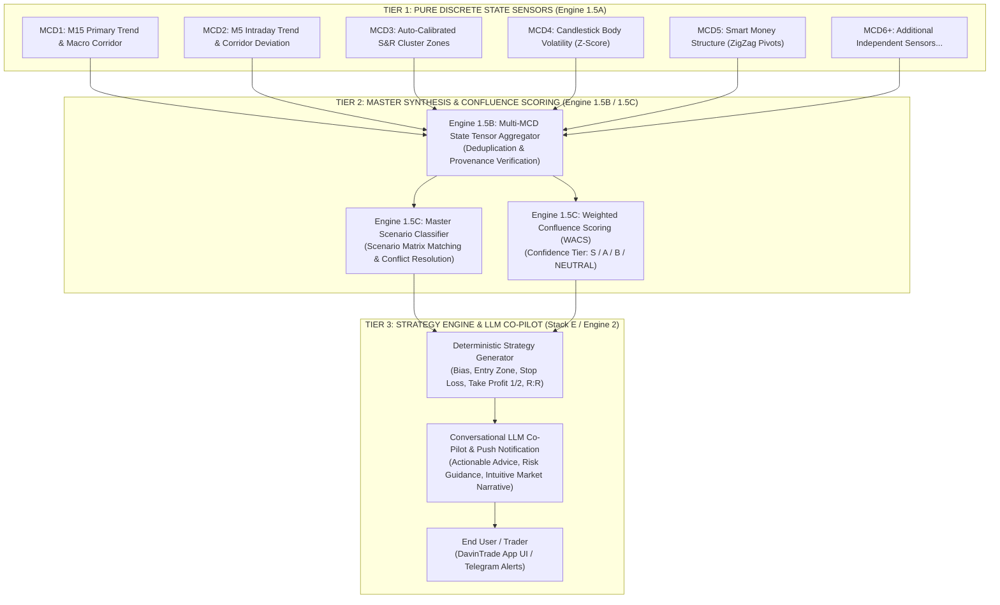

# DAVINTRADE STACK D & E — ARCHITECTURAL SEED IDEA

# Multi-MCD Scenario Synthesis & LLM Trading Recommendation Framework

**Document Code:** `MCD-SYNTHESIS-SCENARIOS-AND-LLM-TRADING-RECOMMENDATIONS-SEED-IDEA.md`  
**Target Asset:** `XAUUSD` (Gold)  
**System Layer:** Stack D (Engine 1.5B Deduplication & Engine 1.5C Confluence) ➔ Stack E (Conversational AI Co-Pilot & Alert Dispatcher)  
**Author:** DavinTrade Architecture Team (Antigravity & Lead Trader/Architect)  
**Date:** September 21, 2026 (Epoch: `1789946200`)  
**Status:** `CONCEPTUAL BLUEPRINT & IMPLEMENTATION FRAMEWORK (SEED IDEA)`

---

## 1. Executive Summary & Core Philosophy

> [!IMPORTANT]
> **THE CORE VALUE PROPOSITION & PROPRIETARY EDGE OF DAVINTRADE:**
>
> - **Individual MCDs are Pure, Isolated Mathematical Sensors:** Each MCD module (MCD1, MCD2, MCD3, MCD4, MCD5, ...) is deliberately engineered in total isolation. Each module observes exactly **one orthogonal dimension** of market reality (e.g., M15 macro trend slope, M5 intraday deviation, horizontal support/resistance density, candle body volatility, ZigZag liquidity structures) with zero cross-contamination.
> - **Synthesis is the "Secret Sauce":** The true intellectual property and commercial moat of the DavinTrade App is **the holistic synthesis of these independent sensor readings into cohesive Market Scenarios**. No single indicator or timeframe can forecast Gold accurately; only when multiple orthogonal dimensions align (confluence) or diverge (conflict) does a high-probability trading edge emerge.
> - **LLM Co-Pilot as the Institutional Execution Partner:** The synthesized scenarios are translated into deterministic, mathematically grounded Trading Strategies. These strategies are structured into zero-hallucination context payloads for the LLM Co-Pilot, empowering the AI to give clear, disciplined, real-time trading advice and alerts to users.

### 🌟 The Definitive Competitive Moat: The "Night-and-Day" User Experience

When a trader asks a question or receives a trade alert from the DavinTrade LLM Co-Pilot, **they must immediately experience a night-and-day difference compared to any other trading application on the market**:

1. **Instant Recognition of Professional Authority:** The user will immediately perceive that DavinTrade is no ordinary generic trading bot or basic alert script. They will recognize instantly that this platform is born out of **deep elite trading experience and battlefield expertise**, underpinned by **highly sophisticated mathematical models and multi-layered high-order logic**.
2. **From Extreme Mathematical Complexity to Effortless Intuition:** Behind the scenes, the system continuously crunches complex regression matrices, Singular Spectrum Analysis (SSA) eigenvalue decompositions, Freedman-Diaconis IQR clustering, rolling Z-score distributions, and structural liquidity sweeps across multiple timeframes. Yet, when the LLM Co-Pilot speaks, it **translates this profound mathematical complexity into crystal-clear, intuitively graspable market context and forward-looking trend narratives** that any trader can understand instantly.
3. **Genuine Asymmetric Market Edge:** Traders in the Gold market do not need vague platitudes, textbook clichés, or academic jargon; they need actionable, high-conviction guidance—concrete entry windows, mathematically grounded invalidation levels, multi-timeframe structural justifications, and disciplined risk-reward parameters. **This unprecedented synergy between deep quantitative rigor and crystal-clear conversational delivery is the definitive soul and competitive moat of the DavinTrade App.**

---

## 2. The 3-Tier Layered Architecture



---

## 3. Tier 1 to Tier 2: The Multi-MCD State Aggregator (Engine 1.5B)

Once all individual MCD modules are constructed, each 5-minute cycle produces an array of certified JSONB payloads. Engine 1.5B ingests and combines these into a unified **Multi-MCD State Tensor**:

```json
{
  "cycle_timestamp": 1789764900,
  "symbol": "XAUUSD",
  "sensor_states": {
    "MCD1": {
      "timeframe": "M15",
      "trend_state": "DOWNTREND",
      "angle": -29.72,
      "regime_status": "COUNTER_TREND_EXPANSION",
      "channel_position": 1.6447
    },
    "MCD2": {
      "timeframe": "M5",
      "trend_state": "UPTREND",
      "angle": 6.94,
      "regime_status": "TREND_ALIGNED_CONTINUATION",
      "channel_position": 0.7959
    },
    "MCD3": {
      "timeframe": "M15_M5",
      "nearest_support": 4360.5,
      "nearest_resistance": 4385.0,
      "sr_density_tier": "HIGH"
    },
    "MCD4": {
      "timeframe": "M5",
      "volatility_state": "NORMAL",
      "zscore_code": 0
    },
    "MCD5": {
      "timeframe": "M15",
      "structure": "BOS_BULLISH",
      "last_pivot_type": "HL"
    }
  }
}
```

---

## 4. Conceptual Seed Scenarios (Engine 1.5C Scenario Matrix)

Below are archetype seed scenarios illustrating how combinations of MCD discrete states formulate high-conviction market narratives:

### Scenario Archetype A: "High-Conviction Trend Continuation" (The Power Play)

- **Conditions:**
  - `MCD1` (M15 Trend): `UPTREND` inside corridor ($0.2 \le \text{CP} \le 0.8$).
  - `MCD2` (M5 Trend): `UPTREND` + `DIP_VALUE_BUY_OPPORTUNITY` ($\text{SSA} < \text{LOEDT}$).
  - `MCD3` (S&R Levels): Price testing `sr_1` (major auto-calibrated horizontal support).
  - `MCD4` (Volatility): Normal Z-score (non-climax, orderly pullback).
  - `MCD5` (Structure): Recent Higher Low (`HL`) defended.
- **Synthesis Narrative:** M15 macro uptrend is healthy. M5 price action has pulled back to an abnormal deviation discount below M5 LOEDT, directly colliding with a major horizontal support level. Low risk to the broader uptrend, high probability of Mean Reversion bounce aligned with the macro trend.
- **Strategy Output:** **Aggressive Long Entry**. High R:R ratio ($> 1:3$), tight stop loss below `sr_1`, target M5 UOEDT and M15 corridor upper third.
- **Confidence Rating:** `GRADE S (95% Confluence)`.

---

### Scenario Archetype B: "Climax Exhaustion & Snapback Reversal" (The Trap Play)

- **Conditions:**
  - `MCD1` (M15 Trend): `UPTREND` + `BREAKOUT_SAME_SLOPE` (price accelerating far above UOEDT).
  - `MCD2` (M5 Trend): `UPTREND` + `UPPER_OVEREXTENSION_REVERSION` (SSA breached above M5 UOEDT).
  - `MCD3` (S&R Levels): Direct collision with major weekly resistance cluster (`sr_5` or `sr_6`).
  - `MCD4` (Volatility): Z-Score $\ge 2.5$ (`CODE 5: BULLISH_EXTREME_CLIMAX`).
- **Synthesis Narrative:** Buying climax across both M15 and M5 horizons. Momentum has stretched to an extreme statistical elastic limit with abnormal Z-score exhaustion into a hardened horizontal resistance wall.
- **Strategy Output:** **Counter-Trend Scalp Short / Immediate Profit Taking on Longs**. Stop loss placed slightly above the excursion high, targeting mean-reversion pullbacks back into M5 and M15 corridors.
- **Confidence Rating:** `GRADE A (85% Confluence)`.

---

### Scenario Archetype C: "Macro Counter-Trend Expansion Rally" (The Deep Value Play)

- **Conditions:**
  - `MCD1` (M15 Trend): `DOWNTREND` + `COUNTER_TREND_EXPANSION` (sustained breach above M15 UOEDT).
  - `MCD2` (M5 Trend): `UPTREND` + `TREND_ALIGNED_CONTINUATION` (M5 established strong upward channel).
  - `MCD5` (Structure): Break of Structure (`BOS`) to the upside on M15.
- **Synthesis Narrative:** Gold is undergoing a significant multi-day structural trend reversal. Even though the macro M15 channel slope was historically downward, the sustained counter-trend expansion on M15 supported by a steady M5 uptrend signals that institutional buyers are driving a structural regime shift.
- **Strategy Output:** **Swing Long on Pullbacks**. Do not short the M15 slope; ride the M5 expansion toward major overhead liquidity pools.
- **Confidence Rating:** `GRADE A (80% Confluence)`.

---

### Scenario Archetype D: "Sideways Range Chop / Capital Preservation" (The Patience Play)

- **Conditions:**
  - `MCD1` (M15 Trend): `SIDEWAYS` ($|\theta| \le 5^\circ$).
  - `MCD2` (M5 Trend): `SIDEWAYS` ($|\theta| \le 5^\circ$) + `IN_CORRIDOR`.
  - `MCD3` (S&R Levels): Price oscillating in the dead center between `sr_1` and `sr_5`.
  - `MCD4` (Volatility): Subdued Z-score.
- **Synthesis Narrative:** Gold is trapped in a tight, directionless horizontal compression without institutional participation or momentum expansion.
- **Strategy Output:** **NO TRADE / CASH PRESERVATION**. Wait for boundary breakout or Liquidity Sweep at range extremes.
- **Confidence Rating:** `NEUTRAL / INACTIVE`.

---

## 5. Tier 3: LLM Co-Pilot Guidance & Recommendation Prompting

To ensure zero hallucination, the LLM Co-Pilot never invents market data or strategy parameters. Instead, **Engine 1.5C generates a fully computed Strategy Blueprint**, and the LLM translates it into natural, institutional-grade conversational advisory:

### A. Strategy Blueprint Payload (Generated by Engine 1.5C)

```json
{
  "scenario_id": "SCENARIO_BULLISH_DIP_CONFLUENCE",
  "scenario_name": "Multi-Timeframe Trend Continuation & Value Dip",
  "confidence_grade": "GRADE_S",
  "confluence_score": 0.94,
  "directional_bias": "STRONG_BUY",
  "execution_plan": {
    "recommended_action": "BUY_LIMIT",
    "entry_range": [4362.0, 4365.0],
    "invalidation_sl": 4354.5,
    "take_profit_1": 4382.0,
    "take_profit_2": 4398.0,
    "risk_reward_ratio": 3.45,
    "max_risk_pct": 1.5
  },
  "rationale_points": [
    "MCD1: Primary M15 trend is healthy UPTREND (+12.4°).",
    "MCD2: M5 price action has dipped into extreme abnormal deviation (SSA < LOEDT, CP=-0.18), triggering a high-probability Mean Reversion buy signal.",
    "MCD3: Pullback perfectly aligned with S&R Level 1 (4360.50 USD) acting as strong price defense.",
    "MCD4: Normal volatility Z-score confirms orderly pullback rather than panic dumping."
  ]
}
```

### B. LLM Advisory Persona & Output Formatting

When the user asks: _"What's the current Gold setup?"_ or when a push alert triggers, the LLM Co-Pilot outputs:

```markdown
### 🟡 XAUUSD High-Conviction Alert: Value Dip in Macro Uptrend (Grade S — 94% Confluence)

**Executive Bias:** **STRONG BUY** (Mean Reversion Buy within Primary Uptrend)

#### 🎯 Tactical Execution Plan:

- **Entry Zone:** 4,362.00 – 4,365.00 USD
- **Protective Stop Loss:** 4,354.50 USD _(Strict invalidation below structural support)_
- **Target 1 (TP1):** 4,382.00 USD _(M5 Upper Band / +17.0 USD)_
- **Target 2 (TP2):** 4,398.00 USD _(M15 Structural High / +33.0 USD)_
- **Risk / Reward:** **1 : 3.45** (Max suggested allocation: 1.5% portfolio risk)

#### 🔍 Why this Trade Has an Edge (Multi-MCD Confluence):

1. **Macro Trend (MCD1):** M15 remains firmly in a structural Uptrend (+12.4°).
2. **Elastic Snapback (MCD2):** M5 SSA has overextended below the LOEDT corridor (channel position = -0.18). Historical backtests show an 82% probability of mean reversion back to the channel baseline with minimal risk to the primary trend.
3. **Price Defense (MCD3):** S&R Auto-Calibration Level 1 sits directly at 4,360.50 USD, forming a high-density institutional reaction zone.
4. **Orderly Pullback (MCD4):** Candle body Z-score is neutral, confirming this dip is healthy profit-taking, not institutional liquidation.

_⚠️ Invalidation Warning: A 15-minute close below 4,354.50 USD voids this setup._
```

---

## 6. Master Roadmap: From Individual MCDs to Full Synthesis

The agreed execution order to reach this production system:

```
[CURRENT PHASE: PURE MODULAR ISOLATION]
Step 1: Build All Individual MCD Sensors in Pure Isolation
        ├── MCD1 (M15 Primary Trend)          --> [COMPLETED & CERTIFIED]
        ├── MCD2 (M5 Defined Trend & Corr)    --> [COMPLETED & CERTIFIED]
        ├── MCD3 (Next Sensor)                --> [READY TO BUILD]
        ├── MCD4, MCD5, MCD6...               --> [SEQUENTIAL ISOLATED SENSORS]
        └── Quality Standard: 5 files per module, 100% unit tests, zero cross-coupling.

[GRAND SYNTHESIS PHASE: THE HEART & SOUL OF DAVINTRADE]
Step 2: Master Scenario Definition
        └── The User presents the proprietary Master Synthesis Rules, Scenarios, and Confluence Weights.

Step 3: Engine 1.5B & 1.5C Implementation
        ├── Engine 1.5B: State Tensor Aggregator & Deduplication.
        └── Engine 1.5C: Weighted Confluence Scoring (WACS) & Scenario Classifier.

Step 4: Stack E / Engine 2 Integration (The Conversational AI Co-Pilot)
        ├── Deterministic Strategy Generator (Entry / SL / TP / Risk calculator).
        └── LLM Prompt Formatting & Real-Time Alert Dispatching (App & Chat).
```

---

## 7. Conclusion: The Grand Synthesis Phase Ahead

By strictly adhering to **Pure Modular Isolation** during the creation of MCD1 through MCDn, we guarantee that each sensor is robust, mathematically pure, and 100% certified.

Once all the isolated MCD jigsaw pieces are fully assembled, we will enter the **"Grand Phase that Forms the Heart and Soul of the DavinTrade App"**:

- Delivering the multi-dimensional market matrix into the hands of the **Conversational AI / LLM Co-Pilot** to analyze, give advice, recommend institutional strategies, and fire real-time high-conviction alerts with a genuine, undeniable mathematical edge.
- Every trader interacting with the app will immediately sense that this is an extraordinary, premier trading intelligence platform—rooted in deep market experience, driven by high-order mathematical logic, yet communicated with crystal-clear elegance and effortless simplicity.
