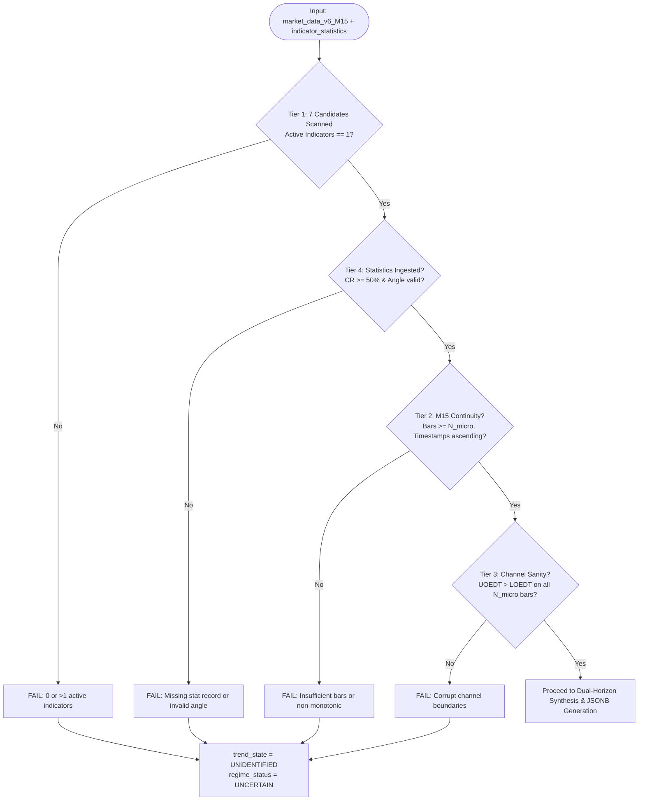

# MCD1 MANIFEST & WORK COMPLETION SPECIFICATION (DUAL-HORIZON UPGRADE)

**Module Name:** `mcd1_evaluator.py`  
**Test Suite:** `test_mcd1_unit_tests.py`  
**MCD ID:** `MCD1`  
**Description:** M15 Primary Trend Direction Evaluator (Dual-Horizon Framework)  
**Target Asset:** `XAUUSD`  
**Target Timeframe:** `M15`  
**Target Architecture:** DavinTrade Stack D — Engine 1.5A (Discrete State Machine & Quality Gate)  
**Primary Consumer:** Claude Code (Stack D Master Builder & Code Auditor) / DavinTrade Ingestion Pipeline  
**Document Status:** `CERTIFIED & VERIFIED (100% PASS - 13/13 UNIT TESTS)`  
**Timestamp:** `2026-09-20 12:15:00 UTC` (Epoch: `1789906500`)

---

## 1. Executive Summary & Purpose

`MCD1` is the foundational discrete state evaluator of **Stack D (Engine 1.5A)**. Following the architectural review and database schema upgrade (98 columns in `MarketDataV6` and 88 columns in `IndicatorStatistic`), `MCD1` has been refactored from a rigid 54-bar fixed window to a mathematically coherent **Dual-Horizon Framework**:

> **"Determine the primary structural trend direction of Gold (XAUUSD) on the macro-execution timeframe (M15) across the full EDT Time Horizon, evaluate immediate price action across a dynamic micro window of at least 5.0% of the channel span (with a strict minimum floor of 96 bars = 1 full trading day), and synthesize these into zero-hallucination, deterministic JSONB qualitative commentary in canonical English."**

### Core Upgrades in this Release:

1. **Scope Restriction to 7 Centroid Variants for M15:** Strictly isolates `best_fit_a`, `best_fit_b`, `cherry_a`, `cherry_b`, `most_recent`, `non_a`, and `non_b`. Strictly excludes non-centroid M5 or single-line indicators (`fractal_edt`, `resistance`, `support`, `sr_levels`).
2. **Single Active Indicator Rule:** Enforces that exactly 1 centroid indicator can be active on M15.
3. **Macro Structure Horizon:** Evaluates structural integrity using the **EDT Time Horizon** ($T_{\text{EDT}}$ from `containment_n` in `indicator_statistics`), **`containment_rate`** ($\ge 50\%$), and **`regression_angle`** ($\pm 5.0^\circ$ deadband). Omitted `baseline_coverage_*` as redundant since `containment_rate` already governs channel integrity.
4. **Dynamic Micro Window ($N_{\text{micro}}$):**
   $$N_{\text{micro}} = \max(96,\; \text{round}(T_{\text{EDT}} \times 0.05))$$
   Enforces a strict minimum floor of **96 bars (24 hours / 1 full trading day)** to filter out false breakouts from temporary 2–3 hour news wicks.
5. **Asymmetric Breakout Logic (Climax vs Reversal):**
   - **`BREAKOUT_SAME_SLOPE` (Prompt Climax Trigger):** Triggers promptly upon latest bar breach in the same direction of macro slope (massive dump/pump) without waiting for 96 bars / 80%, capturing explosive moves with high probability of immediate **V-shape price reversal**.
   - **`COUNTER_TREND_EXPANSION` (Structural Reversal):** Requires $\ge 80.0\%$ sustained breach across the micro window ($N_{\text{micro}}$ bars) to confirm genuine structural trend reversal and filter false pullbacks.
6. **Synthesis Decision Matrix:** Produces rich qualitative states:
   - `TREND_ALIGNED_CONTINUATION`: Healthy trend continuation within bands.
   - `BREAKOUT_SAME_SLOPE`: Price breaking out in the same direction of macro slope (massive dump/pump with high probability of soon V-shape price reversal).
   - `COUNTER_TREND_EXPANSION`: Price breaking out against macro slope (sustained counter-trend buying/selling with high probability of structural trend reversal).
   - `CONSOLIDATION` / `RANGE_EXPANSION`: Sideways macro dynamics.

---

## 2. Upstream Data Contract & Input Dependencies

`MCD1` consumes data from two primary sheets in [market_data_v6_replicated.xlsx](file:///d:/SaaS%20Project/trading-alerts-saas-public/davintrade-stack-d-and-e/engine-1-5-new/market_data_v6_replicated.xlsx):

### A. Primary Time-Series Spine: `market_data_v6_M15`

- **Lookback Requirement:** Dynamically determined $N_{\text{micro}} = \max(96, \text{round}(T_{\text{EDT}} \times 0.05))$ bars (guaranteed $\ge 96$ bars).
- **Candidate Centroid Pool (Strictly 7 Variants):**
  1. `best_fit_a` (`best_fit_a_ssa`, `best_fit_a_uoedt`, `best_fit_a_loedt`)
  2. `best_fit_b` (`best_fit_b_ssa`, `best_fit_b_uoedt`, `best_fit_b_loedt`)
  3. `cherry_a` (`cherry_a_ssa`, `cherry_a_uoedt`, `cherry_a_loedt`)
  4. `cherry_b` (`cherry_b_ssa`, `cherry_b_uoedt`, `cherry_b_loedt`)
  5. `most_recent` (`most_recent_ssa`, `most_recent_uoedt`, `most_recent_loedt`)
  6. `non_a` (`non_a_ssa`, `non_a_uoedt`, `non_a_loedt`)
  7. `non_b` (`non_b_ssa`, `non_b_uoedt`, `non_b_loedt`)
- **Spine Fields Used:** `timestamp`, `close`, `<active_ind>_ssa`, `<active_ind>_uoedt`, `<active_ind>_loedt`.

### B. Statistical Snapshot Store: `indicator_statistics`

- **Table Design:** Append-Only Immutable Snapshot log.
- **Selection Filter:** `symbol == 'XAUUSD' AND timeframe == 'M15' AND source == <active_indicator>`.
- **Resolution Rule:** `ORDER BY captured_at DESC LIMIT 1` (Takes the latest snapshot; never overwrites past cycles).
- **Fields Extracted:**
  - `containment_n` (or `visual_window_bars`): Interpreted as **`EDT Time Horizon`** ($T_{\text{EDT}}$).
  - `containment_rate`: Validated against `min_containment_threshold` ($\ge 50.0\%$).
  - `regression_angle`: Linear slope angle in degrees $\in [-90.0^\circ, +90.0^\circ]$.
  - `channel_position`: Ratio $\frac{\text{close} - \text{LOEDT}}{\text{UOEDT} - \text{LOEDT}}$.
  - `captured_at`, `live_bar_ts`, `raw_slope`.

---

## 3. 4-Tier Comprehensive Pre-Flight Validation



1. **Tier 1 (Candidate Isolation & Single Active Rule):**
   - Scans only the 7 Centroid Variants.
   - Enforces that exactly 1 indicator has populated data ($\ge 96$ bars). Fails if 0 or $>1$ active indicators exist.
2. **Tier 2 (M15 Continuity & Data Availability):**
   - Verifies that at least $N_{\text{micro}}$ valid bars exist prior to the last computed bar.
   - Verifies monotonic timestamp ordering and non-null numeric values.
3. **Tier 3 (Channel Sanity Gate):**
   - Checks that $\text{UOEDT}_i > \text{LOEDT}_i$ on every bar $i \in [1 \dots N_{\text{micro}}]$.
4. **Tier 4 (Statistics Ingestion Verification):**
   - Matches record in `indicator_statistics` by `symbol`, `timeframe`, and `active_indicator`.
   - Validates that `containment_rate >= 50.0%`. (If $< 50\%$, flags corridor integrity as `COMPROMISED`).

---

## 4. Synthesis Decision Matrix & Output States

Combining Macro Trend Direction ($\theta$) and Micro Corridor Regime ($CP$):

| Macro Trend     | Micro Regime      | Synthesis `regime_status`        | Description & Market Dynamics                                                                                                                |
| :-------------- | :---------------- | :------------------------------- | :------------------------------------------------------------------------------------------------------------------------------------------- |
| **`UPTREND`**   | `IN_CORRIDOR`     | **`TREND_ALIGNED_CONTINUATION`** | Price fluctuates normally inside upward channel bands. Healthy uptrend continuation.                                                         |
| **`DOWNTREND`** | `IN_CORRIDOR`     | **`TREND_ALIGNED_CONTINUATION`** | Price fluctuates normally inside downward channel bands. Healthy downtrend continuation.                                                     |
| **`UPTREND`**   | `UPPER_BREAKOUT`  | **`BREAKOUT_SAME_SLOPE`**        | Price breaking out upward in the same direction of macro slope. Shows massive pump with high probability of soon price reversal.             |
| **`DOWNTREND`** | `LOWER_BREAKDOWN` | **`BREAKOUT_SAME_SLOPE`**        | Price breaking out downward in the same direction of macro slope. Shows massive dump with high probability of soon price reversal.           |
| **`UPTREND`**   | `LOWER_BREAKDOWN` | **`COUNTER_TREND_EXPANSION`**    | Price breaking out downward against macro uptrend slope. Sustained counter-trend selling with high probability of structural trend reversal. |
| **`DOWNTREND`** | `UPPER_BREAKOUT`  | **`COUNTER_TREND_EXPANSION`**    | Price breaking out upward against macro downtrend slope. Sustained counter-trend buying with high probability of structural trend reversal.  |
| **`SIDEWAYS`**  | `IN_CORRIDOR`     | **`CONSOLIDATION`**              | Price moving sideways within normal horizontal corridor.                                                                                     |
| **`SIDEWAYS`**  | `UPPER_BREAKOUT`  | **`RANGE_EXPANSION`**            | Price breaking out upward from sideways range. Bullish expansion out of consolidation.                                                       |
| **`SIDEWAYS`**  | `LOWER_BREAKDOWN` | **`RANGE_EXPANSION`**            | Price breaking out downward from sideways range. Bearish expansion out of consolidation.                                                     |

---

## 5. Live Production Execution & Output Contract

Executing `python mcd1_evaluator.py` against `market_data_v6_replicated.xlsx` yields:

```json
{
  "mcd_id": "MCD1",
  "name": "M15 Primary Trend Direction",
  "symbol": "XAUUSD",
  "timeframe": "M15",
  "evaluated_at": "2026-09-20 11:59:01 UTC",
  "evaluated_epoch": 1789905541,
  "parameters": {
    "micro_lookback_pct": 5.0,
    "min_micro_floor": 96,
    "micro_breach_threshold_pct": 80.0,
    "min_containment_threshold": 50.0,
    "sideways_angle_threshold_degrees": 5.0
  },
  "validation": {
    "status": "PASS",
    "errors": [],
    "warnings": [],
    "checks": {
      "total_bars_available": 3000,
      "candidate_indicator_coverage": {
        "best_fit_a": 0,
        "best_fit_b": 0,
        "cherry_a": 0,
        "cherry_b": 0,
        "most_recent": 0,
        "non_a": 0,
        "non_b": 1808
      },
      "active_indicators_detected": ["non_b"],
      "indicator_statistics_record": {
        "source": "non_b",
        "captured_at": 1789764900,
        "live_bar_ts": 1789764300,
        "regression_angle": -29.72,
        "containment_rate": 73.95,
        "edt_time_horizon": 1808,
        "channel_position_stat": 1.6447,
        "raw_slope": -0.25452,
        "total_matching_snapshots": 1
      },
      "edt_time_horizon": 1808,
      "dynamic_micro_window_bars": 96,
      "evaluation_start_bar_index": 2906,
      "evaluation_end_bar_index": 3001
    }
  },
  "active_indicator": "non_b",
  "macro_structure": {
    "edt_time_horizon": 1808,
    "regression_angle": -29.72,
    "containment_rate_pct": 73.95,
    "channel_position_stat": 1.6447,
    "is_corridor_valid": true,
    "macro_trend": "DOWNTREND",
    "provenance": {
      "source": "non_b",
      "captured_at": 1789764900,
      "live_bar_ts": 1789764300,
      "raw_slope": -0.25452
    }
  },
  "micro_regime": {
    "window_bars": 96,
    "channel_position_latest": 1.6447,
    "regime": "UPPER_BREAKOUT",
    "contained_bar_count": 0,
    "upper_breach_count": 96,
    "upper_breach_pct": 100.0,
    "lower_breach_count": 0,
    "lower_breach_pct": 0.0,
    "breach_threshold_pct": 80.0,
    "containment_rate_pct": 0.0,
    "latest_bar": {
      "timestamp": 1789764300,
      "close": 4377.99,
      "ssa": 4380.76289794,
      "uoedt": 4279.20888,
      "loedt": 4125.9876,
      "channel_position": 1.6447,
      "breach_type": "UPPER_BREACH"
    }
  },
  "synthesis": {
    "primary_trend": "DOWNTREND",
    "regime_status": "COUNTER_TREND_EXPANSION",
    "description": "Price breaking out upward against macro downtrend slope. Sustained counter-trend buying with high probability of structural trend reversal."
  },
  "trend_state": "DOWNTREND",
  "regime_status": "COUNTER_TREND_EXPANSION",
  "commentary": "XAUUSD M15 macro slope is DOWNTREND (-29.72°), yet recent micro price action has breached above the UOEDT corridor (channel_position=1.6447 > 1.0) sustained over the past 96 bars (1 day: 96/96 bars = 100.0% >= 80.0% threshold). This demonstrates persistent counter-trend buying expansion with high probability of structural reversal."
}
```

---

## 6. Test Suite & Validation Evidence

Automated test suite `test_mcd1_unit_tests.py` validates 13 critical test cases:

```
test_01_real_data_execution_counter_trend_expansion (__main__.TestMCD1DualHorizonLogic.test_01_real_data_execution_counter_trend_expansion) ... ok
test_02_dynamic_micro_window_floor_and_percentage (__main__.TestMCD1DualHorizonLogic.test_02_dynamic_micro_window_floor_and_percentage) ... ok
test_03_synthetic_trend_aligned_continuation_uptrend (__main__.TestMCD1DualHorizonLogic.test_03_synthetic_trend_aligned_continuation_uptrend) ... ok
test_04_synthetic_breakout_same_slope_massive_dump (__main__.TestMCD1DualHorizonLogic.test_04_synthetic_breakout_same_slope_massive_dump) ... ok
test_05_synthetic_breakout_same_slope_massive_pump (__main__.TestMCD1DualHorizonLogic.test_05_synthetic_breakout_same_slope_massive_pump) ... ok
test_06_synthetic_counter_trend_expansion_uptrend (__main__.TestMCD1DualHorizonLogic.test_06_synthetic_counter_trend_expansion_uptrend) ... ok
test_07_synthetic_sideways_consolidation_and_expansion (__main__.TestMCD1DualHorizonLogic.test_07_synthetic_sideways_consolidation_and_expansion) ... ok
test_08_tier1_validation_multiple_active_indicators (__main__.TestMCD1DualHorizonLogic.test_08_tier1_validation_multiple_active_indicators) ... ok
test_09_tier1_validation_no_active_indicator (__main__.TestMCD1DualHorizonLogic.test_09_tier1_validation_no_active_indicator) ... ok
test_10_tier3_validation_corrupt_channel_boundaries (__main__.TestMCD1DualHorizonLogic.test_10_tier3_validation_corrupt_channel_boundaries) ... ok
test_11_tier4_compromised_corridor_containment_threshold (__main__.TestMCD1DualHorizonLogic.test_11_tier4_compromised_corridor_containment_threshold) ... ok
test_12_micro_breach_threshold_80pct_filtering (__main__.TestMCD1DualHorizonLogic.test_12_micro_breach_threshold_80pct_filtering) ... ok
test_13_same_slope_v_shape_prompt_trigger (__main__.TestMCD1DualHorizonLogic.test_13_same_slope_v_shape_prompt_trigger) ... ok

----------------------------------------------------------------------
Ran 13 tests in 0.951s

OK (100% PASS)
```

---

## 7. Claude Code Integration & Audit Sign-Off

For Claude Code / Master Builder assembling Stack D:

- [x] **File Path:** `davintrade-stack-d-and-e/engine-1-5-new/mcd1/mcd1_evaluator.py`
- [x] **Executable Entry Point:** `evaluator = MCD1PrimaryTrendEvaluator(excel_path=...)` -> `evaluator.evaluate()`
- [x] **Zero Hallucination:** 100% deterministic mathematical evaluation. No external network dependencies.
- [x] **Timeframe Confinement:** Operates strictly on `M15`.
- [x] **Centroid Isolation:** Candidate pool restricted strictly to 7 centroid variants.
- [x] **Dynamic Micro Window:** Calculated as $\ge 5\%$ of EDT Time Horizon with a 96-bar (1 day) floor.
- [x] **Climax vs. Reversal Asymmetry:** Prompt trigger for same-slope climax breakout (V-shape reversal detection) vs. $\ge 80.0\%$ sustained breach across micro window for counter-trend structural expansion.
- [x] **JSONB Canonical Output:** Ready for direct ingestion into `davin_report_1_market_data_analysis`.
- [x] **Test Suite Verified:** `python test_mcd1_unit_tests.py` (13/13 passing).
