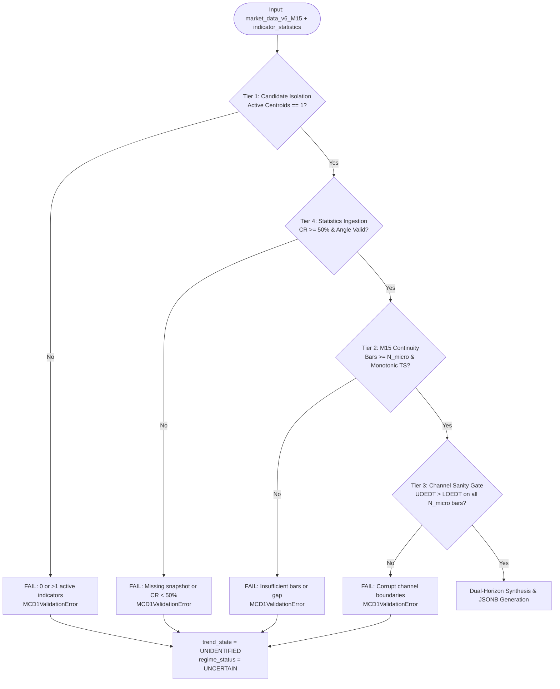

# Implementation Plan: MCD1 (M15 Primary Trend Direction Evaluator)

## 1. Executive Overview & Problem Context

**Module ID:** `MCD1`  
**Module Name:** M15 Primary Trend Direction Evaluator  
**Asset:** `XAUUSD` (Spot Gold / US Dollar)  
**Timeframe:** `M15`  
**Architecture Context:** DavinTrade Stack D — Engine 1.5A (Discrete State Machine & Quality Gate)  
**Primary Consumer:** DavinTrade Ingestion Pipeline / Claude Code (Stack D Master Builder)

### 1.1 Problem Statement

The legacy implementation of MCD1 relied on a rigid, fixed 54-bar lookback window that failed to capture the genuine structural trend of Gold on M15. In real market conditions, regression channels span hundreds or thousands of bars, while short-term noise (2–3 hour news wicks) can distort fixed-window evaluations.

### 1.2 The Dual-Horizon Solution

MCD1 refactors the evaluation into a mathematically grounded **Dual-Horizon Framework**:

1. **Macro Structure Horizon:** Assesses the full statistical envelope across the entire **EDT Time Horizon** ($T_{\text{EDT}}$ from `indicator_statistics`), verifying corridor integrity ($\text{Containment Rate} \ge 50.0\%$) and determining the primary macro slope ($\text{Regression Angle}$).
2. **Dynamic Micro Regime Horizon:** Evaluates recent price action across a dynamic lookback window of at least **5.0%** of the EDT Time Horizon, anchored by a strict floor of **96 bars (24 hours / 1 full trading day of M15)**:
   $$N_{\text{micro}} = \max(96,\; \text{round}(T_{\text{EDT}} \times 0.05))$$
3. **Asymmetric Breakout Logic:**
   - **Climax Trend Breaks (`BREAKOUT_SAME_SLOPE`):** Prompt trigger on the latest bar to capture explosive liquidation dumps or parabolic pumps with high probability of immediate **V-shape price reversal**.
   - **Counter-Trend Breaks (`COUNTER_TREND_EXPANSION`):** Requires sustained breach across **$\ge 80.0\%$** of the micro window ($N_{\text{micro}}$ bars) to confirm genuine structural trend reversal and filter temporary pullbacks.

---

## 2. Core Architectural Principles & Mathematical Model

### 2.1 Scope Restriction to 7 Centroid Variants for M15

MCD1 strictly examines only the **7 Centroid Variants** on the M15 timeframe:

1. `best_fit_a`
2. `best_fit_b`
3. `cherry_a`
4. `cherry_b`
5. `most_recent`
6. `non_a`
7. `non_b`

> [!IMPORTANT]
> Non-centroid indicators, single-line indicators (`resistance`, `support`, `sr_levels`), and M5-only indicators (`fractal_edt`) are strictly excluded from the M15 centroid candidate pool.

### 2.2 Single Active Indicator Rule

- Under DavinTrade platform rules, **exactly 1 active centroid indicator** is permitted on M15 at any given time.
- If $0$ or $>1$ indicators have populated data ($\ge 96$ bars), the evaluator triggers a **Tier 1 Validation Failure** (`trend_state = UNIDENTIFIED`, `regime_status = UNCERTAIN`).

### 2.3 Macro Structure Horizon Model

- **Data Source:** Sheet `indicator_statistics` in `market_data_v6_replicated.xlsx`.
- **Query Filter:** `symbol == 'XAUUSD' AND timeframe == 'M15' AND source == <active_indicator>` ordered by `captured_at DESC LIMIT 1`.
- **Extracted Fields:**
  - $T_{\text{EDT}}$: EDT Time Horizon (from `containment_n` or `visual_window_bars`).
  - $CR$: Containment Rate (`containment_rate`). Minimum threshold: $\text{MIN\_CONTAINMENT\_THRESHOLD} = 50.0\%$.
  - $\theta$: Regression Angle (`regression_angle` in degrees $\in [-90^\circ, +90^\circ]$).
- **Macro Trend State ($\theta$):**
  - $\theta > +5.0^\circ \implies$ **`UPTREND`**
  - $\theta < -5.0^\circ \implies$ **`DOWNTREND`**
  - $-5.0^\circ \le \theta \le +5.0^\circ \implies$ **`SIDEWAYS`**
  - If $CR < 50.0\% \implies$ Corridor is flagged as `COMPROMISED`, macro trend becomes **`UNIDENTIFIED`**.

### 2.4 Dynamic Micro Regime Horizon Model

- **Evaluation Window Size ($N_{\text{micro}}$):**
  $$N_{\text{micro}} = \max(96,\; \text{round}(T_{\text{EDT}} \times 0.05))$$
  - Ensures at least 1 full trading day (24 hours = 96 bars on M15).
  - For $T_{\text{EDT}} = 1,808$ bars: $\text{round}(1808 \times 0.05) = 90 \implies N_{\text{micro}} = \max(96, 90) = \mathbf{96\text{ bars}}$.
- **Channel Position ($CP$):**
  $$CP_i = \frac{\text{Close}_i - \text{LOEDT}_i}{\text{UOEDT}_i - \text{LOEDT}_i}$$
  - $CP \in [0.0, 1.0]$: Inside corridor bands.
  - $CP > 1.0$: Upper breach (above UOEDT).
  - $CP < 0.0$: Lower breach (below LOEDT).

### 2.5 Climax vs. Reversal Asymmetric Breakout Rules

- **Rule 1: Same-Slope Climax Breakout (`BREAKOUT_SAME_SLOPE`):**
  - Macro `UPTREND` + Latest Bar $CP > 1.0 \implies$ `UPPER_BREAKOUT`
  - Macro `DOWNTREND` + Latest Bar $CP < 0.0 \implies$ `LOWER_BREAKDOWN`
  - _Trigger:_ Immediate on latest bar without waiting for 96 bars or 80%.
  - _Market Dynamics:_ Parabolic buying pump or panic liquidation dump with high probability of immediate **V-shape price reversal**.
- **Rule 2: Counter-Trend Structural Breakout (`COUNTER_TREND_EXPANSION`):**
  - Macro `UPTREND` + Lower Breach Percentage $\ge 80.0\%$ over $N_{\text{micro}}$ bars $\implies$ `LOWER_BREAKDOWN`
  - Macro `DOWNTREND` + Upper Breach Percentage $\ge 80.0\%$ over $N_{\text{micro}}$ bars $\implies$ `UPPER_BREAKOUT`
  - _Trigger:_ Requires sustained presence outside channel bands ($\ge 80.0\%$ of $N_{\text{micro}}$ bars).
  - _Market Dynamics:_ Structural trend breakdown with high probability of complete trend reversal.

---

## 3. 4-Tier Pre-Flight Quality Gate Architecture



1. **Tier 1 (Candidate Isolation & Single Active Rule):**
   - Scans candidate columns for the 7 Centroid Variants.
   - Enforces exactly 1 active indicator with $\ge 96$ populated bars.
2. **Tier 2 (M15 Continuity & Data Availability):**
   - Extracts the dynamic window of $N_{\text{micro}}$ bars ending at the latest populated bar.
   - Verifies monotonic timestamp ordering and non-null numeric values.
3. **Tier 3 (Channel Sanity Gate):**
   - Verifies that $\text{UOEDT}_i > \text{LOEDT}_i$ on every evaluated bar $i \in [1 \dots N_{\text{micro}}]$.
4. **Tier 4 (Statistics Ingestion Verification):**
   - Validates existence of snapshot in `indicator_statistics`.
   - Flags corridor integrity as `COMPROMISED` if $CR < 50.0\%$.

---

## 4. Synthesis Decision Matrix

| Macro Trend ($\theta$) | Micro Regime ($CP$) | Synthesis `trend_state` | Synthesis `regime_status`        | Description & Market Dynamics                                                                                                                             |
| :--------------------- | :------------------ | :---------------------- | :------------------------------- | :-------------------------------------------------------------------------------------------------------------------------------------------------------- |
| **`UPTREND`**          | `IN_CORRIDOR`       | `UPTREND`               | **`TREND_ALIGNED_CONTINUATION`** | Price fluctuates normally inside upward channel bands. Healthy uptrend continuation.                                                                      |
| **`DOWNTREND`**        | `IN_CORRIDOR`       | `DOWNTREND`             | **`TREND_ALIGNED_CONTINUATION`** | Price fluctuates normally inside downward channel bands. Healthy downtrend continuation.                                                                  |
| **`UPTREND`**          | `UPPER_BREAKOUT`    | `UPTREND`               | **`BREAKOUT_SAME_SLOPE`**        | Price breaking out upward in the same direction of macro slope. Massive pump with high probability of soon V-shape price reversal.                        |
| **`DOWNTREND`**        | `LOWER_BREAKDOWN`   | `DOWNTREND`             | **`BREAKOUT_SAME_SLOPE`**        | Price breaking out downward in the same direction of macro slope. Massive dump with high probability of soon V-shape price reversal.                      |
| **`UPTREND`**          | `LOWER_BREAKDOWN`   | `UPTREND`               | **`COUNTER_TREND_EXPANSION`**    | Price breaking out downward against macro uptrend slope. Sustained counter-trend selling ($\ge 80\%$) with high probability of structural trend reversal. |
| **`DOWNTREND`**        | `UPPER_BREAKOUT`    | `DOWNTREND`             | **`COUNTER_TREND_EXPANSION`**    | Price breaking out upward against macro downtrend slope. Sustained counter-trend buying ($\ge 80\%$) with high probability of structural trend reversal.  |
| **`SIDEWAYS`**         | `IN_CORRIDOR`       | `SIDEWAYS`              | **`CONSOLIDATION`**              | Price moving sideways within normal horizontal corridor.                                                                                                  |
| **`SIDEWAYS`**         | `UPPER_BREAKOUT`    | `SIDEWAYS`              | **`RANGE_EXPANSION`**            | Price breaking out upward from sideways range ($\ge 80\%$). Bullish expansion out of consolidation.                                                       |
| **`SIDEWAYS`**         | `LOWER_BREAKDOWN`   | `SIDEWAYS`              | **`RANGE_EXPANSION`**            | Price breaking out downward from sideways range ($\ge 80\%$). Bearish expansion out of consolidation.                                                     |

---

## 5. Proposed File Modifications & Component Deliverables

All components reside in `davintrade-stack-d-and-e/engine-1-5-new/mcd1/`:

### 5.1 [MODIFY] `mcd1_evaluator.py`

- Implements class `MCD1PrimaryTrendEvaluator`:
  - `load_workbook()`: Opens Excel using `openpyxl(data_only=True)`.
  - `validate_tier1_and_detect_active_indicator()`: Enforces 7 Centroid isolation and single active indicator rule.
  - `validate_tier4_indicator_statistics()`: Extracts snapshot from `indicator_statistics`.
  - `calculate_dynamic_micro_window()`: Calculates $N_{\text{micro}} = \max(96, \text{round}(T_{\text{EDT}} \times 0.05))$.
  - `validate_tier2_and_tier3_micro_corridor()`: Enforces continuity and sanity gate $\text{UOEDT} > \text{LOEDT}$.
  - `synthesize_macro_micro_regime()`: Evaluates the decision matrix with asymmetric breakout logic.
  - `evaluate()`: Orchestrates execution and returns structured dict.

### 5.2 [MODIFY] `test_mcd1_unit_tests.py`

- Implements 13 comprehensive unit tests covering:
  - Real dataset parity on `non_b`.
  - Dynamic micro window math (floor and percentage).
  - All synthetic synthesis states (`TREND_ALIGNED_CONTINUATION`, `BREAKOUT_SAME_SLOPE`, `COUNTER_TREND_EXPANSION`, `CONSOLIDATION`, `RANGE_EXPANSION`).
  - Validation error handling for Tier 1, Tier 3, and Tier 4.
  - 80% sustained breach threshold filtering.
  - Prompt V-shape same-slope trigger for dump and pump.

### 5.3 [MODIFY] `mcd1.md`

- Complete architectural specification document defining parameters, schemas, and equations.

### 5.4 [MODIFY] `mcd1-manifest-work-completion.md`

- Work completion manifest serving as the formal audit and integration hand-off document for Claude Code.

### 5.5 [NEW] `mcd1_output.json`

- Production execution JSONB payload generated from real `market_data_v6_replicated.xlsx`.

---

## 6. Verification & Automated Test Plan

### 6.1 Test Suite Matrix (`test_mcd1_unit_tests.py`)

| Test Case | Description & Assertion                                                                                          | Expected Result                                                  |
| :-------- | :--------------------------------------------------------------------------------------------------------------- | :--------------------------------------------------------------- |
| `test_01` | Real data parity against `market_data_v6_replicated.xlsx` (`non_b`, $T_{\text{EDT}}=1808$, Angle $-29.72^\circ$) | Trend: `DOWNTREND`, Regime: `COUNTER_TREND_EXPANSION`            |
| `test_02` | Dynamic micro window formula: $N = \max(96, \text{round}(T \times 0.05))$                                        | 1808 $\to$ 96 bars, 3000 $\to$ 150 bars, 500 $\to$ 96 bars       |
| `test_03` | Macro `UPTREND` + Micro `IN_CORRIDOR`                                                                            | Regime: `TREND_ALIGNED_CONTINUATION`                             |
| `test_04` | Macro `DOWNTREND` + Micro `LOWER_BREAKDOWN` (Massive dump)                                                       | Regime: `BREAKOUT_SAME_SLOPE`                                    |
| `test_05` | Macro `UPTREND` + Micro `UPPER_BREAKOUT` (Massive pump)                                                          | Regime: `BREAKOUT_SAME_SLOPE`                                    |
| `test_06` | Macro `UPTREND` + Micro `LOWER_BREAKDOWN` (Sustained sell-off)                                                   | Regime: `COUNTER_TREND_EXPANSION`                                |
| `test_07` | Macro `SIDEWAYS` with `IN_CORRIDOR` and `UPPER_BREAKOUT`                                                         | Regimes: `CONSOLIDATION` and `RANGE_EXPANSION`                   |
| `test_08` | Tier 1: Fails when $>1$ active indicators detected in 7 centroid pool                                            | `validation.status = FAIL`, `trend_state = UNIDENTIFIED`         |
| `test_09` | Tier 1: Fails when 0 active indicators detected in 7 centroid pool                                               | `validation.status = FAIL`, `trend_state = UNIDENTIFIED`         |
| `test_10` | Tier 3: Fails when $\text{UOEDT} \le \text{LOEDT}$ on any bar                                                    | `validation.status = FAIL`, Corrupt Channel Boundary warning     |
| `test_11` | Tier 4: Corridor integrity compromised when $CR < 50.0\%$                                                        | `is_corridor_valid = False`, `macro_trend = UNIDENTIFIED`        |
| `test_12` | Approach B: $\ge 80\%$ sustained breach confirms breakout, $< 80\%$ stays `IN_CORRIDOR`                          | Filters noise wicks; 80/96 bars confirms, 50/96 bars filtered    |
| `test_13` | Prompt same-slope V-shape trigger: 3-bar panic dump / 2-bar pump triggers immediately                            | `BREAKOUT_SAME_SLOPE` triggered promptly without waiting for 80% |

### 6.2 Verification Command

```powershell
python test_mcd1_unit_tests.py
```

**Acceptance Criterion:** 13/13 tests pass in $< 1.5$ seconds with 0 errors and 0 warnings.
