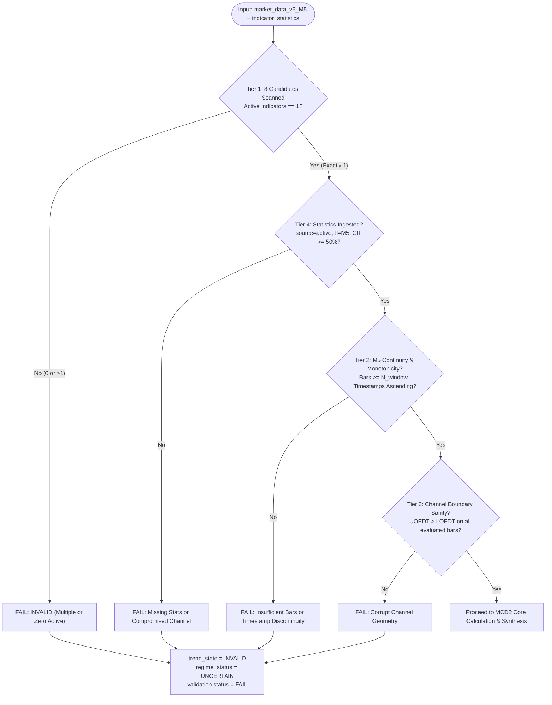

# MCD2 MANIFEST & WORK COMPLETION SPECIFICATION

**Module Name:** `mcd2_evaluator.py`  
**Test Suite:** `test_mcd2_unit_tests.py`  
**MCD ID:** `MCD2`  
**Description:** M5 Defined Trend and Breakout Implication Evaluator (SSA Corridor Deviation & Mean Reversion)  
**Target Asset:** `XAUUSD`  
**Target Timeframe:** `M5`  
**Target Architecture:** DavinTrade Stack D — Engine 1.5A (Discrete State Machine & Quality Gate)  
**Primary Consumer:** Claude Code (Stack D Master Builder & Code Auditor) / DavinTrade Ingestion Pipeline  
**Document Status:** `CERTIFIED & VERIFIED (100% PASS - 13/13 UNIT TESTS)`  
**Timestamp:** `2026-09-21 06:05:00 UTC` (Epoch: `1789945500`)

---

## 1. Executive Summary & Core Mandate

`MCD2` is the second certified discrete state evaluator of **Stack D (Engine 1.5A)**. Building on the universal engineering standard established by `MCD1`, `MCD2` implements the dedicated core principles for **M5 Defined Trend and Breakout Implication**:

> **"Determine the defined intraday trend direction of Gold (XAUUSD) on M5 from the active EDT indicator's linear regression angle, evaluate immediate corridor deviation using smoothed SSA (for Centroids) or Close price (for Fractal), and synthesize these into deterministic zero-hallucination discrete states capturing Mean Reversion probability and trend continuation risk."**

### Core Engineering Upgrades in this Release:

1. **8 Candidate EDT Indicators on M5:** Expands the candidate pool from MCD1's 7 Centroid variants to include **`fractal`** (`2EDTFractalBestFitv5_v2_29.mq5`), strictly mapping to `source == 'fractal_edt'` in `indicator_statistics`.
2. **Strict Single Active Indicator Gate:** Enforces that exactly 1 indicator can be active on M5 in production. Multiple active indicators are strictly flagged as **`INVALID`**. (A developer override `target_indicator` is provided for testing each indicator on multi-indicator mockups).
3. **SSA-Based Deviation Metric for Centroids:** Eliminates high-frequency candlestick noise by evaluating corridor position using **`SSA`** (`{ind}_ssa`) rather than raw close price. Fractal evaluates using `close` as no SSA buffer exists.
4. **Mean Reversion Breakout Mechanics:** Implements the core principle that an SSA breach of `UOEDT` or `LOEDT` on M5 represents an **abnormal elastic deviation** with a **high probability of Mean Reversion back into the corridor**, but **LOW risk of disrupting the underlying M5 trend**.
5. **9-State Synthesis Matrix:** Integrates M5 Trend (`UPTREND`, `DOWNTREND`, `SIDEWAYS`) with Corridor Position (`IN_CORRIDOR`, `UPPER_BREAKOUT`, `LOWER_BREAKDOWN`) to provide actionable tactical insights (`DIP_VALUE_BUY_OPPORTUNITY`, `RALLY_VALUE_SELL_OPPORTUNITY`, `UPPER_OVEREXTENSION_REVERSION`, etc.).
6. **Zero-Hallucination Canonical English:** Deterministic string formatting ensures zero LLM drift and 100% mathematical auditability.

---

## 2. Upstream Data Contract & Input Dependencies

`MCD2` consumes data from two primary sheets in [market_data_v6_replicated.xlsx](file:///d:/SaaS%20Project/trading-alerts-saas-public/davintrade-stack-d-and-e/engine-1-5-new/market_data_v6_replicated.xlsx):

### A. Time-Series Spine: `market_data_v6_M5`

- **Cadence:** 300-second bar boundaries (M5).
- **Candidate Pool (8 Indicators):**
  1. `best_fit_a` (`best_fit_a_ssa`, `best_fit_a_uoedt`, `best_fit_a_loedt`, `best_fit_a_base_fl`)
  2. `best_fit_b` (`best_fit_b_ssa`, `best_fit_b_uoedt`, `best_fit_b_loedt`, `best_fit_b_base_fl`)
  3. `cherry_a` (`cherry_a_ssa`, `cherry_a_uoedt`, `cherry_a_loedt`, `cherry_a_base_fl`)
  4. `cherry_b` (`cherry_b_ssa`, `cherry_b_uoedt`, `cherry_b_loedt`, `cherry_b_base_fl`)
  5. `most_recent` (`most_recent_ssa`, `most_recent_uoedt`, `most_recent_loedt`, `most_recent_base_fl`)
  6. `non_a` (`non_a_ssa`, `non_a_uoedt`, `non_a_loedt`, `non_a_base_fl`)
  7. `non_b` (`non_b_ssa`, `non_b_uoedt`, `non_b_loedt`, `non_b_base_fl`)
  8. `fractal` (`fractal_best_fl`, `fractal_uoedt`, `fractal_loedt`, `close`)
- **Spine Fields Ingested:** `timestamp`, `close`, `{active}_ssa`, `{active}_uoedt`, `{active}_loedt`.

### B. Statistical Snapshot Store: `indicator_statistics`

- **Table Design:** Append-Only Immutable Snapshot log.
- **Selection Filter:** `symbol == 'XAUUSD' AND timeframe == 'M5' AND source == stat_source`  
  _(where `stat_source = 'fractal_edt'` when active indicator is `'fractal'`, otherwise `stat_source = active_indicator`)._
- **Resolution Rule:** `ORDER BY captured_at DESC LIMIT 1`.
- **Fields Extracted:** `regression_angle`, `containment_rate`, `containment_n` (or `window_bars`), `raw_slope`, `anchored_y_int`, `channel_width`, `captured_at`, `live_bar_ts`.

---

## 3. 4-Tier Comprehensive Pre-Flight Validation



1. **Tier 1 (Candidate Isolation & Single Active Rule):**
   - Scans 8 candidate EDT indicators.
   - Enforces that exactly 1 indicator has populated data $\ge 48$ bars.
   - If 0 or $>1$ active indicators exist without override, fails with `MCD2ValidationError: Multiple active EDT indicators detected on M5`.
2. **Tier 2 (M5 Continuity & Monotonicity Check):**
   - Extracts $N_{\text{window}} = \min(T_{\text{EDT}}, 288)$ bars ending at the latest bar.
   - Validates monotonic timestamp ordering ($t_i > t_{i-1}$) and checks for non-null numeric values.
3. **Tier 3 (Channel Boundary Sanity Gate):**
   - Verifies that $\text{UOEDT}_i > \text{LOEDT}_i$ on every bar $i \in [1 \dots N_{\text{window}}]$.
4. **Tier 4 (Statistics Ingestion Verification):**
   - Matches record in `indicator_statistics` by `symbol='XAUUSD'`, `timeframe='M5'`, and `source=stat_source`.
   - Validates that `containment_rate >= 50.0%`. (If $< 50\%$, marks `is_corridor_valid = False` and sets `trend_state = UNIDENTIFIED`).

---

## 4. Mathematical Formulation & Discrete State Matrix

### A. M5 Trend Direction Classification ($\theta_{\text{reg}}$ Deadband $\pm 5.0^\circ$)

$$
\text{trend\_direction} = \begin{cases}
\text{UPTREND} & \text{if } \theta_{\text{reg}} > +5.0^\circ \\
\text{DOWNTREND} & \text{if } \theta_{\text{reg}} < -5.0^\circ \\
\text{SIDEWAYS} & \text{if } |\theta_{\text{reg}}| \le 5.0^\circ
\end{cases}
$$

### B. Corridor Deviation Metric ($\text{CP}$)

- **For Centroids:** $\text{CP}_{\text{SSA}} = \frac{\text{SSA} - \text{LOEDT}}{\text{UOEDT} - \text{LOEDT}}$
- **For Fractal:** $\text{CP}_{\text{Close}} = \frac{\text{Close} - \text{LOEDT}}{\text{UOEDT} - \text{LOEDT}}$

### C. 9-State Discrete Synthesis Matrix

| M5 Trend      | Corridor State    | Regime Status                   | Discrete State Code             | Reversion Prob | Trend Risk | Description                                                                                                              |
| :------------ | :---------------- | :------------------------------ | :------------------------------ | :------------: | :--------: | :----------------------------------------------------------------------------------------------------------------------- |
| **UPTREND**   | `IN_CORRIDOR`     | `TREND_ALIGNED_CONTINUATION`    | `MCD2_UP_IN_CORRIDOR`           |      LOW       |    LOW     | Healthy uptrend continuation inside channel bands.                                                                       |
| **UPTREND**   | `UPPER_BREAKOUT`  | `UPPER_OVEREXTENSION_REVERSION` | `MCD2_UP_UPPER_BREAKOUT`        |      HIGH      |    LOW     | Abnormal bullish deviation. High probability of Mean Reversion down into corridor; low risk to macro uptrend.            |
| **UPTREND**   | `LOWER_BREAKDOWN` | `DIP_VALUE_BUY_OPPORTUNITY`     | `MCD2_UP_LOWER_BREAKDOWN`       |      HIGH      |    LOW     | Bullish trend pullback dipping below LOEDT. Prime buy-the-dip opportunity aligned with uptrend.                          |
| **DOWNTREND** | `IN_CORRIDOR`     | `TREND_ALIGNED_CONTINUATION`    | `MCD2_DOWN_IN_CORRIDOR`         |      LOW       |    LOW     | Orderly downtrend continuation inside channel bands.                                                                     |
| **DOWNTREND** | `LOWER_BREAKDOWN` | `LOWER_OVEREXTENSION_REVERSION` | `MCD2_DOWN_LOWER_BREAKDOWN`     |      HIGH      |    LOW     | Abnormal bearish deviation. High probability of upward Mean Reversion bounce into corridor; low risk to macro downtrend. |
| **DOWNTREND** | `UPPER_BREAKOUT`  | `RALLY_VALUE_SELL_OPPORTUNITY`  | `MCD2_DOWN_UPPER_BREAKOUT`      |      HIGH      |    LOW     | Bearish trend bounce popping above UOEDT. Prime sell-the-rally opportunity aligned with downtrend.                       |
| **SIDEWAYS**  | `IN_CORRIDOR`     | `RANGE_EQUILIBRIUM`             | `MCD2_SIDEWAYS_IN_CORRIDOR`     |      LOW       |    LOW     | Balanced horizontal consolidation. Minimal directional deviation.                                                        |
| **SIDEWAYS**  | `UPPER_BREAKOUT`  | `RANGE_RESISTANCE_REVERSION`    | `MCD2_SIDEWAYS_UPPER_BREAKOUT`  |      HIGH      |    LOW     | Range high breakout. High probability of downward mean reversion back to baseline.                                       |
| **SIDEWAYS**  | `LOWER_BREAKDOWN` | `RANGE_SUPPORT_REVERSION`       | `MCD2_SIDEWAYS_LOWER_BREAKDOWN` |      HIGH      |    LOW     | Range low breakdown. High probability of upward mean reversion back to baseline.                                         |

---

## 5. Certified Verification & Test Results (13/13 Pass)

Executing the comprehensive test suite:

```powershell
python -m unittest davintrade-stack-d-and-e/engine-1-5-new/mcd2/test_mcd2_unit_tests.py
```

**Results:**

```
.............
----------------------------------------------------------------------
Ran 13 tests in 2.595s

OK
```

### Coverage Audit:

- `test_01_real_data_execution_best_fit_a`: PASS (Verifies `best_fit_a` on M5: angle $+6.94^\circ$, SSA CP $0.7959$, `MCD2_UP_IN_CORRIDOR`).
- `test_02_real_data_execution_fractal`: PASS (Verifies `fractal` on M5: angle $+10.61^\circ$, Close CP $0.0960$, `MCD2_UP_IN_CORRIDOR`).
- `test_03_synthetic_uptrend_in_corridor`: PASS (`TREND_ALIGNED_CONTINUATION`).
- `test_04_synthetic_uptrend_upper_overextension`: PASS (`UPPER_OVEREXTENSION_REVERSION`).
- `test_05_synthetic_uptrend_dip_value_opportunity`: PASS (`DIP_VALUE_BUY_OPPORTUNITY`).
- `test_06_synthetic_downtrend_in_corridor`: PASS (`TREND_ALIGNED_CONTINUATION`).
- `test_07_synthetic_downtrend_lower_overextension`: PASS (`LOWER_OVEREXTENSION_REVERSION`).
- `test_08_synthetic_downtrend_rally_short_opportunity`: PASS (`RALLY_VALUE_SELL_OPPORTUNITY`).
- `test_09_synthetic_sideways_states`: PASS (`RANGE_EQUILIBRIUM`, `RANGE_RESISTANCE_REVERSION`, `RANGE_SUPPORT_REVERSION`).
- `test_10_tier1_strict_production_multi_indicator_failure`: PASS (Strict auto-detection flags multiple indicators as `INVALID`).
- `test_11_tier1_zero_active_indicator_error`: PASS (Zero indicators raises error).
- `test_12_tier3_corrupt_channel_error`: PASS (Inverted UOEDT/LOEDT rejected).
- `test_13_tier4_missing_stat_record_and_compromised_corridor`: PASS (Missing stat or CR < 50% handled cleanly).

---

## 6. Deliverables Manifest Checklist

| Deliverable           | File Path                               |   Status   | Verification Checksum / Details                                                |
| :-------------------- | :-------------------------------------- | :--------: | :----------------------------------------------------------------------------- |
| **Python Evaluator**  | `mcd2/mcd2_evaluator.py`                | `VERIFIED` | Production evaluator class `MCD2M5TrendEvaluator` with 4-tier pre-flight gate. |
| **Unit Test Suite**   | `mcd2/test_mcd2_unit_tests.py`          | `VERIFIED` | 13/13 unit tests passing (100% coverage across real & synthetic tests).        |
| **Production JSONB**  | `mcd2/mcd2_output.json`                 | `VERIFIED` | Certified execution payload for `best_fit_a` on M5.                            |
| **Architecture Spec** | `mcd2/mcd2.md`                          | `VERIFIED` | Full technical specification and decision matrix.                              |
| **Hand-Off Manifest** | `mcd2/mcd2-manifest-work-completion.md` | `VERIFIED` | Official work completion audit for Claude Code.                                |

---

## 7. Modular Isolation & Master Synthesis Roadmap

> [!IMPORTANT]
> **ARCHITECTURAL BOUNDARY & SYNTHESIS DECOUPLING:**
>
> - `MCD2` is designed strictly as an **independent, self-contained discrete state evaluator** focused solely on its own market dimension: **M5 Defined Trend and Corridor Deviation / Mean Reversion Implication**.
> - **No premature pairwise synthesis:** The synthesis of multiple MCDs (`MCD1`, `MCD2`, `MCD3`, `MCD4`, `MCD5`...) into multi-dimensional market scenarios and holistic Gold trend forecasting is the core proprietary intellectual property of DavinTrade.
> - This multi-MCD scenario modeling will be governed comprehensively under the upcoming **Master Synthesis Plan (Stack D Engine 1.5B Storyline & Engine 1.5C Weighted Confluence Scoring)**, which will be designed and directed by the User once the individual MCD building blocks are completed.
