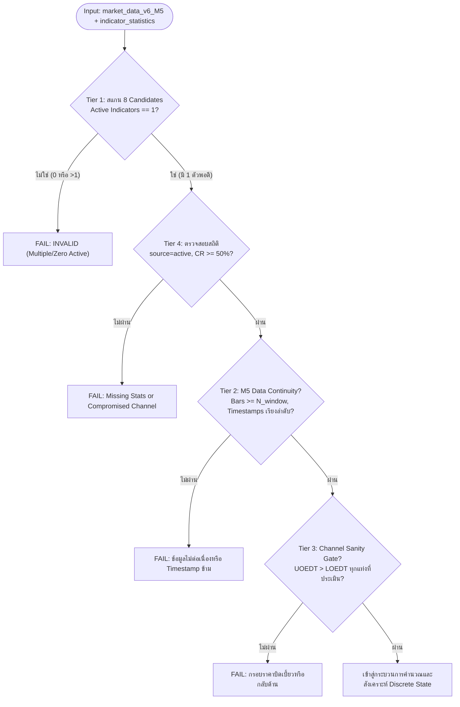

# MCD2 Specification: M5 Defined Trend and Breakout Implication Evaluator

**DavinTrade Architecture:** Stack D — Engine 1.5A Module  
**Asset:** `XAUUSD` | **Timeframe:** `M5`  
**Evaluation Framework:** M5 Linear Regression Trend + SSA-Based Corridor Deviation & Mean Reversion Dynamics  
**Status:** Certified & Production-Ready (13/13 Unit Tests Passing - 100% Pass)  
**Last Updated:** 2026-09-21 (Derived directly from MCD2 Core Principles and Gold Standard Blueprint)

---

## 1. วัตถุประสงค์และหน้าที่หลัก (Core Mandate)

**MCD2** ทำหน้าที่หาคำตอบเชิงคณิตศาสตร์และพฤติกรรมตลาดบน Timeframe **M5** ว่า:

> **"ณ ปัจจุบัน แนวโน้มราคาระยะสั้น (Defined Intraday Trend) ของ XAUUSD บน M5 เป็นเทรนอะไร และตำแหน่งความเบี่ยงเบนของราคา/SSA ในกรอบ Corridor (UOEDT/LOEDT) มีนัยสำคัญต่อโอกาสการเกิด Mean Reversion หรือไม่?"**

### ความแตกต่างเชิงกระบวนทัศน์ระหว่าง MCD1 (M15) และ MCD2 (M5):

| มิติทางสถาปัตยกรรม                   | **MCD1 (M15 Primary Trend)**                                                                                                                                                                                         | **MCD2 (M5 Defined Trend & Implication)**                                                                                                                                                                                                                                                                                                 |
| :----------------------------------- | :------------------------------------------------------------------------------------------------------------------------------------------------------------------------------------------------------------------- | :---------------------------------------------------------------------------------------------------------------------------------------------------------------------------------------------------------------------------------------------------------------------------------------------------------------------------------------- |
| **Timeframe เป้าหมาย**               | `M15` (แท่งละ 15 นาที / 900 วินาที)                                                                                                                                                                                  | `M5` (แท่งละ 5 นาที / 300 วินาที)                                                                                                                                                                                                                                                                                                         |
| **Candidate Indicators**             | **7 Centroid Variants เท่านั้น** (ไม่รวม Fractal)                                                                                                                                                                    | **8 EDT Indicators** (7 Centroids + เพิ่ม **`fractal`**)                                                                                                                                                                                                                                                                                  |
| **Metric วัดตำแหน่งในกรอบ**          | ราคา `close` ของแท่งเทียน                                                                                                                                                                                            | **`SSA` (Singular Spectrum Analysis)** สำหรับ Centroids; **`close`** สำหรับ Fractal                                                                                                                                                                                                                                                       |
| **นัยสำคัญเมื่อหลุดกรอบ (Breakout)** | **การกลับตัวเชิงโครงสร้าง (Structural Reversal):** • หลุดกรอบสวนเทรน $\ge 80\%$ ข้าม 96 แท่ง = เปลี่ยนโครงสร้าง (`COUNTER_TREND_EXPANSION`) • หลุดกรอบทิศเดียวกับเทรน = จบคลื่น Climax (`BREAKOUT_SAME_SLOPE`) | **ความเบี่ยงเบนผิดปกติและการเกิด Mean Reversion:** • การที่ SSA หลุดกรอบ UOEDT/LOEDT คือ **Abnormal Deviation** • มีโอกาสสูงมากที่จะเกิด **Mean Reversion กลับเข้ากรอบ** • มี **ความเสี่ยงต่ำ** ที่จะทำลายแนวโน้มหลักของเทรน M5 • เป็นโอกาสทองในการเปิด Position Buy/Sell เพื่อทำกำไรจากการดึงกลับเข้ากรอบตามสมมติฐานเทรนเดิม |
| **กฎ Single Active Indicator**       | Active ได้เพียง 1 ตัวเท่านั้น (0 หรือ >1 = `INVALID`)                                                                                                                                                                | Active ได้เพียง 1 ตัวเท่านั้น (0 หรือ >1 = `INVALID`)                                                                                                                                                                                                                                                                                     |

---

## 2. ขอบเขต Indicator บน M5 (8 Candidate EDT Indicators)

ตามกฎความปลอดภัยของระบบ DavinTrade แอดมินผู้คุมระบบสามารถเปิดใช้งาน Indicator บน M5 ได้ **เพียง 1 ตัวจาก 8 ตัวนี้เท่านั้น** (Single Active Indicator Rule):

1. `best_fit_a` (`best_fit_a_ssa`, `best_fit_a_uoedt`, `best_fit_a_loedt`, `best_fit_a_base_fl`)
2. `best_fit_b` (`best_fit_b_ssa`, `best_fit_b_uoedt`, `best_fit_b_loedt`, `best_fit_b_base_fl`)
3. `cherry_a` (`cherry_a_ssa`, `cherry_a_uoedt`, `cherry_a_loedt`, `cherry_a_base_fl`)
4. `cherry_b` (`cherry_b_ssa`, `cherry_b_uoedt`, `cherry_b_loedt`, `cherry_b_base_fl`)
5. `most_recent` (`most_recent_ssa`, `most_recent_uoedt`, `most_recent_loedt`, `most_recent_base_fl`)
6. `non_a` (`non_a_ssa`, `non_a_uoedt`, `non_a_loedt`, `non_a_base_fl`)
7. `non_b` (`non_b_ssa`, `non_b_uoedt`, `non_b_loedt`, `non_b_base_fl`)
8. **`fractal`** (`fractal_best_fl`, `fractal_uoedt`, `fractal_loedt`, `close`) _(จับคู่กับ `source == 'fractal_edt'` ใน `indicator_statistics`)_

> [!NOTE]
> ในระบบ Live Production จริง หากพบ Indicator Active มากกว่า 1 ตัว ถือว่าข้อมูลทับซ้อนและจัดเป็น **`INVALID`** ทันที ส่วนตัวเลือก `target_indicator` มีไว้เพื่อแยกทดสอบตัวชี้วัดในสภาพแวดล้อม Development/Mockup เท่านั้น

---

## 3. ระบบการตรวจสอบข้อมูล 4 ชั้น (4-Tier Comprehensive Pre-Flight Validation)

ก่อนเริ่มคำนวณ `mcd2_evaluator.py` จะรันด่านตรวจ Pre-Flight ทั้งหมด 4 ชั้น หากพบความผิดปกติจะ Fail ทันที และออกผลลัพธ์เป็น `trend_state = INVALID`:

- **Tier 1 (Candidate Isolation & Single Active Rule):** สแกนทั้ง 8 Candidate Indicators ต้องมีข้อมูลครบถ้วน $\ge 48$ แท่ง เพียง 1 ตัวเท่านั้น
- **Tier 2 (M5 Continuity & Monotonicity Check):** ตรวจสอบว่า Timestamp เรียงจากอดีตไปปัจจุบัน ($t_i > t_{i-1}$) และตัวเลขค่าราคา/อินดิเคเตอร์ไม่เป็น Null หรือค่าลบ
- **Tier 3 (Channel Sanity Gate):** ตรวจสอบว่า $\text{UOEDT}_i > \text{LOEDT}_i$ ในทุกๆ แท่งเทียนที่นำมาประเมิน (ป้องกันปัญหา Band กลับด้านหรือความกว้างเป็น 0)
- **Tier 4 (Statistics Ingestion Verification):** ดึงแถวข้อมูลล่าสุดจาก `indicator_statistics` ที่ตรงกับ `symbol='XAUUSD'`, `timeframe='M5'`, และ `source=active_indicator` ตรวจสอบความถูกต้องของมุมองศาและยืนยันว่า `containment_rate >= 50.0%` (หากต่ำกว่า 50% จะถือว่ากรอบเสียสภาพ)

---

## 4. สูตรการคำนวณและเกณฑ์การตัดสิน (Formulation & Matrix)

### A. การจำแนกทิศทางเทรน M5 (M5 Defined Trend Direction)

ประเมินจากมุมองศา Regression Angle ($\theta_{\text{reg}}$) จาก `indicator_statistics` ภายใต้ Deadband Threshold $\pm 5.0^\circ$:

$$
\text{m5\_trend\_state} = \begin{cases}
\text{UPTREND} & \text{เมื่อ } \theta_{\text{reg}} > +5.0^\circ \\
\text{DOWNTREND} & \text{เมื่อ } \theta_{\text{reg}} < -5.0^\circ \\
\text{SIDEWAYS} & \text{เมื่อ } |\theta_{\text{reg}}| \le 5.0^\circ
\end{cases}
$$

### B. การวัดตำแหน่งในกรอบราคา (Channel Position Metric)

- **สำหรับ Centroid Indicators (7 Variants):** คำนวณจาก **`SSA`** เพื่อตัด Noise ความผันผวนของราคาแท่งเทียน:
  $$\text{CP}_{\text{SSA}} = \frac{\text{SSA} - \text{LOEDT}}{\text{UOEDT} - \text{LOEDT}}$$
- **สำหรับ Fractal Indicator:** คำนวณจากราคา **`Close`** เนื่องจาก Fractal ไม่มีบัฟเฟอร์ SSA:
  $$\text{CP}_{\text{Close}} = \frac{\text{Close} - \text{fractal\_loedt}}{\text{fractal\_uoedt} - \text{fractal\_loedt}}$$

### C. การจำแนกสถานะในกรอบราคา (Corridor State)

- **`UPPER_BREAKOUT`**: $\text{CP} > 1.0$ (ค่า SSA ทะลุเกินขอบบน UOEDT) $\longrightarrow$ เกิดการเบี่ยงเบนเชิงบวกสูงผิดปกติ (Abnormal Upward Deviation) โอกาสเกิด **Mean Reversion ดึงกลับลงสู่กรอบสูงมาก**
- **`LOWER_BREAKDOWN`**: $\text{CP} < 0.0$ (ค่า SSA หลุดต่ำกว่าขอบล่าง LOEDT) $\longrightarrow$ เกิดการเบี่ยงเบนเชิงลบสูงผิดปกติ (Abnormal Downward Deviation) โอกาสเกิด **Mean Reversion ดีดตัวกลับขึ้นสู่กรอบสูงมาก**
- **`IN_CORRIDOR`**: $0.0 \le \text{CP} \le 1.0$ (ค่า SSA วิ่งอยู่ในกรอบปกติ) $\longrightarrow$ ระดับความเบี่ยงเบนปกติ โอกาสเกิด Mean Reversion ต่ำ ราคาดำเนินไปตามแนวโน้มเดิมอย่างราบรื่น

### D. การสังเคราะห์ผลลัพธ์ 9 สถานะ (Synthesis Decision Matrix)

| M5 Trend ($\theta$) | Corridor State ($\text{CP}$) | Synthesis `regime_status`           | Discrete State Code             | คำอธิบายทางพฤติกรรมตลาดและโอกาสทางกลยุทธ์                                                                                                                                                      |
| :------------------ | :--------------------------- | :---------------------------------- | :------------------------------ | :--------------------------------------------------------------------------------------------------------------------------------------------------------------------------------------------- |
| **`UPTREND`**       | `IN_CORRIDOR`                | **`TREND_ALIGNED_CONTINUATION`**    | `MCD2_UP_IN_CORRIDOR`           | ราคาและ SSA แกว่งตัวในกรอบขาขึ้นปกติ ความเบี่ยงเบนต่ำ เทรนด์ขาขึ้นดำเนินต่อไป                                                                                                                  |
| **`UPTREND`**       | `UPPER_BREAKOUT`             | **`UPPER_OVEREXTENSION_REVERSION`** | `MCD2_UP_UPPER_BREAKOUT`        | **Abnormal Bullish Deviation:** SSA พุ่งทะลุ UOEDT โอกาสเกิด Mean Reversion ดึงกลับลงเข้ากรอบสูง โดยมีความเสี่ยงต่ำต่อเทรนด์ขาขึ้นหลัก (จังหวะ Take Profit ฝั่ง Buy หรือดัก Short สวนระยะสั้น) |
| **`UPTREND`**       | `LOWER_BREAKDOWN`            | **`DIP_VALUE_BUY_OPPORTUNITY`**     | `MCD2_UP_LOWER_BREAKDOWN`       | **Prime Buy Opportunity:** SSA ย่อตัวหลุดกรอบล่าง LOEDT ในช่วงขาขึ้น เป็นการเบี่ยงเบนผิดปกติ จังหวะทองในการเข้าช้อนซื้อ (Buy the Dip) เพื่อกินรอบดีดตัวกลับเข้ากรอบตามเทรนด์ใหญ่               |
| **`DOWNTREND`**     | `IN_CORRIDOR`                | **`TREND_ALIGNED_CONTINUATION`**    | `MCD2_DOWN_IN_CORRIDOR`         | ราคาและ SSA เคลื่อนตัวลงตามกรอบขาลงปกติ ความเบี่ยงเบนปานกลาง เทรนด์ขาลงดำเนินต่อไป                                                                                                             |
| **`DOWNTREND`**     | `LOWER_BREAKDOWN`            | **`LOWER_OVEREXTENSION_REVERSION`** | `MCD2_DOWN_LOWER_BREAKDOWN`     | **Abnormal Bearish Deviation:** SSA ร่วงหลุด LOEDT โอกาสเกิด Mean Reversion ดีดกลับขึ้นเข้ากรอบสูง โดยมีความเสี่ยงต่ำต่อเทรนด์ขาลงหลัก (จังหวะ Take Profit ฝั่ง Sell หรือดัก Long สวนระยะสั้น) |
| **`DOWNTREND`**     | `UPPER_BREAKOUT`             | **`RALLY_VALUE_SELL_OPPORTUNITY`**  | `MCD2_DOWN_UPPER_BREAKOUT`      | **Prime Sell Opportunity:** SSA เด้งทะลุกรอบบน UOEDT ในช่วงขาลง เป็นการเบี่ยงเบนผิดปกติ จังหวะทองในการดักขาย (Sell the Rally) เพื่อกินรอบทุบกลับเข้ากรอบตามเทรนด์ใหญ่                          |
| **`SIDEWAYS`**      | `IN_CORRIDOR`                | **`RANGE_EQUILIBRIUM`**             | `MCD2_SIDEWAYS_IN_CORRIDOR`     | ตลาดไซด์เวย์สมดุล ราคาแกว่งตัวใกล้เส้นกึ่งกลาง ความเบี่ยงเบนต่ำ                                                                                                                                |
| **`SIDEWAYS`**      | `UPPER_BREAKOUT`             | **`RANGE_RESISTANCE_REVERSION`**    | `MCD2_SIDEWAYS_UPPER_BREAKOUT`  | SSA ชนและทะลุกรอบบนในตลาดไซด์เวย์ โอกาสสูงที่จะเกิด Mean Reversion กดราคากลับลงสู่จุดสมดุล                                                                                                     |
| **`SIDEWAYS`**      | `LOWER_BREAKDOWN`            | **`RANGE_SUPPORT_REVERSION`**       | `MCD2_SIDEWAYS_LOWER_BREAKDOWN` | SSA หลุดกรอบล่างในตลาดไซด์เวย์ โอกาสสูงที่จะเกิด Mean Reversion ดันราคากลับขึ้นสู่จุดสมดุล                                                                                                     |

---

## 5. ผลลัพธ์จากการประเมินชุดข้อมูลจริง (`market_data_v6_replicated.xlsx`)

### A. กรณีประเมิน `best_fit_a` (ตัวแทนหลัก Centroid Indicator)

- **Active Indicator:** `best_fit_a`
- **Regression Angle:** $+6.94^\circ$ ($\longrightarrow$ M5 Trend: **`UPTREND`**)
- **Containment Rate:** $55.76\%$ (ผ่านเกณฑ์ $\ge 50\%$)
- **EDT Time Horizon:** $755$ bars
- **Evaluation Window:** $288$ bars (24 ชั่วโมงเต็มของ M5)
- **Latest Bar Close:** $4377.99$ USD
- **Latest Bar SSA:** $4377.33$ USD
- **UOEDT / LOEDT:** $4384.28$ / $4350.22$ USD (Channel Width = $34.06$ USD)
- **Channel Position (SSA):** $0.7959$ ($\longrightarrow$ Corridor State: **`IN_CORRIDOR`**)
- **Channel Position (Close):** $0.8153$
- **Discrete State:** `MCD2_UP_IN_CORRIDOR`
- **Regime Status:** `TREND_ALIGNED_CONTINUATION`
- **Canonical Commentary:**
  > _"XAUUSD M5 trend is UPTREND (+6.94°) with SSA safely within the EDT corridor (channel_position=0.7959). Deviation remains moderate without high mean reversion pressure, confirming healthy trend continuation."_

### B. กรณีประเมิน `fractal` (ตัวแทน Fractal Best-Fit Flip Line)

- **Active Indicator:** `fractal` (จับคู่กับ `fractal_edt` ใน `indicator_statistics`)
- **Regression Angle:** $+10.61^\circ$ ($\longrightarrow$ M5 Trend: **`UPTREND`**)
- **Containment Rate:** $64.88\%$ (ผ่านเกณฑ์ $\ge 50\%$)
- **EDT Time Horizon:** $336$ bars
- **Latest Bar Close:** $4377.99$ USD
- **UOEDT / LOEDT:** $4412.60$ / $4374.32$ USD
- **Channel Position (Close):** $0.0960$ ($\longrightarrow$ Corridor State: **`IN_CORRIDOR`** ใกล้ LOEDT)
- **Discrete State:** `MCD2_UP_IN_CORRIDOR`
- **Regime Status:** `TREND_ALIGNED_CONTINUATION`
- **Canonical Commentary:**
  > _"XAUUSD M5 trend is UPTREND (+10.61°) with Close safely within the EDT corridor (channel_position=0.0960). Deviation remains moderate without high mean reversion pressure, confirming healthy trend continuation."_

---

## 6. การทดสอบและการรับรองคุณภาพ (Unit Test Certification)

ชุดทดสอบ `test_mcd2_unit_tests.py` ครอบคลุมการทดสอบ 13 กรณีและผ่านการรับรอง **100% PASS**:

1. `test_01_real_data_execution_best_fit_a`: ตรวจสอบผลลัพธ์ข้อมูลจริง `best_fit_a`
2. `test_02_real_data_execution_fractal`: ตรวจสอบผลลัพธ์ข้อมูลจริง `fractal`
3. `test_03_synthetic_uptrend_in_corridor`: ตรวจสอบสถานะ Uptrend In-Corridor
4. `test_04_synthetic_uptrend_upper_overextension`: ตรวจสอบสถานะ Bullish Overextension (Mean Reversion trigger)
5. `test_05_synthetic_uptrend_dip_value_opportunity`: ตรวจสอบสถานะ Buy the Dip Opportunity
6. `test_06_synthetic_downtrend_in_corridor`: ตรวจสอบสถานะ Downtrend In-Corridor
7. `test_07_synthetic_downtrend_lower_overextension`: ตรวจสอบสถานะ Bearish Overextension (Mean Reversion trigger)
8. `test_08_synthetic_downtrend_rally_short_opportunity`: ตรวจสอบสถานะ Sell the Rally Opportunity
9. `test_09_synthetic_sideways_states`: ตรวจสอบสภาวะ Sideways ครบทั้ง 3 กรณี
10. `test_10_tier1_strict_production_multi_indicator_failure`: ตรวจสอบการปฏิเสธกรณีพบ Indicator มากกว่า 1 ตัว
11. `test_11_tier1_zero_active_indicator_error`: ตรวจสอบการปฏิเสธกรณีไม่พบ Active Indicator
12. `test_12_tier3_corrupt_channel_error`: ตรวจสอบการจับข้อผิดพลาดกรอบราคาบิดเบี้ยว (UOEDT <= LOEDT)
13. `test_13_tier4_missing_stat_record_and_compromised_corridor`: ตรวจสอบกรณีสถิติหายหรือ Containment Rate ต่ำกว่า 50%
