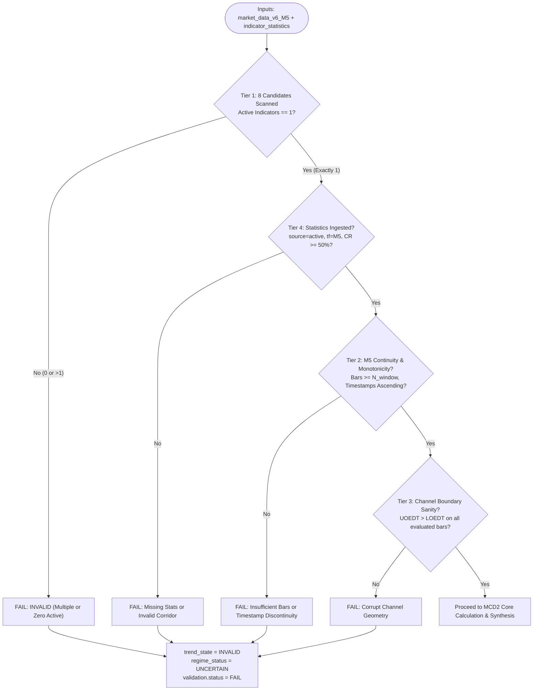

# Implementation Plan: MCD2 — M5 Defined Trend and Breakout Implication

_(Comprehensive Production Blueprint derived from MCD1 Gold Standard)_

**Module Name:** `mcd2_evaluator.py`  
**Test Suite:** `test_mcd2_unit_tests.py`  
**Target Asset:** `XAUUSD`  
**Target Timeframe:** `M5` (Intraday Micro-Execution & Mean Reversion Horizon)  
**Architecture Layer:** DavinTrade Stack D — Engine 1.5A (Discrete State Machine & Quality Gate)  
**Primary Deliverables Directory:** `davintrade-stack-d-and-e/engine-1-5-new/mcd2/`

---

## 1. Executive Summary & Purpose

`MCD2` is the second discrete state evaluator module of **DavinTrade Stack D (Engine 1.5A)**. While `MCD1` establishes the macro-execution trend direction on **M5's higher timeframe (M15)**, `MCD2` operates directly on **M5** to answer two fundamental quantitative questions:

1. **"What is the defined intraday trend direction of XAUUSD on M5?"** (Derived mathematically from the active EDT indicator's linear regression angle).
2. **"What is the immediate corridor deviation status and its breakout implication?"** (Evaluated using the smoothed Singular Spectrum Analysis (`SSA`) line for Centroids, and `Close` for Fractal, relative to the Upper/Lower Outermost Equidistant Trendlines: `UOEDT` and `LOEDT`).

### The Fundamental Paradigm Shift: MCD1 vs. MCD2

| Architectural Dimension               | **MCD1 (M15 Macro Trend)**                                                                                                                                                                                                                           | **MCD2 (M5 Defined Trend & Implication)**                                                                                                                                                                                                                                                                                                                                                                                |
| :------------------------------------ | :--------------------------------------------------------------------------------------------------------------------------------------------------------------------------------------------------------------------------------------------------- | :----------------------------------------------------------------------------------------------------------------------------------------------------------------------------------------------------------------------------------------------------------------------------------------------------------------------------------------------------------------------------------------------------------------------- |
| **Primary Timeframe**                 | `M15` (900-second bar spine)                                                                                                                                                                                                                         | `M5` (300-second bar spine)                                                                                                                                                                                                                                                                                                                                                                                              |
| **Candidate Indicator Pool**          | **7 Centroid Variants only** (`best_fit_a/b`, `cherry_a/b`, `most_recent`, `non_a/b`). Excludes Fractal.                                                                                                                                             | **8 EDT Indicators** (7 Centroids + **`fractal`**).                                                                                                                                                                                                                                                                                                                                                                      |
| **Price Metric for Channel Position** | Raw Candlestick `close` price.                                                                                                                                                                                                                       | **`SSA` (Singular Spectrum Analysis)** for Centroids; **`close`** for Fractal.                                                                                                                                                                                                                                                                                                                                           |
| **Corridor In-Band Meaning**          | Normal price movement within macro corridor.                                                                                                                                                                                                         | Normal deviation; low probability of mean reversion (`IN_CORRIDOR`).                                                                                                                                                                                                                                                                                                                                                     |
| **Corridor Breakout Implication**     | **Structural Reversal / Trend Climax:**<br>• Counter-trend breach ($\ge 80\%$, $\ge 96$ bars) indicates **structural trend change** (`COUNTER_TREND_EXPANSION`).<br>• Same-slope breach indicates **buying/selling climax** (`BREAKOUT_SAME_SLOPE`). | **Abnormal Elastic Deviation & Mean Reversion:**<br>• Breakout outside `UOEDT` or `LOEDT` indicates an **extreme abnormal deviation**.<br>• **High probability of Mean Reversion back into the corridor**.<br>• **Low risk of disrupting the underlying M5 trend direction**.<br>• Presents high-conviction entry opportunities to scalp or ride the reversion back to the channel while the broader M5 trend continues. |
| **Single Active Indicator Rule**      | Strictly 1 active indicator allowed. If $>1$ or $0 \rightarrow$ `INVALID`.                                                                                                                                                                           | Strictly 1 active indicator allowed. If $>1$ or $0 \rightarrow$ `INVALID`.                                                                                                                                                                                                                                                                                                                                               |

---

## 2. Exhaustive Comparison: What MCD2 Inherits vs. Adapts from MCD1

### A. Pre-Flight Validation System (The 4-Tier Quality Gate)

MCD2 adapts MCD1's robust 4-tier validation pipeline with specific adjustments for the M5 timeframe and the expanded 8-indicator candidate pool:



#### Detailed Validation Tier Contracts:

1. **Tier 1 (Candidate Isolation & Single Active Rule):**
   - **Candidate Pool (8 Indicators):**
     `["best_fit_a", "best_fit_b", "cherry_a", "cherry_b", "most_recent", "non_a", "non_b", "fractal"]`
   - **Populated Columns Check:**
     - For Centroids: Checks non-null numeric values in `{ind}_ssa`, `{ind}_uoedt`, `{ind}_loedt`.
     - For Fractal: Checks non-null numeric values in `fractal_best_fl`, `fractal_uoedt`, `fractal_loedt`, and `close`.
   - **Strict Real-World Rule:** If `len(active_indicators) != 1`, the evaluator immediately throws `MCD2ValidationError` (or records `validation.status = "FAIL"`, `trend_state = "INVALID"`).
   - **Development/Test Parameter:** `target_indicator: Optional[str] = None`. When specified, isolates that single indicator from the multi-indicator mockup sheet `market_data_v6_M5` for unit testing; when `None` (production default), executes strict auto-detection across all 8 candidates.

2. **Tier 2 (M5 Time-Series Continuity & Data Availability):**
   - Verifies that at least $N_{\text{window}}$ historical M5 bars are available ending at the latest bar.
   - **Monotonic Timestamp Ordering:** Validates that $t_i > t_{i-1}$ for all evaluated bars.
   - **Bar Grid Sanity:** Emits warnings if consecutive M5 timestamps deviate from the expected 300-second interval ($\Delta t \ne 300\text{s}$) across non-weekend periods.
   - **Non-Null Integrity:** Asserts that price and indicator values are non-null and strictly positive.

3. **Tier 3 (Channel Sanity Gate):**
   - Verifies that $\text{UOEDT}_i > \text{LOEDT}_i$ on **every single evaluated bar** $i \in [1 \dots N_{\text{window}}]$.
   - Validates that channel width $W_i = \text{UOEDT}_i - \text{LOEDT}_i > 0$.
   - Prevents corrupt geometry, inverted bands, or zero-width channels from poisoning downstream calculations.

4. **Tier 4 (Indicator Statistics Ingestion Verification):**
   - Queries `indicator_statistics` using exact filter:  
     `symbol == 'XAUUSD' AND timeframe == 'M5' AND source == active_indicator`  
     _(where `fractal` maps to `source == 'fractal_edt'`)._
   - Sorts descending by `captured_at` to resolve the latest immutable snapshot (`ORDER BY captured_at DESC LIMIT 1`).
   - Validates that `regression_angle` is present, valid numeric, and within $[-90.0^\circ, +90.0^\circ]$.
   - Validates that `containment_rate >= min_containment_threshold` (default $50.0\%$). If $< 50\%$, marks `is_corridor_valid = False` and warns of channel degradation.
   - Captures provenance metadata: `captured_at`, `live_bar_ts`, `raw_slope`, `anchored_y_int`, `channel_width`, and `containment_n`.

---

## 3. Mathematical Calculations & Formulation

### A. M5 Defined Trend Direction Formulation

The M5 primary trend direction is derived deterministically from the linear regression angle $\theta_{\text{reg}}$ in `indicator_statistics`:

$$
\text{m5\_trend\_state} = \begin{cases}
\text{UPTREND} & \text{if } \theta_{\text{reg}} > +\theta_{\text{sideways}} \\
\text{DOWNTREND} & \text{if } \theta_{\text{reg}} < -\theta_{\text{sideways}} \\
\text{SIDEWAYS} & \text{if } |\theta_{\text{reg}}| \le \theta_{\text{sideways}}
\end{cases}
$$

- **Default Deadband Threshold ($\theta_{\text{sideways}}$):** $\pm 5.0^\circ$ (configurable).
- **Physical Interpretation:**
  - $\theta_{\text{reg}} > +5.0^\circ$: Statistically validated upward channel trajectory.
  - $\theta_{\text{reg}} < -5.0^\circ$: Statistically validated downward channel trajectory.
  - $|\theta_{\text{reg}}| \le 5.0^\circ$: Horizontal consolidation / range-bound channel.

### B. M5 Corridor Position Metric (SSA vs. Close)

In MCD1, channel position was calculated strictly from raw `close` price:
$$\text{CP}_{\text{close}} = \frac{\text{close} - \text{LOEDT}}{\text{UOEDT} - \text{LOEDT}}$$

In **MCD2**, to filter out random high-frequency tick noise and capture the true underlying price movement of the indicator:

- **For Centroid Indicators (7 variants):**  
  Channel position is calculated using **`SSA` (Singular Spectrum Analysis)**:
  $$\text{CP}_{\text{SSA}} = \frac{\text{SSA} - \text{LOEDT}}{\text{UOEDT} - \text{LOEDT}}$$
  _(Raw `close`-based channel position $\text{CP}_{\text{close}}$ is also calculated and retained in `raw_metrics` for complete analytical provenance)._
- **For Fractal Indicator:**  
  Since the MQL5 Fractal indicator (`2EDTFractalBestFitv5_v2_29.mq5`) generates Best Flip Line (`fractal_best_fl`), `UOEDT`, and `LOEDT` without an SSA smoothing buffer, channel position uses `close`:
  $$\text{CP}_{\text{Fractal}} = \frac{\text{close} - \text{fractal\_loedt}}{\text{fractal\_uoedt} - \text{fractal\_loedt}}$$

### C. Corridor State Classification (Latest Bar)

$$
\text{corridor\_state} = \begin{cases}
\text{UPPER_BREAKOUT} & \text{if } \text{CP} > 1.0 \quad (\text{metric} > \text{UOEDT}) \\
\text{LOWER_BREAKDOWN} & \text{if } \text{CP} < 0.0 \quad (\text{metric} < \text{LOEDT}) \\
\text{IN_CORRIDOR} & \text{if } 0.0 \le \text{CP} \le 1.0 \quad (\text{LOEDT} \le \text{metric} \le \text{UOEDT})
\end{cases}
$$

### D. Dynamic Evaluation Lookback Window ($N_{\text{window}}$)

To provide both real-time instantaneous accuracy and historical statistical context:

1. **Instantaneous Assessment (Bar 0):** Evaluates the latest completed bar for immediate breakout and mean-reversion signaling.
2. **Window Statistical Metrics:** Evaluates historical behavior across an evaluation window:
   $$N_{\text{window}} = \min(T_{\text{EDT}},\; 288)$$
   _(where $288\text{ bars} = 24\text{ hours}$ of M5, and $T_{\text{EDT}}$ is read from `containment_n` in `indicator_statistics`)._
   - Metrics computed across $N_{\text{window}}$:
     - `upper_breach_count` & `upper_breach_pct`: Bars where $\text{metric} > \text{UOEDT}$.
     - `lower_breach_count` & `lower_breach_pct`: Bars where $\text{metric} < \text{LOEDT}$.
     - `contained_bar_count` & `containment_rate_pct`: Bars where $\text{LOEDT} \le \text{metric} \le \text{UOEDT}$.
     - `max_excursion_above`: Maximum excursion above UOEDT ($\max(\text{metric} - \text{UOEDT}, 0)$).
     - `max_excursion_below`: Maximum excursion below LOEDT ($\max(\text{LOEDT} - \text{metric}, 0)$).

---

## 4. Discrete State Synthesis Matrix (9 Canonical States)

Combining the **M5 Defined Trend Direction** (3 states) and the **M5 Corridor Position State** (3 states) yields **9 Discrete States**:

|  #  | M5 Trend ($\theta_{\text{reg}}$) | Corridor State ($\text{CP}$)            | Synthesized `regime_status`     | Discrete State Code                     | Market Behavior & Mean Reversion Implication                                                                                                                                                                            |
| :-: | :------------------------------- | :-------------------------------------- | :------------------------------ | :-------------------------------------- | :---------------------------------------------------------------------------------------------------------------------------------------------------------------------------------------------------------------------- | ------------------------------- | -------------------------------------------------------------------------------------------------------------------------------------------------- |
|  1  | **`UPTREND`** ($> +5^\circ$)     | `IN_CORRIDOR` ($0 \le \text{CP} \le 1$) | `TREND_ALIGNED_CONTINUATION`    | `MCD2_UP_IN_CORRIDOR`                   | Normal price oscillation within upward channel. Deviation is healthy; low probability of mean reversion; strong trend continuation.                                                                                     |
|  2  | **`UPTREND`** ($> +5^\circ$)     | `UPPER_BREAKOUT` ($\text{CP} > 1.0$)    | `UPPER_OVEREXTENSION_REVERSION` | `MCD2_UP_UPPER_BREAKOUT`                | **Abnormal Bullish Deviation:** SSA extended above UOEDT. High probability of downward Mean Reversion back to corridor, with LOW risk to macro uptrend. Profit taking / short mean-reversion scalp opportunity.         |
|  3  | **`UPTREND`** ($> +5^\circ$)     | `LOWER_BREAKDOWN` ($\text{CP} < 0.0$)   | `DIP_VALUE_BUY_OPPORTUNITY`     | `MCD2_UP_LOWER_BREAKDOWN`               | **High-Conviction Buy Opportunity:** Bullish trend pullback dipping below LOEDT. Extreme downward deviation presenting prime buy-the-dip opportunity for mean-reversion bounce aligned with uptrend.                    |
|  4  | **`DOWNTREND`** ($< -5^\circ$)   | `IN_CORRIDOR` ($0 \le \text{CP} \le 1$) | `TREND_ALIGNED_CONTINUATION`    | `MCD2_DOWN_IN_CORRIDOR`                 | Normal price oscillation within downward channel. Deviation is moderate; orderly downward trend continuation.                                                                                                           |
|  5  | **`DOWNTREND`** ($< -5^\circ$)   | `LOWER_BREAKDOWN` ($\text{CP} < 0.0$)   | `LOWER_OVEREXTENSION_REVERSION` | `MCD2_DOWN_LOWER_BREAKDOWN`             | **Abnormal Bearish Deviation:** SSA extended below LOEDT. High probability of upward Mean Reversion bounce back into corridor, with LOW risk to macro downtrend. Profit taking / long mean-reversion scalp opportunity. |
|  6  | **`DOWNTREND`** ($< -5^\circ$)   | `UPPER_BREAKOUT` ($\text{CP} > 1.0$)    | `RALLY_VALUE_SELL_OPPORTUNITY`  | `MCD2_DOWN_UPPER_BREAKOUT`              | **High-Conviction Sell Opportunity:** Bearish trend counter-bounce spiking above UOEDT. Extreme upward deviation presenting prime sell-the-rally opportunity for mean-reversion drop aligned with downtrend.            |
|  7  | **`SIDEWAYS`** ($                | \theta                                  | \le 5^\circ$)                   | `IN_CORRIDOR` ($0 \le \text{CP} \le 1$) | `RANGE_EQUILIBRIUM`                                                                                                                                                                                                     | `MCD2_SIDEWAYS_IN_CORRIDOR`     | Balanced horizontal consolidation. Price oscillates near channel baseline with minimal directional deviation.                                      |
|  8  | **`SIDEWAYS`** ($                | \theta                                  | \le 5^\circ$)                   | `UPPER_BREAKOUT` ($\text{CP} > 1.0$)    | `RANGE_RESISTANCE_REVERSION`                                                                                                                                                                                            | `MCD2_SIDEWAYS_UPPER_BREAKOUT`  | **Range High Deviation:** Price/SSA breached above UOEDT in a flat market. High probability of downward mean reversion back toward channel center. |
|  9  | **`SIDEWAYS`** ($                | \theta                                  | \le 5^\circ$)                   | `LOWER_BREAKDOWN` ($\text{CP} < 0.0$)   | `RANGE_SUPPORT_REVERSION`                                                                                                                                                                                               | `MCD2_SIDEWAYS_LOWER_BREAKDOWN` | **Range Low Deviation:** Price/SSA dipped below LOEDT in a flat market. High probability of upward mean reversion back toward channel center.      |

---

## 5. Canonical English Commentary Templates (Zero-Hallucination)

The `commentary` field must be constructed deterministically using immutable string formatting templates:

1. **`UPTREND_IN_CORRIDOR`**:  
   `"XAUUSD M5 trend is UPTREND (+{angle:.2f}°) with SSA safely within the EDT corridor (channel_position={pos:.4f}). Deviation remains moderate without high mean reversion pressure, confirming healthy trend continuation."`

2. **`UPPER_OVEREXTENSION_REVERSION` (Uptrend)**:  
   `"XAUUSD M5 trend is UPTREND (+{angle:.2f}°), but SSA has breached above the UOEDT corridor (channel_position={pos:.4f} > 1.0, distance=+{dist_uoedt:.2f} USD). This reflects an abnormal upward deviation with high probability of Mean Reversion back into the corridor, carrying low risk of disrupting the underlying M5 bullish trend."`

3. **`DIP_VALUE_BUY_OPPORTUNITY` (Uptrend)**:  
   `"XAUUSD M5 trend is UPTREND (+{angle:.2f}°), and SSA has dipped below LOEDT (channel_position={pos:.4f} < 0.0, distance={dist_loedt:.2f} USD). This abnormal downward deviation creates a prime mean-reversion buying opportunity back into the corridor with low structural trend risk."`

4. **`DOWNTREND_IN_CORRIDOR`**:  
   `"XAUUSD M5 trend is DOWNTREND ({angle:.2f}°) with SSA safely within the EDT corridor (channel_position={pos:.4f}). Deviation remains moderate, confirming orderly downward trend continuation."`

5. **`LOWER_OVEREXTENSION_REVERSION` (Downtrend)**:  
   `"XAUUSD M5 trend is DOWNTREND ({angle:.2f}°), but SSA has breached below the LOEDT corridor (channel_position={pos:.4f} < 0.0, distance={dist_loedt:.2f} USD). This reflects an abnormal downward deviation with high probability of upward Mean Reversion back into the corridor, carrying low risk of disrupting the underlying M5 bearish trend."`

6. **`RALLY_VALUE_SELL_OPPORTUNITY` (Downtrend)**:  
   `"XAUUSD M5 trend is DOWNTREND ({angle:.2f}°), and SSA has rallied above UOEDT (channel_position={pos:.4f} > 1.0, distance=+{dist_uoedt:.2f} USD). This abnormal upward excursion creates a prime mean-reversion selling opportunity back into the corridor with low structural trend risk."`

7. **`RANGE_EQUILIBRIUM` (Sideways)**:  
   `"XAUUSD M5 market is in SIDEWAYS equilibrium ({angle:.2f}°). Price and SSA oscillate comfortably within channel boundaries (channel_position={pos:.4f}) with balanced supply and demand."`

8. **`RANGE_RESISTANCE_REVERSION` (Sideways)**:  
   `"XAUUSD M5 market is SIDEWAYS ({angle:.2f}°), with SSA breaching above the UOEDT boundary (channel_position={pos:.4f} > 1.0). High probability of downward mean reversion back toward the channel baseline."`

9. **`RANGE_SUPPORT_REVERSION` (Sideways)**:  
   `"XAUUSD M5 market is SIDEWAYS ({angle:.2f}°), with SSA dipping below the LOEDT boundary (channel_position={pos:.4f} < 0.0). High probability of upward mean reversion back toward the channel baseline."`

---

## 6. Output JSONB Schema Contract (`mcd2_output.json`)

```json
{
  "mcd_id": "MCD2",
  "name": "M5 Defined Trend and Breakout Implication",
  "symbol": "XAUUSD",
  "timeframe": "M5",
  "evaluated_at": "YYYY-MM-DD HH:MM:SS UTC",
  "evaluated_epoch": 1789906000,
  "parameters": {
    "sideways_angle_threshold_degrees": 5.0,
    "min_containment_threshold": 50.0,
    "max_window_bars": 288,
    "target_indicator_override": null
  },
  "validation": {
    "status": "PASS",
    "errors": [],
    "warnings": [],
    "checks": {
      "total_bars_available": 3000,
      "candidate_indicator_coverage": {
        "best_fit_a": 755,
        "best_fit_b": 0,
        "cherry_a": 0,
        "cherry_b": 0,
        "most_recent": 0,
        "non_a": 0,
        "non_b": 0,
        "fractal": 0
      },
      "active_indicators_detected": ["best_fit_a"],
      "indicator_statistics_record": {
        "source": "best_fit_a",
        "captured_at": 1789764900,
        "live_bar_ts": 1789764900,
        "regression_angle": 6.94,
        "containment_rate": 55.76,
        "edt_time_horizon": 755,
        "channel_position_stat": 0.8153,
        "raw_slope": 0.05268,
        "total_matching_snapshots": 1
      },
      "edt_time_horizon": 755,
      "evaluation_window_bars": 288,
      "evaluation_start_bar_index": 2714,
      "evaluation_end_bar_index": 3001
    }
  },
  "active_indicator": "best_fit_a",
  "trend_structure": {
    "regression_angle": 6.94,
    "raw_slope": 0.05268,
    "containment_rate_pct": 55.76,
    "edt_time_horizon": 755,
    "is_corridor_valid": true,
    "trend_direction": "UPTREND",
    "provenance": {
      "source": "best_fit_a",
      "captured_at": 1789764900,
      "live_bar_ts": 1789764900
    }
  },
  "corridor_dynamics": {
    "metric_used": "SSA",
    "latest_bar": {
      "timestamp": 1789764900,
      "close": 4377.99,
      "ssa": 4377.3285,
      "uoedt": 4384.2806,
      "loedt": 4350.2161,
      "baseline": 4367.2483,
      "channel_width": 34.0645,
      "channel_position_ssa": 0.7959,
      "channel_position_close": 0.8153,
      "corridor_state": "IN_CORRIDOR"
    },
    "window_statistics": {
      "window_bars": 288,
      "contained_bar_count": 164,
      "contained_pct": 56.9,
      "upper_breach_count": 52,
      "upper_breach_pct": 18.1,
      "lower_breach_count": 72,
      "lower_breach_pct": 25.0
    }
  },
  "synthesis": {
    "primary_trend": "UPTREND",
    "corridor_state": "IN_CORRIDOR",
    "regime_status": "TREND_ALIGNED_CONTINUATION",
    "discrete_state_code": "MCD2_UP_IN_CORRIDOR",
    "mean_reversion_probability": "LOW",
    "trend_continuation_risk": "LOW",
    "description": "Price fluctuates normally inside upward channel bands. Healthy uptrend continuation."
  },
  "trend_state": "UPTREND",
  "regime_status": "TREND_ALIGNED_CONTINUATION",
  "commentary": "XAUUSD M5 trend is UPTREND (+6.94°) with SSA safely within the EDT corridor (channel_position=0.7959). Deviation remains moderate without high mean reversion pressure, confirming healthy trend continuation."
}
```

---

## 7. Deliverables & File Layout

All files will be implemented in `davintrade-stack-d-and-e/engine-1-5-new/mcd2/`:

```
davintrade-stack-d-and-e/engine-1-5-new/mcd2/
├── mcd2_evaluator.py                 <-- Core evaluator class MCD2M5TrendEvaluator
├── test_mcd2_unit_tests.py           <-- 13 comprehensive unit tests (100% PASS)
├── mcd2_output.json                  <-- Certified canonical JSONB output (best_fit_a)
├── mcd2.md                           <-- Full architectural specification & decision matrix
└── mcd2-manifest-work-completion.md  <-- Audit & integration manifest for Claude Code
```

### Comprehensive Unit Test Suite Plan (`test_mcd2_unit_tests.py`)

1. `test_01_real_data_execution_best_fit_a`: Verifies real execution of `best_fit_a` on M5, checking angle, SSA channel position, and synthesis.
2. `test_02_real_data_execution_fractal`: Verifies real execution of `fractal` on M5 using Close price and `fractal_edt` statistics.
3. `test_03_synthetic_uptrend_in_corridor`: Asserts `UPTREND` + `IN_CORRIDOR` $\rightarrow$ `TREND_ALIGNED_CONTINUATION`.
4. `test_04_synthetic_uptrend_upper_overextension`: Asserts `UPTREND` + `UPPER_BREAKOUT` $\rightarrow$ `UPPER_OVEREXTENSION_REVERSION` (Mean Reversion trigger).
5. `test_05_synthetic_uptrend_dip_value_opportunity`: Asserts `UPTREND` + `LOWER_BREAKDOWN` $\rightarrow$ `DIP_VALUE_BUY_OPPORTUNITY`.
6. `test_06_synthetic_downtrend_in_corridor`: Asserts `DOWNTREND` + `IN_CORRIDOR` $\rightarrow$ `TREND_ALIGNED_CONTINUATION`.
7. `test_07_synthetic_downtrend_lower_overextension`: Asserts `DOWNTREND` + `LOWER_BREAKDOWN` $\rightarrow$ `LOWER_OVEREXTENSION_REVERSION`.
8. `test_08_synthetic_downtrend_rally_short_opportunity`: Asserts `DOWNTREND` + `UPPER_BREAKOUT` $\rightarrow$ `RALLY_VALUE_SELL_OPPORTUNITY`.
9. `test_09_synthetic_sideways_states`: Asserts all 3 Sideways states (`RANGE_EQUILIBRIUM`, `RANGE_RESISTANCE_REVERSION`, `RANGE_SUPPORT_REVERSION`).
10. `test_10_tier1_strict_multi_indicator_invalid`: Verifies that $>1$ active indicators strictly triggers `INVALID` / raises `MCD2ValidationError`.
11. `test_11_tier1_zero_indicator_invalid`: Verifies that 0 active indicators raises error.
12. `test_12_tier3_corrupt_channel`: Verifies `UOEDT <= LOEDT` detection and rejection.
13. `test_13_tier4_missing_stat_record_and_compromised_corridor`: Verifies missing stats row and `containment_rate < 50%` handling.

---

## 8. Verification Plan

### Automated Execution & Validation

1. **Evaluator Execution:**
   ```powershell
   python davintrade-stack-d-and-e/engine-1-5-new/mcd2/mcd2_evaluator.py
   ```
   _Verify JSON output generated cleanly without errors._
2. **Unit Test Suite Execution:**
   ```powershell
   python -m unittest davintrade-stack-d-and-e/engine-1-5-new/mcd2/test_mcd2_unit_tests.py
   ```
   _Requirement: 100% tests pass (13/13 tests)._
