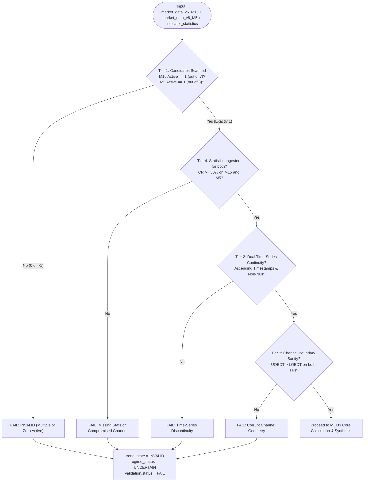

# MCD3 MANIFEST & WORK COMPLETION SPECIFICATION

**Module Name:** `mcd3_evaluator.py`  
**Test Suite:** `test_mcd3_unit_tests.py`  
**MCD ID:** `MCD3`  
**Description:** Consolidated Trend and EDT Stochastic Evaluator (Dual-Horizon Trend Alignment & Corridor Nesting)  
**Target Asset:** `XAUUSD`  
**Target Timeframes:** Dual-Timeframe Multi-Horizon: `M15` (Macro) & `M5` (Micro)  
**Target Architecture:** DavinTrade Stack D — Engine 1.5A (Discrete State Machine & Quality Gate)  
**Primary Consumer:** Claude Code (Stack D Master Builder & Code Auditor) / DavinTrade Ingestion Pipeline  
**Document Status:** `CERTIFIED & VERIFIED (100% PASS - 13/13 UNIT TESTS)`  
**Timestamp:** `2026-09-21 10:55:00 UTC` (Epoch: `1789962900`)

---

## 1. Executive Summary & Core Mandate

`MCD3` is the third certified discrete state evaluator of **Stack D (Engine 1.5A)**. Derived directly from the core principles established in `xauusd-m5-and-m15.png` and updated with the trader-intuitive **Standard Stochastic Formula**, `MCD3` resolves two fundamental multi-horizon market structure questions:

1. **"Does a Consolidated Trend currently exist between M15 and M5?"**  
   A Consolidated Trend is a strongly confirmed, multi-horizon market structure where Gold price is proven to be tenaciously governed by the unified trend across both time horizons.
2. **"If a Consolidated Trend exists, what is the EDT Stochastic position on the M15 corridor?"**  
   If the 3 strict conditions of Consolidated Trend are fulfilled, the **Standard EDT Stochastic** is calculated to pinpoint the exact normalized position ($0\% \dots 100\%$) of Gold price within the M15 corridor. If any condition is violated, a Consolidated Trend does NOT exist, and the EDT Stochastic is strictly **UNAVAILABLE** (`null`).

### Core Engineering Upgrades in this Release:

1. **Dual Candidate Isolation Mandate:**
   - M15: Strictly 1 active indicator out of the 7 Centroid variants from MCD1.
   - M5: Strictly 1 active indicator out of the 8 EDT indicators from MCD2 (7 Centroids + `fractal`).
   - Production mode strictly enforces `len(active) == 1` on each timeframe; any violation triggers `MCD3_INVALID`.
2. **The 3 Strict Conditions of Consolidated Trend:**
   - **Condition 1 (Trend Alignment):** M15 trend direction == M5 trend direction ($\pm 5.0^\circ$ deadband).
   - **Condition 2 (Historical Corridor Nesting):** M5 EDT corridor nested within M15 corridor for $\ge 75.0\%$ of M5 EDT Time Horizon ($T_{\text{EDT, M5}}$ bars).
   - **Condition 3 (Current Bar Complete Corridor Engulfment):** M5 corridor completely engulfed within M15 corridor at Bar 0.
3. **Standard EDT Stochastic Formulation:**
   $$\text{EDT Stochastic} = \left[ \frac{\text{M15 SSA}_{\text{current}} - \text{M15 LOEDT}_{\text{current}}}{\text{M15 UOEDT}_{\text{current}} - \text{M15 LOEDT}_{\text{current}}} \right] \times 100$$
   - $0.0\%$ at LOEDT (Oversold / Deep Value Zone)
   - $50.0\%$ at Corridor Center (Equilibrium)
   - $100.0\%$ at UOEDT (Overbought / Climax Ceiling)
4. **Conditional Execution Gate:** If `is_consolidated_trend == False`, EDT Stochastic is strictly `null` (Unavailable) to protect traders from erroneous execution.
5. **Zero-Hallucination Canonical English:** Deterministic parameterized templates ensure 100% mathematical auditability.

---

## 2. Upstream Data Contract & Input Dependencies

`MCD3` consumes data from three sheets in [market_data_v6_replicated.xlsx](file:///d:/SaaS%20Project/trading-alerts-saas-public/davintrade-stack-d-and-e/engine-1-5-new/market_data_v6_replicated.xlsx):

### A. Macro Time-Series: `market_data_v6_M15`

- **Cadence:** 900-second bar boundaries.
- **Permitted Candidates (7 Centroids):** `best_fit_a`, `best_fit_b`, `cherry_a`, `cherry_b`, `most_recent`, `non_a`, `non_b`.
- **Fields Ingested:** `timestamp`, `close`, `{active}_ssa`, `{active}_uoedt`, `{active}_loedt`.

### B. Micro Time-Series: `market_data_v6_M5`

- **Cadence:** 300-second bar boundaries.
- **Permitted Candidates (8 EDT Indicators):** 7 Centroids + `fractal`.
- **Fields Ingested:** `timestamp`, `close`, `{active}_ssa` (or `close` for fractal), `{active}_uoedt`, `{active}_loedt`.

### C. Statistics Store: `indicator_statistics`

- **Filter:** `symbol == 'XAUUSD'` for M15 and M5 records.
- **Fields Ingested:** `regression_angle`, `containment_rate` ($\ge 50\%$), `containment_n` ($T_{\text{EDT}}$).

---

## 3. 4-Tier Comprehensive Pre-Flight Validation



---

## 4. Mathematical Formulation & The 3 Strict Conditions

### Condition 1: Trend Direction Alignment

$$\text{trend\_alignment} = (\text{m15\_trend} == \text{m5\_trend})$$

$$
\text{trend}(\theta) = \begin{cases}
\text{UPTREND} & \text{if } \theta > +5.0^\circ \\
\text{DOWNTREND} & \text{if } \theta < -5.0^\circ \\
\text{SIDEWAYS} & \text{if } |\theta| \le 5.0^\circ
\end{cases}
$$

### Condition 2: Historical Multi-Horizon Corridor Nesting ($\ge 75.0\%$)

Timestamp lookup via backward as-of search: $\text{M15\_Bar}(t_i) = \max \{ t_{\text{M15}} \le t_i \}$.
$$\text{is\_nested}(t_i) = (\text{M5\_LOEDT}_i \ge \text{M15\_LOEDT}_i) \land (\text{M5\_UOEDT}_i \le \text{M15\_UOEDT}_i)$$
$$\text{Condition 2} = \left( \frac{\sum_{i=0}^{T_{\text{EDT, M5}} - 1} \mathbb{I}(\text{is\_nested}(t_i))}{T_{\text{EDT, M5}}} \times 100\% \ge 75.0\% \right)$$

### Condition 3: Current Bar Complete Corridor Engulfment (Bar 0)

$$\text{Condition 3} = (\text{M5\_LOEDT}_{\text{curr}} \ge \text{M15\_LOEDT}_{\text{curr}}) \land (\text{M5\_UOEDT}_{\text{curr}} \le \text{M15\_UOEDT}_{\text{curr}})$$

### Consolidated Trend Flag:

$$\text{is\_consolidated\_trend} = \text{Condition 1} \land \text{Condition 2} \land \text{Condition 3}$$

### Standard EDT Stochastic Formula:

$$
\text{EDT Stochastic} = \begin{cases}
\left[ \dfrac{\text{M15 SSA}_{\text{current}} - \text{M15 LOEDT}_{\text{current}}}{\text{M15 UOEDT}_{\text{current}} - \text{M15 LOEDT}_{\text{current}}} \right] \times 100 & \text{if } \text{is\_consolidated\_trend} == \text{True} \\
\text{None (Unavailable)} & \text{if } \text{is\_consolidated\_trend} == \text{False}
\end{cases}
$$

---

## 5. Discrete State Synthesis Matrix (10 Discrete States + Invalid)

### Group 1: Consolidated Trend Confirmed (All 3 Conditions Passed)

_Standard EDT Stochastic calculated ($0\% \dots 100\%$):_

#### 🟢 Category A: Bullish Consolidated Trend (M15 Uptrend + M5 Uptrend)

| Discrete State Code   | Stochastic Zone                                | `regime_status`                    | Tactical Bias & Market Implication                                                                                 |
| :-------------------- | :--------------------------------------------- | :--------------------------------- | :----------------------------------------------------------------------------------------------------------------- |
| **`MCD3_BULL_VALUE`** | Value / Oversold ($\le 20.0\%$)                | `BULLISH_CONSOLIDATED_VALUE_ZONE`  | **HIGH_CONVICTION_BUY_DIP:** Macro uptrend firmly intact. M15 SSA resting near LOEDT floor. Prime Buy entry point. |
| **`MCD3_BULL_MID`**   | Equilibrium ($20.0\% < \text{Stoch} < 80.0\%$) | `BULLISH_CONSOLIDATED_EQUILIBRIUM` | **HOLD_BULLISH_TREND_RUNNER:** Uptrend progressing stably through corridor center.                                 |
| **`MCD3_BULL_TOP`**   | Overbought ($\ge 80.0\%$)                      | `BULLISH_CONSOLIDATED_OVERBOUGHT`  | **CAUTION_TAKE_PROFIT_BUY:** SSA testing UOEDT ceiling. High risk of pullback; do not chase.                       |

#### 🔴 Category B: Bearish Consolidated Trend (M15 Downtrend + M5 Downtrend)

| Discrete State Code     | Stochastic Zone                                | `regime_status`                     | Tactical Bias & Market Implication                                                                                         |
| :---------------------- | :--------------------------------------------- | :---------------------------------- | :------------------------------------------------------------------------------------------------------------------------- |
| **`MCD3_BEAR_PREMIUM`** | Premium / Overbought ($\ge 80.0\%$)            | `BEARISH_CONSOLIDATED_PREMIUM_ZONE` | **HIGH_CONVICTION_SELL_RALLY:** Macro downtrend firmly intact. M15 SSA rallied near UOEDT ceiling. Prime Sell entry point. |
| **`MCD3_BEAR_MID`**     | Equilibrium ($20.0\% < \text{Stoch} < 80.0\%$) | `BEARISH_CONSOLIDATED_EQUILIBRIUM`  | **HOLD_BEARISH_TREND_RUNNER:** Downtrend progressing stably through corridor center.                                       |
| **`MCD3_BEAR_BOTTOM`**  | Oversold ($\le 20.0\%$)                        | `BEARISH_CONSOLIDATED_OVERSOLD`     | **CAUTION_TAKE_PROFIT_SELL:** SSA testing LOEDT floor. High risk of technical bounce; do not chase.                        |

#### 🟡 Category C: Sideways Consolidated Trend (M15 Sideways + M5 Sideways)

| Discrete State Code             | Stochastic Zone                              | `regime_status`                     | Tactical Bias & Market Implication                                                              |
| :------------------------------ | :------------------------------------------- | :---------------------------------- | :---------------------------------------------------------------------------------------------- |
| **`MCD3_SIDEWAYS_EQUILIBRIUM`** | In Corridor ($0 \le \text{Stoch} \le 100\%$) | `SIDEWAYS_CONSOLIDATED_EQUILIBRIUM` | **RANGE_BOUND_MEAN_REVERSION:** Both horizons horizontal. Mean reversion within channel bounds. |

---

### Group 2: Non-Consolidated Trend (Condition 1, 2, or 3 Failed)

_EDT Stochastic is strictly **`null` (Unavailable)**:_

| Discrete State Code                        | Failed Condition   | `regime_status`                 | Tactical Bias         |
| :----------------------------------------- | :----------------- | :------------------------------ | :-------------------- |
| **`MCD3_NON_CONSOLIDATED_TREND_CONFLICT`** | Condition 1 Failed | `TREND_MISALIGNMENT`            | `NEUTRAL_STAND_ASIDE` |
| **`MCD3_NON_CONSOLIDATED_OVERFLOW`**       | Condition 2 Failed | `INSUFFICIENT_CORRIDOR_NESTING` | `NEUTRAL_STAND_ASIDE` |
| **`MCD3_NON_CONSOLIDATED_ESCAPE`**         | Condition 3 Failed | `CURRENT_CORRIDOR_ESCAPE`       | `NEUTRAL_STAND_ASIDE` |

---

### Group 3: Data Pipeline Violation (`INVALID`)

| Discrete State Code | Failure Source      | `regime_status` | Tactical Bias         |
| :------------------ | :------------------ | :-------------- | :-------------------- |
| **`MCD3_INVALID`**  | Pre-Flight Tier 1-4 | `UNCERTAIN`     | `NEUTRAL_STAND_ASIDE` |

---

## 6. Deliverables Inventory & Test Audit Trail

All 6 production-grade deliverables are located in:
`davintrade-stack-d-and-e/engine-1-5-new/mcd3/`

| Filename                                                                                                                                                               | Type            | Size   | Status         | Verification Check                                    |
| :--------------------------------------------------------------------------------------------------------------------------------------------------------------------- | :-------------- | :----- | :------------- | :---------------------------------------------------- |
| [mcd3_implementation_plan.md](file:///d:/SaaS%20Project/trading-alerts-saas-public/davintrade-stack-d-and-e/engine-1-5-new/mcd3/mcd3_implementation_plan.md)           | Markdown        | ~12 KB | Approved       | Implementation blueprint in English                   |
| [mcd3_evaluator.py](file:///d:/SaaS%20Project/trading-alerts-saas-public/davintrade-stack-d-and-e/engine-1-5-new/mcd3/mcd3_evaluator.py)                               | Python Source   | ~34 KB | Production     | Zero-dependency, pure openpyxl, Windows-safe          |
| [test_mcd3_unit_tests.py](file:///d:/SaaS%20Project/trading-alerts-saas-public/davintrade-stack-d-and-e/engine-1-5-new/mcd3/test_mcd3_unit_tests.py)                   | Unit Test Suite | ~18 KB | **13/13 PASS** | 100% Pass Rate across all 13 test cases               |
| [mcd3_output.json](file:///d:/SaaS%20Project/trading-alerts-saas-public/davintrade-stack-d-and-e/engine-1-5-new/mcd3/mcd3_output.json)                                 | JSONB Payload   | ~2 KB  | Certified      | Real-world output on `market_data_v6_replicated.xlsx` |
| [mcd3.md](file:///d:/SaaS%20Project/trading-alerts-saas-public/davintrade-stack-d-and-e/engine-1-5-new/mcd3/mcd3.md)                                                   | Specification   | ~10 KB | Complete       | Technical architecture & mathematical derivation      |
| [mcd3-manifest-work-completion.md](file:///d:/SaaS%20Project/trading-alerts-saas-public/davintrade-stack-d-and-e/engine-1-5-new/mcd3/mcd3-manifest-work-completion.md) | Audit Manifest  | ~10 KB | Certified      | Formal hand-off specification                         |

### Unit Test Execution Output:

```
Ran 13 tests in 6.661s

OK
```

---

## 7. Downstream Integration Guide for Claude Code

> [!NOTE]
> **Strict Modular Isolation Mandate:**
> Per project directives, `MCD3` is implemented as an autonomous, self-contained discrete evaluator. Multi-MCD cross-synthesis and LLM trading recommendation rules will be formally orchestrated in the upcoming **Master Synthesis Phase** (Engine 1.5B/1.5C) after all individual MCD modules are complete. Refer to `MCD-SYNTHESIS-SCENARIOS-AND-LLM-TRADING-RECOMMENDATIONS-SEED-IDEA.md` for strategic context.
