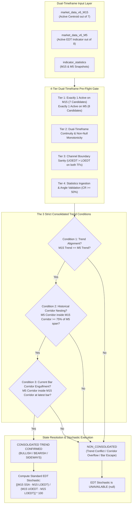
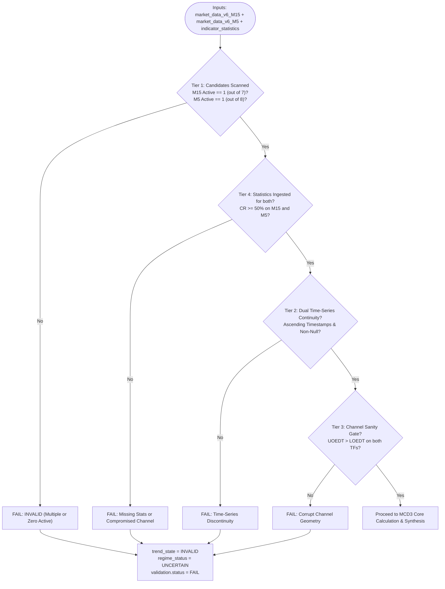

# MCD3 Specification: Consolidated Trend and EDT Stochastic Evaluator

**DavinTrade Architecture:** Stack D — Engine 1.5A Module  
**Asset:** `XAUUSD` | **Timeframes:** Dual-Timeframe Multi-Horizon: `M15` (Macro) & `M5` (Micro)  
**Evaluation Framework:** Dual-Horizon Linear Regression Alignment + Corridor Nesting Geometry + Standard EDT Stochastic  
**Status:** Certified & Production-Ready (13/13 Unit Tests Passing - 100% Pass)  
**Last Updated:** September 21, 2026 (Derivation from `xauusd-m5-and-m15.png` with Standard Stochastic Orientation)

---

## 1. Core Mandate & Multi-Horizon Principles

`MCD3` is the third discrete state evaluator module of **DavinTrade Stack D (Engine 1.5A)**. Derived directly from the core principles established in `xauusd-m5-and-m15.png` and calibrated with the trader-intuitive **Standard Stochastic Formula**, `MCD3` resolves two fundamental multi-horizon market structure questions:

1. **"Does a Consolidated Trend currently exist between M15 and M5?"**  
   A Consolidated Trend is a strongly confirmed, multi-horizon market structure where Gold price is proven to be tenaciously governed by the unified trend across both time horizons.
2. **"If a Consolidated Trend exists, what is the EDT Stochastic position on the M15 corridor?"**  
   If the 3 strict conditions of Consolidated Trend are fulfilled, the **Standard EDT Stochastic** is calculated to pinpoint the exact normalized position ($0\% \dots 100\%$) of Gold price within the M15 corridor. If any condition is violated, a Consolidated Trend does NOT exist, and the EDT Stochastic is strictly **UNAVAILABLE** (`null`).

---

## 2. Upstream Indicator Constraints & Dual Candidate Isolation

To ensure absolute mathematical integrity, MCD3 enforces candidate isolation and Single Active Indicator rules:

### A. M15 Indicator Pool (Strictly 7 Centroid Variants from MCD1)

Permitted candidates on M15:

1. `best_fit_a` (`best_fit_a_ssa`, `best_fit_a_uoedt`, `best_fit_a_loedt`, `best_fit_a_base_fl`)
2. `best_fit_b` (`best_fit_b_ssa`, `best_fit_b_uoedt`, `best_fit_b_loedt`, `best_fit_b_base_fl`)
3. `cherry_a` (`cherry_a_ssa`, `cherry_a_uoedt`, `cherry_a_loedt`, `cherry_a_base_fl`)
4. `cherry_b` (`cherry_b_ssa`, `cherry_b_uoedt`, `cherry_b_loedt`, `cherry_b_base_fl`)
5. `most_recent` (`most_recent_ssa`, `most_recent_uoedt`, `most_recent_loedt`, `most_recent_base_fl`)
6. `non_a` (`non_a_ssa`, `non_a_uoedt`, `non_a_loedt`, `non_a_base_fl`)
7. `non_b` (`non_b_ssa`, `non_b_uoedt`, `non_b_loedt`, `non_b_base_fl`)

- **Production Mandate:** Strictly **1 active indicator** out of these 7. If 0 or $>1$ active indicators exist on M15 in production, the evaluator throws `MCD3ValidationError` or flags status as `INVALID`.

### B. M5 Indicator Pool (Strictly 8 EDT Indicators from MCD2)

Permitted candidates on M5:

1. `best_fit_a` (`best_fit_a_ssa`, `best_fit_a_uoedt`, `best_fit_a_loedt`, `best_fit_a_base_fl`)
2. `best_fit_b` (`best_fit_b_ssa`, `best_fit_b_uoedt`, `best_fit_b_loedt`, `best_fit_b_base_fl`)
3. `cherry_a` (`cherry_a_ssa`, `cherry_a_uoedt`, `cherry_a_loedt`, `cherry_a_base_fl`)
4. `cherry_b` (`cherry_b_ssa`, `cherry_b_uoedt`, `cherry_b_loedt`, `cherry_b_base_fl`)
5. `most_recent` (`most_recent_ssa`, `most_recent_uoedt`, `most_recent_loedt`, `most_recent_base_fl`)
6. `non_a` (`non_a_ssa`, `non_a_uoedt`, `non_a_loedt`, `non_a_base_fl`)
7. `non_b` (`non_b_ssa`, `non_b_uoedt`, `non_b_loedt`, `non_b_base_fl`)
8. **`fractal`** (`fractal_best_fl`, `fractal_uoedt`, `fractal_loedt`, `close`) _(mapped to `source == 'fractal_edt'` in `indicator_statistics`)_

- **Production Mandate:** Strictly **1 active indicator** out of these 8. If 0 or $>1$ active indicators exist on M5 in production, the evaluator throws `MCD3ValidationError` or flags status as `INVALID`.

_(Developer test overrides `m15_target_indicator` and `m5_target_indicator` are supported to isolate testing against multi-indicator development workbooks)._

---

## 3. 4-Tier Dual-Timeframe Pre-Flight Quality Gate

- **Tier 1 (Candidate Isolation & Single Active Rule):**
  - M15: Enforces strictly 1 active indicator out of 7 with $\ge 96$ bars.
  - M5: Enforces strictly 1 active indicator out of 8 with $\ge 48$ bars.
- **Tier 2 (Dual Time-Series Continuity & Non-Null Monotonicity):**
  - Asserts $t_i > t_{i-1}$ with regular step ($900\text{s}$ on M15, $300\text{s}$ on M5).
  - Asserts non-null numeric values across evaluated arrays and confirms chronological time overlap.
- **Tier 3 (Dual Channel Boundary Sanity):**
  - Asserts $\text{UOEDT}_i > \text{LOEDT}_i$ on every evaluated bar for both M15 and M5 (zero inverted bands).
- **Tier 4 (Dual Statistics Ingestion):**
  - Verifies presence of record in `indicator_statistics` for both active indicators (`symbol='XAUUSD'`).
  - Asserts `containment_rate >= 50.0%` on both timeframes.

---

## 4. Mathematical Formulation & The 3 Strict Conditions

### Condition 1: Trend Direction Alignment

$$\text{trend\_alignment} = (\text{m15\_trend} == \text{m5\_trend})$$

$$
\text{trend}(\theta) = \begin{cases}
\text{UPTREND} & \text{if } \theta > +5.0^\circ \\
\text{DOWNTREND} & \text{if } \theta < -5.0^\circ \\
\text{SIDEWAYS} & \text{if } |\theta| \le 5.0^\circ
\end{cases}
$$

---

### Condition 2: Historical Multi-Horizon Corridor Nesting ($\ge 75.0\%$)

The M5 EDT corridor must reside within the M15 EDT corridor for at least **75.0%** of the M5 EDT Time Horizon ($T_{\text{EDT, M5}}$ bars):

For each M5 bar $t_i$, the corresponding active M15 candle is determined via backward as-of timestamp lookup:
$$\text{M15\_Bar}(t_i) = \max \big\{ \text{M15 bar at timestamp } t_{\text{M15}} \;\big|\; t_{\text{M15}} \le t_i \big\}$$

$$\text{is\_nested}(t_i) = \Big( \text{M5\_LOEDT}(t_i) \ge \text{M15\_LOEDT}(t_i) \Big) \;\land\; \Big( \text{M5\_UOEDT}(t_i) \le \text{M15\_UOEDT}(t_i) \Big)$$

$$\text{Condition 2} = \left( \frac{\sum_{i=0}^{T_{\text{EDT, M5}} - 1} \mathbb{I}(\text{is\_nested}(t_i))}{T_{\text{EDT, M5}}} \times 100\% \ge 75.0\% \right)$$

---

### Condition 3: Current Bar Complete Corridor Engulfment (Bar 0)

At the latest instantaneous bar:
$$\text{Condition 3} = \Big( \text{M5\_LOEDT}_{\text{curr}} \ge \text{M15\_LOEDT}_{\text{curr}} \Big) \;\land\; \Big( \text{M5\_UOEDT}_{\text{curr}} \le \text{M15\_UOEDT}_{\text{curr}} \Big)$$

---

### Consolidated Trend Flag:

$$\text{is\_consolidated\_trend} = \text{Condition 1} \;\land\; \text{Condition 2} \;\land\; \text{Condition 3}$$

---

### Formula for Standard EDT Stochastic (Conditional Execution):

$$
\text{EDT Stochastic} = \begin{cases}
\left[ \dfrac{\text{M15 SSA}_{\text{current}} - \text{M15 LOEDT}_{\text{current}}}{\text{M15 UOEDT}_{\text{current}} - \text{M15 LOEDT}_{\text{current}}} \right] \times 100 & \text{if } \text{is\_consolidated\_trend} == \text{True} \\
\text{None (Unavailable)} & \text{if } \text{is\_consolidated\_trend} == \text{False}
\end{cases}
$$

#### Intuitive Standard Stochastic Scale:

- **$0.0\%$ (LOEDT Floor):** Price/SSA resting at lower support floor (Oversold / Deep Value Zone).
- **$50.0\%$ (Corridor Midpoint):** Price/SSA resting at equilibrium center.
- **$100.0\%$ (UOEDT Ceiling):** Price/SSA resting at upper resistance ceiling (Overbought / Climax Zone).

---

## 5. Discrete State Synthesis Matrix (10 Discrete States + Invalid)

The evaluation results are categorized into **3 logical groups**:

### Group 1: Consolidated Trend Confirmed (All 3 Conditions Passed)

_Standard EDT Stochastic is calculated ($0\% \dots 100\%$):_

#### 🟢 Category A: Bullish Consolidated Trend (M15 Uptrend + M5 Uptrend)

| Discrete State Code   | Stochastic Zone                                | `regime_status`                    | Market Implication & Tactical Edge                                                                                              |
| :-------------------- | :--------------------------------------------- | :--------------------------------- | :------------------------------------------------------------------------------------------------------------------------------ |
| **`MCD3_BULL_VALUE`** | Value / Oversold ($\le 20.0\%$)                | `BULLISH_CONSOLIDATED_VALUE_ZONE`  | **Prime Buy Dip Opportunity:** Macro uptrend firmly intact. M15 SSA pulled back near LOEDT floor. Highest edge Buy entry point. |
| **`MCD3_BULL_MID`**   | Equilibrium ($20.0\% < \text{Stoch} < 80.0\%$) | `BULLISH_CONSOLIDATED_EQUILIBRIUM` | **Sweet Spot Continuation:** Uptrend progressing stably through corridor center. Hold long positions.                           |
| **`MCD3_BULL_TOP`**   | Overbought ($\ge 80.0\%$)                      | `BULLISH_CONSOLIDATED_OVERBOUGHT`  | **Caution / Take Profit:** SSA testing UOEDT ceiling. High risk of pullback; do not chase Buy orders.                           |

#### 🔴 Category B: Bearish Consolidated Trend (M15 Downtrend + M5 Downtrend)

| Discrete State Code     | Stochastic Zone                                | `regime_status`                     | Market Implication & Tactical Edge                                                                                                  |
| :---------------------- | :--------------------------------------------- | :---------------------------------- | :---------------------------------------------------------------------------------------------------------------------------------- |
| **`MCD3_BEAR_PREMIUM`** | Premium / Overbought ($\ge 80.0\%$)            | `BEARISH_CONSOLIDATED_PREMIUM_ZONE` | **Prime Sell Rally Opportunity:** Macro downtrend firmly intact. M15 SSA rallied near UOEDT ceiling. Highest edge Sell entry point. |
| **`MCD3_BEAR_MID`**     | Equilibrium ($20.0\% < \text{Stoch} < 80.0\%$) | `BEARISH_CONSOLIDATED_EQUILIBRIUM`  | **Sweet Spot Continuation:** Downtrend progressing stably through corridor center. Hold short positions.                            |
| **`MCD3_BEAR_BOTTOM`**  | Oversold ($\le 20.0\%$)                        | `BEARISH_CONSOLIDATED_OVERSOLD`     | **Caution / Take Profit:** SSA testing LOEDT floor. High risk of technical bounce; do not chase Sell orders.                        |

#### 🟡 Category C: Sideways Consolidated Trend (M15 Sideways + M5 Sideways)

| Discrete State Code             | Stochastic Zone                              | `regime_status`                     | Market Implication & Tactical Edge             |
| :------------------------------ | :------------------------------------------- | :---------------------------------- | :--------------------------------------------- | ------ | ------------------------------------------------------------------------------------- |
| **`MCD3_SIDEWAYS_EQUILIBRIUM`** | In Corridor ($0 \le \text{Stoch} \le 100\%$) | `SIDEWAYS_CONSOLIDATED_EQUILIBRIUM` | **Range Trading:** Both horizons horizontal ($ | \theta | \le 5.0^\circ$). M5 corridor nested inside M15. Mean reversion within channel bounds. |

---

### Group 2: Non-Consolidated Trend (Condition 1, 2, or 3 Failed)

_EDT Stochastic is strictly **`null` (Unavailable)** to prevent misleading signals:_

| Discrete State Code                        | Failed Condition   | `regime_status`                 | Market Implication                                                                                                                                            |
| :----------------------------------------- | :----------------- | :------------------------------ | :------------------------------------------------------------------------------------------------------------------------------------------------------------ |
| **`MCD3_NON_CONSOLIDATED_TREND_CONFLICT`** | Condition 1 Failed | `TREND_MISALIGNMENT`            | **Trend Conflict:** M15 and M5 slopes diverge (e.g. M15 Downtrend vs M5 Uptrend). Market horizons battling; unified structure absent.                         |
| **`MCD3_NON_CONSOLIDATED_OVERFLOW`**       | Condition 2 Failed | `INSUFFICIENT_CORRIDOR_NESTING` | **Insufficient Historical Nesting:** Slopes aligned, but M5 corridor historical nesting inside M15 corridor $< 75\%$. M5 volatility overflows macro corridor. |
| **`MCD3_NON_CONSOLIDATED_ESCAPE`**         | Condition 3 Failed | `CURRENT_CORRIDOR_ESCAPE`       | **Current Bar Breach:** Slopes aligned and nesting $\ge 75\%$, but latest M5 corridor breaches outside M15 corridor boundaries.                               |

---

### Group 3: Data Pipeline Violation (`INVALID`)

| Discrete State Code | Failure Source      | `regime_status` | System Action                                                                                                                                        |
| :------------------ | :------------------ | :-------------- | :--------------------------------------------------------------------------------------------------------------------------------------------------- |
| **`MCD3_INVALID`**  | Pre-Flight Tier 1-4 | `UNCERTAIN`     | **Data Pipeline Anomaly:** Multiple active indicators, discontinuous timestamps, inverted bands, or low containment rate ($< 50\%$). Aborts cleanly. |

---

## 6. Real-World Execution Results (`market_data_v6_replicated.xlsx`)

Executing `mcd3_evaluator.py` against the real dataset with active M15 Centroid (`non_b`) and active M5 EDT (`best_fit_a`):

- **Validation Status:** `PASS`
- **M15 Active Indicator:** `non_b` (Regression Angle: $-29.72^\circ \implies$ **`DOWNTREND`**, Containment Rate: $73.95\%$)
- **M5 Active Indicator:** `best_fit_a` (Regression Angle: $+6.94^\circ \implies$ **`UPTREND`**, Containment Rate: $55.76\%$)
- **Condition 1 (Trend Alignment):** `False` (Macro Downtrend vs Micro Uptrend)
- **Condition 2 (Corridor Nesting):** `False` ($0.0\%$ nesting rate across 755 bars)
- **Condition 3 (Current Bar Engulfment):** `False` (M5 corridor $[4350.22, 4384.28]$ outside M15 corridor $[4125.99, 4279.21]$)
- **Consolidated Trend Flag:** `False` (`NON_CONSOLIDATED`)
- **EDT Stochastic:** `None` (`UNAVAILABLE`)
- **Regime Status:** `TREND_MISALIGNMENT`
- **Discrete State Code:** `MCD3_NON_CONSOLIDATED_TREND_CONFLICT`
- **Tactical Bias:** `NEUTRAL_STAND_ASIDE`
