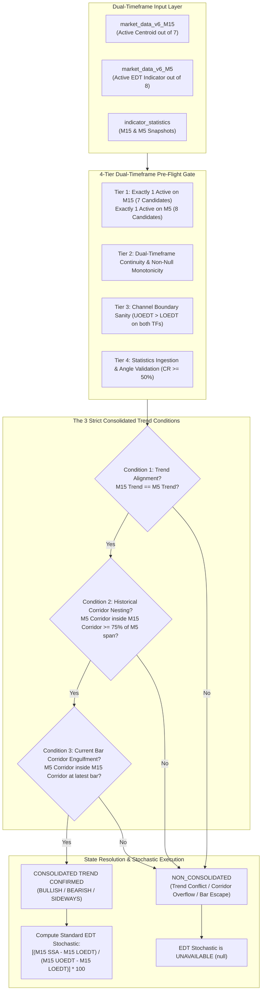
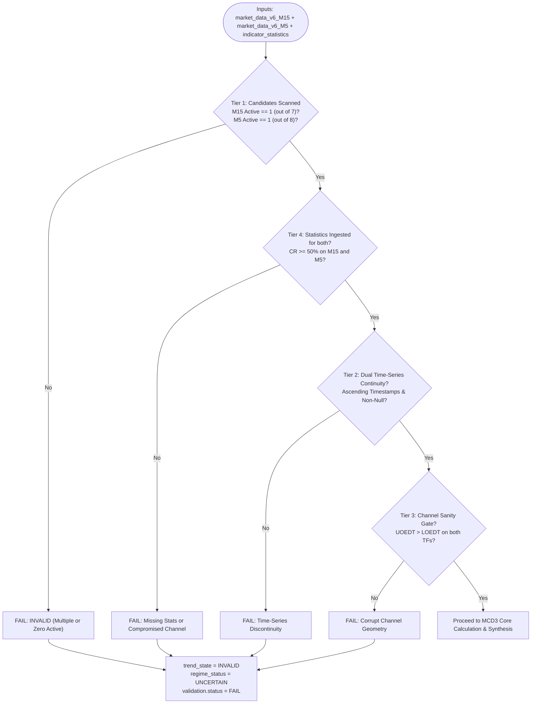

# MCD3 Implementation Plan: Consolidated Trend and EDT Stochastic Evaluator

_(Standard Stochastic Formulation, Dual-Timeframe 4-Tier Pre-Flight Quality Gate, and Multi-Horizon Interpretation Blueprint)_

**Module Name:** `mcd3_evaluator.py`  
**Test Suite:** `test_mcd3_unit_tests.py`  
**Target Asset:** `XAUUSD`  
**Target Timeframes:** Dual-Timeframe Multi-Horizon: `M15` (Macro Horizon) & `M5` (Micro Horizon)  
**Architecture Layer:** DavinTrade Stack D — Engine 1.5A Discrete State Evaluator  
**Primary Deliverables Directory:** `davintrade-stack-d-and-e/engine-1-5-new/mcd3/`  
**Author:** Antigravity (Pair Programming Partner)  
**Date:** September 21, 2026  
**Status:** Approved for Implementation

---

## 1. Executive Summary & Core Mandate

`MCD3` is the third discrete state evaluator module of **DavinTrade Stack D (Engine 1.5A)**. Derived directly from the core principles established in `xauusd-m5-and-m15.png` and calibrated with the trader-intuitive **Standard Stochastic Formula**, `MCD3` resolves two fundamental multi-horizon market structure questions:

1. **"Does a Consolidated Trend currently exist between M15 and M5?"**  
   A Consolidated Trend is a strongly confirmed, multi-horizon market structure where Gold price is proven to be tenaciously governed by the unified trend across both time horizons.
2. **"If a Consolidated Trend exists, what is the EDT Stochastic position on the M15 corridor?"**  
   If the 3 strict conditions of Consolidated Trend are fulfilled, the **Standard EDT Stochastic** is calculated to pinpoint the exact normalized position ($0\% \dots 100\%$) of Gold price within the M15 corridor. If any condition is violated, a Consolidated Trend does NOT exist, and the EDT Stochastic is strictly **UNAVAILABLE** (`null`).



---

## 2. Upstream Indicator Constraints & Dual Candidate Isolation

To ensure absolute mathematical integrity, MCD3 enforces the proven candidate pools and Single Active Indicator rules from MCD1 and MCD2:

### A. M15 Indicator Pool (Strictly the 7 Centroid Variants from MCD1)

Permitted candidates on M15:

1. `best_fit_a` (`best_fit_a_ssa`, `best_fit_a_uoedt`, `best_fit_a_loedt`, `best_fit_a_base_fl`)
2. `best_fit_b` (`best_fit_b_ssa`, `best_fit_b_uoedt`, `best_fit_b_loedt`, `best_fit_b_base_fl`)
3. `cherry_a` (`cherry_a_ssa`, `cherry_a_uoedt`, `cherry_a_loedt`, `cherry_a_base_fl`)
4. `cherry_b` (`cherry_b_ssa`, `cherry_b_uoedt`, `cherry_b_loedt`, `cherry_b_base_fl`)
5. `most_recent` (`most_recent_ssa`, `most_recent_uoedt`, `most_recent_loedt`, `most_recent_base_fl`)
6. `non_a` (`non_a_ssa`, `non_a_uoedt`, `non_a_loedt`, `non_a_base_fl`)
7. `non_b` (`non_b_ssa`, `non_b_uoedt`, `non_b_loedt`, `non_b_base_fl`)

- **Production Rule:** Strictly **1 active indicator** out of these 7. If 0 or $>1$ active indicators exist on M15 in production, the evaluator raises `MCD3ValidationError` or flags status as `INVALID`.

### B. M5 Indicator Pool (Strictly the 8 EDT Indicators from MCD2)

Permitted candidates on M5:

1. `best_fit_a` (`best_fit_a_ssa`, `best_fit_a_uoedt`, `best_fit_a_loedt`, `best_fit_a_base_fl`)
2. `best_fit_b` (`best_fit_b_ssa`, `best_fit_b_uoedt`, `best_fit_b_loedt`, `best_fit_b_base_fl`)
3. `cherry_a` (`cherry_a_ssa`, `cherry_a_uoedt`, `cherry_a_loedt`, `cherry_a_base_fl`)
4. `cherry_b` (`cherry_b_ssa`, `cherry_b_uoedt`, `cherry_b_loedt`, `cherry_b_base_fl`)
5. `most_recent` (`most_recent_ssa`, `most_recent_uoedt`, `most_recent_loedt`, `most_recent_base_fl`)
6. `non_a` (`non_a_ssa`, `non_a_uoedt`, `non_a_loedt`, `non_a_base_fl`)
7. `non_b` (`non_b_ssa`, `non_b_uoedt`, `non_b_loedt`, `non_b_base_fl`)
8. **`fractal`** (`fractal_best_fl`, `fractal_uoedt`, `fractal_loedt`, `close`) _(mapped to `source == 'fractal_edt'` in `indicator_statistics`)_

- **Production Rule:** Strictly **1 active indicator** out of these 8. If 0 or $>1$ active indicators exist on M5 in production, the evaluator raises `MCD3ValidationError` or flags status as `INVALID`.

_(Developer test overrides `m15_target_indicator` and `m5_target_indicator` are supported to allow isolated testing against multi-indicator mock workbooks)._

---

## 3. 4-Tier Dual-Timeframe Pre-Flight Quality Gate (Validation)



### Detailed Validation Rules:

1. **Tier 1 (Candidate Isolation & Single Active Rule):**
   - **M15:** Scans 7 Centroids. Enforces exactly 1 active indicator having valid data for $\ge 96$ bars.
   - **M5:** Scans 8 EDT indicators (7 Centroids + `fractal`). Enforces exactly 1 active indicator having valid data for $\ge 48$ bars.
   - Any violation triggers `validation.status = FAIL`.
2. **Tier 2 (Dual Time-Series Continuity & Non-Null Monotonicity):**
   - Asserts monotonic timestamps on M15 ($t_i > t_{i-1}$, step $= 900\text{s}$) and M5 ($t_i > t_{i-1}$, step $= 300\text{s}$).
   - Validates that historical price, SSA, UOEDT, and LOEDT contain zero NaN/null values.
   - Verifies chronological time range overlap between M15 and M5.
3. **Tier 3 (Dual Channel Boundary Sanity):**
   - Asserts $\text{UOEDT}_i > \text{LOEDT}_i$ on every evaluated bar for both M15 and M5.
   - Asserts positive non-zero corridor width $(\text{UOEDT}_i - \text{LOEDT}_i) > 0$.
4. **Tier 4 (Dual Statistics Ingestion & Channel Quality Integrity):**
   - Ingests latest statistics from `indicator_statistics` for both active indicators (`symbol='XAUUSD'`).
   - Asserts `containment_rate >= 50.0%` for both timeframes.
   - Ingests regression angles ($\theta$) and EDT time horizons ($T_{\text{EDT}}$).

---

## 4. Mathematical Formulation & The 3 Strict Conditions (Calculation)

### Condition 1: Trend Direction Alignment

The primary trend of M15 and M5 must share the exact same directional classification:
$$\text{trend\_alignment} = (\text{m15\_trend} == \text{m5\_trend})$$

Where trend classification on each timeframe is derived from `regression_angle` ($\theta$) with the standard $\pm 5.0^\circ$ deadband:

$$
\text{trend}(\theta) = \begin{cases}
\text{UPTREND} & \text{if } \theta > +5.0^\circ \\
\text{DOWNTREND} & \text{if } \theta < -5.0^\circ \\
\text{SIDEWAYS} & \text{if } |\theta| \le 5.0^\circ
\end{cases}
$$

- If both are `UPTREND` $\implies$ `BULLISH_ALIGNED` (Condition 1 = TRUE).
- If both are `DOWNTREND` $\implies$ `BEARISH_ALIGNED` (Condition 1 = TRUE).
- If both are `SIDEWAYS` $\implies$ `SIDEWAYS_ALIGNED` (Condition 1 = TRUE).
- If they differ $\implies$ `MISALIGNED` (Condition 1 = FALSE).

---

### Condition 2: Historical Multi-Horizon Corridor Nesting ($\ge 75.0\%$ of M5 EDT Length)

The M5 EDT corridor must reside within the M15 EDT corridor for at least **75.0%** of the M5 EDT Time Horizon length ($T_{\text{EDT, M5}}$ bars, read from `containment_n` of the active M5 indicator):

#### Timestamp Synchronization Strategy:

- M5 bars advance at 5-minute (300-second) intervals; M15 bars advance at 15-minute (900-second) intervals.
- For each M5 bar at timestamp $t_i$ ($i = 0 \dots T_{\text{EDT, M5}} - 1$), the corresponding active M15 corridor is determined via backward as-of timestamp matching:
  $$\text{M15\_Bar}(t_i) = \max \big\{ \text{M15 bar at timestamp } t_{\text{M15}} \;\big|\; t_{\text{M15}} \le t_i \big\}$$

#### Nesting Evaluation:

At each M5 bar $t_i$, the M5 corridor is nested inside M15 if and only if:
$$\text{is\_nested}(t_i) = \Big( \text{M5\_LOEDT}(t_i) \ge \text{M15\_LOEDT}(t_i) \Big) \;\land\; \Big( \text{M5\_UOEDT}(t_i) \le \text{M15\_UOEDT}(t_i) \Big)$$

The historical nesting percentage is:
$$\text{Corridor Nesting Rate} = \frac{\sum_{i=0}^{T_{\text{EDT, M5}} - 1} \mathbb{I}(\text{is\_nested}(t_i))}{T_{\text{EDT, M5}}} \times 100\%$$

$$\text{Condition 2} = (\text{Corridor Nesting Rate} \ge 75.0\%)$$

---

### Condition 3: Current Bar Complete Corridor Engulfment (Instantaneous Bar 0)

At the latest (current) bar, the M5 corridor must be **completely engulfed inside** the M15 corridor:
$$\text{Condition 3} = \Big( \text{M5\_LOEDT}_{\text{curr}} \ge \text{M15\_LOEDT}_{\text{curr}} \Big) \;\land\; \Big( \text{M5\_UOEDT}_{\text{curr}} \le \text{M15\_UOEDT}_{\text{curr}} \Big)$$

---

### Consolidated Trend State Synthesis:

$$\text{is\_consolidated\_trend} = \text{Condition 1} \;\land\; \text{Condition 2} \;\land\; \text{Condition 3}$$

- If `is_consolidated_trend == True`:
  - If both `UPTREND` $\implies$ **`BULLISH_CONSOLIDATED`**
  - If both `DOWNTREND` $\implies$ **`BEARISH_CONSOLIDATED`**
  - If both `SIDEWAYS` $\implies$ **`SIDEWAYS_CONSOLIDATED`**
- If `is_consolidated_trend == False`:
  - State is **`NON_CONSOLIDATED`**

---

### Formula for Standard EDT Stochastic (Conditional Execution):

$$
\text{EDT Stochastic} = \begin{cases}
\left[ \dfrac{\text{M15 SSA}_{\text{current}} - \text{M15 LOEDT}_{\text{current}}}{\text{M15 UOEDT}_{\text{current}} - \text{M15 LOEDT}_{\text{current}}} \right] \times 100 & \text{if } \text{is\_consolidated\_trend} == \text{True} \\
\text{None (Unavailable)} & \text{if } \text{is\_consolidated\_trend} == \text{False}
\end{cases}
$$

#### Intuitive Standard Stochastic Scale:

- **$0.0\%$ (LOEDT Floor):** Price/SSA is resting at the absolute lower support floor of the M15 corridor (Oversold / Deep Value Zone).
- **$50.0\%$ (Corridor Midpoint):** Price/SSA is resting at the exact equilibrium center of the M15 corridor.
- **$100.0\%$ (UOEDT Ceiling):** Price/SSA is resting at the absolute upper resistance ceiling of the M15 corridor (Overbought / Climax Zone).

---

## 5. Discrete State Synthesis Matrix (Interpretation)

The evaluation results are structured into **3 logical groups**:

### Group 1: Consolidated Trend Confirmed (All 3 Conditions Passed)

_Standard EDT Stochastic is calculated ($0\% \dots 100\%$):_

#### 🟢 Category A: Bullish Consolidated Trend (M15 Uptrend + M5 Uptrend)

| Discrete State Code   | Stochastic Zone                                | `regime_status`                    | Market Implication & Tactical Edge                                                                                              |
| :-------------------- | :--------------------------------------------- | :--------------------------------- | :------------------------------------------------------------------------------------------------------------------------------ |
| **`MCD3_BULL_VALUE`** | Value / Oversold ($\le 20.0\%$)                | `BULLISH_CONSOLIDATED_VALUE_ZONE`  | **Prime Buy Dip Opportunity:** Macro uptrend firmly intact. M15 SSA pulled back near LOEDT floor. Highest edge Buy entry point. |
| **`MCD3_BULL_MID`**   | Equilibrium ($20.0\% < \text{Stoch} < 80.0\%$) | `BULLISH_CONSOLIDATED_EQUILIBRIUM` | **Sweet Spot Continuation:** Uptrend progressing stably through corridor center. Hold long positions.                           |
| **`MCD3_BULL_TOP`**   | Overbought ($\ge 80.0\%$)                      | `BULLISH_CONSOLIDATED_OVERBOUGHT`  | **Caution / Take Profit:** SSA testing UOEDT ceiling. High risk of pullback; do not chase Buy orders.                           |

#### 🔴 Category B: Bearish Consolidated Trend (M15 Downtrend + M5 Downtrend)

| Discrete State Code     | Stochastic Zone                                | `regime_status`                     | Market Implication & Tactical Edge                                                                                                  |
| :---------------------- | :--------------------------------------------- | :---------------------------------- | :---------------------------------------------------------------------------------------------------------------------------------- |
| **`MCD3_BEAR_PREMIUM`** | Premium / Overbought ($\ge 80.0\%$)            | `BEARISH_CONSOLIDATED_PREMIUM_ZONE` | **Prime Sell Rally Opportunity:** Macro downtrend firmly intact. M15 SSA rallied near UOEDT ceiling. Highest edge Sell entry point. |
| **`MCD3_BEAR_MID`**     | Equilibrium ($20.0\% < \text{Stoch} < 80.0\%$) | `BEARISH_CONSOLIDATED_EQUILIBRIUM`  | **Sweet Spot Continuation:** Downtrend progressing stably through corridor center. Hold short positions.                            |
| **`MCD3_BEAR_BOTTOM`**  | Oversold ($\le 20.0\%$)                        | `BEARISH_CONSOLIDATED_OVERSOLD`     | **Caution / Take Profit:** SSA testing LOEDT floor. High risk of technical bounce; do not chase Sell orders.                        |

#### 🟡 Category C: Sideways Consolidated Trend (M15 Sideways + M5 Sideways)

| Discrete State Code             | Stochastic Zone                              | `regime_status`                     | Market Implication & Tactical Edge             |
| :------------------------------ | :------------------------------------------- | :---------------------------------- | :--------------------------------------------- | ------ | ------------------------------------------------------------------------------------- |
| **`MCD3_SIDEWAYS_EQUILIBRIUM`** | In Corridor ($0 \le \text{Stoch} \le 100\%$) | `SIDEWAYS_CONSOLIDATED_EQUILIBRIUM` | **Range Trading:** Both horizons horizontal ($ | \theta | \le 5.0^\circ$). M5 corridor nested inside M15. Mean reversion within channel bounds. |

---

### Group 2: Non-Consolidated Trend (Condition 1, 2, or 3 Failed)

_EDT Stochastic is strictly **`null` (Unavailable)** to prevent misleading signals:_

| Discrete State Code                        | Failed Condition   | `regime_status`                 | Market Implication                                                                                                                                            |
| :----------------------------------------- | :----------------- | :------------------------------ | :------------------------------------------------------------------------------------------------------------------------------------------------------------ |
| **`MCD3_NON_CONSOLIDATED_TREND_CONFLICT`** | Condition 1 Failed | `TREND_MISALIGNMENT`            | **Trend Conflict:** M15 and M5 slopes diverge (e.g. M15 Downtrend vs M5 Uptrend). Market horizons battling; unified structure absent.                         |
| **`MCD3_NON_CONSOLIDATED_OVERFLOW`**       | Condition 2 Failed | `INSUFFICIENT_CORRIDOR_NESTING` | **Insufficient Historical Nesting:** Slopes aligned, but M5 corridor historical nesting inside M15 corridor $< 75\%$. M5 volatility overflows macro corridor. |
| **`MCD3_NON_CONSOLIDATED_ESCAPE`**         | Condition 3 Failed | `CURRENT_CORRIDOR_ESCAPE`       | **Current Bar Breach:** Slopes aligned and nesting $\ge 75\%$, but latest M5 corridor breaches outside M15 corridor boundaries.                               |

---

### Group 3: Data Pipeline Violation (`INVALID`)

| Discrete State Code | Failure Source      | `regime_status` | System Action                                                                                                                                        |
| :------------------ | :------------------ | :-------------- | :--------------------------------------------------------------------------------------------------------------------------------------------------- |
| **`MCD3_INVALID`**  | Pre-Flight Tier 1-4 | `UNCERTAIN`     | **Data Pipeline Anomaly:** Multiple active indicators, discontinuous timestamps, inverted bands, or low containment rate ($< 50\%$). Aborts cleanly. |

---

## 6. Canonical English Commentary Templates (Zero-Hallucination)

- **`NON_CONSOLIDATED_TREND_CONFLICT`**:  
  `"XAUUSD multi-timeframe structure is NON_CONSOLIDATED due to trend conflict: M15 slope is {m15_trend} ({m15_angle:.2f}°) while M5 slope is {m5_trend} (+{m5_angle:.2f}°). Because the 3 strict conditions are not satisfied, a Consolidated Trend does not exist and EDT Stochastic is UNAVAILABLE."`
- **`NON_CONSOLIDATED_OVERFLOW`**:  
  `"XAUUSD multi-timeframe trends are aligned ({m15_trend}), but historical M5 corridor nesting within M15 corridor is {nesting_pct:.1f}%, which fails the strict 75.0% threshold requirement ({contained_bars}/{total_bars} bars). A Consolidated Trend cannot be confirmed and EDT Stochastic is UNAVAILABLE."`
- **`NON_CONSOLIDATED_ESCAPE`**:  
  `"XAUUSD multi-timeframe trends are aligned ({m15_trend}) with {nesting_pct:.1f}% historical nesting, but the M5 corridor on the current bar extends outside the M15 corridor boundaries (M5: [{m5_lo:.2f}, {m5_uo:.2f}] vs M15: [{m15_lo:.2f}, {m15_uo:.2f}]). A Consolidated Trend is not active and EDT Stochastic is UNAVAILABLE."`
- **`BULLISH_CONSOLIDATED_VALUE_ZONE`**:  
  `"XAUUSD has confirmed a BULLISH_CONSOLIDATED_TREND: M15 and M5 slopes are both UPTREND (+{m15_angle:.2f}° / +{m5_angle:.2f}°), M5 corridor nesting within M15 corridor is {nesting_pct:.1f}% (>= 75.0% threshold), and current M5 corridor is totally engulfed inside M15 corridor. Gold price is strongly confirmed to be under persistent bullish channel governance. Standard EDT Stochastic is {stoch:.2f}% (Oversold / Value Dip Zone near LOEDT)."`
- **`BULLISH_CONSOLIDATED_EQUILIBRIUM`**:  
  `"XAUUSD has confirmed a BULLISH_CONSOLIDATED_TREND: M15 and M5 slopes are both UPTREND (+{m15_angle:.2f}° / +{m5_angle:.2f}°), M5 corridor nesting within M15 corridor is {nesting_pct:.1f}% (>= 75.0% threshold), and current M5 corridor is totally engulfed inside M15 corridor. Gold price is strongly confirmed to be under persistent bullish channel governance. Standard EDT Stochastic is {stoch:.2f}% (Equilibrium Sweet Spot)."`
- **`BEARISH_CONSOLIDATED_PREMIUM_ZONE`**:  
  `"XAUUSD has confirmed a BEARISH_CONSOLIDATED_TREND: M15 and M5 slopes are both DOWNTREND ({m15_angle:.2f}° / {m5_angle:.2f}°), M5 corridor nesting within M15 corridor is {nesting_pct:.1f}% (>= 75.0% threshold), and current M5 corridor is totally engulfed inside M15 corridor. Gold price is strongly confirmed to be under persistent bearish channel governance. Standard EDT Stochastic is {stoch:.2f}% (Premium / Short Opportunity Zone near UOEDT)."`

---

## 7. DavinTrade Stack D JSONB Output Specification

```json
{
  "symbol": "XAUUSD",
  "timeframe": "M15_M5",
  "timestamp": "2026-09-20T23:55:00Z",
  "evaluator_version": "1.0.0",
  "module": "MCD3_CONSOLIDATED_TREND_AND_EDT_STOCHASTIC",
  "validation": {
    "status": "PASS",
    "tier1_active_indicators": {
      "m15": ["non_b"],
      "m5": ["best_fit_a"]
    },
    "tier2_continuity": "PASS",
    "tier3_sanity": "PASS",
    "tier4_statistics": "PASS"
  },
  "m15_metrics": {
    "active_indicator": "non_b",
    "trend_state": "DOWNTREND",
    "regression_angle": -29.72,
    "current_close": 4377.99,
    "current_ssa": 4377.33,
    "current_uoedt": 4443.37,
    "current_loedt": 4350.59,
    "containment_rate": 81.38,
    "edt_horizon_n": 336
  },
  "m5_metrics": {
    "active_indicator": "best_fit_a",
    "trend_state": "UPTREND",
    "regression_angle": 6.94,
    "current_close": 4377.99,
    "current_ssa": 4377.33,
    "current_uoedt": 4384.28,
    "current_loedt": 4350.22,
    "containment_rate": 55.76,
    "edt_horizon_n": 755
  },
  "consolidated_trend_conditions": {
    "condition_1_trend_aligned": false,
    "condition_2_historical_nesting_passed": false,
    "condition_2_nesting_rate_pct": 20.53,
    "condition_2_contained_bars": 155,
    "condition_2_total_bars": 755,
    "condition_3_current_bar_engulfed": false
  },
  "evaluation": {
    "is_consolidated_trend": false,
    "consolidated_trend_state": "NON_CONSOLIDATED",
    "edt_stochastic": null,
    "stochastic_zone": "UNAVAILABLE",
    "regime_status": "TREND_MISALIGNMENT",
    "discrete_state_code": "MCD3_NON_CONSOLIDATED_TREND_CONFLICT",
    "tactical_bias": "NEUTRAL_STAND_ASIDE"
  },
  "commentary": "XAUUSD multi-timeframe structure is NON_CONSOLIDATED due to trend conflict: M15 slope is DOWNTREND (-29.72°) while M5 slope is UPTREND (+6.94°). Because the 3 strict conditions are not satisfied, a Consolidated Trend does not exist and EDT Stochastic is UNAVAILABLE."
}
```

---

## 8. Comprehensive Unit Test Plan (`test_mcd3_unit_tests.py`)

1. `test_01_real_data_execution_non_consolidated`: Validates real execution on `market_data_v6_replicated.xlsx` (`non_b` on M15 + `best_fit_a` on M5). Verifies all 3 conditions fail, `is_consolidated_trend == False`, and `edt_stochastic is None`.
2. `test_02_synthetic_bullish_consolidated_value_zone`: Tests Bullish Consolidated with Stochastic $\le 20\%$ (near LOEDT).
3. `test_03_synthetic_bullish_consolidated_equilibrium`: Tests Bullish Consolidated with Stochastic in $20\% \dots 80\%$.
4. `test_04_synthetic_bullish_consolidated_overbought`: Tests Bullish Consolidated with Stochastic $\ge 80\%$ (near UOEDT).
5. `test_05_synthetic_bearish_consolidated_premium`: Tests Bearish Consolidated with Stochastic $\ge 80\%$ (near UOEDT).
6. `test_06_synthetic_bearish_consolidated_equilibrium`: Tests Bearish Consolidated in equilibrium.
7. `test_07_synthetic_bearish_consolidated_oversold`: Tests Bearish Consolidated with Stochastic $\le 20\%$ (near LOEDT).
8. `test_08_synthetic_sideways_consolidated`: Tests Sideways Consolidated.
9. `test_09_condition1_trend_conflict_failure`: Verifies Condition 1 failure triggers `NON_CONSOLIDATED_TREND_CONFLICT` and `edt_stochastic == None`.
10. `test_10_condition2_insufficient_nesting_failure`: Verifies nesting rate $< 75\%$ triggers `NON_CONSOLIDATED_OVERFLOW`.
11. `test_11_condition3_current_bar_escape_failure`: Verifies current bar escape triggers `NON_CONSOLIDATED_ESCAPE`.
12. `test_12_tier1_strict_multi_indicator_error`: Verifies multiple indicators on either TF triggers `INVALID`.
13. `test_13_tier3_and_tier4_channel_and_stats_failures`: Verifies corrupt channel geometry and low containment rate handling.
