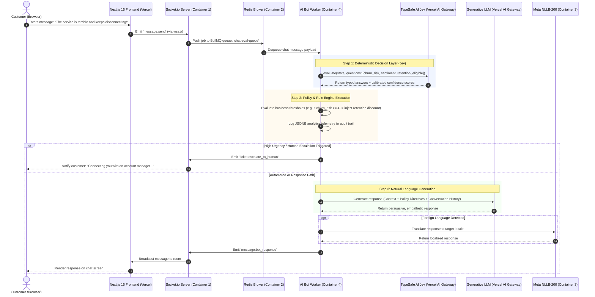

# Technical Architecture Blueprint: Jev-Integrated Intelligent Customer Support Web Chat System

**Document Version:** 1.0.0  
**Target Infrastructure:** 2-Host Distributed Architecture (Vercel + Contabo VPS)  
**Core Stack:** Next.js 16, Socket.io, Redis 7, Meta NLLB-200, BullMQ, TypeSafe AI Jev, Generative LLMs

---

## 1. Executive Summary & Vision

Traditional Large Language Model (LLM) customer support bots suffer from three fundamental production vulnerabilities:

1. **Unpredictable Policy Hallucination:** Relying purely on generative models to interpret complex business rules often leads to unauthorized discounts, faulty commitments, or missed cancellations.
2. **High Latency & High Inference Costs:** Passing full prompt chains and conversational histories through heavy generative models repeatedly to extract intent and sentiment creates unacceptable latency and bloated API bills.
3. **Absence of Calibrated Confidence:** Generative LLMs cannot natively output reliable, calibrated mathematical probabilities for decision thresholds.

This blueprint documents an enterprise-grade **Two-Tier AI Architecture** for the existing customer support web chat stack. By integrating **TypeSafe AI's Jev** via **Vercel AI Gateway**, the system decouples **Deterministic Decision Making** from **Natural Language Generation**:

- **Tier 1 (Decision Layer - Jev):** Rapidly converts unstructured customer messages into strongly typed, zero-shot structured telemetry (Boolean, Numeric Score, and Categorical Choice) alongside statistical confidence metrics.
- **Tier 2 (Generation Layer - LLM):** Ingests structured directives and business policies synthesized by the backend to produce empathetic, brand-aligned, and persuasive customer responses.

---

## 2. Phased Implementation Strategy & Roadmap

To ensure low development risk and high operational stability, this architecture follows a disciplined, two-stage rollout plan:

```
┌───────────────────────────────────────────────────────────┐
│ Phase 1: Foundational MVP Stack (Current Focus)           │
│ • Next.js 16 Frontend + Socket.io Server + Redis Broker   │
│ • Meta NLLB-200 Microservice + Baseline Pure LLM Worker   │
│ • Objective: Solidify real-time pipeline & latency        │
└─────────────────────────────┬─────────────────────────────┘
                              │
                              ▼ (Stable Baseline Established)
┌───────────────────────────────────────────────────────────┐
│ Phase 2: Jev Layer Integration (Planned Post-MVP Horizon) │
│ • Plug TypeSafe AI Jev into Container 4 (ai_bot_worker)   │
│ • Primary Objective 1: Eliminate LLM Hallucination        │
│ • Primary Objective 2: Enforce Laser-Focused Responses    │
│ • Primary Objective 3: Calibrated Human-in-the-Loop       │
└───────────────────────────────────────────────────────────┘
```

### 2.1 Phase 1: Foundational MVP (Current Target)

- **Scope:** Complete and stabilize the decoupled core stack:
  1. Next.js 16 frontend hosted on Vercel with real-time WebSocket state management.
  2. Contabo Ubuntu 24.04 Docker cluster hosting `socket_chat_server`, `redis_broker`, `nllb_api`, and a baseline generative LLM worker.
- **Milestone Criteria:** Zero socket dropouts, resilient message delivery via Redis BullMQ, and sub-second translation through Meta NLLB-200.
- **Rationale:** Establishes real-world conversational data and benchmarks before adding additional cognitive layers.

### 2.2 Phase 2: Post-MVP Jev Layer Extension (Strategic Evolution)

Following the successful deployment of Phase 1, the Jev evaluation layer will be activated inside Container 4 (`ai_bot_worker`) to resolve core LLM operational deficits:

1. **Elimination of LLM Hallucination & Fabrication:**
   - In pure LLM architectures, models frequently hallucinate refund policies, fabricate technical capabilities, or promise unauthorized concessions when pressed by difficult customers.
   - Jev intercepts the raw text upstream and extracts mathematical ground truth (`Boolean`, `Choice`, `Score`) based strictly on hard business rubrics. The generative LLM is never allowed to make autonomous policy decisions.
2. **Enforcement of Laser-Focused, On-Topic Responses:**
   - Unconstrained generative models tend to over-explain, wander off-topic, or respond defensively to frustrated customers.
   - Jev's typed classification feeds directly into deterministic backend `if-else` blocks, which inject concrete, bounded directives into the LLM system prompt (e.g., _"Acknowledge frustration in under 2 sentences, offer code SAVE30, and request order number only. Do not engage in technical speculation."_).
3. **Zero Architectural Disruption:**
   - Because the system architecture already encapsulates AI processing inside Container 4 (`ai_bot_worker`), implementing Phase 2 requires **zero rewrites** of the Next.js UI, Socket.io networking, or Redis broker. It is a seamless drop-in code enhancement inside the worker job handler.

---

## 3. System Topology & Infrastructure Layout

The entire production stack is orchestrated across **two hosting targets**, minimizing operational complexity while eliminating inter-cloud network hops for the compute-intensive chat pipeline.

```
┌────────────────────────────────────────────────────────┐
│               1. Vercel Cloud Platform                 │
│                                                        │
│  ┌──────────────────────────────────────────────────┐  │
│  │ Next.js 16 Frontend Web Application              │  │
│  │ • Client Web Chat Widget                         │  │
│  │ • Vercel AI Gateway Client / Proxy Routing       │  │
│  └──────────────────────────────────────────────────┘  │
└───────────────────────────┬────────────────────────────┘
                            │ HTTPS / Secure WebSockets (wss://)
                            │ Terminated via Nginx / Caddy / Cloudflare Tunnel
                            ▼
┌────────────────────────────────────────────────────────┐
│           2. Contabo VPS (Ubuntu 24.04 LTS)            │
│               Docker Bridge Network: saas_chat_net     │
│                                                        │
│  ┌────────────────────────┐  ┌──────────────────────┐  │
│  │ Container 1            │  │ Container 2          │  │
│  │ socket_chat_server     │  │ redis_broker         │  │
│  │ (Node.js / Socket.io)  │  │ (Redis 7 Alpine)     │  │
│  └───────────┬────────────┘  └──────────┬───────────┘  │
│              │                          │              │
│              │ Internal Bridge Traffic  │              │
│              ▼                          ▼              │
│  ┌────────────────────────┐  ┌──────────────────────┐  │
│  │ Container 3            │  │ Container 4          │  │
│  │ nllb_api               │  │ ai_bot_worker        │  │
│  │ (Meta NLLB-200 FastAPI)│  │ (BullMQ Worker)      │  │
│  └────────────────────────┘  └──────────┬───────────┘  │
└─────────────────────────────────────────┼──────────────┘
                                          │
                                          │ HTTPS / REST (Outbound)
                                          ▼
                      ┌────────────────────────────────────────┐
                      │            Vercel AI Gateway           │
                      │                                        │
                      │  ├── TypeSafe AI Jev (Decision Model)  │
                      │  └── Generative LLM (Claude / GPT)     │
                      └────────────────────────────────────────┘
```

---

## 4. End-to-End Processing Workflow



---

## 5. Component Breakdown & Functional Roles

### 5.1 Next.js 16 Frontend (Vercel)

- Hosts the responsive customer support UI widget and agent dashboard.
- Maintains persistent, secure WebSocket connections (`wss://`) terminated by the reverse proxy on Contabo.
- Provides immediate optimistic UI updates while asynchronous AI tasks process in the background.

### 5.2 Socket.io Chat Server (`socket_chat_server`)

- Ingests incoming chat payloads, validates authentication tokens, and decouples real-time client traffic from AI processing.
- Offloads messages immediately into the Redis-backed BullMQ queue, ensuring zero socket blocking.

### 5.3 Redis Broker (`redis_broker`)

- Serves as the primary message bus for Socket.io horizontal scaling (`@socket.io/redis-adapter`).
- Manages reliable task queues, retries, and dead-letter queues (DLQ) for the `ai_bot_worker`.

### 5.4 Meta NLLB-200 Translation Service (`nllb_api`)

- Containerized FastAPI microservice utilizing `CTranslate2` optimized inference for Meta's `facebook/nllb-200-distilled-600M`.
- Provides low-latency, localized translation across 200+ languages directly inside the Docker bridge network.

### 5.5 AI Bot Worker (`ai_bot_worker`) - The Core Orchestrator

- Consumes events from the `chat-eval-queue`.
- Dispatches evaluation payloads to **TypeSafe AI's Jev** through Vercel AI Gateway.
- Applies deterministic business rules to Jev's typed outputs.
- Assembles dynamic system prompts and passes them to the downstream Generative LLM.

---

## 6. TypeSafe AI Jev Decision Engine Implementation

### 6.1 Why Jev in Customer Support?

Unlike generative LLMs that output text token-by-token, Jev evaluates multiple questions simultaneously and returns typed results directly:

- **Up to 193.6x faster** than traditional LLMs, adding virtually zero perceived latency (<50ms).
- **Up to 444.6x cheaper**, allowing every single incoming customer turn to be evaluated without budget strain.
- **Deterministic Type Safety:** Delivers raw `Boolean`, `Choice`, and `Score` structures without JSON parsing issues or schema hallucinations.

### 6.2 TypeScript Implementation Sample (`ai_bot_worker`)

```typescript
import { experimental_evaluate as evaluate } from 'ai';

export interface CustomerEvaluationResult {
  sentiment: 'positive' | 'neutral' | 'frustrated' | 'angry';
  churnRisk: number; // 1 to 5
  intent: 'billing' | 'technical_issue' | 'cancellation' | 'general_query';
  eligibleForRetentionPromo: boolean;
  needsHumanIntervention: boolean;
}

export async function evaluateCustomerMessage(
  customerMessage: string,
  customerAccountTier: string
): Promise<{
  evaluations: CustomerEvaluationResult;
  confidence: Record<string, number>;
}> {
  const result = await evaluate({
    model: 'typesafe-ai/jev',
    state: {
      message: customerMessage,
      accountTier: customerAccountTier,
    },
    questions: {
      sentiment: {
        type: 'choice',
        options: ['positive', 'neutral', 'frustrated', 'angry'],
        instructions:
          'Determine the emotional sentiment expressed by the customer.',
      },
      churnRisk: {
        type: 'score',
        min: 1,
        max: 5,
        instructions:
          'Rate the probability that this customer will churn or cancel their subscription (1 = lowest risk, 5 = imminent cancellation).',
      },
      intent: {
        type: 'choice',
        options: [
          'billing',
          'technical_issue',
          'cancellation',
          'general_query',
        ],
        instructions: 'Categorize the core customer support intent.',
      },
      eligibleForRetentionPromo: {
        type: 'boolean',
        instructions:
          'Based on high churn risk or dissatisfaction, should this customer receive a retention incentive?',
      },
      needsHumanIntervention: {
        type: 'boolean',
        instructions:
          'Does this message convey abusive behavior, legal threats, or complex enterprise outage requirements necessitating human escalation?',
      },
    },
    providerOptions: {
      gateway: {
        zeroDataRetention: true, // Guarantees customer privacy
      },
    },
  });

  return {
    evaluations: {
      sentiment: result.answers
        .sentiment as CustomerEvaluationResult['sentiment'],
      churnRisk: Number(result.answers.churnRisk),
      intent: result.answers.intent as CustomerEvaluationResult['intent'],
      eligibleForRetentionPromo: Boolean(
        result.answers.eligibleForRetentionPromo
      ),
      needsHumanIntervention: Boolean(result.answers.needsHumanIntervention),
    },
    confidence: result.providerMetadata?.typesafe?.confidence || {},
  };
}
```

---

## 7. Business Logic & Dynamic Prompt Injection

Once the backend worker receives Jev's numeric/typed evaluation, standard deterministic code routes the execution path:

```typescript
// Sample Rule Engine inside Worker
const { evaluations, confidence } = await evaluateCustomerMessage(
  message,
  user.tier
);

// 1. Immediate Human Escalation Rule
if (
  evaluations.needsHumanIntervention &&
  (confidence.needsHumanIntervention ?? 1) > 0.85
) {
  await dispatchToHumanAgentQueue({ userId, message, evaluations });
  return;
}

// 2. Dynamic Behavioral Directive Synthesis
let policyDirective = '';

if (evaluations.churnRisk >= 4) {
  if (evaluations.eligibleForRetentionPromo) {
    policyDirective = `
[POLICY DIRECTIVE: CRITICAL RETENTION]
- The customer is exhibiting severe churn risk (Score: ${evaluations.churnRisk}/5).
- Acknowledge their frustrations with profound empathy and validate their concerns.
- Offer retention promotion code 'SAVE30' (30% off for 3 months).
- Do not make technical excuses. Focus on immediate resolution.
`;
  } else {
    policyDirective = `
[POLICY DIRECTIVE: DE-ESCALATION]
- The customer is exhibiting high frustration.
- Provide a clear, step-by-step diagnostic plan.
- Offer to schedule a priority follow-up with engineering.
`;
  }
} else {
  policyDirective = `
[POLICY DIRECTIVE: STANDARD ASSISTANCE]
- Provide concise, helpful, and cordial support regarding: ${evaluations.intent}.
`;
}

// 3. Dispatch to Generative LLM
const finalPrompt = `
System Context: You are an expert support specialist for our SaaS platform.
${policyDirective}

Customer Message: "${message}"
`;

const botReply = await callGenerativeLLM(finalPrompt);
```

---

## 8. Updated Production Docker Compose Configuration

The following updated `docker-compose.yml` integrates the **AI Bot Worker** into your Contabo Ubuntu 24.04 environment alongside Redis, NLLB-200, and Socket.io.

```yaml
version: '3.8'

services:
  # Container 1: Node.js Socket.io Chat Server
  chat_server:
    build:
      context: ./apps/server
      dockerfile: Dockerfile
    container_name: socket_chat_server
    restart: always
    ports:
      - '3001:3001' # Exposed for Nginx/Caddy reverse proxy termination
    environment:
      - PORT=3001
      - REDIS_URL=redis://redis:6379
      - NLLB_API_URL=http://nllb_api:8000
      - NODE_ENV=production
    depends_on:
      - redis
      - nllb_api
    networks:
      - saas_chat_net

  # Container 2: Redis Broker (Socket.io Cluster & BullMQ Queue)
  redis:
    image: redis:7-alpine
    container_name: redis_broker
    restart: always
    command: redis-server --save 60 1 --loglevel warning
    ports:
      - '127.0.0.1:6379:6379' # Localhost only for security
    volumes:
      - redis_data:/data
    networks:
      - saas_chat_net

  # Container 3: Meta NLLB-200 Translation Microservice
  nllb_api:
    image: ghcr.io/winstxnhdw/nllb-api:latest
    container_name: nllb_api
    restart: always
    environment:
      - MODEL_NAME=facebook/nllb-200-distilled-600M
      - USE_CTRANSLATE2=true
    ports:
      - '127.0.0.1:8000:8000' # Localhost only
    networks:
      - saas_chat_net

  # Container 4: AI Bot Worker (Jev Decision + LLM Generation)
  ai_bot_worker:
    build:
      context: ./apps/ai-worker
      dockerfile: Dockerfile
    container_name: ai_bot_worker
    restart: always
    environment:
      - REDIS_URL=redis://redis:6379
      - NLLB_API_URL=http://nllb_api:8000
      - VERCEL_AI_GATEWAY_URL=${VERCEL_AI_GATEWAY_URL}
      - VERCEL_AI_GATEWAY_API_KEY=${VERCEL_AI_GATEWAY_API_KEY}
      - TYPESAFE_AI_API_KEY=${TYPESAFE_AI_API_KEY}
      - LLM_MODEL=anthropic/claude-3-5-sonnet
      - NODE_ENV=production
    depends_on:
      - redis
      - nllb_api
    networks:
      - saas_chat_net

networks:
  saas_chat_net:
    driver: bridge

volumes:
  redis_data:
```

---

## 9. Strategic Business Advantages

| Metric / Capability            | Conventional Pure LLM Architecture                                  | Jev-Integrated Two-Tier Architecture                                    |
| :----------------------------- | :------------------------------------------------------------------ | :---------------------------------------------------------------------- |
| **Decision Latency**           | 1,200ms – 2,500ms                                                   | <50ms (Up to 193.6x faster evaluation)                                  |
| **Evaluation Cost**            | ~$0.01 – $0.03 per check                                            | ~$0.00004 (Up to 444.6x cheaper)                                        |
| **Business Policy Adherence**  | Probabilistic; prone to hallucinating unapproved discounts or rules | **100% Deterministic**; enforced via backend code & numeric scoring     |
| **Audit & Business Analytics** | Requires costly post-hoc NLP parsing of conversation transcripts    | **Instant Telemetry**; typed JSONB logs directly recorded to PostgreSQL |
| **Human-in-the-Loop Routing**  | Hard to define mathematical thresholds for escalation               | Built-in **Calibrated Confidence** enables strict routing triggers      |

---

## 10. References & Further Reading

1. **Vercel Official Launch Blog:**  
   [Jev is the fastest-adopted model in AI Gateway history](https://vercel.com/blog/ai-gateway-jev-model-launch)
2. **Vercel Changelog & SDK Release:**  
   [TypeSafe AI's Jev now available on AI Gateway](https://vercel.com/changelog/typesafe-ai-jev-now-available-on-ai-gateway)
3. **Vercel AI SDK `evaluate` Documentation:**  
   [Evaluation Models on AI Gateway](https://sdk.vercel.ai/docs/ai-sdk-core/evaluating-content)
4. **Codebase Foundation Repositories:**
   - Frontend & Socket Architecture: [IMRANDIL/Next_JS_Turbo_Repo_Scaleable_chat_APP](https://github.com/IMRANDIL/Next_JS_Turbo_Repo_Scaleable_chat_APP)
   - Translation Microservice: [winstxnhdw/nllb-api](https://github.com/winstxnhdw/nllb-api)
