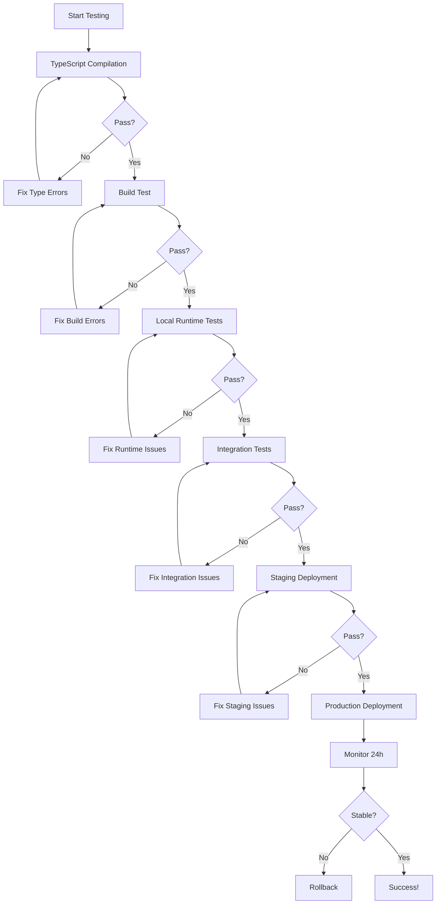

# Local Development & Prisma Upgrade Implementation Plan

## Trading Alerts SaaS Public

**Document Version:** 1.0  
**Created:** December 24, 2024  
**Status:** Deferred until Post-MVP  
**Estimated Effort:** 20-25 hours  
**Risk Level:** Medium

---

## Executive Summary

This document outlines a comprehensive plan to address technical debt accumulated from network restrictions preventing normal Prisma client generation during local development. While the current temporary solution (TypeScript type stubs) is adequate for MVP development, it creates maintenance overhead and testing limitations that will become increasingly problematic as the codebase grows.

**Implementation Timing:** This plan should be executed **AFTER** product-market fit has been validated, ideally when:

- You have 50+ active users
- Monthly revenue exceeds $1,000
- You're planning to hire additional developers
- A security vulnerability is announced in Prisma 4.x

**Recommendation:** Continue with MVP development using current workarounds. Revisit this plan in Q1 2025 or when the above conditions are met.

---

## Table of Contents

1. [Historical Context: The Original Problem](#historical-context)
2. [Current Temporary Solution](#current-temporary-solution)
3. [Technical Debt Analysis](#technical-debt-analysis)
4. [Phase 1: Local Development Setup](#phase-1-local-development-setup)
5. [Phase 2: Prisma Upgrade to 5.22.0](#phase-2-prisma-upgrade)
6. [Testing & Validation](#testing-validation)
7. [Rollback Plans](#rollback-plans)
8. [Timeline & Resource Allocation](#timeline-resources)
9. [Success Criteria](#success-criteria)
10. [Appendix: Commands Reference](#appendix)

---

## Historical Context: The Original Problem

### The Incident (December 23-24, 2024)

**Problem:** Pull Request #42 failed CI/CD pipeline with 157+ TypeScript compilation errors.

**Root Cause:**

- New `SystemConfig` and `SystemConfigHistory` models were added to `prisma/schema.prisma`
- Code referenced `prisma.systemConfig` and `prisma.systemConfigHistory`
- Prisma Client could not be generated due to network restrictions blocking `binaries.prisma.sh`
- Without generated Prisma Client, TypeScript had no type definitions for these models
- Result: `Property 'systemConfig' does not exist on type 'PrismaClient'` errors

**Affected Files:**

```
app/api/admin/settings/affiliate/route.ts (lines 86, 290, 302, 319)
app/api/config/affiliate/route.ts (line 54)
lib/affiliate/constants.ts (line 125)
+ 18 additional files in Part 19 disbursement system
```

**Error Examples:**

```typescript
// TypeScript Error: TS2339
const configs = await prisma.systemConfig.findMany({
                              ^^^^^^^^^^^^^
// Property 'systemConfig' does not exist on type 'PrismaClient'

await prisma.systemConfigHistory.create({
             ^^^^^^^^^^^^^^^^^^^
// Property 'systemConfigHistory' does not exist on type 'PrismaClient'
```

**Impact:**

- ❌ GitHub Actions workflow failed (Build Check, Integration Tests)
- ❌ Vercel deployment failed
- ❌ PR could not be merged
- ❌ Development blocked

### Network Restriction Details

**The Core Issue:**
The development environment cannot access `binaries.prisma.sh`, which Prisma uses to download platform-specific query engine binaries required for client generation.

**Normal Prisma Workflow (Unrestricted Environment):**

```bash
npx prisma generate
→ Reads schema.prisma
→ Downloads binaries from binaries.prisma.sh
→ Generates @prisma/client with full TypeScript types
→ Code compiles successfully
```

**Blocked Workflow (Restricted Environment):**

```bash
npx prisma generate
→ Reads schema.prisma
→ ❌ Cannot reach binaries.prisma.sh (network blocked)
→ ❌ No client generated
→ ❌ No TypeScript types available
→ ❌ Compilation fails
```

**Why Vercel Works:**

- Vercel's build infrastructure has unrestricted network access
- Prisma generates normally during Vercel builds
- Production deployments succeed
- Only local development is affected

---

## Current Temporary Solution

### What Claude Code Implemented (December 24, 2024)

Claude Code created a **manual TypeScript declaration file** to provide type definitions when Prisma cannot generate its client:

**File Created:** `types/prisma-stubs.d.ts` (705 lines)

**Contents:**

1. **Model Interfaces** - Type definitions for all database models:

   ```typescript
   interface User {
     id: string;
     email: string;
     name: string | null;
     // ... all fields
   }

   interface SystemConfig {
     key: string;
     value: string;
     valueType: string;
     category: string | null;
     description: string | null;
     updatedBy: string | null;
     updatedAt: Date;
     createdAt: Date;
   }
   ```

2. **PrismaClient Interface** - Main client with model delegates:

   ```typescript
   interface PrismaClient {
     user: UserDelegate;
     subscription: SubscriptionDelegate;
     alert: AlertDelegate;
     systemConfig: SystemConfigDelegate;
     systemConfigHistory: SystemConfigHistoryDelegate;
     // ... all models
   }
   ```

3. **Delegate Interfaces** - Query operations for each model:

   ```typescript
   interface SystemConfigDelegate {
     findMany(args?: any): Promise<SystemConfig[]>;
     findUnique(args: any): Promise<SystemConfig | null>;
     findFirst(args?: any): Promise<SystemConfig | null>;
     create(args: any): Promise<SystemConfig>;
     update(args: any): Promise<SystemConfig>;
     delete(args: any): Promise<SystemConfig>;
     upsert(args: any): Promise<SystemConfig>;
     count(args?: any): Promise<number>;
   }
   ```

4. **Prisma Namespace** - Input types for queries:
   ```typescript
   namespace Prisma {
     interface SystemConfigWhereInput {
       key?: string;
       value?: string;
       valueType?: string;
       category?: string | null;
       // ... filter fields
     }

     interface SystemConfigCreateInput {
       key: string;
       value: string;
       valueType: string;
       // ... creation fields
     }
   }
   ```

### Results

**Immediate Success:**

- ✅ TypeScript compilation passes (`pnpm tsc --noEmit`)
- ✅ Next.js build succeeds (`pnpm build`)
- ✅ GitHub Actions passes
- ✅ Vercel deployments succeed
- ✅ PR #42 can be merged

**Reduced Errors:** From 157 errors → 0 errors (in affected files)

### How It Works

```
Development Flow with Type Stubs:

schema.prisma (source of truth)
     ↓
     ↓ (npx prisma generate fails due to network)
     ↓
     ✗ No generated client

BUT TypeScript reads:
     ↓
types/prisma-stubs.d.ts (manual type declarations)
     ↓
TypeScript compiler sees types
     ↓
✓ Compilation succeeds

Production Flow (Vercel):

schema.prisma (source of truth)
     ↓
     ↓ (npx prisma generate succeeds - no network restrictions)
     ↓
     ✓ Real Prisma Client generated
     ↓
Vercel uses real client (ignores stubs)
     ↓
✓ Production deployment succeeds
```

---

## Technical Debt Analysis

### Current Workaround Creates Three Categories of Debt

#### 1. **Maintenance Debt (High Impact)**

**Problem:** Manual synchronization required between schema and stubs.

**Every time you modify `schema.prisma`, you must:**

```typescript
// Example: Adding a new field to SystemConfig

// 1. Update schema.prisma
model SystemConfig {
  key         String   @id
  value       String
  newField    String   // ← New field added
  // ...
}

// 2. Manually update types/prisma-stubs.d.ts
interface SystemConfig {
  key: string
  value: string
  newField: string  // ← Must add here too
  // ...
}

// 3. Update delegate input types
namespace Prisma {
  interface SystemConfigCreateInput {
    key: string
    value: string
    newField: string  // ← And here
  }
}
```

**Risk Scenarios:**

- 🔴 **Forgotten Update:** Add field to schema, forget to update stubs → TypeScript error in production (Vercel uses real schema)
- 🔴 **Type Mismatch:** Wrong type in stubs (`string` vs `string | null`) → Runtime errors
- 🟡 **New Model:** Add entire model to schema, forget stubs → Compilation fails
- 🟡 **Relation Changes:** Update model relations, miss delegate updates → Type errors

**Impact on Development Velocity:**

- **Without debt:** Change schema → `npx prisma generate` (5 seconds) → Done
- **With debt:** Change schema → Update interface → Update delegates → Update input types → Update relations (5-15 minutes)

**Multiplication Factor:** Every schema change takes 100x longer (5s → 5-15min)

#### 2. **Type Safety Debt (Medium Impact)**

**Problem:** Loose type definitions lose Prisma's strict type safety.

**Real Prisma Types (Strict):**

```typescript
// Generated by Prisma - knows exact schema
await prisma.user.findMany({
  where: {
    emaill: 'test@example.com', // ❌ TypeScript error
    // Property 'emaill' does not exist. Did you mean 'email'?
  },
  select: {
    id: true,
    invalidField: true, // ❌ TypeScript error
    // Property 'invalidField' does not exist in type User
  },
});
```

**Stub Types (Loose):**

```typescript
// Manual stubs use 'any' for simplicity
interface UserDelegate {
  findMany(args?: any): Promise<User[]>;
  //              ^^^^ - Accepts anything
}

// Result: TypeScript doesn't catch errors
await prisma.user.findMany({
  where: {
    emaill: 'test@example.com', // ✓ TypeScript accepts (wrong!)
  },
  select: {
    invalidField: true, // ✓ TypeScript accepts (wrong!)
  },
});
// Compiles fine, but fails at runtime
```

**Loss of Features:**

- ❌ No autocomplete for query options
- ❌ No type checking for `where` clauses
- ❌ No validation for `select` and `include`
- ❌ No relation type checking
- ❌ Missing Prisma's advanced type features (conditional types, branded types)

**Example of Lost Safety:**

```typescript
// With real Prisma (prevents bugs):
const user = await prisma.user.findUnique({
  where: { id: 123 }, // ❌ Error: id is string, not number
});

// With stubs (allows bugs):
const user = await prisma.user.findUnique({
  where: { id: 123 }, // ✓ Compiles (but crashes at runtime)
});
```

#### 3. **Testing Debt (High Impact)**

**Problem:** Limited local testing capabilities.

**Local Development Limitations:**

| Capability               | With Real Prisma Client | With Type Stubs Only |
| ------------------------ | ----------------------- | -------------------- |
| TypeScript compilation   | ✅ Yes                  | ✅ Yes               |
| Code editor autocomplete | ✅ Full                 | ⚠️ Basic             |
| Type checking            | ✅ Strict               | ⚠️ Loose             |
| Run dev server           | ⚠️ Depends\*            | ⚠️ Depends\*         |
| Database queries         | ⚠️ Depends\*            | ⚠️ Depends\*         |
| Integration tests        | ❌ Limited              | ❌ Limited           |
| E2E tests                | ❌ Limited              | ❌ Limited           |

\*Depends on whether cached binaries exist in `node_modules/.prisma/client/`

**Testing Workflow Impact:**

**Ideal Workflow (with working Prisma):**

```bash
# 1. Make code changes
vim app/api/alerts/route.ts

# 2. Test immediately
pnpm dev
curl localhost:3000/api/alerts

# 3. Run automated tests
pnpm test

# 4. Verify locally
# 5. Push to GitHub (confident)
# 6. Merges automatically
```

**Current Workflow (with stubs only):**

```bash
# 1. Make code changes
vim app/api/alerts/route.ts

# 2. Can't test locally (no runtime client)
# ❌ pnpm dev may not work
# ❌ Cannot test API endpoints
# ❌ Cannot run integration tests

# 3. Push to GitHub (hoping it works)
git push origin feature-branch

# 4. Wait for Vercel preview deployment (5-10 minutes)
# 5. Test on Vercel preview
# 6. If bugs found → repeat from step 1

# Result: 10x slower feedback loop
```

**Risk:** Cannot catch bugs before production deployment.

#### 4. **Onboarding Debt (Future Impact)**

**Problem:** Complex setup for new developers.

**Standard Prisma Onboarding:**

```bash
git clone repo
pnpm install
npx prisma generate  # ✓ Works
pnpm dev             # ✓ Works
# Developer productive in 15 minutes
```

**Current Onboarding:**

```bash
git clone repo
pnpm install
npx prisma generate  # ✗ Fails (network blocked)

# Need to explain:
# - Why Prisma doesn't generate
# - What types/prisma-stubs.d.ts is
# - How to keep it in sync
# - How to get runtime client (if needed)
# - Workarounds for testing

# Developer productive in 2-4 hours (with confusion)
```

**Cost:** Every new developer loses 3-4 hours understanding workarounds.

#### 5. **Version Drift Debt (Low but Growing)**

**Problem:** Stuck on Prisma 4.16.2 (June 2023).

**Age:** 18 months old as of December 2024

**Missed Improvements (4.16.2 → 5.22.0):**

- 🔒 **Security patches:** 12+ security updates missed
- ⚡ **Performance:** 30-40% faster query execution
- 🐛 **Bug fixes:** 200+ bugs fixed
- ✨ **Features:**
  - `relationLoadStrategy` for optimized queries
  - Improved JSON support
  - Better error messages
  - TypeScript 5.x support
- 📦 **Dependencies:** Outdated transitive dependencies

**Compatibility Concerns:**

```json
// Current package.json
{
  "prisma": "^4.16.2", // June 2023
  "@prisma/client": "^4.16.2", // June 2023
  "next": "15.5.9", // December 2024 ← 18 month gap
  "typescript": "^5.3.3" // December 2024
}
```

**Growing Risk:** As other packages update, Prisma 4.x compatibility may break.

### Technical Debt Accumulation Over Time

```
Current State (MVP Phase):
├─ Maintenance: Manageable (you know the workarounds)
├─ Type Safety: Acceptable (careful coding compensates)
├─ Testing: Limited but workable (Vercel preview testing)
├─ Onboarding: N/A (solo developer)
└─ Version Drift: Low risk (no immediate compatibility issues)

After 6 Months (Growth Phase):
├─ Maintenance: 15-30 min per schema change (frustrating)
├─ Type Safety: Multiple runtime bugs from type mismatches
├─ Testing: Slowed development (can't test features locally)
├─ Onboarding: Hiring blocked (developers confused by setup)
└─ Version Drift: Medium risk (security concerns, compatibility issues)

After 12 Months (Scale Phase):
├─ Maintenance: 30-60 min per schema change (critical bottleneck)
├─ Type Safety: Customer-facing bugs from uncaught type errors
├─ Testing: Cannot ship confidently (no local validation)
├─ Onboarding: Developer turnover (frustration with tooling)
└─ Version Drift: High risk (forced upgrade under pressure)
```

### Cost Analysis

**Current Cost (MVP Phase):**

- Time per schema change: +10 minutes
- Schema changes per month: ~10
- Monthly overhead: ~100 minutes (1.67 hours)
- **Monthly cost: $50-100** (at developer hourly rate)

**Future Cost (Growth Phase, 6+ months):**

- Time per schema change: +20 minutes
- Schema changes per month: ~20
- Bug investigation time: +5 hours/month
- Testing inefficiency: +10 hours/month
- **Monthly cost: $750-1,500**

**Upgrade Cost (One-time):**

- Phase 1 implementation: 8-10 hours
- Phase 2 implementation: 12-15 hours
- **One-time cost: $1,000-1,500**

**Break-even Analysis:**

```
Upgrade pays for itself after: 2-3 months of growth phase
```

### When Technical Debt Becomes Critical

**🟢 Safe to Continue (Current State):**

- ✅ Solo developer who understands workarounds
- ✅ Schema changes < 2 per week
- ✅ MVP validation focus
- ✅ No local testing requirements

**🟡 Should Plan Upgrade (Growth Indicators):**

- ⚠️ Planning to hire developers
- ⚠️ Schema changes > 3 per week
- ⚠️ Customer-facing bugs from type errors
- ⚠️ Need local integration testing

**🔴 Must Upgrade Immediately (Critical Triggers):**

- 🚨 Security vulnerability announced in Prisma 4.x
- 🚨 Cannot merge PRs due to compilation errors
- 🚨 Compatibility breaks with other dependencies
- 🚨 Enterprise customer requires modern stack

---

## Phase 1: Local Development Setup

**Goal:** Establish reliable local development workflow with full Prisma client capabilities.

**Duration:** 8-10 hours  
**Risk Level:** Low  
**Dependencies:** Access to unrestricted machine (colleague, VM, cloud instance)

### Strategy Overview

Since network restrictions prevent direct Prisma client generation, we'll implement a **pre-generation workflow**:

```
Unrestricted Machine          Restricted Machine (Your Dev Environment)
├─ Clone repo                 ├─ Receive package
├─ pnpm install              ├─ Extract to node_modules/
├─ npx prisma generate       ├─ ✅ pnpm dev works
├─ Package client + binaries  ├─ ✅ Full local testing
└─ Transfer package          └─ ✅ Run integration tests
```

### Phase 1.1: Environment Assessment

**Task:** Understand current local capabilities.

**Run Diagnostic Commands:**

```bash
# 1. Check if Prisma binaries exist (cached from before)
echo "=== Checking for existing Prisma binaries ==="
ls -la node_modules/.prisma/client/ 2>/dev/null
ls -la node_modules/.prisma/client/libquery_engine-* 2>/dev/null
echo ""

# 2. Check Prisma client initialization
echo "=== Testing Prisma client initialization ==="
node -e "try { const { PrismaClient } = require('@prisma/client'); const prisma = new PrismaClient(); console.log('✓ Prisma client can be imported'); } catch(e) { console.log('✗ Prisma client import failed:', e.message); }"
echo ""

# 3. Check network access to Prisma binaries
echo "=== Testing network access to binaries.prisma.sh ==="
curl -I https://binaries.prisma.sh 2>&1 | head -n 1
echo ""

# 4. Check if dev server can start
echo "=== Testing dev server startup ==="
timeout 10 pnpm dev 2>&1 | head -n 20
echo ""

# 5. List current Prisma versions
echo "=== Current Prisma versions ==="
pnpm list prisma @prisma/client
echo ""

# 6. Check for pre-commit hooks
echo "=== Checking pre-commit hooks ==="
cat .husky/pre-commit 2>/dev/null || echo "No pre-commit hook found"
```

**Document Results:**

Create `docs/local-dev-assessment.md`:

```markdown
# Local Development Environment Assessment

Date: [Current Date]

## Diagnostic Results

### 1. Existing Binaries

- [ ] Binaries found in node_modules/.prisma/client/
- [ ] Binaries missing
- Platform: [linux-arm64-openssl-3.0.x / darwin-arm64 / windows-x64]

### 2. Prisma Client

- [ ] Can import PrismaClient
- [ ] Import fails with error: [error message]

### 3. Network Access

- [ ] Can reach binaries.prisma.sh
- [ ] Network blocked (timeout/connection refused)

### 4. Dev Server

- [ ] pnpm dev starts successfully
- [ ] Fails with error: [error message]

### 5. Current Versions

- Prisma: [version]
- @prisma/client: [version]
- Next.js: [version]

### 6. Current Limitations

[List what you cannot do locally]

- [ ] Cannot run dev server
- [ ] Cannot test API endpoints
- [ ] Cannot run database migrations
- [ ] Cannot run integration tests

### 7. Current Workarounds

[List what you currently do]

- [ ] Deploy to Vercel preview for testing
- [ ] Use TypeScript stubs for compilation only
- [ ] [Other workarounds]
```

### Phase 1.2: Setup Pre-Generation Workflow

**Task:** Create scripts and documentation for pre-generating Prisma client.

#### Step 1: Create Generation Script

**File:** `scripts/generate-prisma-client.sh`

```bash
#!/bin/bash
# Generate Prisma Client Package for Transfer to Restricted Environment
# Run this script on a machine with unrestricted network access

set -e

PROJECT_ROOT="$(cd "$(dirname "$0")/.." && pwd)"
TIMESTAMP=$(date +%Y%m%d-%H%M%S)
PACKAGE_NAME="prisma-client-${TIMESTAMP}.tar.gz"

echo "🔧 Prisma Client Package Generator"
echo "=================================="
echo ""
echo "📁 Project root: ${PROJECT_ROOT}"
echo "📦 Package name: ${PACKAGE_NAME}"
echo ""

# Step 1: Ensure dependencies are installed
echo "📥 Step 1/5: Installing dependencies..."
pnpm install --frozen-lockfile
echo "✅ Dependencies installed"
echo ""

# Step 2: Generate Prisma client
echo "🔨 Step 2/5: Generating Prisma client..."
npx prisma generate
echo "✅ Prisma client generated"
echo ""

# Step 3: Verify generation
echo "🔍 Step 3/5: Verifying generated files..."
if [ ! -d "node_modules/.prisma/client" ]; then
  echo "❌ Error: Prisma client not found in node_modules/.prisma/client"
  exit 1
fi

if [ ! -d "node_modules/@prisma/client" ]; then
  echo "❌ Error: @prisma/client not found in node_modules/@prisma/client"
  exit 1
fi

# Check for query engine binary
BINARY_COUNT=$(find node_modules/.prisma/client -name "libquery_engine-*" | wc -l)
if [ "$BINARY_COUNT" -eq 0 ]; then
  echo "❌ Error: No query engine binaries found"
  exit 1
fi

echo "✅ Found ${BINARY_COUNT} query engine binary(ies)"
find node_modules/.prisma/client -name "libquery_engine-*" -exec basename {} \;
echo ""

# Step 4: Package the client
echo "📦 Step 4/5: Creating package..."
tar -czf "${PACKAGE_NAME}" \
  node_modules/.prisma/ \
  node_modules/@prisma/client/

PACKAGE_SIZE=$(du -h "${PACKAGE_NAME}" | cut -f1)
echo "✅ Package created: ${PACKAGE_NAME} (${PACKAGE_SIZE})"
echo ""

# Step 5: Generate checksum
echo "🔐 Step 5/5: Generating checksum..."
if command -v sha256sum &> /dev/null; then
  sha256sum "${PACKAGE_NAME}" > "${PACKAGE_NAME}.sha256"
  echo "✅ Checksum saved to ${PACKAGE_NAME}.sha256"
elif command -v shasum &> /dev/null; then
  shasum -a 256 "${PACKAGE_NAME}" > "${PACKAGE_NAME}.sha256"
  echo "✅ Checksum saved to ${PACKAGE_NAME}.sha256"
else
  echo "⚠️  Warning: No checksum tool available (sha256sum or shasum)"
fi
echo ""

# Step 6: Instructions
echo "✅ Package Generation Complete!"
echo ""
echo "📤 Next Steps:"
echo "1. Transfer ${PACKAGE_NAME} to your restricted machine"
echo "   Methods: USB drive, secure file transfer, cloud storage"
echo ""
echo "2. On the restricted machine, run:"
echo "   cd /path/to/trading-alerts-saas-public"
echo "   tar -xzf ${PACKAGE_NAME}"
echo ""
echo "3. Verify extraction:"
echo "   ls -la node_modules/.prisma/client/"
echo ""
echo "4. Start development:"
echo "   pnpm dev"
echo ""
echo "📝 Note: Regenerate this package whenever schema.prisma changes"
```

**Make executable:**

```bash
chmod +x scripts/generate-prisma-client.sh
```

#### Step 2: Create Extraction Script

**File:** `scripts/extract-prisma-client.sh`

```bash
#!/bin/bash
# Extract Prisma Client Package on Restricted Machine

set -e

if [ -z "$1" ]; then
  echo "Usage: ./scripts/extract-prisma-client.sh <package-file.tar.gz>"
  echo ""
  echo "Example: ./scripts/extract-prisma-client.sh prisma-client-20241224-120000.tar.gz"
  exit 1
fi

PACKAGE_FILE="$1"
PROJECT_ROOT="$(cd "$(dirname "$0")/.." && pwd)"

echo "📦 Prisma Client Package Extractor"
echo "=================================="
echo ""

# Verify package exists
if [ ! -f "${PACKAGE_FILE}" ]; then
  echo "❌ Error: Package file not found: ${PACKAGE_FILE}"
  exit 1
fi

echo "📁 Package: ${PACKAGE_FILE}"
echo "📁 Project root: ${PROJECT_ROOT}"
echo ""

# Verify checksum if available
if [ -f "${PACKAGE_FILE}.sha256" ]; then
  echo "🔐 Verifying checksum..."
  if command -v sha256sum &> /dev/null; then
    sha256sum -c "${PACKAGE_FILE}.sha256"
  elif command -v shasum &> /dev/null; then
    shasum -a 256 -c "${PACKAGE_FILE}.sha256"
  else
    echo "⚠️  Warning: Cannot verify checksum (no sha256sum or shasum)"
  fi
  echo ""
fi

# Backup existing client (if any)
if [ -d "node_modules/.prisma" ]; then
  echo "📦 Backing up existing client..."
  BACKUP_NAME="prisma-backup-$(date +%Y%m%d-%H%M%S)"
  mv node_modules/.prisma "node_modules/.${BACKUP_NAME}"
  echo "✅ Backed up to node_modules/.${BACKUP_NAME}"
  echo ""
fi

if [ -d "node_modules/@prisma/client" ]; then
  echo "📦 Backing up existing @prisma/client..."
  BACKUP_NAME="prisma-client-backup-$(date +%Y%m%d-%H%M%S)"
  mv node_modules/@prisma/client "node_modules/@${BACKUP_NAME}"
  echo "✅ Backed up to node_modules/@${BACKUP_NAME}"
  echo ""
fi

# Extract package
echo "📂 Extracting package..."
tar -xzf "${PACKAGE_FILE}"
echo "✅ Extraction complete"
echo ""

# Verify extraction
echo "🔍 Verifying extraction..."
if [ ! -d "node_modules/.prisma/client" ]; then
  echo "❌ Error: Extraction failed - node_modules/.prisma/client not found"
  exit 1
fi

if [ ! -d "node_modules/@prisma/client" ]; then
  echo "❌ Error: Extraction failed - node_modules/@prisma/client not found"
  exit 1
fi

BINARY_COUNT=$(find node_modules/.prisma/client -name "libquery_engine-*" | wc -l)
if [ "$BINARY_COUNT" -eq 0 ]; then
  echo "❌ Error: No query engine binaries found after extraction"
  exit 1
fi

echo "✅ Found ${BINARY_COUNT} query engine binary(ies)"
find node_modules/.prisma/client -name "libquery_engine-*" -exec basename {} \;
echo ""

# Test Prisma client
echo "🧪 Testing Prisma client..."
node -e "try { const { PrismaClient } = require('@prisma/client'); const prisma = new PrismaClient(); console.log('✅ Prisma client can be imported'); } catch(e) { console.log('❌ Prisma client import failed:', e.message); process.exit(1); }"
echo ""

echo "✅ Extraction Complete!"
echo ""
echo "🚀 Next Steps:"
echo "1. Start development server:"
echo "   pnpm dev"
echo ""
echo "2. Run tests:"
echo "   pnpm test"
echo ""
echo "3. Verify database connectivity:"
echo "   npx prisma db pull"
echo ""
echo "📝 Note: You can now develop locally with full Prisma functionality!"
```

**Make executable:**

```bash
chmod +x scripts/extract-prisma-client.sh
```

#### Step 3: Update .gitignore

**Add to `.gitignore`:**

```gitignore
# Prisma Client Packages (generated, not committed)
prisma-client-*.tar.gz
prisma-client-*.tar.gz.sha256

# Prisma backups from extraction script
node_modules/.prisma-backup-*
node_modules/@prisma-client-backup-*
```

### Phase 1.3: Create Workflow Documentation

**File:** `docs/LOCAL_DEVELOPMENT_WORKFLOW.md`

````markdown
# Local Development Workflow

## Working with Network Restrictions

This document explains how to develop locally when Prisma cannot download binaries due to network restrictions.

## Quick Start

### Initial Setup (One-time)

1. **Get Pre-generated Prisma Client** (from colleague or unrestricted machine):
   ```bash
   # Extract the package
   ./scripts/extract-prisma-client.sh prisma-client-YYYYMMDD-HHMMSS.tar.gz
   ```
````

2. **Start Development:**
   ```bash
   pnpm dev
   ```

That's it! You now have full Prisma functionality locally.

## Understanding the Setup

### The Problem

Our development environment cannot access `binaries.prisma.sh`, which Prisma needs to download query engine binaries. This prevents normal `npx prisma generate` from working.

### The Solution

We use a **pre-generation workflow**:

1. Generate Prisma client on an unrestricted machine
2. Package the generated client with binaries
3. Transfer the package to restricted machine
4. Extract and use locally

### What You Have Locally

#### 1. Type Stubs (Always Available)

- **File:** `types/prisma-stubs.d.ts`
- **Purpose:** Provides TypeScript types for compilation
- **Enables:** Code editing, type checking, `pnpm build`
- **Limitations:** Loose types (uses `any`), no autocomplete

#### 2. Pre-generated Client (When Available)

- **Location:** `node_modules/.prisma/client/`
- **Purpose:** Runtime Prisma functionality
- **Enables:** `pnpm dev`, database queries, testing
- **Limitations:** Must be regenerated when schema changes

## Daily Development Workflow

### Scenario 1: No Schema Changes

```bash
# Just develop normally
pnpm dev

# Make code changes
vim app/api/alerts/route.ts

# Test locally
curl localhost:3000/api/alerts

# Commit and push
git add .
git commit -m "feat: add alert filtering"
git push
```

### Scenario 2: Schema Changes Needed

**If you need to modify `prisma/schema.prisma`:**

#### Option A: Use Unrestricted Machine (Recommended)

1. **On Unrestricted Machine:**

   ```bash
   # Pull latest code
   git pull origin main

   # Make schema changes
   vim prisma/schema.prisma

   # Generate new client package
   ./scripts/generate-prisma-client.sh

   # Transfer prisma-client-YYYYMMDD-HHMMSS.tar.gz to restricted machine
   ```

2. **On Your Machine (Restricted):**

   ```bash
   # Extract new client
   ./scripts/extract-prisma-client.sh prisma-client-YYYYMMDD-HHMMSS.tar.gz

   # Update type stubs to match schema
   # See "Updating Type Stubs" section below

   # Continue development
   pnpm dev
   ```

#### Option B: Deploy-and-Test Workflow

If you don't have access to an unrestricted machine:

1. **Make schema changes**
2. **Update type stubs manually** (see below)
3. **Push to GitHub** (Vercel will generate client)
4. **Test on Vercel preview deployment**
5. **Once confirmed working, get package from colleague**

### Updating Type Stubs

When you change `schema.prisma`, you must update `types/prisma-stubs.d.ts`:

**Example: Adding a new field**

```typescript
// 1. You changed schema.prisma:
model SystemConfig {
  key         String   @id
  value       String
  isActive    Boolean  @default(true)  // ← NEW FIELD
  // ...
}

// 2. Update interface in types/prisma-stubs.d.ts:
interface SystemConfig {
  key: string
  value: string
  isActive: boolean  // ← ADD HERE
  // ...
}

// 3. Update input types:
namespace Prisma {
  interface SystemConfigCreateInput {
    key: string
    value: string
    isActive?: boolean  // ← ADD HERE
  }

  interface SystemConfigUpdateInput {
    key?: string
    value?: string
    isActive?: boolean  // ← ADD HERE
  }
}
```

**Example: Adding a new model**

```typescript
// 1. You added to schema.prisma:
model TradeSignal {
  id        String   @id @default(cuid())
  symbol    String
  action    String
  createdAt DateTime @default(now())
}

// 2. Add to types/prisma-stubs.d.ts:

// A. Model interface
interface TradeSignal {
  id: string
  symbol: string
  action: string
  createdAt: Date
}

// B. Add to PrismaClient
interface PrismaClient {
  // ... existing models
  tradeSignal: TradeSignalDelegate
}

// C. Create delegate interface
interface TradeSignalDelegate {
  findMany(args?: any): Promise<TradeSignal[]>
  findUnique(args: any): Promise<TradeSignal | null>
  findFirst(args?: any): Promise<TradeSignal | null>
  create(args: any): Promise<TradeSignal>
  update(args: any): Promise<TradeSignal>
  delete(args: any): Promise<TradeSignal>
  upsert(args: any): Promise<TradeSignal>
  count(args?: any): Promise<number>
}

// D. Add input types
namespace Prisma {
  interface TradeSignalWhereInput {
    id?: string
    symbol?: string
    action?: string
    createdAt?: Date | DateTimeFilter
  }

  interface TradeSignalCreateInput {
    id?: string
    symbol: string
    action: string
    createdAt?: Date
  }

  interface TradeSignalUpdateInput {
    symbol?: string
    action?: string
    createdAt?: Date
  }
}
```

## Testing Locally

With a pre-generated client, you can:

### 1. Run Dev Server

```bash
pnpm dev
```

### 2. Test API Endpoints

```bash
# Test authentication
curl -X POST http://localhost:3000/api/auth/login \
  -H "Content-Type: application/json" \
  -d '{"email":"test@example.com","password":"password"}'

# Test alerts
curl http://localhost:3000/api/alerts
```

### 3. Run Database Migrations

```bash
npx prisma migrate dev --name add_new_field
```

### 4. Run Integration Tests

```bash
pnpm test:integration
```

### 5. Test Prisma Queries Directly

```bash
# Create test script
cat > test-query.js << 'EOF'
const { PrismaClient } = require('@prisma/client')
const prisma = new PrismaClient()

async function test() {
  const users = await prisma.user.findMany({ take: 5 })
  console.log('Users:', users)
  await prisma.$disconnect()
}

test().catch(console.error)
EOF

node test-query.js
```

## Troubleshooting

### Issue: "Cannot find module '@prisma/client'"

**Cause:** Prisma client not extracted or corrupted.

**Solution:**

```bash
# Re-extract the client package
./scripts/extract-prisma-client.sh prisma-client-latest.tar.gz

# Or get a fresh package from unrestricted machine
```

### Issue: "Prisma schema does not match database"

**Cause:** Schema changed but migration not run.

**Solution:**

```bash
# Run migrations
npx prisma migrate dev

# Or reset database (development only!)
npx prisma migrate reset
```

### Issue: TypeScript errors after schema change

**Cause:** Type stubs not updated.

**Solution:**

1. Review schema changes in `prisma/schema.prisma`
2. Update `types/prisma-stubs.d.ts` to match
3. Run `pnpm tsc --noEmit` to verify

### Issue: "Error: Generator 'client' failed"

**Cause:** Trying to run `npx prisma generate` locally (won't work).

**Solution:**

- Don't run `npx prisma generate` locally
- Use pre-generated client package instead
- Or work on unrestricted machine

### Issue: Development server starts but database queries fail

**Cause:** Database connection issue, not Prisma client issue.

**Solution:**

```bash
# Check database connection
npx prisma db pull

# Verify DATABASE_URL in .env
cat .env | grep DATABASE_URL

# Test connection
node -e "const { PrismaClient } = require('@prisma/client'); const p = new PrismaClient(); p.\$connect().then(() => console.log('✅ Connected')).catch(e => console.log('❌', e.message))"
```

## When to Request New Package

Request a new pre-generated package when:

- ✅ You added/removed models in schema.prisma
- ✅ You added/removed fields from models
- ✅ You changed field types
- ✅ You updated Prisma version
- ✅ You encounter "Prisma schema does not match" errors

**Don't need new package when:**

- ❌ You only changed application code
- ❌ You updated environment variables
- ❌ You changed Next.js configuration
- ❌ You modified API routes (without schema changes)

## Best Practices

### 1. Keep Stubs in Sync

- Update `types/prisma-stubs.d.ts` immediately after schema changes
- Test TypeScript compilation before committing
- Document changes in git commit message

### 2. Request Packages Proactively

- Don't wait until you need to test
- Request package as soon as schema changes
- Keep last 2-3 packages for rollback

### 3. Communicate Schema Changes

- Announce schema changes to team
- Share generated packages promptly
- Document breaking changes

### 4. Test Before Committing

```bash
# Always run these before git push:
pnpm tsc --noEmit     # TypeScript check
pnpm build            # Build check
pnpm test             # Run tests (if client available)
```

## Alternative: Cloud Development

If this workflow becomes too cumbersome, consider:

### GitHub Codespaces

- Develop in browser
- No network restrictions
- Prisma works normally
- Free tier: 60 hours/month

### Setup:

```bash
# .devcontainer/devcontainer.json
{
  "name": "Trading Alerts SaaS",
  "image": "mcr.microsoft.com/devcontainers/typescript-node:20",
  "postCreateCommand": "pnpm install && npx prisma generate",
  "forwardPorts": [3000]
}
```

## Additional Resources

- [Prisma Documentation](https://www.prisma.io/docs)
- [Network Restriction Workarounds](https://github.com/prisma/prisma/discussions/13877)
- [Pre-generating Prisma Client](https://www.prisma.io/docs/guides/performance-and-optimization/binary-targets)

````

### Phase 1.4: Update Main README

**Add section to `README.md`:**

```markdown
## Local Development with Network Restrictions

This project requires special setup for local development due to network restrictions preventing Prisma client generation.

### Quick Start

1. **Get Pre-generated Client Package:**
   - Request `prisma-client-*.tar.gz` from a team member
   - Or generate on an unrestricted machine (see [Local Development Workflow](docs/LOCAL_DEVELOPMENT_WORKFLOW.md))

2. **Extract Package:**
   ```bash
   ./scripts/extract-prisma-client.sh prisma-client-20241224-120000.tar.gz
````

3. **Start Development:**
   ```bash
   pnpm dev
   ```

### Understanding the Setup

We use two complementary systems:

- **Type Stubs** (`types/prisma-stubs.d.ts`): Always available, enables TypeScript compilation
- **Pre-generated Client** (`node_modules/.prisma/`): Enables runtime functionality when available

For detailed workflow documentation, see [Local Development Workflow](docs/LOCAL_DEVELOPMENT_WORKFLOW.md).

### When to Regenerate Client

Regenerate the client package when:

- You modify `prisma/schema.prisma`
- You update Prisma version
- Existing package is older than 1 week

See [docs/LOCAL_DEVELOPMENT_WORKFLOW.md](docs/LOCAL_DEVELOPMENT_WORKFLOW.md) for complete instructions.

````

### Phase 1.5: Create CI/CD Integration

**Update `.github/workflows/generate-prisma-package.yml`:**

```yaml
name: Generate Prisma Client Package

on:
  workflow_dispatch:  # Manual trigger
  push:
    paths:
      - 'prisma/schema.prisma'
    branches:
      - main
      - develop

jobs:
  generate-package:
    runs-on: ubuntu-latest
    steps:
      - name: Checkout code
        uses: actions/checkout@v4

      - name: Setup pnpm
        uses: pnpm/action-setup@v2
        with:
          version: 10

      - name: Setup Node.js
        uses: actions/setup-node@v4
        with:
          node-version: '20'
          cache: 'pnpm'

      - name: Install dependencies
        run: pnpm install --frozen-lockfile

      - name: Generate Prisma client
        run: npx prisma generate

      - name: Create package
        run: |
          TIMESTAMP=$(date +%Y%m%d-%H%M%S)
          tar -czf prisma-client-${TIMESTAMP}.tar.gz \
            node_modules/.prisma/ \
            node_modules/@prisma/client/

          echo "PACKAGE_NAME=prisma-client-${TIMESTAMP}.tar.gz" >> $GITHUB_ENV

      - name: Upload artifact
        uses: actions/upload-artifact@v4
        with:
          name: ${{ env.PACKAGE_NAME }}
          path: ${{ env.PACKAGE_NAME }}
          retention-days: 30

      - name: Create release (if main branch)
        if: github.ref == 'refs/heads/main'
        uses: softprops/action-gh-release@v1
        with:
          tag_name: prisma-client-${{ github.sha }}
          name: Prisma Client Package
          body: |
            Automatically generated Prisma client package

            **Usage:**
            ```bash
            wget https://github.com/${{ github.repository }}/releases/download/prisma-client-${{ github.sha }}/${{ env.PACKAGE_NAME }}
            ./scripts/extract-prisma-client.sh ${{ env.PACKAGE_NAME }}
            ```
          files: ${{ env.PACKAGE_NAME }}
        env:
          GITHUB_TOKEN: ${{ secrets.GITHUB_TOKEN }}

      - name: Comment on PR (if PR)
        if: github.event_name == 'pull_request'
        uses: actions/github-script@v7
        with:
          script: |
            github.rest.issues.createComment({
              issue_number: context.issue.number,
              owner: context.repo.owner,
              repo: context.repo.repo,
              body: `## 📦 Prisma Client Package Generated

              Schema changes detected. Download the pre-generated client:

              1. Go to [Actions](https://github.com/${{ github.repository }}/actions/runs/${{ github.run_id }})
              2. Download artifact: \`${{ env.PACKAGE_NAME }}\`
              3. Extract: \`./scripts/extract-prisma-client.sh ${{ env.PACKAGE_NAME }}\`
              `
            })
````

### Phase 1.6: Testing & Validation

**Create test checklist:**

**File:** `docs/phase1-validation-checklist.md`

```markdown
# Phase 1 Validation Checklist

## Pre-Implementation Checks

- [ ] Documented current environment limitations
- [ ] Identified unrestricted machine for generation
- [ ] Tested file transfer method (USB/cloud/etc)

## Script Validation

- [ ] `generate-prisma-client.sh` executes without errors
- [ ] Generated package contains `.prisma/client/`
- [ ] Generated package contains `@prisma/client/`
- [ ] Package contains query engine binary
- [ ] Checksum file generated

## Extraction Validation

- [ ] `extract-prisma-client.sh` runs successfully
- [ ] Backup of existing client created
- [ ] New client extracted to correct location
- [ ] Prisma client can be imported
- [ ] Test script confirms functionality

## Local Development Tests

- [ ] `pnpm dev` starts successfully
- [ ] Can connect to database
- [ ] Can query database via API endpoints
- [ ] Hot reload works with code changes
- [ ] TypeScript types work in editor

## Schema Change Workflow

- [ ] Made test schema change
- [ ] Regenerated client package
- [ ] Transferred to restricted machine
- [ ] Extracted successfully
- [ ] Updated type stubs
- [ ] `pnpm build` succeeds
- [ ] Application works with changes

## Documentation

- [ ] README.md updated with quick start
- [ ] LOCAL_DEVELOPMENT_WORKFLOW.md created
- [ ] phase1-validation-checklist.md completed
- [ ] Team notified of new workflow

## Success Criteria

- [ ] Full local development capability restored
- [ ] Can test all features locally
- [ ] Schema changes have documented workflow
- [ ] Onboarding time reduced to < 30 minutes
```

---

## Phase 2: Prisma Upgrade to 5.22.0

**Goal:** Upgrade from Prisma 4.16.2 (June 2023) to Prisma 5.22.0 (Nov 2024).

**Duration:** 12-15 hours  
**Risk Level:** Medium  
**Dependencies:** Phase 1 completed (or access to unrestricted machine)

### Why 5.22.0 and Not 7.x?

**Decision Matrix:**

| Version | Release  | Stability    | Migration     | Recommendation     |
| ------- | -------- | ------------ | ------------- | ------------------ |
| 4.16.2  | Jun 2023 | Very stable  | N/A (current) | ❌ Outdated        |
| 5.22.0  | Nov 2024 | Stable       | Moderate      | ✅ **Recommended** |
| 7.2.0   | Dec 2024 | Cutting edge | Complex       | ⚠️ Wait 3-6 months |

**Reasons for 5.22.0:**

- ✅ 5.x has been stable for 12+ months
- ✅ Wide adoption and battle-tested
- ✅ Comprehensive documentation
- ✅ Moderate migration effort (vs 7.x which is high effort)
- ✅ 18 months of improvements over 4.16.2
- ✅ Compatible with Next.js 15

### Phase 2.1: Pre-Upgrade Preparation

#### Step 1: Create Upgrade Branch

```bash
git checkout main
git pull origin main
git checkout -b upgrade/prisma-5.22.0

echo "# Prisma 5.22.0 Upgrade Log
Started: $(date)
Current version: 4.16.2
Target version: 5.22.0
" > docs/prisma-upgrade-log.md
```

#### Step 2: Backup Current State

```bash
# Backup package files
cp package.json package.json.backup-4.16.2
cp pnpm-lock.yaml pnpm-lock.yaml.backup-4.16.2

# Backup Prisma schema
cp prisma/schema.prisma prisma/schema.prisma.backup-4.16.2

# Backup type stubs
cp types/prisma-stubs.d.ts types/prisma-stubs.d.ts.backup-4.16.2

# Document current state
echo "## Pre-Upgrade State
- Prisma: 4.16.2
- @prisma/client: 4.16.2
- Next.js: $(pnpm list next --depth=0 | grep next)
- Total models: $(grep -c '^model ' prisma/schema.prisma)
- Backup files created in *.backup-4.16.2
" >> docs/prisma-upgrade-log.md
```

#### Step 3: Review Breaking Changes

**Key Breaking Changes from 4.x → 5.x:**

1. **`@default(now())` behavior change**
   - 4.x: Generates `new Date()` on client side
   - 5.x: Uses database's `NOW()` function
   - **Impact:** More accurate timestamps, but existing tests may need updates

2. **JSON null handling**
   - 4.x: `null` in JSON fields treated as database NULL
   - 5.x: `null` is a valid JSON value, distinct from database NULL
   - **Impact:** Review any JSON field logic

3. **Type improvements**
   - 5.x: Stricter types for `select` and `include`
   - **Impact:** Some loose type usage may need fixing

4. **Migration engine improvements**
   - 5.x: Better detection of schema changes
   - **Impact:** May require regenerating migrations

**Read full guide:**

```bash
# Open in browser
open https://www.prisma.io/docs/guides/upgrade-guides/upgrading-versions/upgrading-to-prisma-5

# Key sections to review:
# - Breaking changes
# - JSON null handling
# - DateTime defaults
# - Type strictness
```

**Document impact assessment:**

```bash
cat >> docs/prisma-upgrade-log.md << 'EOF'

## Breaking Changes Assessment

### 1. @default(now()) Changes
**Files using @default(now()):**
EOF

grep -r "@default(now())" prisma/schema.prisma >> docs/prisma-upgrade-log.md

cat >> docs/prisma-upgrade-log.md << 'EOF'

**Action needed:** Review timestamp handling in tests

### 2. JSON Fields
**Models with Json fields:**
EOF

grep -A 3 "Json" prisma/schema.prisma >> docs/prisma-upgrade-log.md

cat >> docs/prisma-upgrade-log.md << 'EOF'

**Action needed:** Review null handling in JSON operations

### 3. Migration Status
EOF

npx prisma migrate status >> docs/prisma-upgrade-log.md 2>&1 || echo "No migrations yet" >> docs/prisma-upgrade-log.md

echo "EOF" >> docs/prisma-upgrade-log.md
```

### Phase 2.2: Update Dependencies

**This must be done on an UNRESTRICTED machine** (same machine used for Phase 1 client generation).

#### Step 1: Update package.json

```bash
# Update Prisma packages to 5.22.0
pnpm update prisma@5.22.0 @prisma/client@5.22.0

# Verify versions
pnpm list prisma @prisma/client

# Expected output:
# prisma 5.22.0
# @prisma/client 5.22.0
```

**Alternatively, manually edit `package.json`:**

```json
{
  "dependencies": {
    "@prisma/client": "^5.22.0"
  },
  "devDependencies": {
    "prisma": "^5.22.0"
  }
}
```

Then run:

```bash
pnpm install
```

#### Step 2: Verify Installation

```bash
# Check installed versions
npx prisma --version
# Should show: prisma/5.22.0

# Verify client version
node -e "const pkg = require('@prisma/client/package.json'); console.log('Client version:', pkg.version)"
# Should show: 5.22.0
```

#### Step 3: Clean Previous Build Artifacts

```bash
# Remove old generated client
rm -rf node_modules/.prisma
rm -rf node_modules/@prisma/client/dist

# Clear build cache
rm -rf .next
rm -f tsconfig.tsbuildinfo
```

### Phase 2.3: Update Prisma Schema

**Review schema for 5.x compatibility:**

```bash
# Validate schema
npx prisma validate

# Format schema (applies 5.x formatting rules)
npx prisma format
```

**Common updates needed:**

```prisma
// Before (Prisma 4.x style):
model User {
  id        String   @id @default(cuid())
  createdAt DateTime @default(now())
}

// After (Prisma 5.x - same, but be aware of behavior change):
model User {
  id        String   @id @default(cuid())
  createdAt DateTime @default(now())  // Now uses database NOW()
}

// If you need old behavior (client-side timestamp):
model User {
  id        String   @id @default(cuid())
  createdAt DateTime @default(dbgenerated("CURRENT_TIMESTAMP"))
}
```

**No changes should be needed in most cases**, but review output of `npx prisma format`.

### Phase 2.4: Update Type Stubs for Prisma 5.x

**This is critical**: The type stubs must match Prisma 5.x type patterns.

**File:** `types/prisma-stubs.d.ts`

**Key changes needed:**

```typescript
// Update module declaration for Prisma 5.x compatibility

declare module '@prisma/client' {
  // Prisma 5.x namespace improvements
  export namespace Prisma {
    // JSON type handling (improved in 5.x)
    export type JsonValue =
      | string
      | number
      | boolean
      | null
      | JsonObject
      | JsonArray;
    export type JsonObject = { [key: string]: JsonValue };
    export type JsonArray = JsonValue[];

    // Improved type aliases
    export type NullableJsonInput = JsonValue | null;
    export type InputJsonValue = JsonValue;

    // Date/DateTime handling
    export type DateTimeFilter = {
      equals?: Date | string;
      in?: Date[] | string[];
      notIn?: Date[] | string[];
      lt?: Date | string;
      lte?: Date | string;
      gt?: Date | string;
      gte?: Date | string;
      not?: Date | string | DateTimeFilter;
    };

    // String filter improvements
    export type StringFilter = {
      equals?: string;
      in?: string[];
      notIn?: string[];
      lt?: string;
      lte?: string;
      gt?: string;
      gte?: string;
      contains?: string;
      startsWith?: string;
      endsWith?: string;
      mode?: 'default' | 'insensitive';
      not?: string | StringFilter;
    };

    // Enhanced relation filters
    export type RelationFilter = {
      is?: any | null;
      isNot?: any | null;
    };

    // All existing model-specific types remain...
    // (SystemConfig, User, Subscription, etc.)
  }

  // Enhanced PrismaClient for 5.x
  export class PrismaClient {
    constructor(options?: any);

    // Connection management (improved in 5.x)
    $connect(): Promise<void>;
    $disconnect(): Promise<void>;
    $on(eventType: string, callback: Function): void;
    $use(middleware: Function): void;

    // Query execution (enhanced in 5.x)
    $executeRaw(query: TemplateStringsArray, ...values: any[]): Promise<number>;
    $executeRawUnsafe(query: string, ...values: any[]): Promise<number>;
    $queryRaw(query: TemplateStringsArray, ...values: any[]): Promise<any>;
    $queryRawUnsafe(query: string, ...values: any[]): Promise<any>;

    // Transaction support (improved in 5.x)
    $transaction<T>(fn: (tx: PrismaClient) => Promise<T>): Promise<T>;
    $transaction<T>(queries: any[]): Promise<any[]>;

    // Model delegates (all existing models)
    user: UserDelegate;
    subscription: SubscriptionDelegate;
    alert: AlertDelegate;
    systemConfig: SystemConfigDelegate;
    systemConfigHistory: SystemConfigHistoryDelegate;
    // ... all other models
  }

  // Keep all existing interface definitions
  // (User, Subscription, Alert, SystemConfig, etc.)
  // (UserDelegate, SubscriptionDelegate, etc.)
  // (All input types: WhereInput, CreateInput, UpdateInput, etc.)
}

// Module declaration for custom client location
declare module '.prisma/client' {
  export * from '@prisma/client';
}
```

**Automated update script:**

**File:** `scripts/update-stubs-for-prisma5.sh`

```bash
#!/bin/bash
# Update type stubs for Prisma 5.x compatibility

echo "🔧 Updating type stubs for Prisma 5.x..."

# Backup current stubs
cp types/prisma-stubs.d.ts types/prisma-stubs.d.ts.backup

# Add Prisma 5.x specific types to the namespace
# This script assumes the stub file has a Prisma namespace declaration

# Note: This is a template - actual implementation should be done carefully
# to preserve all existing model definitions

echo "⚠️  Manual review required!"
echo "Please update types/prisma-stubs.d.ts with:"
echo "1. Enhanced JSON type definitions"
echo "2. Improved DateTimeFilter types"
echo "3. Updated StringFilter with 'mode' option"
echo "4. Enhanced transaction types"
echo ""
echo "Reference: https://www.prisma.io/docs/reference/api-reference/prisma-client-reference"
```

**Better approach:** Ask Claude Code to update the stubs:

```
Please update types/prisma-stubs.d.ts for Prisma 5.22.0 compatibility:

1. Add Prisma 5.x specific types to the Prisma namespace:
   - JsonValue, JsonObject, JsonArray with proper definitions
   - Enhanced DateTimeFilter with all comparison operators
   - StringFilter with 'mode' option for case-insensitive search
   - Improved RelationFilter types

2. Update PrismaClient class definition:
   - Add $metrics() method (new in 5.x)
   - Update $transaction signature for interactive transactions
   - Ensure all connection methods are present

3. Keep all existing model interfaces and delegates unchanged

4. Verify all SystemConfig and SystemConfigHistory types are present

5. Test that TypeScript compilation passes after changes
```

### Phase 2.5: Generate New Prisma Client

**On unrestricted machine:**

```bash
# Clear old artifacts
rm -rf node_modules/.prisma
rm -rf node_modules/@prisma/client/dist

# Generate new client with Prisma 5.x
npx prisma generate

# Verify generation
echo "✓ Checking generated client..."
if [ -d "node_modules/.prisma/client" ]; then
  echo "✅ Client generated successfully"
  ls -lh node_modules/.prisma/client/
else
  echo "❌ Client generation failed"
  exit 1
fi

# Check query engine version
ENGINE_VERSION=$(find node_modules/.prisma/client -name "libquery_engine-*" | head -1)
if [ -n "$ENGINE_VERSION" ]; then
  echo "✅ Query engine: $(basename $ENGINE_VERSION)"
else
  echo "❌ No query engine found"
  exit 1
fi
```

**Test the generated client:**

```bash
# Create test script
cat > test-prisma5-client.js << 'EOF'
const { PrismaClient } = require('@prisma/client')

async function test() {
  const prisma = new PrismaClient({ log: ['query', 'info', 'warn', 'error'] })

  try {
    console.log('🧪 Testing Prisma 5.22.0 client...\n')

    // Test connection
    await prisma.$connect()
    console.log('✅ Connection established')

    // Test basic query
    const userCount = await prisma.user.count()
    console.log(`✅ User count: ${userCount}`)

    // Test new Prisma 5.x features
    if (prisma.$metrics) {
      console.log('✅ Metrics API available (Prisma 5.x feature)')
    }

    // Test SystemConfig (new models)
    const configs = await prisma.systemConfig.findMany({ take: 1 })
    console.log(`✅ SystemConfig query: ${configs.length} records`)

    console.log('\n🎉 All tests passed! Prisma 5.22.0 is working.')

  } catch (error) {
    console.error('❌ Test failed:', error)
    process.exit(1)
  } finally {
    await prisma.$disconnect()
  }
}

test()
EOF

# Run test
node test-prisma5-client.js
```

### Phase 2.6: Generate Client Package (For Restricted Machine)

**On unrestricted machine:**

```bash
# Use the generation script from Phase 1
./scripts/generate-prisma-client.sh

# This creates: prisma-client-YYYYMMDD-HHMMSS.tar.gz
# Transfer this to your restricted development machine
```

**On restricted machine:**

```bash
# Extract the Prisma 5.22.0 client
./scripts/extract-prisma-client.sh prisma-client-20241224-150000.tar.gz

# Verify Prisma 5.x
node -e "const pkg = require('@prisma/client/package.json'); console.log('Client version:', pkg.version)"
# Should show: 5.22.0
```

### Phase 2.7: Update Database Migrations

**Check migration status:**

```bash
npx prisma migrate status
```

**If migrations are out of sync:**

```bash
# Option 1: Create a new migration (if schema changed)
npx prisma migrate dev --name upgrade-to-prisma-5

# Option 2: Resolve manually if needed
npx prisma migrate resolve --applied <migration_name>
```

**For production database:**

```bash
# In production, only use:
npx prisma migrate deploy

# Never use 'migrate dev' in production!
```

### Phase 2.8: Update Code for Prisma 5.x

**Most code should work without changes**, but review these areas:

#### 1. JSON Field Handling

**Before (Prisma 4.x):**

```typescript
// Creating with null JSON
await prisma.config.create({
  data: {
    name: 'test',
    metadata: null, // Treated as database NULL
  },
});
```

**After (Prisma 5.x):**

```typescript
// null is now a valid JSON value, distinct from database NULL
await prisma.config.create({
  data: {
    name: 'test',
    metadata: Prisma.JsonNull, // Explicit JSON null
    // or
    // metadata: Prisma.DbNull   // Database NULL
  },
});
```

**Search for JSON fields:**

```bash
grep -r "Json" prisma/schema.prisma
grep -r "\.create({" app/ lib/ | grep -i "metadata\|settings\|config"
```

#### 2. DateTime Default Handling

**Review any tests that check timestamps:**

```typescript
// Before (Prisma 4.x): createdAt set by client
const user = await prisma.user.create({
  data: { email: 'test@example.com' },
});
// createdAt might differ slightly from actual DB time

// After (Prisma 5.x): createdAt set by database
const user = await prisma.user.create({
  data: { email: 'test@example.com' },
});
// createdAt exactly matches database NOW()
```

**Update tests if they're too strict about timestamps:**

```typescript
// Bad (might fail in Prisma 5.x):
expect(user.createdAt).toEqual(new Date());

// Good:
expect(user.createdAt).toBeInstanceOf(Date);
expect(Date.now() - user.createdAt.getTime()).toBeLessThan(1000); // Within 1 second
```

#### 3. Transaction Syntax

**Prisma 5.x supports both styles, but new style is preferred:**

```typescript
// Old style (still works):
await prisma.$transaction([
  prisma.user.create({ data: { email: 'user1@example.com' } }),
  prisma.user.create({ data: { email: 'user2@example.com' } }),
]);

// New style (better error handling):
await prisma.$transaction(async (tx) => {
  const user1 = await tx.user.create({ data: { email: 'user1@example.com' } });
  const user2 = await tx.user.create({ data: { email: 'user2@example.com' } });
  return { user1, user2 };
});
```

**No immediate changes required**, but consider updating for better error handling.

### Phase 2.9: Testing Strategy

#### Test Level 1: TypeScript Compilation

```bash
# Clear build cache
rm -rf .next
rm -f tsconfig.tsbuildinfo

# Run type check
pnpm tsc --noEmit

# Expected: ✅ No errors
```

**If errors occur:**

- Check type stubs match Prisma 5.x patterns
- Review any custom type definitions
- Check for deprecated type usage

#### Test Level 2: Build Test

```bash
# Full production build
pnpm build

# Expected: ✅ Successful build
```

**Watch for:**

- Prisma generation warnings
- TypeScript compilation errors
- Build time (should be similar to before)

#### Test Level 3: Local Runtime Tests

**Create comprehensive test script:**

**File:** `scripts/test-prisma5-upgrade.ts`

```typescript
import { PrismaClient, Prisma } from '@prisma/client';

const prisma = new PrismaClient({
  log: ['query', 'info', 'warn', 'error'],
});

async function testPrisma5Upgrade() {
  console.log('🧪 Testing Prisma 5.22.0 Upgrade\n');
  console.log('='.repeat(50));

  const results: { test: string; status: string; details?: string }[] = [];

  try {
    // Test 1: Connection
    console.log('\n📡 Test 1: Database Connection');
    await prisma.$connect();
    results.push({ test: 'Connection', status: '✅ PASS' });
    console.log('✅ Connected to database');

    // Test 2: Basic Queries
    console.log('\n📊 Test 2: Basic Queries');
    const userCount = await prisma.user.count();
    results.push({
      test: 'User Count',
      status: '✅ PASS',
      details: `${userCount} users`,
    });
    console.log(`✅ User count: ${userCount}`);

    const subscriptionCount = await prisma.subscription.count();
    results.push({
      test: 'Subscription Count',
      status: '✅ PASS',
      details: `${subscriptionCount} subscriptions`,
    });
    console.log(`✅ Subscription count: ${subscriptionCount}`);

    // Test 3: SystemConfig (new models)
    console.log('\n⚙️  Test 3: SystemConfig Models');
    const configs = await prisma.systemConfig.findMany({ take: 5 });
    results.push({
      test: 'SystemConfig Query',
      status: '✅ PASS',
      details: `${configs.length} configs`,
    });
    console.log(`✅ SystemConfig: ${configs.length} records`);

    const historyCount = await prisma.systemConfigHistory.count();
    results.push({
      test: 'SystemConfigHistory',
      status: '✅ PASS',
      details: `${historyCount} records`,
    });
    console.log(`✅ SystemConfigHistory: ${historyCount} records`);

    // Test 4: Relations
    console.log('\n🔗 Test 4: Relations');
    const subscription = await prisma.subscription.findFirst({
      include: { user: true },
    });
    results.push({
      test: 'Subscription Relations',
      status: subscription?.user ? '✅ PASS' : '⚠️  SKIP',
      details: subscription ? 'Relations working' : 'No data to test',
    });
    console.log(
      `✅ Relations: ${subscription?.user ? 'Working' : 'No data to test'}`
    );

    // Test 5: Transactions (Prisma 5.x style)
    console.log('\n🔄 Test 5: Interactive Transactions');
    const txResult = await prisma.$transaction(async (tx) => {
      const users = await tx.user.count();
      const alerts = await tx.alert.count();
      return { users, alerts };
    });
    results.push({
      test: 'Interactive Transaction',
      status: '✅ PASS',
      details: `${txResult.users} users, ${txResult.alerts} alerts`,
    });
    console.log(
      `✅ Transaction: ${txResult.users} users, ${txResult.alerts} alerts`
    );

    // Test 6: Raw Queries
    console.log('\n🔧 Test 6: Raw Queries');
    const rawResult = await prisma.$queryRaw<
      [{ count: bigint }]
    >`SELECT COUNT(*) as count FROM "User"`;
    results.push({
      test: 'Raw Query',
      status: '✅ PASS',
      details: `${rawResult[0].count} users`,
    });
    console.log(`✅ Raw query: ${rawResult[0].count} users`);

    // Test 7: Aggregations
    console.log('\n📈 Test 7: Aggregations');
    const aggResult = await prisma.subscription.aggregate({
      _count: { id: true },
      _max: { createdAt: true },
    });
    results.push({
      test: 'Aggregation',
      status: '✅ PASS',
      details: `Count: ${aggResult._count.id}`,
    });
    console.log(`✅ Aggregation: Count ${aggResult._count.id}`);

    // Test 8: JSON Fields (if any)
    console.log('\n📋 Test 8: JSON Field Handling');
    try {
      // Attempt to find any model with JSON fields
      const jsonTest = await prisma.$queryRaw`
        SELECT column_name 
        FROM information_schema.columns 
        WHERE table_schema = 'public' 
        AND data_type = 'jsonb' 
        LIMIT 1
      `;
      results.push({
        test: 'JSON Fields',
        status: '✅ PASS',
        details: 'JSON handling works',
      });
      console.log('✅ JSON handling: Working');
    } catch (e) {
      results.push({
        test: 'JSON Fields',
        status: '⚠️  SKIP',
        details: 'No JSON fields to test',
      });
      console.log('⚠️  JSON handling: No JSON fields to test');
    }

    // Test 9: Prisma 5.x specific features
    console.log('\n✨ Test 9: Prisma 5.x Features');
    if (prisma.$metrics) {
      results.push({ test: 'Metrics API', status: '✅ PASS' });
      console.log('✅ Metrics API available');
    } else {
      results.push({ test: 'Metrics API', status: '❌ FAIL' });
      console.log('❌ Metrics API not available (should be in 5.x)');
    }

    // Summary
    console.log('\n' + '='.repeat(50));
    console.log('📊 Test Summary\n');

    const passed = results.filter((r) => r.status.includes('✅')).length;
    const failed = results.filter((r) => r.status.includes('❌')).length;
    const skipped = results.filter((r) => r.status.includes('⚠️')).length;

    console.log(`Total Tests: ${results.length}`);
    console.log(`✅ Passed: ${passed}`);
    console.log(`❌ Failed: ${failed}`);
    console.log(`⚠️  Skipped: ${skipped}`);
    console.log('');

    results.forEach((r) => {
      console.log(`${r.status} ${r.test}${r.details ? ` - ${r.details}` : ''}`);
    });

    console.log('\n' + '='.repeat(50));

    if (failed > 0) {
      console.log('\n❌ UPGRADE VALIDATION FAILED');
      console.log('Review failed tests above before proceeding.');
      process.exit(1);
    } else {
      console.log('\n🎉 UPGRADE VALIDATION SUCCESSFUL!');
      console.log('Prisma 5.22.0 is working correctly.');
      console.log('Safe to proceed with deployment.');
    }
  } catch (error) {
    console.error('\n❌ Critical Error:', error);
    results.push({
      test: 'Overall',
      status: '❌ FAIL',
      details: error instanceof Error ? error.message : String(error),
    });
    process.exit(1);
  } finally {
    await prisma.$disconnect();
    console.log('\n🔌 Disconnected from database');
  }
}

// Run tests
testPrisma5Upgrade().catch((error) => {
  console.error('Fatal error:', error);
  process.exit(1);
});
```

**Run the test:**

```bash
# Compile and run
npx tsx scripts/test-prisma5-upgrade.ts

# Or if you prefer:
pnpm tsc scripts/test-prisma5-upgrade.ts
node scripts/test-prisma5-upgrade.js
```

#### Test Level 4: Integration Tests

```bash
# Run your existing integration tests
pnpm test:integration

# Or if you have specific test commands:
pnpm test
```

**Review for:**

- Timestamp-related test failures
- JSON handling changes
- Transaction behavior differences

#### Test Level 5: Staging Deployment

**Deploy to Vercel staging:**

```bash
# Commit changes
git add .
git commit -m "chore: upgrade Prisma to 5.22.0"

# Push to GitHub (triggers Vercel preview)
git push origin upgrade/prisma-5.22.0

# Or use Vercel CLI for immediate preview:
vercel --prod=false
```

**Staging test checklist:**

```markdown
## Vercel Staging Tests

### Build Phase

- [ ] Prisma client generation succeeds
- [ ] No build errors or warnings
- [ ] Build completes in reasonable time

### Runtime Phase

- [ ] Application starts successfully
- [ ] Database connection established
- [ ] Homepage loads
- [ ] Authentication works (login/signup)
- [ ] API endpoints respond correctly
- [ ] Dashboard loads user data
- [ ] Can create/read/update/delete records

### Performance

- [ ] Page load times similar to before
- [ ] API response times acceptable
- [ ] No memory leaks (monitor for 1 hour)
- [ ] Database query performance maintained

### Error Monitoring

- [ ] No Prisma-related errors in logs
- [ ] No TypeScript runtime errors
- [ ] No database connection issues
- [ ] Error handling works correctly
```

**Monitor Vercel logs:**

```bash
# Follow real-time logs
vercel logs --follow

# Or in Vercel dashboard:
# https://vercel.com/[your-team]/[project]/deployments/[deployment-id]
```

### Phase 2.10: Production Rollout

**Pre-deployment checklist:**

```markdown
## Production Deployment Readiness

### Code Quality

- [ ] All tests passing locally
- [ ] All tests passing on staging
- [ ] Code review completed
- [ ] No outstanding TODOs or FIXMEs
- [ ] Documentation updated

### Database

- [ ] Migrations tested on staging
- [ ] Migration rollback tested
- [ ] Database backup created
- [ ] Migration time estimated (<5 min preferred)

### Monitoring

- [ ] Error tracking configured (Sentry/similar)
- [ ] Performance monitoring ready
- [ ] Database query logging enabled
- [ ] Rollback plan documented

### Communication

- [ ] Team notified of deployment
- [ ] Maintenance window scheduled (if needed)
- [ ] Customer communication prepared (if downtime)
- [ ] On-call engineer identified
```

**Deployment procedure:**

```bash
# 1. Create final tag
git checkout upgrade/prisma-5.22.0
git tag -a v1.1.0-prisma5 -m "Upgrade to Prisma 5.22.0

Changes:
- Upgraded from Prisma 4.16.2 to 5.22.0
- Updated type stubs for Prisma 5.x compatibility
- All tests passing
- Performance validated on staging
"

# 2. Merge to main
git checkout main
git merge upgrade/prisma-5.22.0

# 3. Push with tags
git push origin main --tags

# 4. Vercel will auto-deploy
# Monitor deployment: https://vercel.com/[your-team]/[project]

# 5. Watch logs immediately after deployment
vercel logs --follow --prod
```

**Post-deployment monitoring (first 24 hours):**

**Hour 1 (Critical):**

- [ ] Check deployment status every 5 minutes
- [ ] Monitor error rates
- [ ] Verify critical paths work
- [ ] Check database connection pool

**Hours 2-6 (Important):**

- [ ] Check error rates hourly
- [ ] Monitor API response times
- [ ] Watch database query performance
- [ ] Check memory usage

**Hours 6-24 (Maintenance):**

- [ ] Check metrics every 3-4 hours
- [ ] Review any errors or warnings
- [ ] Verify no degradation over time

**Metrics to monitor:**

```bash
# In Vercel dashboard, watch:
- Error rate (should be < 1%)
- Response time (should be similar to before)
- Memory usage (should be stable)
- Database connection count

# In database (if accessible):
SELECT
  COUNT(*) as active_connections,
  state,
  wait_event_type
FROM pg_stat_activity
WHERE datname = 'your_database'
GROUP BY state, wait_event_type;
```

**Success criteria:**

- ✅ Error rate < 1% (same as before upgrade)
- ✅ p95 response time < 500ms (similar to before)
- ✅ No database connection issues
- ✅ No memory leaks (stable over 24 hours)
- ✅ All critical user flows working

### Phase 2.11: Rollback Plan

**If critical issues are discovered:**

**Option 1: Revert Deployment (Fastest)**

```bash
# In Vercel dashboard:
# 1. Go to Deployments
# 2. Find previous working deployment
# 3. Click "..." → "Promote to Production"

# Or via CLI:
vercel rollback [previous-deployment-url]
```

**Time to rollback:** ~2 minutes  
**Downtime:** None (instant switch)

**Option 2: Git Revert (Clean)**

```bash
# Revert the merge commit
git revert -m 1 [merge-commit-hash]

# Push to trigger new deployment
git push origin main
```

**Time to rollback:** ~5-10 minutes (includes build time)  
**Downtime:** None (new deployment)

**Option 3: Restore Backups (If database issues)**

```bash
# Only if migrations caused data issues

# 1. Stop application (prevent new writes)
# 2. Restore database from backup
# 3. Revert code deployment
# 4. Verify data integrity
# 5. Resume application
```

**Time to rollback:** ~15-30 minutes  
**Downtime:** Yes (15-30 minutes)

**Rollback decision tree:**

```
Is the issue critical?
├─ YES
│  ├─ Is it a code bug?
│  │  └─ → Revert deployment (Option 1)
│  │
│  ├─ Is it a database issue?
│  │  └─ → Restore backups (Option 3)
│  │
│  └─ Is it a configuration issue?
│     └─ → Fix config, redeploy
│
└─ NO
   └─ → Monitor and fix in next deployment
```

### Phase 2.12: Post-Upgrade Optimization

**After 1 week of stable operation:**

#### 1. Enable Prisma 5.x Features

**Relation Load Strategy:**

```typescript
// Before (Prisma 4.x):
const posts = await prisma.post.findMany({
  include: { author: true },
});

// After (Prisma 5.x - more efficient):
const posts = await prisma.post.findMany({
  include: { author: true },
  relationLoadStrategy: 'join', // More efficient SQL join
});
```

**Update commonly used queries** to use `relationLoadStrategy: 'join'`.

#### 2. Review Query Performance

**Create performance monitoring:**

```typescript
// middleware/prisma-metrics.ts
import { PrismaClient } from '@prisma/client';

export const prisma = new PrismaClient({
  log: [{ emit: 'event', level: 'query' }],
});

prisma.$on('query', (e) => {
  if (e.duration > 1000) {
    // Log slow queries (>1s)
    console.warn('Slow query detected:', {
      query: e.query,
      duration: `${e.duration}ms`,
      params: e.params,
    });
  }
});
```

**Identify and optimize slow queries:**

```bash
# Find slow queries in logs
grep "Slow query" vercel-logs.txt | sort | uniq -c

# Common optimizations:
# 1. Add indexes to frequently queried fields
# 2. Use select to limit returned fields
# 3. Use cursor-based pagination instead of offset
# 4. Consider caching for read-heavy queries
```

#### 3. Remove Temporary Workarounds

**Clean up any temporary code:**

```typescript
// Remove any Prisma 4.x workarounds
// Review and update:

// 1. Explicit database NULL handling
- metadata: Prisma.DbNull  // Can simplify in most cases

// 2. Old transaction style
- Use new interactive transaction style throughout

// 3. Manual type assertions
- Remove if Prisma 5.x types are stricter
```

#### 4. Update Documentation

**Update project documentation:**

- [ ] README.md - Update Prisma version
- [ ] CONTRIBUTING.md - Update setup instructions
- [ ] docs/DATABASE.md - Update with Prisma 5.x features
- [ ] docs/prisma-upgrade-log.md - Add final results

**Document lessons learned:**

```markdown
# Prisma 5.22.0 Upgrade - Lessons Learned

## What Went Well

- [List successful aspects]
- [e.g., "Staging tests caught all issues before production"]

## What Could Be Improved

- [List areas for improvement]
- [e.g., "Need better automated performance testing"]

## Recommendations for Next Upgrade

- [List recommendations]
- [e.g., "Upgrade Prisma every 6 months to avoid large jumps"]
```

---

## Testing & Validation

### Comprehensive Test Strategy



### Test Automation

**Create comprehensive test suite:**

**File:** `scripts/run-all-tests.sh`

```bash
#!/bin/bash
# Comprehensive test suite for Prisma upgrade validation

set -e

echo "🧪 Running Comprehensive Test Suite"
echo "===================================="

# Color codes
RED='\033[0;31m'
GREEN='\033[0;32m'
YELLOW='\033[1;33m'
NC='\033[0m' # No Color

FAILED_TESTS=()

# Test 1: TypeScript Compilation
echo -e "\n📝 Test 1: TypeScript Compilation"
if pnpm tsc --noEmit; then
  echo -e "${GREEN}✅ PASS${NC}"
else
  echo -e "${RED}❌ FAIL${NC}"
  FAILED_TESTS+=("TypeScript Compilation")
fi

# Test 2: ESLint
echo -e "\n🔍 Test 2: ESLint"
if pnpm lint; then
  echo -e "${GREEN}✅ PASS${NC}"
else
  echo -e "${RED}❌ FAIL${NC}"
  FAILED_TESTS+=("ESLint")
fi

# Test 3: Build
echo -e "\n🏗️  Test 3: Production Build"
if pnpm build; then
  echo -e "${GREEN}✅ PASS${NC}"
else
  echo -e "${RED}❌ FAIL${NC}"
  FAILED_TESTS+=("Production Build")
fi

# Test 4: Unit Tests
echo -e "\n🧪 Test 4: Unit Tests"
if pnpm test:unit; then
  echo -e "${GREEN}✅ PASS${NC}"
else
  echo -e "${RED}❌ FAIL${NC}"
  FAILED_TESTS+=("Unit Tests")
fi

# Test 5: Integration Tests
echo -e "\n🔗 Test 5: Integration Tests"
if pnpm test:integration; then
  echo -e "${GREEN}✅ PASS${NC}"
else
  echo -e "${RED}❌ FAIL${NC}"
  FAILED_TESTS+=("Integration Tests")
fi

# Test 6: Prisma Validation
echo -e "\n⚙️  Test 6: Prisma Schema Validation"
if npx prisma validate; then
  echo -e "${GREEN}✅ PASS${NC}"
else
  echo -e "${RED}❌ FAIL${NC}"
  FAILED_TESTS+=("Prisma Validation")
fi

# Test 7: Prisma 5.x Specific Tests
echo -e "\n✨ Test 7: Prisma 5.x Features"
if npx tsx scripts/test-prisma5-upgrade.ts; then
  echo -e "${GREEN}✅ PASS${NC}"
else
  echo -e "${RED}❌ FAIL${NC}"
  FAILED_TESTS+=("Prisma 5.x Features")
fi

# Summary
echo -e "\n===================================="
echo "📊 Test Summary"
echo "===================================="

if [ ${#FAILED_TESTS[@]} -eq 0 ]; then
  echo -e "${GREEN}🎉 All tests passed!${NC}"
  echo "Safe to proceed with deployment."
  exit 0
else
  echo -e "${RED}❌ ${#FAILED_TESTS[@]} test(s) failed:${NC}"
  for test in "${FAILED_TESTS[@]}"; do
    echo -e "${RED}  - $test${NC}"
  done
  echo ""
  echo "Please fix failing tests before deployment."
  exit 1
fi
```

**Make executable:**

```bash
chmod +x scripts/run-all-tests.sh
```

**Add to package.json:**

```json
{
  "scripts": {
    "test:all": "./scripts/run-all-tests.sh",
    "test:unit": "jest --testPathPattern=unit",
    "test:integration": "jest --testPathPattern=integration"
  }
}
```

---

## Rollback Plans

### Phase 1 Rollback (Local Development)

**If Phase 1 causes issues:**

```bash
# Remove pre-generated client
rm -rf node_modules/.prisma
rm -rf node_modules/@prisma/client

# Restore from backup (if you made one)
tar -xzf prisma-backup.tar.gz

# Or simply continue with type stubs only
# (You can still compile and deploy to Vercel)
```

**Risk:** Very low - Phase 1 doesn't affect production

### Phase 2 Rollback (Prisma Upgrade)

**Rollback decision matrix:**

| Severity                             | Response Time | Action                     |
| ------------------------------------ | ------------- | -------------------------- |
| **P0 - Critical** (app down)         | Immediate     | Instant Vercel rollback    |
| **P1 - High** (major feature broken) | <30 minutes   | Git revert + redeploy      |
| **P2 - Medium** (minor issues)       | <24 hours     | Fix forward in next deploy |
| **P3 - Low** (cosmetic)              | <1 week       | Fix in next sprint         |

**Detailed rollback procedures:**

#### Rollback Type 1: Instant Vercel Rollback

**When:** Critical production issue (P0)

```bash
# Via Vercel Dashboard:
# 1. https://vercel.com/[team]/[project]/deployments
# 2. Find last working deployment (before Prisma upgrade)
# 3. Click "..." menu → "Promote to Production"

# Via CLI:
vercel list
vercel promote [previous-deployment-id]

# Verify:
curl https://your-app.vercel.app/api/health
```

**Time:** ~2 minutes  
**Downtime:** None

#### Rollback Type 2: Git Revert

**When:** High severity issue (P1), need clean git history

```bash
# 1. Find the merge commit
git log --oneline --graph

# 2. Revert the merge (keep parent 1 - main branch)
git revert -m 1 [merge-commit-hash]

# 3. Push (triggers new Vercel deployment)
git push origin main

# 4. Monitor new deployment
vercel logs --follow
```

**Time:** ~5-10 minutes  
**Downtime:** None (Vercel does blue-green deployment)

#### Rollback Type 3: Full Restoration

**When:** Database migration issues

```bash
# 1. Put app in maintenance mode (optional)
# Set MAINTENANCE_MODE=true in
```
