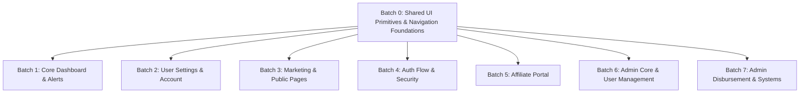

# Systematic Light & Dark Theme Mode Completion Plan (Codebase 2)

Complete, flawless light and dark theme mode support for all ~94 active pages and components in `seed-code/trading-conversational-ai-ui-pages-increment/` based on the [Light & Dark Mode Fix Methodology](file:///D:/SaaS%20Project/trading-alerts-saas-public/docs/files-completion-list/frontend-codebase-migration/light-dark-mode-fix-methodology.md) and the [UI Pages Inventory](file:///D:/SaaS%20Project/trading-alerts-saas-public/docs/files-completion-list/frontend-codebase-migration/ui-pages-pages-increment-codebase-2.xlsx).

---

## User Review Required

> [!IMPORTANT]
> **Zero Dark-Mode Regressions**: The core rule of this methodology is strictly additive — every existing dark hex value or slate color is preserved behind a `dark:` variant (e.g., `bg-slate-50 dark:bg-[#06070a]`), guaranteeing that the **Dark Trading Terminal theme remains 100% pixel-identical** while unlocking a crisp, high-contrast **Light Clean Mode**.

> [!NOTE]
> **Exploration & Screenshot Capture**: The Playwright automation pipeline is capturing light-mode screenshots of all 94 active pages (initialized via `/settings/appearance` theme switch) into `seed-code/trading-conversational-ai-ui-pages-increment/public/captured-screenshots-light-mode/` to establish a visual baseline before and after fixes.

---

## Architecture & Methodology Summary

Our audit identified **130 files containing 2,341 dark-only color token instances** across Codebase 2:

1. **Arbitrary Hex Values**: `bg-[#06070a]`, `bg-[#050609]`, `bg-[#090b14]`, `bg-[#06080e]`, `bg-[#04060a]`, `bg-[#0b0f19]`.
2. **Bare Slate Shades**: `bg-slate-900`, `bg-slate-800`, `border-slate-800`, `border-slate-700`, `text-slate-100`, `text-slate-200`, `text-slate-300`, `text-slate-400`.
3. **Bare White / Black Text**: `text-white`, `border-white/10`.
4. **Accent Text Contrast**: `text-amber-400`, `text-emerald-400`, `text-rose-400`, `text-cyan-400` needing daylight contrast equivalents (`text-amber-700 dark:text-amber-400`, `text-emerald-700 dark:text-emerald-400`).

### Token Mapping Standards

| Dark-Only Token                            | Light Replacement                     | Paired Dark Output                       |
| :----------------------------------------- | :------------------------------------ | :--------------------------------------- |
| `bg-[#06070a]` / `bg-[#050609]`            | `bg-slate-50` / `bg-white`            | `bg-slate-50 dark:bg-[#06070a]`          |
| `bg-[#090b14]` / `bg-[#06080e]`            | `bg-slate-100` / `bg-white`           | `bg-white dark:bg-[#090b14]`             |
| `bg-slate-900` / `bg-slate-800`            | `bg-slate-100` / `bg-slate-50`        | `bg-slate-100 dark:bg-slate-800`         |
| `border-slate-800` / `border-slate-800/80` | `border-slate-200`                    | `border-slate-200 dark:border-slate-800` |
| `border-slate-700`                         | `border-slate-300`                    | `border-slate-300 dark:border-slate-700` |
| `text-slate-100` / `text-white`            | `text-slate-900`                      | `text-slate-900 dark:text-slate-100`     |
| `text-slate-200` / `text-slate-300`        | `text-slate-800` / `text-slate-700`   | `text-slate-800 dark:text-slate-200`     |
| `text-slate-400`                           | `text-slate-500` / `text-slate-600`   | `text-slate-500 dark:text-slate-400`     |
| `text-amber-400` / `text-emerald-400`      | `text-amber-700` / `text-emerald-700` | `text-amber-700 dark:text-amber-400`     |

---

## Execution Batches & Sessions Breakdown

To ensure systematic, error-free execution with instant feedback, the 94 pages and 130 files are divided into **8 structured batches**:



---

### [Batch 0] Shared UI Primitives & Global Navigation Foundations (Highest Leverage)

> **Goal**: Fix common UI primitives, navigation bars, and error boundaries once so all 94 downstream pages instantly inherit correct background, border, and text tokens.

#### [MODIFY] UI Primitives

- [card.tsx](file:///D:/SaaS%20Project/trading-alerts-saas-public/seed-code/trading-conversational-ai-ui-pages-increment/components/ui/card.tsx)
- [dialog.tsx](file:///D:/SaaS%20Project/trading-alerts-saas-public/seed-code/trading-conversational-ai-ui-pages-increment/components/ui/dialog.tsx)
- [dropdown-menu.tsx](file:///D:/SaaS%20Project/trading-alerts-saas-public/seed-code/trading-conversational-ai-ui-pages-increment/components/ui/dropdown-menu.tsx)
- [select.tsx](file:///D:/SaaS%20Project/trading-alerts-saas-public/seed-code/trading-conversational-ai-ui-pages-increment/components/ui/select.tsx)
- [tabs.tsx](file:///D:/SaaS%20Project/trading-alerts-saas-public/seed-code/trading-conversational-ai-ui-pages-increment/components/ui/tabs.tsx)
- [table.tsx](file:///D:/SaaS%20Project/trading-alerts-saas-public/seed-code/trading-conversational-ai-ui-pages-increment/components/ui/table.tsx)
- [sheet.tsx](file:///D:/SaaS%20Project/trading-alerts-saas-public/seed-code/trading-conversational-ai-ui-pages-increment/components/ui/sheet.tsx)
- [tooltip.tsx](file:///D:/SaaS%20Project/trading-alerts-saas-public/seed-code/trading-conversational-ai-ui-pages-increment/components/ui/tooltip.tsx)
- [input.tsx](file:///D:/SaaS%20Project/trading-alerts-saas-public/seed-code/trading-conversational-ai-ui-pages-increment/components/ui/input.tsx)
- [badge.tsx](file:///D:/SaaS%20Project/trading-alerts-saas-public/seed-code/trading-conversational-ai-ui-pages-increment/components/ui/badge.tsx)
- [button.tsx](file:///D:/SaaS%20Project/trading-alerts-saas-public/seed-code/trading-conversational-ai-ui-pages-increment/components/ui/button.tsx)
- [popover.tsx](file:///D:/SaaS%20Project/trading-alerts-saas-public/seed-code/trading-conversational-ai-ui-pages-increment/components/ui/popover.tsx)
- [pro-upgrade-modal.tsx](file:///D:/SaaS%20Project/trading-alerts-saas-public/seed-code/trading-conversational-ai-ui-pages-increment/components/ui/pro-upgrade-modal.tsx)

#### [MODIFY] Navigation & Layout Headers

- [admin-nav.tsx](file:///D:/SaaS%20Project/trading-alerts-saas-public/seed-code/trading-conversational-ai-ui-pages-increment/components/admin/admin-nav.tsx)
- [affiliate-nav.tsx](file:///D:/SaaS%20Project/trading-alerts-saas-public/seed-code/trading-conversational-ai-ui-pages-increment/components/affiliate/affiliate-nav.tsx)
- [marketing-navbar.tsx](file:///D:/SaaS%20Project/trading-alerts-saas-public/seed-code/trading-conversational-ai-ui-pages-increment/components/marketing/marketing-navbar.tsx)
- [marketing-footer.tsx](file:///D:/SaaS%20Project/trading-alerts-saas-public/seed-code/trading-conversational-ai-ui-pages-increment/components/marketing/marketing-footer.tsx)
- [global-error.tsx](file:///D:/SaaS%20Project/trading-alerts-saas-public/seed-code/trading-conversational-ai-ui-pages-increment/app/global-error.tsx)
- [not-found.tsx](file:///D:/SaaS%20Project/trading-alerts-saas-public/seed-code/trading-conversational-ai-ui-pages-increment/app/not-found.tsx)

---

### [Batch 1] Core User Dashboard & Alerts System (7 pages)

> **Goal**: Enable clean light mode across daily active user workflow pages.

#### [MODIFY] Pages & Components

- `/dashboard` -> [dashboard/page.tsx](<file:///D:/SaaS%20Project/trading-alerts-saas-public/seed-code/trading-conversational-ai-ui-pages-increment/app/(dashboard)/dashboard/page.tsx>) & [dashboard-content.tsx](<file:///D:/SaaS%20Project/trading-alerts-saas-public/seed-code/trading-conversational-ai-ui-pages-increment/app/(dashboard)/dashboard/_components/dashboard-content.tsx>)
- `/alerts` -> [alerts/page.tsx](<file:///D:/SaaS%20Project/trading-alerts-saas-public/seed-code/trading-conversational-ai-ui-pages-increment/app/(dashboard)/alerts/page.tsx>) & [alert-list.tsx](file:///D:/SaaS%20Project/trading-alerts-saas-public/seed-code/trading-conversational-ai-ui-pages-increment/components/alerts/alert-list.tsx)
- `/alerts/new` -> [alerts/new/page.tsx](<file:///D:/SaaS%20Project/trading-alerts-saas-public/seed-code/trading-conversational-ai-ui-pages-increment/app/(dashboard)/alerts/new/page.tsx>)
- `/alerts/[id]/edit` -> [alerts/[id]/edit/page.tsx](<file:///D:/SaaS%20Project/trading-alerts-saas-public/seed-code/trading-conversational-ai-ui-pages-increment/app/(dashboard)/alerts/[id]/edit/page.tsx>)
- `/notifications` -> [notifications/page.tsx](<file:///D:/SaaS%20Project/trading-alerts-saas-public/seed-code/trading-conversational-ai-ui-pages-increment/app/(dashboard)/notifications/page.tsx>)
- `/terminal` & `/free` -> [terminal/page.tsx](file:///D:/SaaS%20Project/trading-alerts-saas-public/seed-code/trading-conversational-ai-ui-pages-increment/app/terminal/page.tsx) & [free/page.tsx](file:///D:/SaaS%20Project/trading-alerts-saas-public/seed-code/trading-conversational-ai-ui-pages-increment/app/free/page.tsx)

---

### [Batch 2] User Settings & Account Management (11 pages)

> **Goal**: Complete all sub-settings views and account configuration panels.

#### [MODIFY] Pages & Components

- `/settings` -> [settings/page.tsx](<file:///D:/SaaS%20Project/trading-alerts-saas-public/seed-code/trading-conversational-ai-ui-pages-increment/app/(dashboard)/settings/page.tsx>)
- `/settings/profile` -> [settings/profile/page.tsx](<file:///D:/SaaS%20Project/trading-alerts-saas-public/seed-code/trading-conversational-ai-ui-pages-increment/app/(dashboard)/settings/profile/page.tsx>)
- `/settings/security` -> [settings/security/page.tsx](<file:///D:/SaaS%20Project/trading-alerts-saas-public/seed-code/trading-conversational-ai-ui-pages-increment/app/(dashboard)/settings/security/page.tsx>)
- `/settings/security/activity` -> [settings/security/activity/page.tsx](<file:///D:/SaaS%20Project/trading-alerts-saas-public/seed-code/trading-conversational-ai-ui-pages-increment/app/(dashboard)/settings/security/activity/page.tsx>)
- `/settings/billing` -> [settings/billing/page.tsx](<file:///D:/SaaS%20Project/trading-alerts-saas-public/seed-code/trading-conversational-ai-ui-pages-increment/app/(dashboard)/settings/billing/page.tsx>) & [subscription-card.tsx](file:///D:/SaaS%20Project/trading-alerts-saas-public/seed-code/trading-conversational-ai-ui-pages-increment/components/billing/subscription-card.tsx)
- `/settings/appearance` -> [settings/appearance/page.tsx](<file:///D:/SaaS%20Project/trading-alerts-saas-public/seed-code/trading-conversational-ai-ui-pages-increment/app/(dashboard)/settings/appearance/page.tsx>)
- `/settings/language` -> [settings/language/page.tsx](<file:///D:/SaaS%20Project/trading-alerts-saas-public/seed-code/trading-conversational-ai-ui-pages-increment/app/(dashboard)/settings/language/page.tsx>)
- `/settings/privacy` -> [settings/privacy/page.tsx](<file:///D:/SaaS%20Project/trading-alerts-saas-public/seed-code/trading-conversational-ai-ui-pages-increment/app/(dashboard)/settings/privacy/page.tsx>)
- `/settings/help` -> [settings/help/page.tsx](<file:///D:/SaaS%20Project/trading-alerts-saas-public/seed-code/trading-conversational-ai-ui-pages-increment/app/(dashboard)/settings/help/page.tsx>)
- `/settings/account` -> [settings/account/page.tsx](<file:///D:/SaaS%20Project/trading-alerts-saas-public/seed-code/trading-conversational-ai-ui-pages-increment/app/(dashboard)/settings/account/page.tsx>)
- `/settings/terms` -> [settings/terms/page.tsx](<file:///D:/SaaS%20Project/trading-alerts-saas-public/seed-code/trading-conversational-ai-ui-pages-increment/app/(dashboard)/settings/terms/page.tsx>)

---

### [Batch 3] Public Marketing, Pricing & Legal Pages (19 pages)

> **Goal**: Audit and polish all public-facing pages, pricing comparisons, and legal documents.

#### [MODIFY] Pages & Components

- `/` -> [landing/landing-page.tsx](file:///D:/SaaS%20Project/trading-alerts-saas-public/seed-code/trading-conversational-ai-ui-pages-increment/components/landing)
- `/pricing` -> [pricing/page.tsx](file:///D:/SaaS%20Project/trading-alerts-saas-public/seed-code/trading-conversational-ai-ui-pages-increment/app/pricing/page.tsx) & [tier-comparison.tsx](file:///D:/SaaS%20Project/trading-alerts-saas-public/seed-code/trading-conversational-ai-ui-pages-increment/components/pricing/tier-comparison.tsx)
- `/about`, `/blog`, `/careers`, `/changelog`, `/docs`, `/help`, `/status`, `/disclaimer`, `/privacy`, `/terms`
- `/welcome` -> [welcome/page.tsx](file:///D:/SaaS%20Project/trading-alerts-saas-public/seed-code/trading-conversational-ai-ui-pages-increment/app/welcome/page.tsx)
- `/checkout` & `/checkout/return` -> [checkout/page.tsx](file:///D:/SaaS%20Project/trading-alerts-saas-public/seed-code/trading-conversational-ai-ui-pages-increment/app/checkout/page.tsx) & [checkout-form.tsx](file:///D:/SaaS%20Project/trading-alerts-saas-public/seed-code/trading-conversational-ai-ui-pages-increment/components/payments/checkout-form.tsx)
- `/upgrade/success`, `/account/deletion-cancel`, `/account/deletion-confirm`, `/test-api`

---

### [Batch 4] Authentication & Account Security Pages (7 pages)

> **Goal**: Fix the wrapper pages for authentication and verification flows.

#### [MODIFY] Pages & Components

- `/login` -> [app/(auth)/login/page.tsx](<file:///D:/SaaS%20Project/trading-alerts-saas-public/seed-code/trading-conversational-ai-ui-pages-increment/app/(auth)/login/page.tsx>)
- `/register` -> [app/(auth)/register/page.tsx](<file:///D:/SaaS%20Project/trading-alerts-saas-public/seed-code/trading-conversational-ai-ui-pages-increment/app/(auth)/register/page.tsx>)
- `/forgot-password` -> [app/(auth)/forgot-password/page.tsx](<file:///D:/SaaS%20Project/trading-alerts-saas-public/seed-code/trading-conversational-ai-ui-pages-increment/app/(auth)/forgot-password/page.tsx>)
- `/reset-password` -> [app/(auth)/reset-password/page.tsx](<file:///D:/SaaS%20Project/trading-alerts-saas-public/seed-code/trading-conversational-ai-ui-pages-increment/app/(auth)/reset-password/page.tsx>)
- `/verify-2fa` -> [app/(auth)/verify-2fa/page.tsx](<file:///D:/SaaS%20Project/trading-alerts-saas-public/seed-code/trading-conversational-ai-ui-pages-increment/app/(auth)/verify-2fa/page.tsx>)
- `/verify-email` & `/verify-email/pending` -> [app/(auth)/verify-email/page.tsx](<file:///D:/SaaS%20Project/trading-alerts-saas-public/seed-code/trading-conversational-ai-ui-pages-increment/app/(auth)/verify-email/page.tsx>)

---

### [Batch 5] Affiliate Portal Pages (14 pages)

> **Goal**: Convert all affiliate portal and partner dashboard views.

#### [MODIFY] Pages & Components

- `/affiliate` (Landing), `/affiliate/join`, `/affiliate/register`, `/affiliate/verify`, `/affiliate/resources`, `/affiliate/settings/payout`
- `/affiliate/dashboard` -> [affiliate/dashboard/page.tsx](file:///D:/SaaS%20Project/trading-alerts-saas-public/seed-code/trading-conversational-ai-ui-pages-increment/app/affiliate/dashboard/page.tsx)
- `/affiliate/dashboard/codes` & `/affiliate/dashboard/code-inventory`
- `/affiliate/dashboard/commissions` & `/affiliate/dashboard/payouts`
- `/affiliate/dashboard/statements` & `/affiliate/dashboard/profile` & `/affiliate/dashboard/profile/payment`

---

### [Batch 6] Admin Core, Users & Partner Management (13 pages)

> **Goal**: Convert executive admin dashboards, user directory, affiliate management, and 5 business performance reports.

#### [MODIFY] Pages & Components

- `/admin` (Executive Dashboard) & `/admin/login`
- `/admin/users` & `/admin/users/[id]`
- `/admin/affiliates` & `/admin/affiliates/[id]`
- 5 Admin Reports: `/admin/affiliates/reports/{code-flows,code-inventory,commission-owings,profit-loss,sales-performance}`
- `/admin/settings/affiliate` & `/admin/resources`

---

### [Batch 7] Admin Disbursement, System Ops & Monitoring (17 pages)

> **Goal**: Convert all 11 disbursement workflows and system/infrastructure monitoring pages.

#### [MODIFY] Pages & Components

- 11 Disbursement Pages: `/admin/disbursement`, `/admin/disbursement/accounts`, `/admin/disbursement/affiliates`, `/admin/disbursement/affiliates/[affiliateId]`, `/admin/disbursement/audit`, `/admin/disbursement/batches`, `/admin/disbursement/batches/[batchId]`, `/admin/disbursement/config`, `/admin/disbursement/recipients`, `/admin/disbursement/transactions`, `/admin/disbursement/settings`
- `/admin/api-usage`, `/admin/errors`
- `/admin/fraud-alerts` & `/admin/fraud-alerts/[id]`
- `/admin/system/{config-history,jobs,outbox,terminals}`
- `/admin/notifications/broadcast`

---

## Verification Plan

### Automated Verification Pipeline

For each batch:

1. **Compilation Check**:
   ```powershell
   npm run build
   ```
   Must compile with 0 TypeScript/Turbopack errors.
2. **Regex Zero-Dark-Only Check**:
   Run token scan against touched files:
   ```powershell
   python C:\Users\WiN\.gemini\antigravity\brain\d1525d05-f856-4795-b6a7-764c7de08e2b\scratch\audit_dark_patterns.py
   ```
   Must return 0 unhandled dark tokens.
3. **Playwright Visual Re-Capture**:
   Run the screenshot suite against the updated routes:
   ```powershell
   python C:\Users\WiN\.gemini\antigravity\brain\d1525d05-f856-4795-b6a7-764c7de08e2b\scratch\capture_all_light_screenshots.py
   ```
4. **Dual Theme Spot-Check**:
   Verify `getComputedStyle(element).backgroundColor` matches `#06070a` in dark mode and `rgb(248, 250, 252)` (or white) in light mode.
