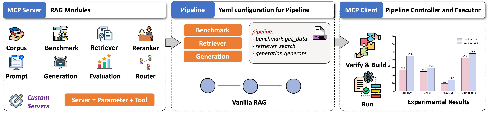
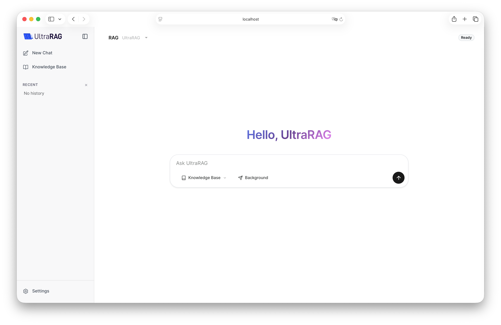

<p align="center">
  <picture>
    <source media="(prefers-color-scheme: dark)" srcset="../docs/ultrarag_dark.svg">
    <source media="(prefers-color-scheme: light)" srcset="../docs/ultrarag.svg">
    
  </picture>
</p>

<h3 align="center">
更少代码，更低门槛，更快实现
</h3>

<p align="center">
| 
<a href="https://ultrarag.openbmb.cn"><b>教程文档</b></a> 
| 
<a href="https://modelscope.cn/datasets/UltraRAG/UltraRAG_Benchmark"><b>数据集</b></a> 
| 
<a href="https://github.com/OpenBMB/UltraRAG/tree/rag-paper-daily/rag-paper-daily"><b>每日论文</b></a> 
| 
<b>简体中文</b>
|
<a href="../README.md"><b>English</b></a>
|
</p>

---

_更新日志_ 🔥

- [2026.01.20] 🎉 发布 AgentCPM-Report 模型！DeepResearch 终于本地化了：8B 端侧写作智能体 AgentCPM-Report 开源 👉 |[🤗 模型](https://huggingface.co/openbmb/AgentCPM-Report)|

<details>
<summary>历史更新</summary>

- [2025.11.11] 🎉 UltraRAG 2.1 更新：强化知识接入与多模态支持，完善统一评估体系！
- [2025.09.23] 新增每日 RAG 论文分享，每日更新最新前沿 RAG 工作 👉 |[📖 论文](https://github.com/OpenBMB/UltraRAG/tree/rag-paper-daily/rag-paper-daily)|
- [2025.09.09] 发布轻量级 DeepResearch Pipeline 本地搭建教程 👉 |[📺 bilibili](https://www.bilibili.com/video/BV1p8JfziEwM)|[📖 博客](https://github.com/OpenBMB/UltraRAG/blob/page/project/blog/cn/01_build_light_deepresearch.md)|
- [2025.09.01] 发布 UltraRAG 安装与完整 RAG 跑通视频 👉 |[📺 bilibili](https://www.bilibili.com/video/BV1B9apz4E7K/?share_source=copy_web&vd_source=7035ae721e76c8149fb74ea7a2432710)|[📖 博客](https://github.com/OpenBMB/UltraRAG/blob/page/project/blog/cn/00_Installing_and_Running_RAG.md)|
- [2025.08.28] 🎉 发布 UltraRAG 2.0！UltraRAG 2.0 全新升级：几十行代码实现高性能 RAG，让科研专注思想创新！我们保留了 UltraRAG v2 的代码，可以点击 [v2](https://github.com/OpenBMB/UltraRAG/tree/v2) 查看。
- [2025.01.23] 发布 UltraRAG！让大模型读懂善用知识库！我们保留了UltraRAG 1.0的代码，可以点击 [v1](https://github.com/OpenBMB/UltraRAG/tree/v1) 查看。

</details>

---

## 关于 UltraRAG

UltraRAG 是由清华大学 [THUNLP](https://nlp.csai.tsinghua.edu.cn/) 实验室、东北大学 [NEUIR](https://neuir.github.io) 实验室、[OpenBMB](https://www.openbmb.cn/home) 与 [AI9stars](https://github.com/AI9Stars) 联合推出的首个基于 [Model Context Protocol (MCP)](https://modelcontextprotocol.io/docs/getting-started/intro) 架构设计的轻量级 RAG 开发框架。

专为科研探索与工业原型设计打造，UltraRAG 将 RAG 中的核心组件（Retriever、Generation 等）标准化封装为独立的 **MCP Server**，配合 **MCP Client** 强大的流程调度能力，开发者仅需通过 YAML 配置，即可实现对条件分支、循环等复杂控制结构的精确编排。

<p align="center">
  <picture>
    
  </picture>
</p>

### UltraRAG UI：从“对话演示”到“全栈开发”

UltraRAG UI 突破了传统对话界面的边界，演进为集编排、调试与演示于一体的 可视化的 RAG 全流程集成开发环境（IDE）。

系统内置强大的 Pipeline Builder，支持‘画布拖拽’与‘代码编辑’的双向实时同步，并允许在线精细化调整 Pipeline 参数与 Prompt；更创新引入了 智能 AI 助手，深度辅助 Pipeline 结构设计、参数调优及 Prompt 生成的全开发流程。构建完成的逻辑流可 一键转化 为交互式对话系统，并无缝集成 知识库管理组件，支持用户构建专属知识库进行文档问答，真正实现了从底层逻辑构建、数据治理到上层应用交付的一站式闭环。

<!-- <p align="center">
  <picture>
    
  </picture>
</p> -->

https://github.com/user-attachments/assets/9cca0d4f-fb47-4232-9e47-69bfbb7b5d5d

### 核心亮点

- 🚀 **低代码编排复杂流程**
  - **推理编排**：原生支持串行、循环与条件分支等控制结构。开发者仅需编写 YAML 配置文件，即可在数十行代码内实现复杂的迭代式 RAG 逻辑。

- ⚡ **模块化扩展与复现**
  - **原子化 Server**：基于 MCP 架构将功能解耦为独立 Server。新功能仅需以函数级 Tool 形式注册，即可无缝接入流程，实现极高的复用性。

- 📊 **统一评测与基准对比**
  - **科研提效**：内置标准化评测流程，开箱即用主流科研 Benchmark。通过统一指标管理与基线集成，大幅提升实验的可复现性与对比效率。

- ✨ **交互原型快速生成**
  - **一键交付**：告别繁琐的 UI 开发。仅需一行命令，即可将 Pipeline 逻辑瞬间转化为可交互的对话式 Web UI，缩短从算法到演示的距离。

## 安装

我们提供了两种安装方式：本地源码安装（推荐使用 `uv` 进行包管理）和 Docker 容器部署

### 方式一：源码安装（推荐）

我们强烈推荐使用 [uv](https://github.com/astral-sh/uv) 来管理 Python 环境与依赖，它能极大地提升安装速度。

**准备环境**

如果您尚未安装 uv，请先执行：

```shell
## 直接安装
pip install uv
## 下载
curl -LsSf https://astral.sh/uv/install.sh | sh
```

**下载源码**

```shell
git clone https://github.com/OpenBMB/UltraRAG.git --depth 1
cd UltraRAG
```

**安装依赖**

请根据您的使用场景选择一种同步方式：

- 核心依赖：如果您只需运行基础核心功能，如只使用 UltraRAG UI：

  ```shell
  uv sync
  ```

- 全量安装：如果您希望完整体验 UltraRAG 的检索、生成、语料处理及评测功能，请运行：
  ```shell
  uv sync --all-extras
  ```
- 按需安装：如果您只需运行定模块，按需保留对应 `--extra`，例如：

  ```shell
  uv sync --extra retriever   # 仅检索模块
  uv sync --extra generation  # 仅生成模块
  ```

最后激活虚拟环境：

```shell
# Windows CMD
.venv\Scripts\activate.bat

# Windows Powershell
.venv\Scripts\Activate.ps1

# macOS / Linux
source .venv/bin/activate
```

如果你希望在一个已有环境中安装依赖，可直接使用`pip`进行安装：

```shell
# 核心依赖
uv pip install -e .

# 全量安装
uv pip install -e ".[all]"

# 按需安装
uv pip install -e ".[retriever]"
```

### 方式二：Docker 容器部署

如果您不想配置本地 Python 环境，可以使用 Docker 一键启动。

```shell
# 1. 下载代码
git clone https://github.com/OpenBMB/UltraRAG.git --depth 1
cd UltraRAG
# 2. 构建镜像
docker build -t ultrarag:v0.3.0 .

# 您也可以使用我们构建好的镜像：
docker pull hdxin2002/ultrarag:v0.3.0-base-cpu # 基本依赖，cpu版本
docker pull hdxin2002/ultrarag:v0.3.0-base-gpu # 基本依赖，gpu版本
docker pull hdxin2002/ultrarag:v0.3.0          # 完整依赖，gpu版本

# 3. 启动容器（已自动映射 5050 端口）
docker run -it --gpus all -p 5050:5050 <docker_image_name>
```

提示：容器启动后会自动运行 UltraRAG UI，您可以直接在浏览器访问 `http://localhost:5050` 使用。

### 验证安装

安装完成后，运行以下示例命令来检查环境是否正常：

```shell
ultrarag run examples/sayhello.yaml
```

看到以下输出即代表安装成功：

```
Hello, UltraRAG v3!
```

## 快速开始

我们提供了从入门到进阶的完整教学示例，无论您是进行学术研究还是构建工业级应用，都能在这里找到指引。欢迎访问[教程文档](https://ultrarag.openbmb.cn) 获取更多细节。

### 科研实验

专为研究人员设计，提供数据、实验流程与可视化分析工具。

- [实验上手](https://ultrarag.openbmb.cn/pages/cn/getting_started/quick_start)：了解如何基于 UltraRAG 快速跑通标准的 RAG 实验流程。
- [评测数据](https://ultrarag.openbmb.cn/pages/cn/develop_guide/dataset)：下载 RAG 领域最常用的公开评测数据集以及大规模检索语料库，直接用于科研基准测试。
- [案例分析](https://ultrarag.openbmb.cn/pages/cn/develop_guide/case_study)：提供可视化的 Case Study 界面，深入追踪工作流的每一步中间输出，辅助分析与错误归因。
- [代码集成](https://ultrarag.openbmb.cn/pages/cn/develop_guide/code_integration)：了解如何在 Python 代码中直接调用 UltraRAG 组件，实现更灵活的定制化开发。

### 演示系统

专为开发者与最终用户设计，提供完整的 UI 交互与复杂应用案例。

- [快速启动](https://ultrarag.openbmb.cn/pages/cn/ui/start)：了解如何启动 UltraRAG UI，并熟悉管理员模式下的各项高级配置。
- [部署指南](https://ultrarag.openbmb.cn/pages/cn/ui/prepare)：详细的生产环境部署教程，涵盖检索器 (Retriever)、生成模型 (LLM) 以及 Milvus 向量库的搭建。
- [深度研究](https://ultrarag.openbmb.cn/pages/cn/demo/deepresearch)：旗舰案例，部署一个深度研究 Pipeline。配合 SurveyCPM 模型，可自动执行多步联网检索与整合，生成数万字的综述报告。

## 贡献

感谢以下贡献者在代码提交和测试中的付出。我们也欢迎新的成员加入，共同构建完善的 RAG 生态！

您可以通过以下标准流程来贡献：**Fork 本仓库 → 提交 Issue → 发起 Pull Request (PR)**。

<a href="https://github.com/OpenBMB/UltraRAG/contributors">
  
</a>

## 支持我们

如果您觉得本项目对您的研究有所帮助，欢迎点亮一颗 ⭐ 来支持我们！

<a href="https://star-history.com/#OpenBMB/UltraRAG&Date">
 <picture>
   <source media="(prefers-color-scheme: dark)" srcset="https://api.star-history.com/svg?repos=OpenBMB/UltraRAG&type=Date&theme=dark" />
   <source media="(prefers-color-scheme: light)" srcset="https://api.star-history.com/svg?repos=OpenBMB/UltraRAG&type=Date" />
   
 </picture>
</a>

## 联系我们

- 关于技术问题及功能请求，请使用 [GitHub Issues](https://github.com/OpenBMB/UltraRAG/issues) 功能。
- 关于使用上的问题、意见以及任何关于 RAG 技术的讨论，欢迎加入我们的[微信群组](https://github.com/OpenBMB/UltraRAG/blob/main/docs/wechat_qr.png)，[飞书群组](https://github.com/OpenBMB/UltraRAG/blob/main/docs/feishu_qr.png)和[discord](https://discord.gg/yRFFjjJnnS)，与我们共同交流。

<table>
  <tr>
    <td align="center">
      <br/>
      <b>微信群组</b>
    </td>
    <td align="center">
      <br/>
      <b>飞书群组</b>
    </td>
    <td align="center">
      <a href="https://discord.gg/yRFFjjJnnS">
        
      </a><br/>
      <b>Discord</b>
  </td>
  </tr>
</table>
